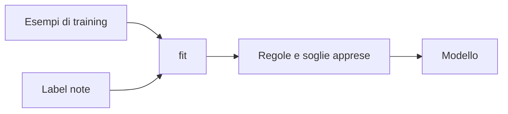
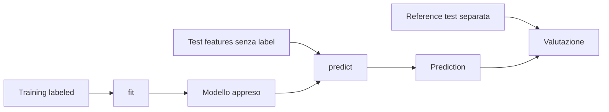

# UD29 — Concetti
# Vedere il Machine Learning: dall'esempio alla regola appresa

## 1. Il punto di partenza: UD28

In UD28 la regola era definita da noi:

```text
mediana + MAD + moltiplicatore
        ↓
      soglia
        ↓
duration_ms > soglia ?
```

Il programma applicava una regola che conoscevamo già.

In UD29 cambia una cosa fondamentale:

> Non scriviamo direttamente la soglia e le combinazioni di regole. Forniamo esempi già classificati e lasciamo che l'algoritmo costruisca un modello dai dati.

---

## 2. Dov'è il Machine Learning?

Consideriamo questo piccolo training set:

| duration_ms | status_code | reference_label |
|---:|---:|---|
| 150 | 200 | normal |
| 160 | 200 | normal |
| 170 | 200 | normal |
| 180 | 200 | normal |
| 230 | 200 | anomaly |
| 250 | 200 | anomaly |
| 165 | 500 | anomaly |

Nel codice **non scriviamo**:

```python
if duration_ms > 205:
    return "anomaly"
```

e non scriviamo:

```python
if status_code == 500:
    return "anomaly"
```

Scriviamo invece:

```python
model = DecisionTreeClassifier(max_depth=2)
model.fit(X, y)
```

Prima di `fit()` il classificatore non possiede ancora le regole apprese dal nostro dataset.

Dopo `fit()` può emergere una struttura come:

```text
duration_ms <= 205?
├── sì
│   └── status_code <= 350?
│       ├── sì → normal
│       └── no → anomaly
└── no → anomaly
```

La soglia `205` non era scritta nel nostro codice: è stata ricavata dagli esempi.

### Attenzione: una soglia appresa non è una regola del dominio

Nel ramo precedente compare:

```text
status_code <= 350?
```

Questa soglia **non significa** che HTTP definisca come “corretti” tutti i codici fino a 350 e come “errori” quelli superiori.

Nel toy dataset il modello vede soprattutto due valori numerici:

```text
200 → esempi prevalentemente normal
500 → esempio anomaly
```

Il Decision Tree tratta qui `status_code` come una feature numerica e cerca una separazione utile tra gli esempi disponibili. Tra 200 e 500 può quindi emergere una soglia intermedia, come 350.

```text
200 ---------------- 350 ---------------- 500
 esempi normal        soglia appresa       esempio anomaly
```

Il modello **non conosce automaticamente la semantica del protocollo HTTP**. Per esempio, una nuova osservazione con:

```text
duration_ms = 170
status_code = 300
```

seguirebbe il ramo `status_code <= 350` e verrebbe classificata `normal` da questo piccolo albero. Questo non dimostra che `300` sia sempre normale in un sistema reale: dimostra soltanto come il modello applica la separazione appresa dai dati.

Inoltre:

```text
errore HTTP ≠ anomalia operativa
```

Un codice `3xx` rappresenta una redirezione e può essere previsto oppure inatteso a seconda del servizio. Analogamente, un comportamento operativo può essere anomalo anche quando lo `status_code` è `200`.

> **Messaggio chiave:** il modello apprende pattern dai dati; la conoscenza del dominio resta necessaria per scegliere buone feature, costruire label affidabili e interpretare le prediction.

In questa UD usiamo direttamente `status_code` come numero per mantenere l'esempio semplice e leggibile. È una **semplificazione didattica**, non una regola generale per progettare feature HTTP in produzione.



---

## 3. La prova più importante: cambiano i dati, cambia ciò che viene appreso

Manteniamo:

```text
stesso DecisionTreeClassifier
stesso max_depth=2
stesso codice di fit()
```

Cambiamo soltanto alcuni esempi:

```text
prima:
170 normal
180 normal
230 anomaly
250 anomaly

dopo:
210 normal
220 normal
280 anomaly
300 anomaly
```

Dopo un nuovo `fit()` la separazione sulla durata può spostarsi:

```text
circa 205 ms
      ↓
circa 250 ms
```

Quindi:

```text
STESSO CODICE
    +
DATI DIFFERENTI
    =
REGOLE APPRESE DIFFERENTI
```

Questo è il punto da fissare: **il comportamento del modello dipende da ciò che apprende dagli esempi di training**.

---

## 4. Automatico non significa spontaneo o autonomo

Il modello non decide tutto da solo.

Noi scegliamo:

- quali osservazioni usare;
- quali feature fornire;
- quale target usare;
- quale algoritmo utilizzare;
- quanto complesso può essere il modello, per esempio `max_depth`.

Durante `fit()`, l'algoritmo apprende entro questi vincoli:

- quali feature risultano utili;
- quali soglie separano meglio gli esempi;
- come combinare le decisioni nell'albero.

Quindi:

> Machine Learning non significa “apprendimento spontaneo”. Significa apprendere automaticamente parametri e regole dai dati, entro un problema e un modello definiti da noi.

---

## 5. Feature e target

Le **feature** sono le informazioni osservabili date al modello:

```text
duration_ms
status_code
```

Le rappresentiamo con `X`.

In questo laboratorio `status_code` è fornito al Decision Tree come valore numerico. Il modello può quindi apprendere soglie numeriche su quel campo, ma **non possiede da solo il significato HTTP dei codici**.

Il **target** è la risposta nota durante il training:

```text
reference_label
```

Lo rappresentiamo con `y`.

```text
X = ciò che il modello osserva
y = ciò che deve imparare a prevedere
```

Non usiamo come feature `reference_reason` o `label_source`, perché appartengono al processo di validazione e potrebbero rivelare la risposta.

---

## 6. Learning e inference sono due momenti diversi

### Learning / training

```text
X_train + y_train
        ↓
       fit()
        ↓
modello con regole apprese
```

### Inference

```text
X_test senza label
        ↓
     predict()
        ↓
    prediction
```

`fit()` **costruisce** il modello dai dati.

`predict()` **applica** il modello già appreso a nuove osservazioni.

Questa distinzione è centrale:

| Operazione | Ruolo |
|---|---|
| `fit()` | apprendimento |
| `predict()` | inferenza |
| confronto con reference | valutazione |

---

## 7. I tre file del caso completo

### Training

`ml_training_labeled.csv` contiene 120 osservazioni storiche già validate.

Serve a `fit()`.

### Test features

`ml_test_features.csv` contiene 40 osservazioni successive senza `reference_label`.

Serve a `predict()`.

### Test reference

`ml_test_reference_labels.csv` contiene la classificazione validata delle stesse `test-*`.

Viene usato **solo dopo** la prediction per misurare il modello.



---

## 8. Da dove arrivano le label?

Come in UD28:

```text
telemetria + test controllati + incident review + log/trace + conoscenza servizio
                                ↓
                        processo di validazione
                                ↓
                        reference_label
```

Nel training la label è necessaria perché il modello supervisionato deve imparare da esempi con risposta nota.

Nel test la label esiste per chi valuta l'esperimento, ma viene tenuta separata dai dati forniti a `predict()`.

---

## 9. Decision Tree: perché lo usiamo

Il Decision Tree è utile didatticamente perché possiamo leggere le regole che ha appreso.

Non significa che gli alberi siano l'unico Machine Learning possibile.

In questa UD usiamo un solo algoritmo per concentrare l'attenzione sul ciclo:

```text
esempi → fit → modello → predict → valutazione
```

---

## 10. Valutazione e limiti

Dopo `predict()` riutilizziamo concetti già consolidati:

```text
TP FP FN TN
precision recall
```

Il modello vede soltanto `duration_ms` e `status_code`.

Non può usare informazioni che non gli vengono fornite, come log completi, trace o contesto operativo.

---

## 11. Overfitting

Un modello più complesso può adattarsi meglio ai dati di training senza generalizzare meglio.

```text
troppo semplice → impara poco
equilibrato     → regole utili anche su dati nuovi
troppo complesso→ rincorre dettagli del training
```

Per questo training e test devono restare separati.

---

## 12. Da ricordare

1. In UD28 la regola era definita da noi; in UD29 viene appresa dagli esempi.
2. `fit()` è il momento dell'apprendimento.
3. `predict()` è inferenza: applica ciò che è stato appreso.
4. Stesso codice con dati diversi può produrre regole apprese diverse.
5. Il modello non apprende spontaneamente: noi definiamo dati, feature, target, algoritmo e vincoli.
6. Il test passato a `predict()` non contiene la risposta.
7. Una prediction resta una previsione da valutare, non una verità.
8. Una soglia appresa su una feature non equivale automaticamente a una regola del dominio: `status_code <= 350` è una separazione appresa, non una classificazione ufficiale dei codici HTTP.
