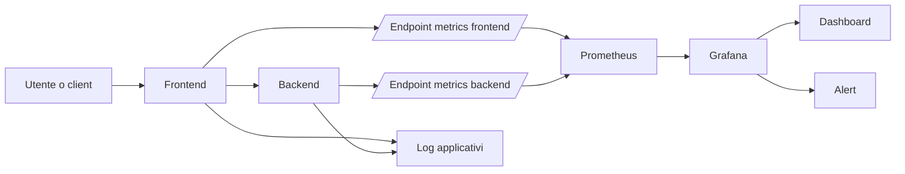
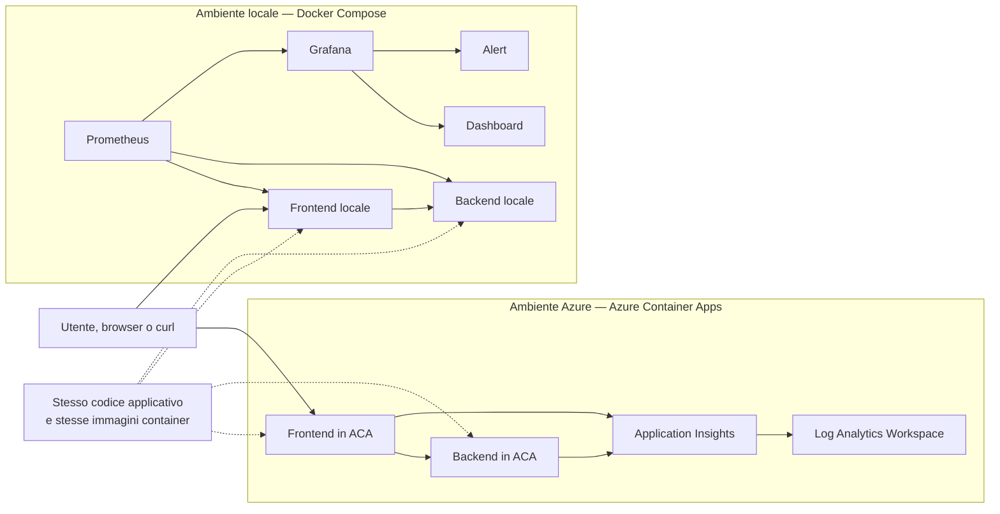

# Laboratorio autonomo di consolidamento professionale  
## Dallo stack di Observability alla presentazione delle proprie competenze

**Nome e cognome:** ______________________________________  
**Data:** ________________________________________________  
**Tempo indicativo:** 5-6 ore  
**Modalità:** lavoro individuale  
**Output finale:** un unico documento compilato, utilizzabile come base per portfolio, colloquio e CV

---

## 1. Scopo del laboratorio

Durante il percorso hai lavorato su applicazioni, container, metriche, log, dashboard e alert.

Questo laboratorio non introduce un nuovo strumento. Serve a consolidare quanto hai già svolto e a trasformarlo in competenze che possano essere:

- spiegate con chiarezza;
- dimostrate attraverso evidenze tecniche;
- presentate a un cliente o a un responsabile IT;
- descritte correttamente in un CV;
- raccontate durante un colloquio tecnico.

L'obiettivo non è memorizzare definizioni isolate, ma dimostrare di aver compreso il flusso completo:

```text
Applicazione
    ↓
Dati osservabili
    ↓
Raccolta
    ↓
Interrogazione
    ↓
Visualizzazione
    ↓
Alert
    ↓
Analisi e decisione operativa
```

---

# PARTE A — RICOSTRUIRE LO STACK

## Task 1 — Disegna l'architettura che hai utilizzato

Ricostruisci lo stack osservato durante il percorso.

Nel diagramma devono comparire almeno:

- utente o client;
- frontend;
- backend;
- endpoint applicativi;
- endpoint `/metrics`;
- Prometheus;
- Grafana;
- dashboard;
- alert;
- log applicativi;
- eventuali componenti Azure utilizzati.

Puoi completare il seguente schema Mermaid oppure sostituirlo con un tuo schema.



### Il mio diagramma

Inserisci qui il diagramma definitivo:



Completa il diagramma specificando:

- porte e nomi dei servizi locali;
- endpoint interrogati da Prometheus;
- significato delle connessioni verso Application Insights e LAW;
- differenza tra distribuzione Azure ed esecuzione locale;
- eventuali elementi mancanti o non utilizzati nel tuo ambiente.

---

## Task 2 — Spiega il ruolo di ogni componente

Completa la tabella senza limitarti a scrivere il nome del prodotto.

| Componente | Quale problema risolve | Quali dati riceve o produce | Come lo hai verificato |
|---|---|---|---|
| Frontend |  |  |  |
| Backend |  |  |  |
| Endpoint `/metrics` |  |  |  |
| Prometheus |  |  |  |
| Grafana |  |  |  |
| Dashboard |  |  |  |
| Alert |  |  |  |
| Log applicativi |  |  |  |

---

## Task 3 — Segui il percorso di una metrica

Scegli una metrica realmente utilizzata nel laboratorio.

**Nome della metrica:** __________________________________________

Descrivi il suo percorso.

### 1. Dove viene prodotta?

Risposta:

> 

### 2. Da quale endpoint viene esposta?

Risposta:

> 

### 3. Quale componente la raccoglie?

Risposta:

> 

### 4. Con quale frequenza viene raccolta?

Risposta:

> 

### 5. Come viene interrogata?

Inserisci una query utilizzata:

```promql
# Inserisci qui la query
```

### 6. Come viene visualizzata?

Descrivi il pannello Grafana:

> 

### 7. Può essere utilizzata in un alert?

Indica una possibile condizione:

> 

---

# PARTE B — DISTINGUERE METRICHE, LOG, DASHBOARD E ALERT

## Task 4 — Confronto tra i principali elementi

Completa la tabella.

| Elemento | Che cosa rappresenta | Esempio concreto | Quando è utile | Limite principale |
|---|---|---|---|---|
| Metrica |  |  |  |  |
| Log |  |  |  |  |
| Dashboard |  |  |  |  |
| Alert |  |  |  |  |

---

## Task 5 — Classifica le seguenti richieste

Per ogni domanda, indica quale strumento o tipo di dato utilizzeresti principalmente.

Possibili risposte:

- metriche;
- log;
- dashboard;
- alert;
- combinazione di più elementi.

| Domanda operativa | Strumento o dato principale | Motivazione |
|---|---|---|
| Quante richieste sono state ricevute negli ultimi cinque minuti? |  |  |
| Quale errore è stato registrato da una specifica richiesta? |  |  |
| Il tasso di errori ha superato una soglia critica? |  |  |
| Come varia la latenza nel corso della giornata? |  |  |
| Il backend è raggiungibile da Prometheus? |  |  |
| Quali endpoint stanno rispondendo più lentamente? |  |  |
| In quale momento è iniziato un peggioramento? |  |  |

---

# PARTE C — DIMOSTRARE LE COMPETENZE CON EVIDENZE

## Task 6 — Raccogli quattro evidenze tecniche

Per ogni evidenza:

1. esegui la verifica;
2. annota il comando, la query o il percorso utilizzato;
3. descrivi il risultato;
4. spiega che cosa dimostra.

### Evidenza 1 — Target Prometheus

**Verifica eseguita:**

> 

**Risultato osservato:**

> 

**Che cosa dimostra:**

> 

---

### Evidenza 2 — Query PromQL

```promql
# Inserisci qui la query
```

**Risultato osservato:**

> 

**Che cosa dimostra:**

> 

---

### Evidenza 3 — Pannello Grafana

**Titolo del pannello:**

> 

**Metrica o query utilizzata:**

> 

**Informazione visualizzata:**

> 

**Utilità operativa:**

> 

---

### Evidenza 4 — Alert Grafana

**Nome dell'alert:**

> 

**Condizione configurata:**

> 

**Come hai generato la situazione di test:**

> 

**Come hai verificato l'attivazione o il cambio di stato:**

> 

---

# PARTE D — TROUBLESHOOTING

Per ogni scenario non limitarti a indicare la soluzione. Descrivi il processo di analisi.

Usa sempre questa sequenza:

```text
Sintomo
→ ipotesi
→ verifiche
→ evidenze
→ causa probabile
→ azione correttiva
→ nuova verifica
```

---

## Task 7 — Scenario 1: Grafana non mostra dati

La dashboard è accessibile, ma un pannello non visualizza alcun dato.

### Ipotesi possibili

Scrivi almeno quattro ipotesi:

1.  
2.  
3.  
4.  

### Verifiche da eseguire

| Ordine | Verifica | Strumento o percorso | Risultato atteso |
|---|---|---|---|
| 1 |  |  |  |
| 2 |  |  |  |
| 3 |  |  |  |
| 4 |  |  |  |

### Conclusione tecnica

> 

---

## Task 8 — Scenario 2: target Prometheus in stato DOWN

Prometheus mostra il target del backend come `DOWN`.

### Quali elementi controlleresti?

- [ ] nome del servizio;
- [ ] porta;
- [ ] endpoint delle metriche;
- [ ] configurazione del job;
- [ ] rete;
- [ ] disponibilità del processo applicativo;
- [ ] altro: _____________________________________________

### Ordine delle verifiche

1.  
2.  
3.  
4.  
5.  

### Come distingueresti un problema applicativo da un problema di rete?

> 

### Conclusione tecnica

> 

---

## Task 9 — Scenario 3: la dashboard mostra dati, ma l'alert non si attiva

### Informazioni da controllare

Completa l'elenco:

- query dell'alert;
- soglia configurata;
- ____________________________________________;
- ____________________________________________;
- ____________________________________________;
- ____________________________________________.

### Possibili motivi

| Possibile causa | Come la verificheresti |
|---|---|
| La soglia non viene superata |  |
| La condizione deve durare per un intervallo minimo |  |
| La query del pannello è diversa da quella dell'alert |  |
| L'intervallo temporale non è adeguato |  |
| Non è stato generato traffico sufficiente |  |

### Conclusione tecnica

> 

---

## Task 10 — Scenario 4: media normale, utenti insoddisfatti

Il tempo medio di risposta appare accettabile, ma alcuni utenti segnalano richieste molto lente.

### Perché la media potrebbe nascondere il problema?

> 

### Quali indicatori useresti al posto della sola media?

> 

### Che ruolo hanno percentili e istogrammi?

> 

### Quale query o visualizzazione potrebbe aiutarti?

```promql
# Inserisci una possibile query
```

### Conclusione tecnica

> 

---

# PARTE E — SIMULAZIONE CLIENTE

## Scenario

Un cliente segnala rallentamenti intermittenti nell'applicazione prodotti.

Non sa se il problema si trovi:

- nel frontend;
- nel backend;
- nella rete;
- nel carico;
- in una dipendenza esterna.

Il cliente chiede:

> “Potete dirci perché l'applicazione a volte è lenta?”

---

## Task 11 — Domande iniziali al cliente

Scrivi almeno dieci domande utili.

Evita domande eccessivamente tecniche nelle prime fasi.

1.  
2.  
3.  
4.  
5.  
6.  
7.  
8.  
9.  
10.  

---

## Task 12 — Distingui fatti, ipotesi e dati mancanti

| Categoria | Elementi |
|---|---|
| Fatti disponibili |  |
| Ipotesi da verificare |  |
| Dati mancanti |  |

---

## Task 13 — Proponi un piano di analisi

Il piano deve essere comprensibile anche a un responsabile non specialista.

### Fase 1 — Verifica disponibilità

> 

### Fase 2 — Verifica traffico ed errori

> 

### Fase 3 — Verifica tempi di risposta

> 

### Fase 4 — Verifica soglie e alert

> 

### Fase 5 — Comunicazione del risultato

> 

---

## Task 14 — Scrivi una risposta professionale al cliente

Massimo 180 parole.

La risposta deve:

- riconoscere il problema;
- evitare conclusioni premature;
- indicare quali dati saranno verificati;
- descrivere il metodo di analisi;
- chiarire quale risultato verrà restituito.

> 

---

# PARTE F — TRASFORMARE LE ATTIVITÀ IN COMPETENZE PROFESSIONALI

## Task 15 — Da attività tecnica a competenza

Completa la tabella.

| Attività svolta | Competenza dimostrata | Evidenza disponibile |
|---|---|---|
| Configurazione di Prometheus |  |  |
| Verifica degli endpoint `/metrics` |  |  |
| Scrittura di query PromQL |  |  |
| Creazione di dashboard Grafana |  |  |
| Configurazione di alert |  |  |
| Generazione di traffico di test |  |  |
| Analisi di metriche HTTP |  |  |
| Troubleshooting di target e query |  |  |
| Utilizzo di container |  |  |
| Analisi di log |  |  |

---

## Task 16 — Correggi le descrizioni deboli

Trasforma le frasi seguenti in descrizioni più professionali.

### Frase debole 1

> Ho usato Prometheus.

**Versione migliorata:**

> 

### Frase debole 2

> So usare Grafana.

**Versione migliorata:**

> 

### Frase debole 3

> Ho fatto un alert.

**Versione migliorata:**

> 

### Frase debole 4

> Ho lavorato con Docker.

**Versione migliorata:**

> 

### Frase debole 5

> Conosco l'Observability.

**Versione migliorata:**

> 

---

## Task 17 — Scrivi la sezione tecnica per il CV

La formulazione deve essere realistica.

Non presentare un'attività laboratoriale come esperienza professionale presso un cliente.

Puoi utilizzare espressioni come:

- progetto formativo;
- esperienza laboratoriale;
- laboratorio tecnico;
- ambiente simulato;
- stack containerizzato;
- attività di configurazione e troubleshooting.

### Titolo del progetto

> 

### Contesto

> 

### Attività svolte

Scrivi da quattro a sei punti.

-  
-  
-  
-  
-  
-  

### Tecnologie

> 

### Risultati ottenuti

> 

---

## Task 18 — Sezione “Competenze tecniche”

Scrivi una sezione pronta per essere inserita in un CV.

### Observability e monitoring

> 

### Cloud e container

> 

### Analisi e troubleshooting

> 

### Query e dati

> 

---

# PARTE G — PRESENTAZIONE ORALE

## Task 19 — Prepara una presentazione di due minuti

Titolo:

> **Come ho contribuito a rendere osservabile un'applicazione frontend/backend**

Segui questa struttura:

1. contesto;
2. problema;
3. architettura;
4. dati raccolti;
5. dashboard;
6. alert;
7. verifiche eseguite;
8. limite attuale;
9. prossimo passo.

### Testo della presentazione

Scrivi un testo tra 220 e 300 parole.

> 

---

## Task 20 — Presentazione per un interlocutore non tecnico

Spiega in massimo 100 parole:

> Che cosa permette di fare uno stack composto da Prometheus, Grafana e un sistema di alert?

Risposta:

> 

---

# PARTE H — SIMULAZIONE DI COLLOQUIO

Rispondi senza copiare definizioni. Usa esempi tratti dalle attività svolte.

---

## Task 21 — Domande tecniche

### 1. Qual è la differenza tra monitoring e observability?

> 

### 2. Che cosa rappresenta una metrica?

> 

### 3. Qual è il ruolo di Prometheus?

> 

### 4. Qual è il ruolo di Grafana?

> 

### 5. Qual è la differenza tra dashboard e alert?

> 

### 6. Che cosa significa che un target Prometheus è `DOWN`?

> 

### 7. Perché una media può non essere sufficiente?

> 

### 8. A cosa servono i bucket di un istogramma?

> 

### 9. Che cosa fa `rate()` in PromQL?

> 

### 10. Come verificheresti che un alert funzioni realmente?

> 

---

## Task 22 — Domande comportamentali

### 1. Racconta un problema tecnico incontrato durante il laboratorio.

Usa la struttura:

```text
Situazione
→ compito
→ azione
→ risultato
```

> 

### 2. Che cosa fai quando non conosci la causa di un problema?

> 

### 3. Come comunicheresti a un cliente che servono ulteriori dati?

> 

### 4. Come eviti di modificare più componenti contemporaneamente durante il troubleshooting?

> 

---

# PARTE I — IL LIMITE DELLE SOLE METRICHE

## Task 23 — Analizza la seguente richiesta

Il cliente domanda:

> “Quale singola richiesta ha impiegato quattro secondi, quali servizi ha attraversato e in quale punto ha trascorso più tempo?”

### Che cosa puoi rispondere utilizzando le metriche aggregate?

> 

### Che cosa non puoi determinare con certezza?

> 

### Quale informazione aggiuntiva sarebbe necessaria?

> 

### Perché questa esigenza è diversa dalla semplice visualizzazione di una metrica?

> 

---

## Task 24 — Formula il problema tecnico

Completa la frase:

> Le metriche permettono di osservare ________________________________________,  
> ma non sempre consentono di ricostruire ___________________________________.

Scrivi poi una spiegazione di almeno 120 parole.

> 

---

# PARTE L — AUTOVALUTAZIONE

## Task 25 — Valuta il tuo livello

Assegna un punteggio da 1 a 4.

- **1 — Non ancora autonomo**
- **2 — Parzialmente autonomo**
- **3 — Autonomo nelle attività di base**
- **4 — Autonomo e capace di spiegare ad altri**

| Competenza | Punteggio | Evidenza |
|---|---:|---|
| Spiegare l'architettura dello stack |  |  |
| Distinguere metriche e log |  |  |
| Leggere una configurazione Prometheus |  |  |
| Scrivere query PromQL di base |  |  |
| Interpretare una dashboard |  |  |
| Configurare o verificare un alert |  |  |
| Eseguire troubleshooting ordinato |  |  |
| Comunicare con un cliente |  |  |
| Descrivere le competenze nel CV |  |  |
| Presentare un progetto tecnico |  |  |

---

## Task 26 — Piano personale di miglioramento

### Le tre competenze che considero più solide

1.  
2.  
3.  

### Le tre competenze da rafforzare

1.  
2.  
3.  

### Azioni concrete per migliorarle

| Competenza | Azione concreta | Evidenza che produrrò |
|---|---|---|
|  |  |  |
|  |  |  |
|  |  |  |

---

# CONSEGNA FINALE

Prima di consegnare, verifica di aver completato:

- [ ] diagramma architetturale;
- [ ] spiegazione dei componenti;
- [ ] percorso completo di una metrica;
- [ ] confronto tra metriche, log, dashboard e alert;
- [ ] quattro evidenze tecniche;
- [ ] quattro scenari di troubleshooting;
- [ ] simulazione cliente;
- [ ] piano di analisi;
- [ ] sezione CV;
- [ ] presentazione di due minuti;
- [ ] risposte alle domande di colloquio;
- [ ] riflessione sui limiti delle metriche;
- [ ] autovalutazione;
- [ ] piano personale di miglioramento.

---

# OUTPUT DA PRODURRE

Al termine del laboratorio conserva:

1. questo file compilato;
2. eventuali screenshot delle verifiche;
3. le query PromQL utilizzate;
4. il diagramma architetturale;
5. la sezione CV;
6. il testo della presentazione orale.

Nome file consigliato:

```text
COGNOME_NOME_Laboratorio_Consolidamento_Observability.md
```

---

## Criterio di qualità finale

Il lavoro è completo quando sei in grado di rispondere con chiarezza alle quattro domande seguenti:

1. **Quale problema risolve lo stack che hai utilizzato?**
2. **Quali attività tecniche hai svolto personalmente?**
3. **Quali evidenze dimostrano che le attività hanno funzionato?**
4. **Quale limite rimane quando vuoi analizzare il percorso di una singola richiesta?**
