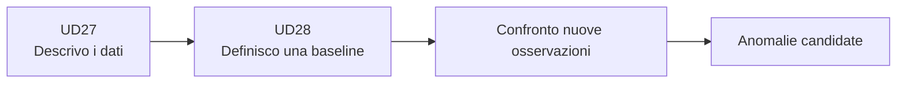

# UD27 — Raccordo
# Dalla descrizione alla baseline

## Che cosa sappiamo fare ora

```text
DataFrame
   ↓
filtrare un gruppo
   ↓
count / min / max
   ↓
media / mediana
   ↓
p95
   ↓
grafico nel tempo
```

Sappiamo quindi **descrivere** il comportamento osservato.

## Che cosa manca ancora

Supponiamo di vedere:

```text
mediana = 180 ms
p95 = 420 ms
massimo = 500 ms
```

Possiamo descrivere questi valori.

Ma per dire che `500 ms` rappresenta uno scostamento significativo dobbiamo rispondere a una domanda nuova:

> Rispetto a quale comportamento consideriamo normale o di riferimento questo valore?

Questa domanda introduce la **baseline**.



## Confine importante

```text
statistica descrittiva
        ↓
"come si sono comportati i dati?"

baseline + detector
        ↓
"quanto si discostano dal riferimento?"
```

UD28 introdurrà il secondo livello.

Non dobbiamo anticiparlo in UD27.
