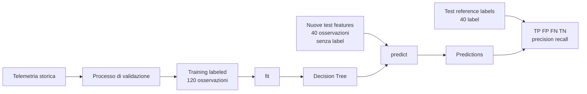

# Punto chiave aggiunto: il modello nasce durante `fit()`

```text
prima di fit()                 dopo fit()
algoritmo configurato          modello con regole apprese
nessuna soglia scritta         soglie ricavate dagli esempi
```

Il toy experiment mostra questo passaggio prima dell'architettura completa training/test.

---

# UD29 — Guida architetturale
# Training, prediction e reference separate



## Tre momenti distinti

### 1. Costruzione del modello

```text
ml_training_labeled.csv
feature + reference label
→ fit
→ modello
```

### 2. Prediction

```text
ml_test_features.csv
solo feature
→ predict
→ prediction
```

Durante questa fase il modello **non riceve** `reference_label`.

### 3. Valutazione

```text
prediction
+
ml_test_reference_labels.csv
→ confronto per observation_id
→ TP / FP / FN / TN
```

## Che cosa rappresenta il reference file?

`ml_test_reference_labels.csv` contiene la classificazione di riferimento delle stesse osservazioni `test-*` presenti nel file delle feature.

Non è una seconda osservazione nel tempo.

È un'informazione separata, ottenuta dal processo di validazione, usata come “foglio delle soluzioni” dopo la prediction.

## Perché questa separazione è utile?

Evita una possibile confusione:

```text
se conosco già reference_label,
che cosa sto predicendo?
```

La risposta diventa visibile nei file:

```text
PREDICT vede solo ml_test_features.csv

VALUTAZIONE usa dopo ml_test_reference_labels.csv
```

## Caso reale di produzione

Su una richiesta appena avvenuta avremmo inizialmente soltanto le feature:

```text
duration_ms
status_code
...
```

Il modello produce una prediction.

Una label validata potrebbe arrivare successivamente tramite investigazione, incident review o altre evidenze.

## Nessuna nuova infrastruttura

La UD29 lavora localmente con Python, pandas e scikit-learn.

L'obiettivo è comprendere il ciclo ML, non introdurre una piattaforma MLOps.
