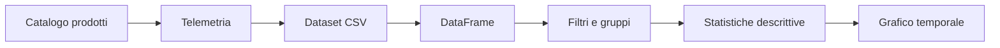

# UD27 — Guida architetturale
# Dal DataFrame alla descrizione del comportamento

In questa UD non aggiungiamo un nuovo componente allo stack di Observability.

Cambiamo il modo in cui analizziamo dati già disponibili.



## Che cosa rappresenta ogni livello

### Applicazione

Frontend e backend producono richieste con:

- servizio;
- endpoint;
- status;
- durata;
- identificatori di correlazione.

### Dataset

Raccoglie le osservazioni in forma tabellare.

### DataFrame

È la rappresentazione in memoria già introdotta in UD26.

### Filtri e gruppi

Servono a evitare di mescolare comportamenti differenti.

### Statistiche

Riassumono il comportamento di un gruppo.

### Grafico

Mantiene visibile la dimensione temporale.

## Punto importante

```text
statistica descrittiva
        ≠
anomaly detection
```

In UD27 osserviamo **come si comportano i dati**.

In UD28 definiremo **rispetto a quale comportamento** uno scostamento debba essere segnalato.
