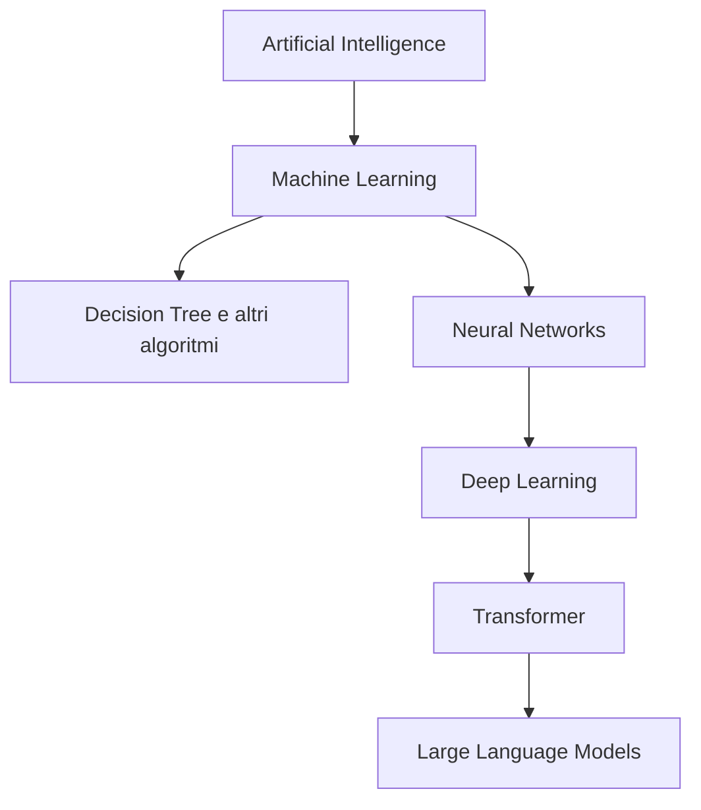
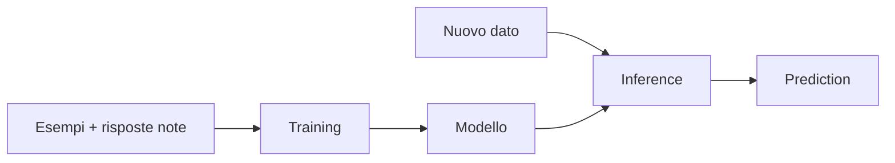
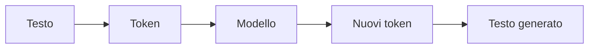
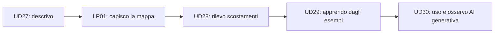

# LP01 — Mappe ed esempi visuali

## 1. La grande mappa



### Lettura corretta

```text
Decision Tree
→ è ML
→ non è una rete neurale
```

```text
LLM
→ è ML
→ usa Deep Learning
→ è basato su reti neurali
→ tipicamente usa Transformer
```

---

## 2. Stesso dato, domande diverse

Immaginiamo di osservare:

```text
duration_ms = 420
status_code = 200
```

### Statistica

Domanda:

> Quanto è distante questo valore dal comportamento abituale?

```text
baseline
→ confronto
→ scostamento
```

### Machine Learning

Domanda:

> Sulla base degli esempi passati, come classificherebbe questo caso il modello?

```text
feature
→ modello appreso
→ prediction
```

### LLM

Domanda:

> Come posso organizzare e interpretare le evidenze disponibili?

```text
evidenze testuali/numeriche
→ prompt + contesto
→ LLM
→ testo / ipotesi / verifiche
```

Tre strumenti, tre tipi di risultato.

---

## 3. Regola scritta vs regola appresa

### Regola definita da noi

```text
if durata > soglia
    segnala candidate
```

La logica è esplicita.

### Regola appresa

```text
esempi + label
        ↓
      training
        ↓
      modello
```

Il modello costruisce internamente separazioni utili a partire dai dati.

La differenza verrà resa concreta in UD29.

---

## 4. Training e inference



### Da ricordare

```text
training
→ costruisce/adatta il modello
```

```text
inference
→ usa il modello già costruito
```

---

## 5. Decision Tree e rete neurale non sono la stessa cosa

### Decision Tree

```text
status_code?
├── errore → anomaly
└── ok
    └── duration?
        ├── alta → anomaly
        └── bassa → normal
```

Il risultato può essere rappresentato come regole leggibili.

### Rete neurale

```text
input
  ↓
○ ○ ○ ○
  ↓
○ ○ ○
  ↓
○ ○
  ↓
output
```

Il comportamento emerge dalla combinazione di molti parametri interni appresi.

### Messaggio

```text
entrambi possono essere Machine Learning
ma funzionano con strutture molto diverse
```

---

## 6. Dal testo al modello linguistico



Esempio concettuale:

```text
"Il frontend è..."
        ↓
modello + contesto
        ↓
"...più lento del backend nella finestra osservata"
```

Il modello genera una continuazione coerente con il contesto disponibile.

---

## 7. Contesto e prompt

```text
PROMPT
"Separa fatti e ipotesi"
        +
CONTESTO
E1 metriche
E2 detector
E3 trace
        ↓
       LLM
        ↓
risposta strutturata
```

Il modello non vede automaticamente tutto ciò che noi sappiamo.
Lavora sul contesto che gli viene reso disponibile.

---

## 8. LLM non significa “motore della verità”

```text
INPUT
"Perché il servizio è lento?"
        ↓
       LLM
        ↓
frase linguisticamente plausibile
```

La frase deve ancora essere sottoposta a:

```text
verifica
→ quale evidenza la supporta?
```

---

## 9. RAG in una sola immagine

### Senza retrieval

```text
domanda
→ LLM
→ risposta
```

### Con RAG

```text
domanda
→ ricerca informazioni pertinenti
→ recupero documenti
→ aggiunta al contesto
→ LLM
→ risposta
```

### Messaggio

```text
RAG
→ porta conoscenza esterna nel contesto
→ non significa automaticamente riaddestrare il modello
```

---

## 10. Mappa anti-confusione

| Concetto | Produce principalmente | Chi definisce il comportamento |
|---|---|---|
| Statistica descrittiva | misure | formule note |
| Detector statistico | candidate | criterio definito esplicitamente |
| Modello ML | prediction | modello appreso dai dati |
| LLM | testo | modello generativo + prompt + contesto |
| RAG + LLM | testo basato anche su fonti recuperate | retrieval + contesto + modello |

---

## 11. Il filo del percorso


