# OBS_UD03 - Concetti: virtualizzazione, container, rete, porte e HTTP

## 1. Obiettivo tecnico della UD03

In questa UD dobbiamo costruire una base chiara su questi concetti:

- come e' stratificato un sistema: hardware, sistema operativo, processi, rete;
- che cosa significa virtualizzare una macchina;
- che cosa sono hypervisor, VM, guest OS e host OS;
- che cosa sono container, runtime container e immagini;
- perche container e VM non sono la stessa cosa;
- come un servizio viene raggiunto tramite IP, porta e protocollo HTTP;
- come distinguere un problema DNS, rete, porta, processo o applicazione.

Il punto non e' memorizzare comandi isolati. Il punto e' leggere correttamente dove si trova il problema quando un servizio non risponde o risponde male.

Prima di entrare nei dettagli, fissiamo alcuni termini che incontreremo subito.

| Termine | Definizione rapida |
|---|---|
| Hardware | parte fisica del computer: CPU, RAM, disco, scheda di rete |
| Sistema operativo | software di base che gestisce hardware, file, processi, memoria e rete |
| Kernel | nucleo del sistema operativo, cioe' la parte che dialoga piu direttamente con hardware e risorse |
| Processo | programma in esecuzione |
| Hypervisor | software che crea e gestisce macchine virtuali |
| VM | macchina virtuale, cioe' un computer simulato via software con un proprio sistema operativo |
| Container | ambiente isolato per eseguire un processo applicativo con le sue dipendenze |
| Runtime container | componente che avvia, ferma e gestisce container |
| Immagine container | modello statico da cui si avvia un container |
| Porta TCP | numero che identifica un servizio di rete su una macchina |
| Socket | combinazione di protocollo, indirizzo IP e porta usata da un processo per comunicare |
| Endpoint | percorso applicativo esposto da un servizio HTTP, per esempio `/health` |

---

## 2. Prima base: hardware, sistema operativo, processi

Un computer non esegue direttamente applicazioni "nel vuoto". C'e' sempre una stratificazione.

Per stratificazione intendiamo che ogni livello usa i servizi del livello sottostante e offre servizi al livello superiore. L'applicazione non parla direttamente con il disco o con la scheda di rete: chiede al sistema operativo di farlo.

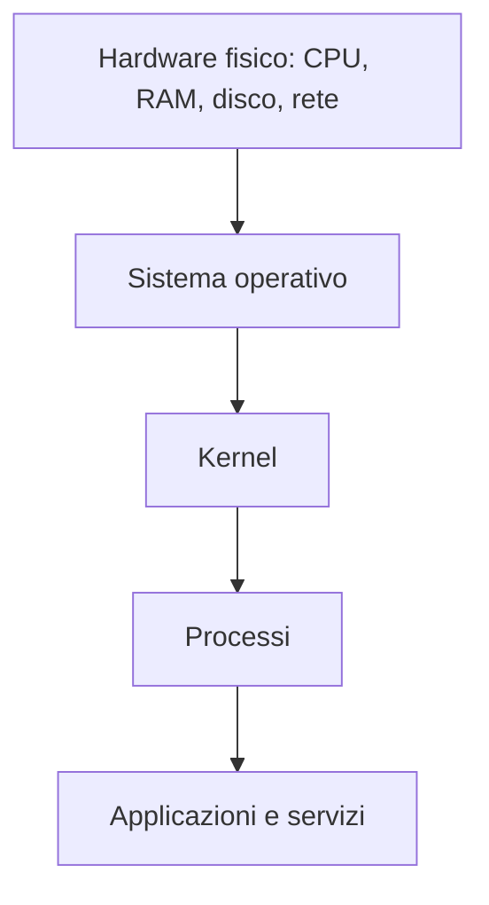

### 2.1 Hardware

L'hardware e' la parte fisica:

| Componente | Funzione |
|---|---|
| CPU | esegue istruzioni |
| RAM | contiene dati e programmi in esecuzione |
| Disco | conserva file e sistemi operativi |
| Scheda rete | permette la comunicazione con altre macchine |

### 2.2 Sistema operativo

Il sistema operativo e' il software di base che permette alle applicazioni di usare la macchina. Gestisce l'hardware e fornisce servizi alle applicazioni.

Esempi:

- Windows;
- Linux;
- macOS;
- Windows Server;
- Ubuntu Server.

Un'applicazione non accede normalmente all'hardware in modo diretto. Chiede al sistema operativo di leggere file, usare memoria, aprire porte di rete, creare processi.

### 2.3 Kernel

Il kernel e' la parte centrale del sistema operativo. E' il livello che coordina l'accesso alle risorse fondamentali della macchina: CPU, memoria, disco, rete e dispositivi.

Gestisce:

- processi;
- memoria;
- filesystem;
- rete;
- permessi;
- driver;
- chiamate di sistema.

Quando un programma Python apre una porta TCP, non "controlla la scheda di rete" direttamente. Chiede al kernel di creare un socket e metterlo in ascolto.

In pratica, il kernel e' il mediatore tra programmi e risorse fisiche o virtuali della macchina.

### 2.4 Processo

Un processo e' un programma in esecuzione, con una propria area di memoria, un proprio identificativo e risorse assegnate dal sistema operativo.

Esempi:

| Programma | Processo possibile |
|---|---|
| Python | server HTTP locale |
| Nginx | web server |
| MySQL | database server |
| Prometheus | sistema di raccolta metriche |
| Grafana | interfaccia dashboard |

Nel laboratorio UD03, quando avviamo:

```bash
python3 src/http_lab_server.py 8081
```

stiamo creando un processo Python che chiede al sistema operativo di ascoltare sulla porta TCP `8081`.

La porta TCP e' un numero logico usato per raggiungere un servizio di rete. L'indirizzo IP individua la macchina o l'interfaccia; la porta individua il servizio su quella macchina.

---

## 3. Virtualizzazione: che cosa significa

Virtualizzare significa creare una macchina "logica" sopra una macchina fisica.

Una macchina virtuale si comporta come se fosse un computer autonomo:

- ha CPU virtuali;
- ha RAM virtuale;
- ha disco virtuale;
- ha schede di rete virtuali;
- ha un proprio sistema operativo installato.

La macchina virtuale non e' un computer fisico separato. E' un ambiente software che usa le risorse del computer reale.

L'hypervisor e' lo strato software che rende possibile questa astrazione: prende CPU, RAM, disco e rete fisici e li presenta alle VM come risorse virtuali.

Schema generale:

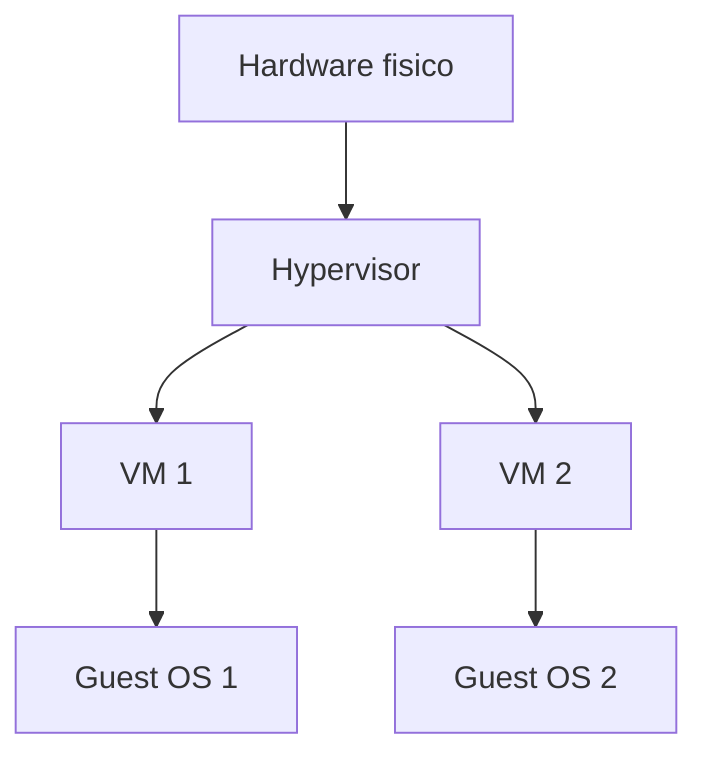

### 3.1 Perche si virtualizza

La virtualizzazione serve a:

- eseguire piu sistemi operativi sulla stessa macchina fisica;
- isolare ambienti diversi;
- creare server rapidamente;
- fare test senza modificare l'host reale;
- consolidare piu server su meno hardware;
- creare infrastrutture cloud.

Esempio pratico:

```text
Un solo server fisico puo ospitare:
- una VM Linux per un'applicazione web;
- una VM Windows Server per Active Directory;
- una VM Linux per un database;
- una VM Linux per monitoraggio e logging.
```

---

## 4. Host OS, guest OS e hypervisor

Per capire VM e container bisogna distinguere tre termini.

| Termine | Significato |
|---|---|
| Host OS | sistema operativo della macchina che ospita altri ambienti |
| Guest OS | sistema operativo installato dentro una VM |
| Hypervisor | software che crea e gestisce VM assegnando loro risorse virtuali |

### 4.1 Host OS

L'host OS e' il sistema operativo installato sulla macchina fisica.

Esempio:

```text
Il PC del partecipante usa Windows 11.
Windows 11 e' l'host OS.
```

### 4.2 Guest OS

Il guest OS e' il sistema operativo installato dentro una VM.

Esempio:

```text
Dentro Hyper-V viene creata una VM Ubuntu.
Ubuntu e' il guest OS.
```

### 4.3 Hypervisor

L'hypervisor e' lo strato che permette di creare ed eseguire macchine virtuali. Decide quanta CPU, RAM, disco e rete virtuale assegnare a ogni VM e media l'accesso alle risorse fisiche.

Esempi:

- Microsoft Hyper-V;
- VMware ESXi;
- VMware Workstation;
- VirtualBox;
- KVM;
- Proxmox VE, basato su KVM;
- Azure, AWS e altri cloud provider, che usano virtualizzazione sotto il livello visibile all'utente.

---

## 5. Hypervisor di tipo 1 e tipo 2

Esistono due modelli principali.

### 5.1 Hypervisor di tipo 1, bare-metal

L'hypervisor gira direttamente sull'hardware fisico.

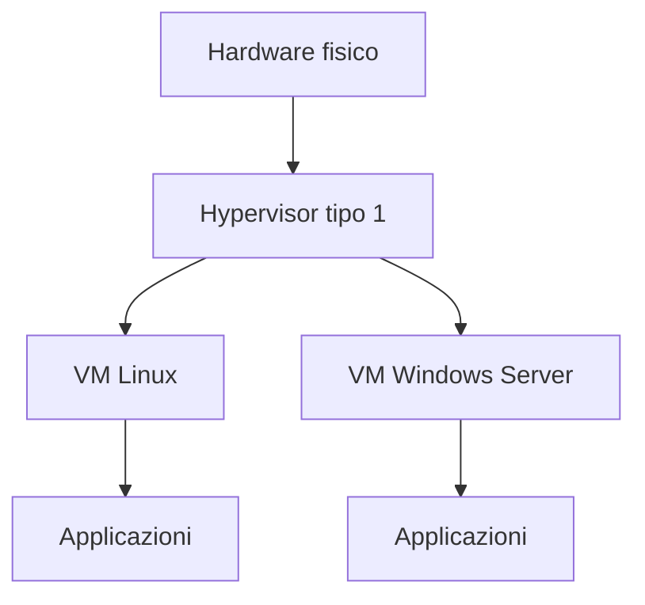

Esempi:

- VMware ESXi;
- Microsoft Hyper-V in scenario server;
- KVM;
- Proxmox VE.

Uso tipico:

- data center;
- server aziendali;
- cloud;
- ambienti di produzione.

### 5.2 Hypervisor di tipo 2, hosted

L'hypervisor gira sopra un sistema operativo gia' installato.

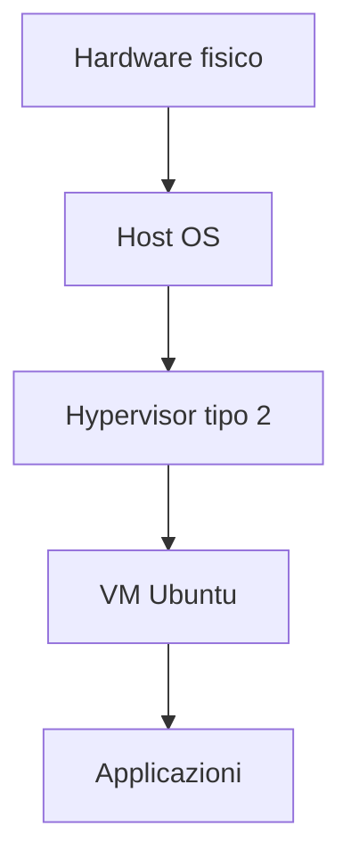

Esempi:

- VirtualBox su Windows;
- VMware Workstation;
- VMware Fusion su macOS.

Uso tipico:

- laboratorio;
- sviluppo;
- formazione;
- test locali.

### 5.3 Differenza principale

| Aspetto | Tipo 1 | Tipo 2 |
|---|---|---|
| Dove gira | direttamente sull'hardware | sopra un sistema operativo host |
| Uso tipico | server, data center, cloud | PC, laboratorio, test |
| Efficienza | maggiore | generalmente minore |
| Semplicita' per desktop | minore | maggiore |

---

## 6. Macchina virtuale: stratificazione completa

Una VM contiene un sistema operativo completo. Questo e' il punto essenziale.

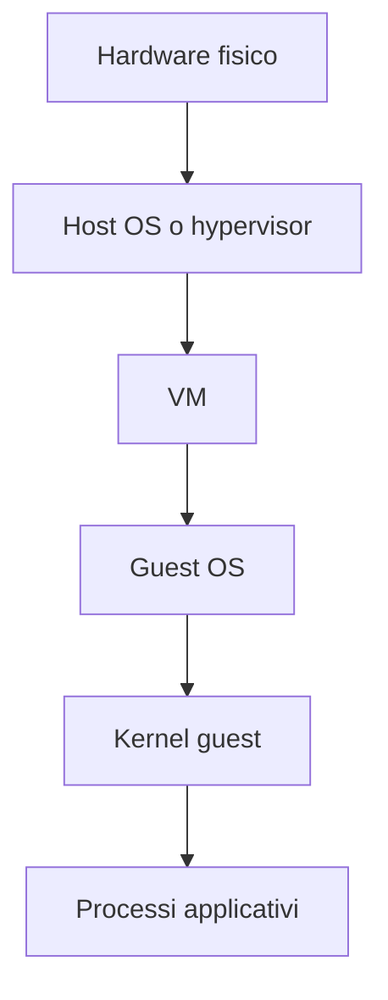

Dentro una VM troviamo:

- sistema operativo;
- kernel;
- driver virtuali;
- filesystem;
- utenti;
- processi;
- rete virtuale;
- servizi.

Una VM Ubuntu, per esempio, ha il proprio kernel Linux e puo' eseguire servizi come se fosse una macchina separata.

### 6.1 Esempio concreto

```text
PC fisico:
  Windows 11
  Hyper-V
  VM Ubuntu Server
    kernel Linux
    processo nginx
    porta TCP 80
```

Se il servizio web nella VM non risponde, il problema puo' essere in molti punti:

- VM spenta;
- rete virtuale non configurata;
- IP della VM errato;
- firewall della VM;
- processo web non avviato;
- porta non in ascolto;
- endpoint HTTP errato.

Questa logica e' molto simile a quella che useremo in UD03, anche se nel laboratorio useremo un server locale semplice.

---

## 7. Container: che cosa sono

Un container e' un ambiente isolato per eseguire uno o piu processi applicativi.

La differenza fondamentale e':

```text
Una VM contiene un sistema operativo completo.
Un container condivide il kernel dell'host.
```

Schema:

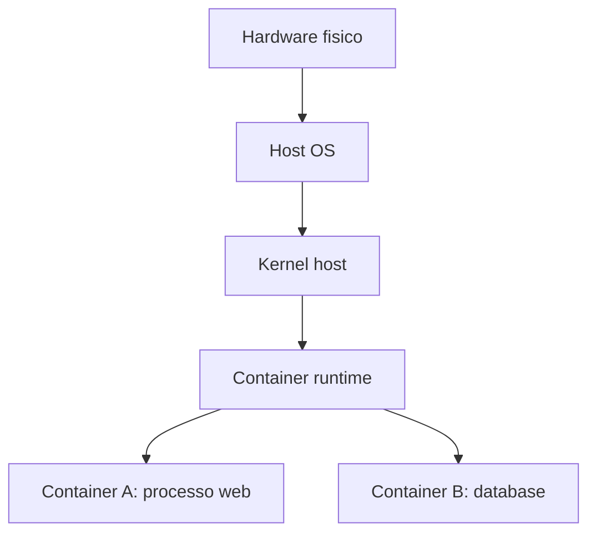

Il container isola:

- filesystem;
- processi;
- variabili d'ambiente;
- rete;
- porte;
- limiti di risorse;
- dipendenze applicative.

Pero' non contiene un kernel autonomo. Usa il kernel dell'host Linux.

### 7.1 Esempio

Un container Nginx puo' contenere:

- binari Nginx;
- file di configurazione;
- file statici;
- librerie necessarie;
- filesystem isolato.

Ma non contiene un kernel Linux completo separato.

Questo e' il motivo per cui un container e' in genere piu leggero di una VM: non deve avviare un sistema operativo completo, ma solo il processo applicativo nel suo ambiente isolato.

---

## 8. Container runtime

Il container runtime e' il componente software che prepara ed esegue container.

Il termine puo' creare confusione perche viene usato in modo un po' ampio. In pratica possiamo distinguere:

| Livello | Che cosa fa | Esempi |
|---|---|---|
| Strumento/engine usato dall'utente | espone comandi, API, gestione immagini, rete, volumi e container | Docker Engine |
| Runtime di alto livello | gestisce ciclo di vita dei container e immagini per conto di engine o orchestratori | containerd, CRI-O |
| Runtime di basso livello | crea concretamente il processo isolato usando primitive del kernel Linux | runc |

Quindi Docker Engine, containerd e CRI-O non vanno letti sempre come tre alternative identiche.

Docker Engine e' la piattaforma che usiamo normalmente con il comando `docker`. Al suo interno puo' usare `containerd` per gestire i container. `containerd` e CRI-O, invece, sono spesso incontrati come runtime usati direttamente da piattaforme di orchestrazione, per esempio Kubernetes.

### 8.1 Caso Docker locale

In un ambiente Docker locale semplificato, la catena puo' essere letta cosi:

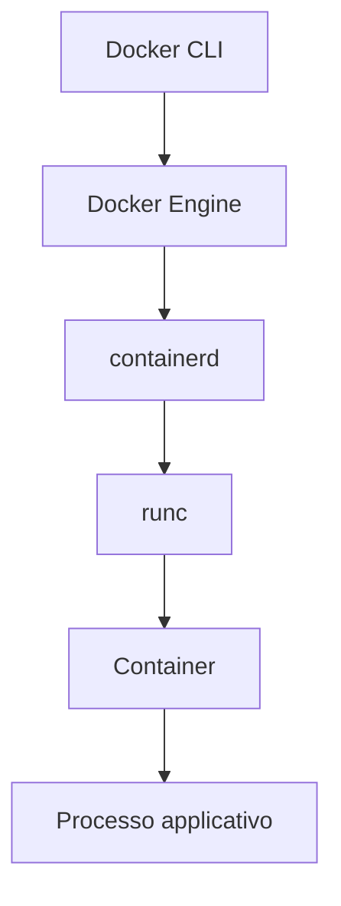

Quando eseguiamo un comando come:

```bash
docker run nginx
```

il comando viene ricevuto da Docker Engine. Docker Engine coordina le operazioni e usa componenti sottostanti, come `containerd` e `runc`, per arrivare all'esecuzione del processo isolato.

In forma semplificata:

1. recupera o usa un'immagine;
2. crea un filesystem isolato;
3. prepara rete e namespace;
4. avvia il processo principale del container;
5. gestisce log, stato e arresto.

### 8.2 Caso Kubernetes, solo come riferimento concettuale

In un cluster Kubernetes, normalmente non usiamo `docker run` sul nodo. Kubernetes chiede al runtime del nodo di avviare container.

Schema molto semplificato:

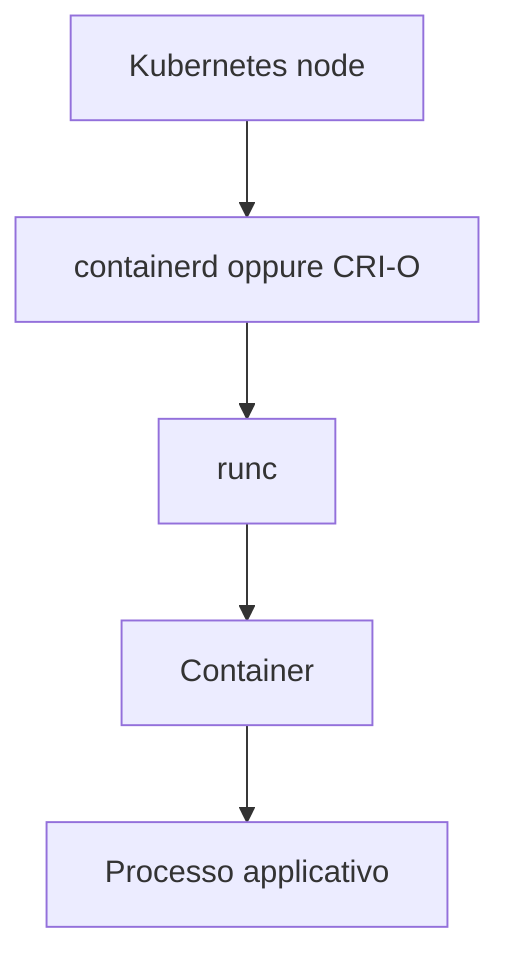

Qui `containerd` e CRI-O sono alternative possibili nello stesso ruolo generale: runtime del nodo usato dall'orchestratore. Non sono pero' "dipendenti" da Docker Engine nello stesso modo mostrato nello schema Docker locale.

### 8.3 Cosa dobbiamo ricordare in questa UD

Per UD03 non serve conoscere tutti i dettagli interni dei runtime. Serve ricordare questo:

| Idea | Spiegazione |
|---|---|
| Il container non parte da solo | serve un runtime o una piattaforma che lo avvii |
| Docker Engine non e' esattamente la stessa cosa di containerd | Docker Engine e' la piattaforma Docker; containerd e' un runtime sottostante o usato anche autonomamente |
| CRI-O e containerd sono spesso alternative in Kubernetes | svolgono il ruolo di runtime del nodo |
| Alla fine viene avviato un processo isolato | il container contiene ed esegue il processo applicativo |

In UD03 non useremo Docker come attivita' principale, ma questi concetti servono per capire perche in ambienti moderni vediamo reti virtuali, porte pubblicate e processi isolati.

---

## 9. Immagine container e container in esecuzione

Un'immagine container e' un modello statico. Un container e' un'istanza in esecuzione di quell'immagine.

La distinzione e' simile a quella tra un file eseguibile e un processo: il file e' fermo su disco, il processo e' in esecuzione. L'immagine e' il modello, il container e' l'esecuzione concreta.

| Concetto | Significato | Esempio |
|---|---|---|
| Immagine | pacchetto statico con file, librerie e comando di avvio | `nginx:latest` |
| Container | processo isolato avviato da un'immagine | un Nginx attivo |

Analogia tecnica:

```text
immagine = template
container = istanza in esecuzione
```

Un'immagine puo' generare molti container.

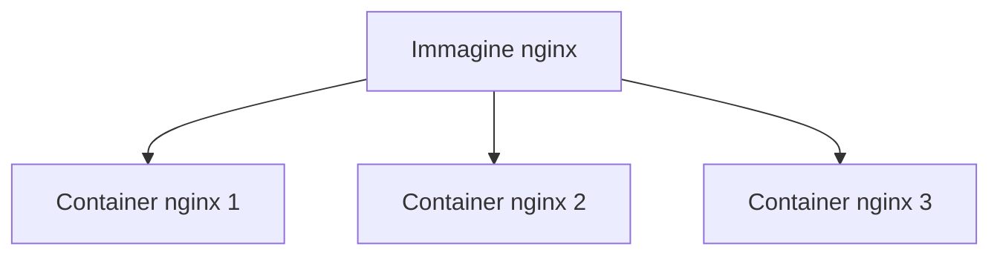

Ogni container puo' avere:

- nome diverso;
- porte diverse;
- variabili d'ambiente diverse;
- volumi diversi;
- stato runtime diverso.

---

## 10. VM e container: confronto chiaro

### 10.1 VM

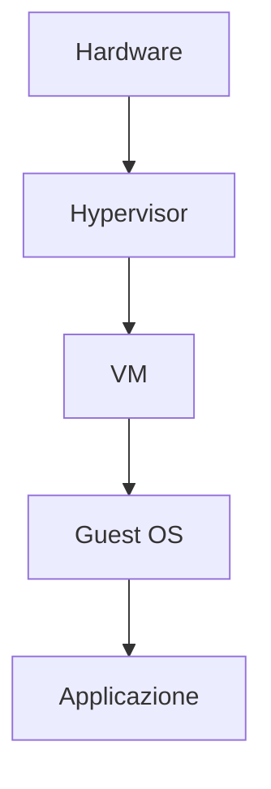

La VM virtualizza una macchina intera.

### 10.2 Container

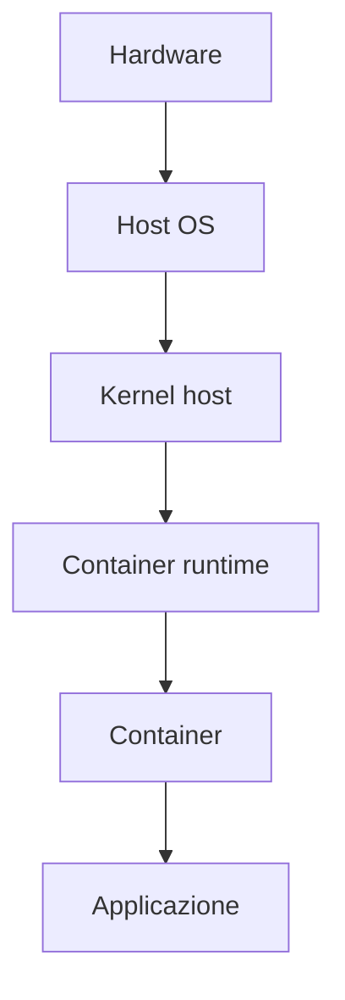

Il container isola un processo applicativo e le sue dipendenze, ma condivide il kernel.

### 10.3 Tabella di confronto

| Aspetto | VM | Container |
|---|---|---|
| Cosa virtualizza/isola | macchina completa | processo e ambiente applicativo |
| Sistema operativo interno | si, guest OS completo | no, condivide il kernel host |
| Kernel separato | si | no |
| Avvio | piu lento | piu rapido |
| Peso | maggiore | minore |
| Isolamento | forte | buono, ma diverso da una VM |
| Uso tipico | server completi, OS diversi, ambienti isolati | microservizi, test, deploy applicativi |
| Esempi | VM Ubuntu, VM Windows Server | container Nginx, container PostgreSQL |

### 10.4 Errore frequente

Dire "Docker e' una VM" e' impreciso.

Piu correttamente:

```text
Docker usa container.
I container non sono VM complete.
I container condividono il kernel dell'host Linux.
Docker Desktop su Windows puo' usare WSL2 o una VM Linux di supporto.
```

Questo ultimo punto crea spesso confusione: su Windows Docker ha bisogno di un ambiente Linux sottostante per eseguire container Linux. Ma il container resta un container, non una VM completa.

---

## 11. WSL2 nel nostro corso

WSL2 e' importante perche ci consente di usare Linux dentro Windows.

Schema semplificato:

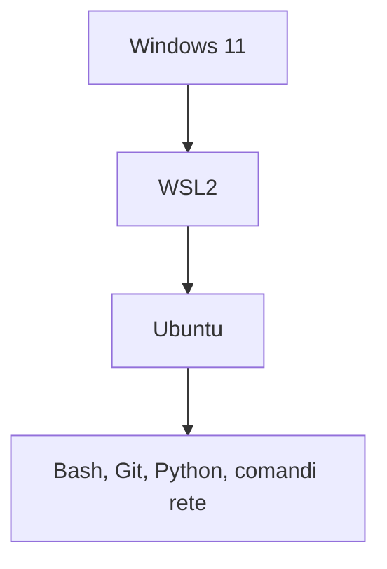

WSL2 usa una virtualizzazione leggera. Dal punto di vista pratico:

- Ubuntu in WSL2 ha un proprio ambiente Linux;
- puo' avere un IP diverso da Windows;
- puo' avere una route di default propria;
- puo' avere un resolver DNS generato automaticamente;
- puo' interagire con Docker Desktop;
- puo' eseguire comandi Linux nativi.

Quando in UD03 eseguiamo:

```bash
ip a
ip r
cat /etc/resolv.conf
ss -ltnp
```

stiamo guardando l'ambiente Linux in cui stiamo lavorando, non genericamente "tutto il PC Windows".

---

## 12. Rete virtuale: perche vediamo interfacce non fisiche

In un PC moderno possiamo vedere piu interfacce di rete:

- scheda Wi-Fi fisica;
- scheda Ethernet fisica;
- loopback;
- interfaccia WSL2;
- interfacce Docker;
- interfacce VPN;
- interfacce Hyper-V o VirtualBox.

Non tutte corrispondono a una scheda fisica.

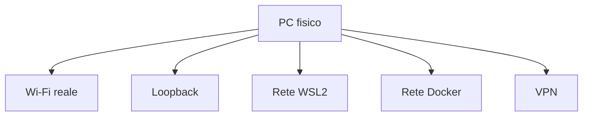

Il comando:

```bash
ip a
```

mostra le interfacce visibili nell'ambiente Linux corrente.

Esempio semplificato:

```text
lo      127.0.0.1
eth0    172.27.120.120
docker0 172.17.0.1
```

Interpretazione:

| Interfaccia | Significato possibile |
|---|---|
| `lo` | loopback locale |
| `eth0` | interfaccia principale dell'ambiente Linux |
| `docker0` | bridge di rete Docker |

Non dobbiamo memorizzare tutti i nomi. Dobbiamo capire che molte interfacce sono virtuali e servono a collegare ambienti isolati.

---

## 13. Rete nei container: porta interna e porta pubblicata

Un container puo' avere un servizio in ascolto su una porta interna. Per raggiungerlo dall'host, quella porta deve essere pubblicata.

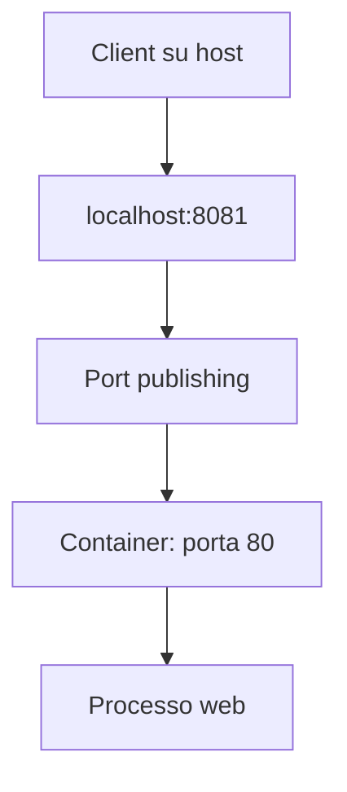

Esempio concettuale:

```text
host:8081 -> container:80
```

Significa:

- dal PC host usiamo `localhost:8081`;
- Docker riceve la connessione sulla porta `8081`;
- Docker la inoltra alla porta `80` del container;
- il processo web dentro il container risponde.

Problemi possibili:

| Sintomo | Possibile causa |
|---|---|
| container spento | runtime/container non attivo |
| porta host non raggiungibile | port publishing mancante o errato |
| porta container errata | servizio ascolta su altra porta |
| HTTP 404 | servizio raggiunto, endpoint inesistente |
| HTTP 500 | errore applicativo nel container |

Questo e' il motivo per cui in UD03 insistiamo su IP, porte, processi e HTTP: sono gli stessi concetti che servono per capire container e servizi cloud.

---

## 14. IP, localhost e loopback

Un indirizzo IP identifica un'interfaccia di rete.

Esempi:

| Indirizzo | Significato tipico |
|---|---|
| `127.0.0.1` | loopback IPv4 locale |
| `::1` | loopback IPv6 locale |
| `192.168.x.x` | rete privata domestica o aziendale |
| `10.x.x.x` | rete privata, VPN, cloud o azienda |
| `172.16.x.x` - `172.31.x.x` | rete privata, spesso usata anche da WSL/Docker |
| `1.1.1.1` | DNS pubblico Cloudflare |
| `8.8.8.8` | DNS pubblico Google |

`localhost` e' un nome, non un indirizzo IP. Di solito risolve a:

```text
127.0.0.1
```

oppure:

```text
::1
```

Per verificare il servizio locale possiamo usare:

```bash
curl -i http://localhost:8081/
```

oppure:

```bash
curl -i http://127.0.0.1:8081/
```

Se sospettiamo differenze IPv4/IPv6:

```bash
curl -4 -i http://localhost:8081/
```

---

## 15. DNS: nomi e indirizzi

Il DNS traduce nomi in indirizzi IP.

Esempio:

```text
example.com -> 93.184.216.34
```

Quando eseguiamo:

```bash
curl https://example.com
```

prima avviene la risoluzione DNS, poi la connessione TCP, poi HTTP/HTTPS.

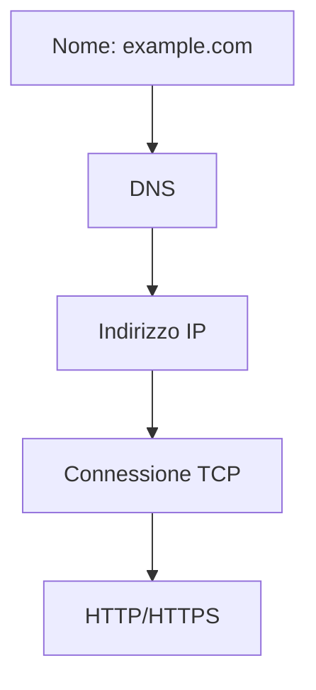

Comandi utili:

```bash
cat /etc/resolv.conf
dig example.com
nslookup example.com
dig @1.1.1.1 example.com
```

Confronto importante:

| Comando | Cosa verifica |
|---|---|
| `ping 1.1.1.1` | connettivita IP/ICMP verso un indirizzo |
| `ping google.com` | DNS + ICMP |
| `dig google.com` | risoluzione DNS |
| `curl https://example.com` | DNS + TCP + TLS + HTTP |

`ping` non verifica che un sito web funzioni. Verifica solo una forma di raggiungibilita ICMP, se non bloccata.

---

## 16. Routing: uscire dalla rete locale

Il routing indica quale strada usa il sistema per raggiungere una destinazione.

Comando:

```bash
ip r
```

Esempio:

```text
default via 172.27.112.1 dev eth0
```

Significa:

| Parte | Significato |
|---|---|
| `default` | regola usata per destinazioni non locali |
| `via 172.27.112.1` | gateway |
| `dev eth0` | interfaccia usata |

Se manca una route di default, il sistema puo' parlare con se stesso o con la rete locale, ma non con Internet.

---

## 17. Porte TCP e socket

Un servizio di rete ascolta su una porta.

Una porta TCP non e' una porta fisica. E' un numero usato dal sistema operativo per distinguere piu servizi di rete sulla stessa macchina.

Esempi:

| Porta | Uso tipico |
|---:|---|
| 22 | SSH |
| 53 | DNS |
| 80 | HTTP |
| 443 | HTTPS |
| 8080 | HTTP alternativo |
| 8081 | porta usata nel laboratorio UD03 |
| 9090 | spesso Prometheus |
| 3000 | spesso Grafana |

Per vedere le porte in ascolto:

```bash
ss -ltnp
```

Opzioni:

| Opzione | Significato |
|---|---|
| `-l` | listening, socket in ascolto |
| `-t` | TCP |
| `-n` | numerico, senza risoluzione nomi |
| `-p` | processo associato |

Esempio:

```text
LISTEN 0 5 0.0.0.0:8081 0.0.0.0:* users:(("python3",pid=1234,fd=3))
```

Interpretazione:

```text
Un processo python3, PID 1234, ascolta sulla porta TCP 8081.
```

Questo e' un socket in ascolto: il processo ha chiesto al sistema operativo di ricevere connessioni TCP su un certo indirizzo e una certa porta.

---

## 18. Binding: 127.0.0.1, 0.0.0.0 e interfacce

Un processo puo' ascoltare su indirizzi diversi.

Il binding e' l'associazione tra un processo e l'indirizzo/porta su cui il processo decide di ascoltare. Non basta dire "il servizio usa la porta 8081": bisogna anche capire su quale indirizzo la usa.

| Binding | Significato |
|---|---|
| `127.0.0.1:8081` | raggiungibile solo localmente via IPv4 loopback |
| `localhost:8081` | nome locale, puo' risolvere IPv4 o IPv6 |
| `0.0.0.0:8081` | ascolta su tutte le interfacce IPv4 |
| `[::]:8081` | ascolto su IPv6 |

Questa differenza e' importante:

```text
Se un servizio ascolta solo su 127.0.0.1, funziona dalla stessa macchina.
Non e' detto che sia raggiungibile da altre macchine.
```

Nei container e nel cloud questa distinzione diventa ancora piu importante.

---

## 19. HTTP: richiesta, risposta, endpoint

HTTP e' un protocollo applicativo. Lavora sopra TCP.

Protocollo applicativo significa che HTTP definisce il formato delle richieste e delle risposte tra client e server web. TCP si occupa della connessione; HTTP si occupa del significato della comunicazione web.

Una richiesta semplificata:

```text
GET /health HTTP/1.1
Host: localhost:8081
```

Una risposta semplificata:

```text
HTTP/1.0 200 OK
Content-Type: text/plain

OK
```

Un endpoint e' un percorso applicativo esposto dal servizio:

| Endpoint | Significato possibile |
|---|---|
| `/` | home o risposta base |
| `/health` | stato del servizio |
| `/metrics` | metriche |
| `/fail` | errore simulato |
| `/non-esiste` | rotta assente |

Comando principale:

```bash
curl -i http://localhost:8081/health
```

---

## 20. Status code HTTP

| Codice | Significato operativo |
|---:|---|
| 200 | richiesta gestita correttamente |
| 301/302 | redirect |
| 400 | richiesta non valida |
| 401 | autenticazione richiesta |
| 403 | accesso vietato |
| 404 | endpoint o risorsa non trovata |
| 429 | troppe richieste |
| 500 | errore lato server/applicazione |
| 503 | servizio non disponibile |

Regola fondamentale:

```text
Se riceviamo uno status code HTTP, il server ha risposto.
```

Quindi:

| Caso | Diagnosi corretta |
|---|---|
| HTTP 200 | servizio raggiunto, endpoint funzionante |
| HTTP 404 | servizio raggiunto, endpoint inesistente |
| HTTP 500 | servizio raggiunto, errore applicativo/server |
| nessuna risposta HTTP | problema prima della risposta HTTP: DNS, rete, porta, processo, timeout |

Errore comune:

```text
HTTP 404 non significa server spento.
Significa che il server ha risposto ma non ha trovato la risorsa.
```

---

## 21. Curl come strumento diagnostico

Comandi utili:

```bash
curl http://localhost:8081/
curl -i http://localhost:8081/
curl -I https://example.com
curl -v http://localhost:8081/ 2>&1 | head -n 40
```

`curl -v` mostra informazioni molto utili:

| Riga visibile | Significato |
|---|---|
| `Host ... was resolved` | risoluzione nome avvenuta |
| `Trying ...` | tentativo verso IP e porta |
| `Connected ...` | connessione TCP riuscita |
| `> GET ...` | richiesta HTTP inviata |
| `< HTTP/...` | risposta HTTP ricevuta |

Esempio:

```text
* Host localhost:8081 was resolved.
* Trying 127.0.0.1:8081...
* Connected to localhost (127.0.0.1) port 8081
> GET / HTTP/1.1
< HTTP/1.0 200 OK
```

Queste righe permettono di capire in quale fase si trova il problema.

---

## 22. Errori tipici: refused, timeout, already in use

| Sintomo | Significato probabile | Livello |
|---|---|---|
| `Connection refused` | host raggiungibile, porta chiusa o servizio assente | porta/processo |
| `Connection timed out` | nessuna risposta entro il tempo previsto | rete/firewall/routing/servizio bloccato |
| `Address already in use` | porta gia' occupata da un altro processo | conflitto locale |

### 22.1 Connection refused

```bash
curl -i --max-time 3 http://localhost:8099/ || true
ss -ltnp | grep 8099 || true
```

Se `ss` non mostra nulla, non c'e' un servizio in ascolto su `8099`.

### 22.2 Address already in use

Se il server e' gia' attivo su `8081` e proviamo ad avviarne un altro sulla stessa porta:

```bash
python3 src/http_lab_server.py 8081
```

possiamo ottenere:

```text
Address already in use
```

Verifica:

```bash
ss -ltnp | grep 8081 || true
```

---

## 23. Server HTTP locale della UD03

Nel laboratorio useremo:

```bash
python3 src/http_lab_server.py 8081
```

Poi, da un secondo terminale:

```bash
ss -ltnp | grep 8081 || true
curl -i http://localhost:8081/
curl -i http://localhost:8081/health
curl -i http://localhost:8081/metrics
curl -i http://localhost:8081/fail
curl -i http://localhost:8081/non-esiste
```

Lettura attesa:

| Endpoint | Risposta attesa | Interpretazione |
|---|---|---|
| `/` | 200 | servizio raggiungibile |
| `/health` | 200 | health check disponibile |
| `/metrics` | 200 | metriche dimostrative disponibili |
| `/slow` | 200 con ritardo | servizio raggiungibile ma lento |
| `/fail` | 500 | errore applicativo simulato |
| `/non-esiste` | 404 | endpoint inesistente |

---

## 24. Metodo diagnostico

Per ogni problema usiamo questa sequenza:

```text
Sintomo
Ipotesi
Test
Output chiave
Interpretazione
Correzione o workaround
Evidenza
```

Esempio:

```text
Sintomo: curl verso localhost:8099 fallisce.
Ipotesi: nessun processo ascolta sulla porta 8099.
Test: ss -ltnp | grep 8099.
Output chiave: nessuna riga.
Interpretazione: la porta non e' in ascolto.
Correzione: avviare il servizio corretto o usare la porta corretta.
Evidenza: output di curl e ss.
```

Tabella di classificazione:

| Sintomo | Livello probabile | Test utile |
|---|---|---|
| nome non risolve | DNS | `dig`, `nslookup`, `/etc/resolv.conf` |
| IP non raggiungibile | rete/routing/firewall | `ping`, `ip r`, `traceroute` |
| porta non risponde | porta/processo | `curl`, `ss -ltnp` |
| porta gia' occupata | conflitto locale | `ss -ltnp`, PID processo |
| HTTP 404 | endpoint applicativo | `curl -i`, confronto endpoint |
| HTTP 500 | errore applicativo | `curl -i`, log applicativi |
| risposta lenta | latenza | `time curl`, log, metriche |

---

## 25. Collegamento con Observability

I comandi della UD03 sono diagnostica manuale. L'Observability automatizza e struttura parte di queste informazioni.

| Diagnostica manuale | Segnale osservabile corrispondente |
|---|---|
| `curl -i` | health check, synthetic monitoring |
| status code HTTP | metriche di error rate |
| tempo di risposta | metriche di latenza |
| `ss -ltnp` | runtime diagnostics, inventory servizi |
| log applicativi | log centralizzati |
| richiesta lenta | metriche percentile, trace |
| tabella sintomo/ipotesi/test | incident analysis, RCA |

Prima di usare dashboard e alert dobbiamo saper interpretare i segnali di base. Altrimenti una dashboard diventa solo una schermata piena di numeri.

---

## 26. Sintesi dei concetti da ricordare

| Concetto | Idea chiave |
|---|---|
| Hardware | macchina fisica |
| OS | gestisce hardware e applicazioni |
| Kernel | nucleo del sistema operativo |
| Processo | programma in esecuzione |
| Hypervisor | crea e gestisce VM |
| VM | macchina virtuale con guest OS completo |
| Guest OS | sistema operativo dentro la VM |
| Host OS | sistema operativo che ospita VM/container |
| Container | processo isolato con dipendenze applicative |
| Runtime container | avvia e gestisce container |
| Immagine | modello statico per creare container |
| Porta | punto di accesso a un servizio |
| Socket | combinazione protocollo/IP/porta/processo |
| DNS | risolve nomi in indirizzi IP |
| HTTP | protocollo applicativo web |
| Endpoint | percorso esposto dal servizio |
| Status code | esito della risposta HTTP |

Sequenza mentale minima:

```text
nome -> DNS -> IP -> porta -> processo -> HTTP -> endpoint -> status code -> log/metriche
```

Se sappiamo collocare il problema in questa sequenza, il troubleshooting diventa molto piu ordinato.
