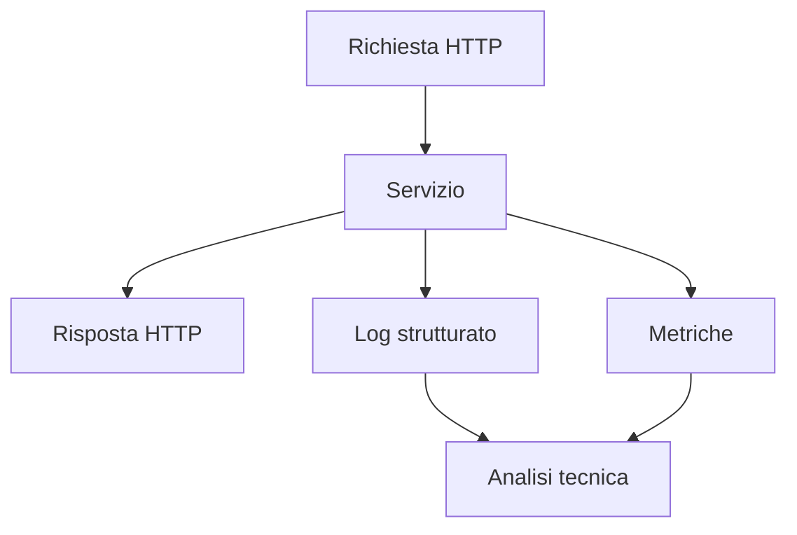
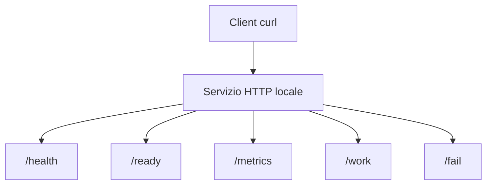
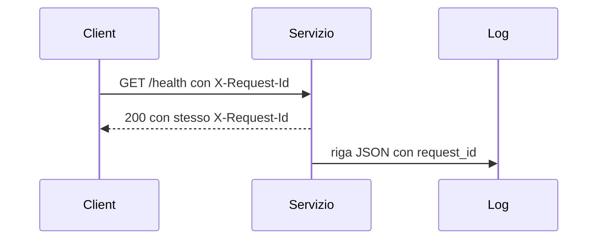
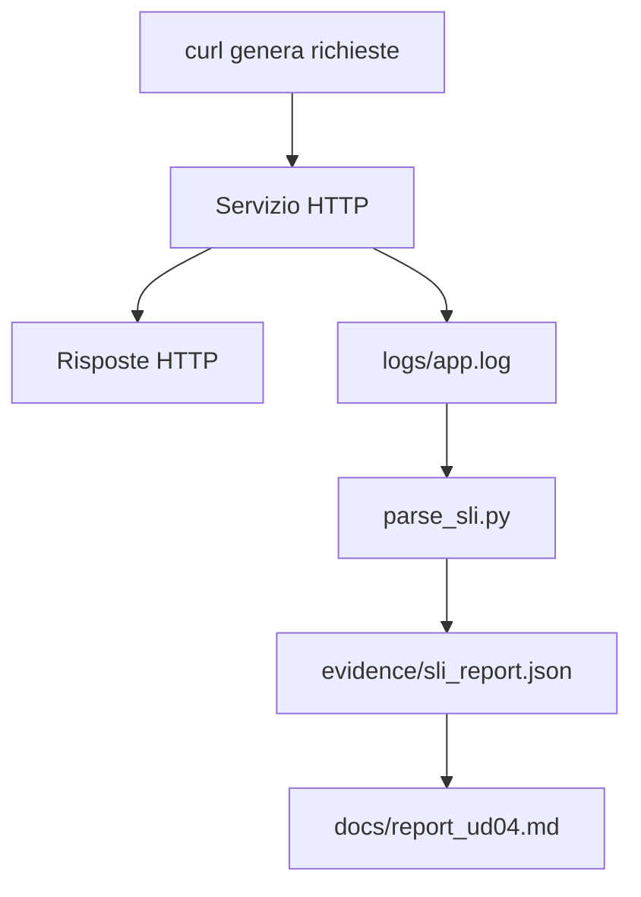

# OBS_UD04 - Concetti: primo servizio osservabile, log, metriche e SLI

## 1. Obiettivo tecnico della UD04

In questa UD lavoriamo su un piccolo servizio HTTP locale e lo rendiamo osservabile.

Il servizio non deve solo rispondere alle richieste. Deve anche produrre informazioni utili per capire:

- quali endpoint sono stati chiamati;
- con quale metodo HTTP;
- con quale status code;
- con quale durata;
- con quale identificativo di richiesta;
- se il servizio e' vivo;
- se il servizio e' pronto;
- quante richieste ha gestito;
- quante richieste sono finite in errore;
- quali indicatori possiamo calcolare dai log.

Sequenza della UD:

```text
servizio HTTP -> log JSON -> request-id -> metriche -> parser SLI -> report tecnico
```

---

## 2. Glossario iniziale

Prima di usare i concetti, fissiamo i termini principali.

| Termine | Definizione rapida |
|---|---|
| Servizio | programma in esecuzione che risponde a richieste, per esempio via HTTP |
| Servizio osservabile | servizio che produce segnali utili per capirne il comportamento |
| Segnale | informazione tecnica prodotta dal sistema: log, metrica o trace |
| Log | registrazione di un evento avvenuto nel servizio |
| Log strutturato | log scritto con campi stabili, per esempio in JSON |
| JSON | formato testuale basato su coppie chiave/valore |
| Campo | singola informazione dentro un record, per esempio `status` o `duration_ms` |
| Timestamp | data e ora associate a un evento |
| Level | livello di gravita' del log, per esempio `INFO`, `WARN`, `ERROR` |
| Request-id | identificativo associato a una singola richiesta |
| Header HTTP | metadato inviato nella richiesta o nella risposta HTTP |
| Metrica | valore numerico che descrive un comportamento del servizio |
| Counter | metrica che cresce nel tempo, per esempio richieste totali |
| Gauge | metrica che rappresenta un valore misurato, per esempio durata media |
| Endpoint | percorso HTTP esposto dal servizio, per esempio `/health` |
| Health check | verifica che il processo sia vivo e risponda |
| Readiness | verifica che il servizio sia pronto a ricevere traffico |
| Latenza | tempo necessario per completare una richiesta |
| SLI | indicatore numerico del comportamento del servizio |
| Error rate | percentuale di richieste fallite |
| Availability | percentuale di richieste concluse con esito positivo |
| Percentile | valore sotto il quale cade una certa percentuale di misure |
| Parser | programma che legge dati e li trasforma in una struttura utile |

---

## 3. Servizio funzionante e servizio osservabile

Un servizio funzionante risponde alle richieste previste.

Un servizio osservabile risponde alle richieste e produce segnali tecnici che permettono di capire cosa sta succedendo.

| Tipo di servizio | Caratteristica | Limite |
|---|---|---|
| Servizio funzionante | risponde alle richieste | se qualcosa va male, abbiamo poche informazioni |
| Servizio osservabile | risponde e lascia tracce interpretabili | richiede progettazione dei segnali |

Esempio:

```text
Caso A:
curl /health restituisce 200.
Sappiamo che il servizio risponde.

Caso B:
curl /health restituisce 200.
Il servizio scrive anche un log JSON con request_id, path, status e duration_ms.
Sappiamo che il servizio risponde e possiamo correlare la risposta con una riga di log.
```

Schema:



In questa UD non costruiamo ancora una piattaforma completa di Observability. Costruiamo un servizio che produce segnali minimi, leggibili e analizzabili.

---

## 4. Monitoring e observability

Monitoring e observability sono collegati, ma non sono sinonimi.

Il monitoring controlla il comportamento del sistema rispetto a condizioni note.

Esempio:

```text
Se error_rate > 5%, genera un alert.
Se latency_p95_ms > 500, genera un alert.
Se /health non risponde, segnala servizio non raggiungibile.
```

L'observability aiuta a capire perche il sistema si comporta in un certo modo, anche quando non conosciamo gia' la causa.

| Concetto | Domanda principale | Esempio |
|---|---|---|
| Monitoring | il sistema sta rispettando soglie note? | error rate sopra soglia |
| Observability | perche il sistema si comporta cosi? | quale endpoint genera errori e con quali request-id |

Esempio operativo:

```text
Monitoring:
L'alert dice che gli errori sono aumentati.

Observability:
Dai log vediamo che gli errori arrivano da /fail, hanno status 500 e level ERROR.
```

---

## 5. I tre segnali principali: log, metriche, trace

Un segnale e' un'informazione prodotta da un sistema per descrivere il proprio comportamento.

Nel percorso useremo tre famiglie principali:

| Segnale | Che cosa racconta | Esempio |
|---|---|---|
| Log | evento specifico accaduto nel tempo | richiesta `/health` con status 200 |
| Metrica | valore numerico aggregabile | totale richieste, error rate, durata media |
| Trace | percorso di una richiesta tra componenti | API -> servizio -> database |

In UD04 lavoriamo soprattutto su:

- log strutturati;
- request-id;
- metriche minime;
- SLI calcolati dai log.

I trace distribuiti verranno affrontati piu avanti. In questa UD e' sufficiente capire che un trace serve a seguire una richiesta attraverso piu servizi.

---

## 6. Servizio HTTP della UD04

Il laboratorio usa un servizio Python locale:

```bash
PORT=9100 LOG_PATH="logs/app.log" python3 src/observable_service.py
```

Il comando avvia un processo Python che ascolta sulla porta TCP `9100`.

| Parte del comando | Significato |
|---|---|
| `PORT=9100` | imposta la porta del servizio |
| `LOG_PATH="logs/app.log"` | imposta il percorso del file di log |
| `python3` | avvia l'interprete Python |
| `src/observable_service.py` | file sorgente del servizio |

Il servizio espone diversi endpoint:

| Endpoint | Metodo | Risposta attesa | Scopo didattico |
|---|---|---|---|
| `/health` | GET | 200 | verificare che il processo sia vivo |
| `/ready` | GET | 200 oppure 503 | verificare se il servizio e' pronto |
| `/time` | GET | 200 | restituire ora corrente UTC |
| `/metrics` | GET | 200 | mostrare metriche minime |
| `/work?ms=300` | GET | 200 dopo ritardo | simulare latenza |
| `/fail` | GET | 500 | simulare errore applicativo |
| `/echo` | POST | 200 oppure 400 | restituire JSON ricevuto o segnalare JSON errato |
| endpoint inesistente | GET/POST | 404 | simulare rotta non trovata |

Schema degli endpoint:



---

## 7. Configurazione tramite variabili d'ambiente

Una variabile d'ambiente e' un valore passato al processo al momento dell'avvio.

Il servizio UD04 legge alcune variabili:

| Variabile | Valore predefinito | Significato |
|---|---|---|
| `PORT` | `9100` | porta TCP su cui ascolta il servizio |
| `LOG_PATH` | `logs/app.log` | file in cui scrivere i log JSON |
| `SERVICE_NAME` | `obs-demo` | nome logico del servizio |
| `SERVICE_VERSION` | `1.0.0` | versione del servizio |
| `READY` | `true` | indica se `/ready` deve rispondere pronto |

Esempio:

```bash
PORT=9100 READY=false LOG_PATH="logs/app.log" python3 src/observable_service.py
```

In questo caso il servizio parte, ma l'endpoint `/ready` risponde con `503`.

Questo e' utile per distinguere:

```text
processo vivo != servizio pronto
```

---

## 8. Log: registrare eventi

Un log e' una registrazione di qualcosa che e' accaduto.

Esempio libero, poco strutturato:

```text
Richiesta health ok
```

Questo messaggio e' leggibile, ma contiene poche informazioni e non e' facile da elaborare automaticamente.

Un log piu utile deve rispondere ad alcune domande:

| Domanda | Campo utile |
|---|---|
| Quando e' accaduto? | `ts` |
| Quanto era grave? | `level` |
| Quale servizio lo ha prodotto? | `service` |
| Quale richiesta riguarda? | `request_id` |
| Quale endpoint e' stato chiamato? | `path` |
| Quale status HTTP e' stato restituito? | `status` |
| Quanto e' durata la richiesta? | `duration_ms` |

---

## 9. Log strutturati e JSON

Un log strutturato e' un log scritto con campi stabili.

Nel laboratorio usiamo JSON. JSON e' un formato testuale basato su coppie chiave/valore.

Esempio:

```json
{
  "ts": "2026-06-24T10:20:30.123Z",
  "level": "INFO",
  "service": "obs-demo",
  "version": "1.0.0",
  "request_id": "ud04-guidato-001",
  "client": "127.0.0.1",
  "method": "GET",
  "path": "/health",
  "query": "",
  "status": 200,
  "duration_ms": 4
}
```

Ogni campo ha un significato:

| Campo | Definizione | Esempio |
|---|---|---|
| `ts` | timestamp, cioe' data e ora dell'evento | `2026-06-24T10:20:30Z` |
| `level` | livello del log | `INFO`, `WARN`, `ERROR` |
| `service` | nome del servizio | `obs-demo` |
| `version` | versione del servizio | `1.0.0` |
| `request_id` | identificativo della richiesta | `ud04-guidato-001` |
| `client` | IP del client che ha chiamato il servizio | `127.0.0.1` |
| `method` | metodo HTTP | `GET`, `POST` |
| `path` | endpoint richiesto | `/health` |
| `query` | parte della URL dopo `?` | `ms=300` |
| `status` | status code HTTP restituito | `200`, `404`, `500` |
| `duration_ms` | durata della richiesta in millisecondi | `4` |

Per leggere meglio una riga JSON possiamo usare:

```bash
tail -n 1 logs/app.log | python3 -m json.tool
```

---

## 10. Level: INFO, WARN, ERROR

Il campo `level` indica la severita' dell'evento.

Nel laboratorio troviamo principalmente:

| Level | Significato | Esempio |
|---|---|---|
| `INFO` | evento normale | richiesta `/health` con status 200 |
| `WARN` | evento anomalo ma gestito | `/ready` non pronto, endpoint non trovato |
| `ERROR` | errore applicativo o tecnico rilevante | `/fail` con status 500 |

Esempi nel servizio:

| Scenario | Status | Level |
|---|---:|---|
| `/health` | 200 | `INFO` |
| `/ready` con `READY=false` | 503 | `WARN` |
| `/nope` | 404 | `WARN` |
| `/fail` | 500 | `ERROR` |

Il `level` non sostituisce lo status code. Sono due informazioni diverse:

```text
status = risultato HTTP visto dal client
level = gravita' dell'evento nel log del servizio
```

---

## 11. Request-id e correlazione

Il `request_id` e' un identificativo associato a una singola richiesta.

Serve a collegare:

```text
risposta vista dal client -> riga di log prodotta dal server
```

Nel laboratorio usiamo l'header HTTP:

```text
X-Request-Id
```

Un header HTTP e' un metadato inviato insieme alla richiesta o alla risposta. Non e' il corpo della richiesta: e' un'informazione aggiuntiva.

Esempio:

```bash
curl -i -H 'X-Request-Id: ud04-guidato-001' http://localhost:9100/health
```

Il servizio:

1. legge l'header `X-Request-Id`;
2. usa quel valore come `request_id`;
3. lo restituisce nella risposta HTTP;
4. lo scrive nel log JSON.

Verifica:

```bash
grep 'ud04-guidato-001' logs/app.log
```

Schema:



Se non inviamo un request-id, il servizio ne genera uno automaticamente.

---

## 12. Health check

Un health check verifica se il processo e' vivo e risponde.

Nel laboratorio:

```bash
curl -i http://localhost:9100/health
```

Risposta attesa:

```text
HTTP/1.0 200 OK
```

con un body JSON simile a:

```json
{
  "status": "ok",
  "service": "obs-demo",
  "version": "1.0.0"
}
```

Interpretazione:

```text
Il processo HTTP e' avviato e riesce a gestire una richiesta semplice.
```

Limite:

```text
/health non dimostra da solo che tutte le dipendenze del servizio funzionino.
```

Per esempio, in un sistema reale un servizio puo' rispondere a `/health` ma non riuscire a collegarsi al database.

---

## 13. Readiness

La readiness verifica se il servizio e' pronto a ricevere traffico.

Nel laboratorio:

```bash
curl -i http://localhost:9100/ready
```

Con configurazione normale:

```text
READY=true -> /ready risponde 200
```

Con servizio simulato come non pronto:

```bash
PORT=9100 READY=false LOG_PATH="logs/app.log" python3 src/observable_service.py
```

la richiesta:

```bash
curl -i http://localhost:9100/ready
```

risponde:

```text
HTTP/1.0 503 Service Unavailable
```

Differenza chiave:

| Endpoint | Domanda | Risposta possibile |
|---|---|---|
| `/health` | il processo e' vivo? | 200 |
| `/ready` | il servizio puo' ricevere traffico? | 200 oppure 503 |

Esempio reale:

```text
Il processo web e' acceso.
Pero' il database non e' raggiungibile.
In questo caso /health potrebbe rispondere 200, mentre /ready dovrebbe rispondere 503.
```

---

## 14. Metriche

Una metrica e' un valore numerico che descrive il comportamento del servizio.

Esempi:

| Metrica | Tipo | Significato |
|---|---|---|
| `http_requests_total` | counter | numero totale di richieste gestite |
| `http_errors_total` | counter | numero di richieste con status >= 400 |
| `http_request_duration_avg_ms` | gauge | durata media delle richieste |
| `http_request_duration_max_ms` | gauge | durata massima osservata |

Un counter e' una metrica che cresce nel tempo.

Esempio:

```text
http_requests_total: 10 -> 11 -> 12
```

Un gauge rappresenta un valore misurato in un certo momento.

Esempio:

```text
http_request_duration_avg_ms: 18.4
```

Nel laboratorio leggiamo le metriche con:

```bash
curl -s http://localhost:9100/metrics
```

Esempio di output:

```text
# HELP http_requests_total Total HTTP requests handled by the demo service
# TYPE http_requests_total counter
http_requests_total 12
# HELP http_errors_total Total HTTP requests with status >= 400
# TYPE http_errors_total counter
http_errors_total 2
```

L'endpoint `/metrics` e' un primo esempio di endpoint pensato per essere letto da strumenti esterni.

---

## 15. Latenza e durata richiesta

La latenza e' il tempo necessario per ottenere una risposta.

Nel log UD04 la durata della richiesta viene registrata nel campo:

```text
duration_ms
```

`ms` significa millisecondi.

Esempio:

```json
{
  "path": "/work",
  "status": 200,
  "duration_ms": 303,
  "simulated_delay_ms": 300
}
```

Nel laboratorio simuliamo una richiesta lenta con:

```bash
curl -i 'http://localhost:9100/work?ms=300'
```

Interpretazione:

```text
Il servizio aspetta circa 300 ms prima di rispondere.
Nel log dovremmo trovare una duration_ms coerente con quel ritardo.
```

La latenza e' importante perche un servizio puo' essere formalmente disponibile ma troppo lento per essere accettabile.

---

## 16. Status code ed errori

Uno status code HTTP indica l'esito della risposta.

| Codice | Significato nel laboratorio |
|---:|---|
| 200 | richiesta gestita correttamente |
| 400 | richiesta non valida, per esempio JSON malformato |
| 404 | endpoint non trovato |
| 500 | errore applicativo simulato |
| 503 | servizio non pronto |

Esempi:

```bash
curl -i http://localhost:9100/health
curl -i http://localhost:9100/nope
curl -i http://localhost:9100/fail
curl -i http://localhost:9100/ready
```

Lettura:

| Richiesta | Status atteso | Interpretazione |
|---|---:|---|
| `/health` | 200 | servizio vivo |
| `/nope` | 404 | endpoint inesistente |
| `/fail` | 500 | errore applicativo simulato |
| `/ready` con `READY=false` | 503 | servizio non pronto |

Regola:

```text
Se riceviamo uno status HTTP, il server ha risposto.
Lo status ci dice come ha risposto.
```

---

## 17. SLI: Service Level Indicator

Uno SLI, Service Level Indicator, e' un indicatore numerico che misura un aspetto del servizio.

In questa UD calcoliamo SLI dai log.

Esempi:

| SLI | Formula semplificata | Domanda |
|---|---|---|
| Error rate | errori / richieste totali | quante richieste falliscono? |
| Availability | richieste riuscite / richieste totali | quante richieste vanno a buon fine? |
| Latenza p50 | mediana delle durate | qual e' il comportamento tipico? |
| Latenza p95 | 95esimo percentile delle durate | quanto sono lente le richieste peggiori frequenti? |

Uno SLI non e' un grafico. E' una misura.

Un grafico puo' visualizzare uno SLI, ma lo SLI e' il valore tecnico che vogliamo misurare.

---

## 18. Error rate

L'error rate misura la quota di richieste fallite.

Nel laboratorio consideriamo errore ogni status:

```text
status >= 400
```

Formula:

```text
error_rate = errori / richieste_totali
```

Esempio:

| Richieste totali | Errori | Error rate |
|---:|---:|---:|
| 100 | 0 | 0% |
| 100 | 5 | 5% |
| 100 | 20 | 20% |

Nel report `sli_report.json` il valore e' espresso come:

```json
{
  "error_rate_percent": 5.0
}
```

---

## 19. Availability

L'availability indica la percentuale di richieste concluse con esito positivo.

Nel laboratorio:

```text
successi = richieste_totali - errori
availability = successi / richieste_totali
```

Esempio:

| Richieste totali | Errori | Successi | Availability |
|---:|---:|---:|---:|
| 100 | 0 | 100 | 100% |
| 100 | 5 | 95 | 95% |
| 100 | 20 | 80 | 80% |

Nel report:

```json
{
  "availability_percent": 95.0
}
```

Attenzione: questa e' una availability semplificata, calcolata sulle richieste del laboratorio. In sistemi reali il concetto puo' essere definito con regole piu precise.

---

## 20. Percentili: p50 e p95

Un percentile indica un valore sotto il quale cade una certa percentuale di misure.

Esempio con durate in millisecondi:

```text
10, 20, 30, 40, 50, 300, 700
```

La media puo' essere influenzata dai valori alti.

Il percentile aiuta a leggere meglio la distribuzione delle latenze.

| Indicatore | Significato |
|---|---|
| p50 | circa il 50% delle richieste e' sotto questo valore |
| p95 | circa il 95% delle richieste e' sotto questo valore |
| max | richiesta piu lenta osservata |

Esempio:

```text
p50 = comportamento tipico
p95 = comportamento delle richieste lente ma non necessariamente estreme
max = caso peggiore osservato
```

Perche p95 e' utile:

```text
Se la media e' 80 ms ma p95 e' 900 ms, molti utenti possono percepire lentezza anche se la media sembra accettabile.
```

---

## 21. Parser SLI

Un parser e' un programma che legge dati e li trasforma in una struttura piu utile.

Nel laboratorio il parser:

```bash
python3 src/parse_sli.py logs/app.log evidence/sli_report.json
```

legge:

```text
logs/app.log
```

e produce:

```text
evidence/sli_report.json
```

Il parser calcola:

| Campo report | Significato |
|---|---|
| `total_requests` | numero totale di record log validi |
| `error_count` | numero di richieste con status >= 400 |
| `error_rate_percent` | percentuale errori |
| `availability_percent` | percentuale richieste riuscite |
| `latency_p50_ms` | latenza p50 |
| `latency_p95_ms` | latenza p95 |
| `latency_max_ms` | latenza massima |
| `status_breakdown` | conteggio per status code |
| `top_paths` | endpoint piu richiesti |
| `sample_request_ids` | alcuni request-id presenti nei log |
| `bad_lines_skipped` | righe non JSON ignorate |

Esempio semplificato:

```json
{
  "total_requests": 40,
  "error_count": 4,
  "error_rate_percent": 10.0,
  "availability_percent": 90.0,
  "latency_p50_ms": 50,
  "latency_p95_ms": 700,
  "status_breakdown": {
    "200": 36,
    "500": 4
  }
}
```

---

## 22. Dal log al report: flusso dei dati

Il flusso della UD04 e':



Ogni passaggio ha uno scopo:

| Passaggio | Scopo |
|---|---|
| `curl` | genera richieste controllate |
| servizio HTTP | produce risposte e log |
| `logs/app.log` | conserva eventi grezzi |
| `parse_sli.py` | calcola indicatori |
| `sli_report.json` | contiene dati sintetici |
| `report_ud04.md` | contiene interpretazione tecnica |

---

## 23. File runtime, evidence e repository

Un file runtime e' un file generato durante l'esecuzione.

Nel laboratorio:

```text
logs/app.log
```

e' un file runtime.

Caratteristiche:

- cambia a ogni esecuzione;
- puo' crescere molto;
- contiene dati grezzi;
- non e' normalmente da versionare nel repository.

Un file di evidence e' invece un output selezionato per documentare il lavoro svolto.

Esempio:

```text
evidence/sli_report.json
docs/report_ud04.md
```

Questi file possono essere consegnati per dimostrare:

- quali test sono stati eseguiti;
- quali valori sono stati misurati;
- quale interpretazione e' stata prodotta.

---

## 24. Metodo di analisi

Ogni analisi deve collegare sintomo, prova, dato e interpretazione.

Schema:

```text
sintomo -> test -> dato osservato -> interpretazione -> evidenza
```

Esempio:

| Passo | Esempio |
|---|---|
| Sintomo | il servizio restituisce HTTP 500 |
| Test | `curl -i http://localhost:9100/fail` |
| Dato osservato | status 500, log con `level=ERROR` |
| Interpretazione | errore applicativo simulato |
| Evidenza | riga log e valore in `status_breakdown` |

Altro esempio:

| Passo | Esempio |
|---|---|
| Sintomo | alcune richieste sono lente |
| Test | `curl -i 'http://localhost:9100/work?ms=700'` |
| Dato osservato | `duration_ms` vicino a 700 |
| Interpretazione | latenza simulata e misurabile |
| Evidenza | log JSON e `latency_p95_ms` nel report |

---

## 25. Errori concettuali da evitare

| Errore | Correzione |
|---|---|
| "Il servizio risponde, quindi e' osservabile" | no, deve produrre segnali interpretabili |
| "Un log qualunque basta" | servono campi stabili e leggibili automaticamente |
| "Il request-id e' un dato estetico" | serve a correlare risposta e log |
| "Health e readiness sono la stessa cosa" | health indica processo vivo, readiness indica servizio pronto |
| "La media basta per capire la latenza" | p95 e max mostrano code lente |
| "HTTP 404 significa servizio spento" | il servizio ha risposto, ma l'endpoint non esiste |
| "HTTP 500 e' un problema di rete" | il server ha risposto con errore applicativo/server |
| "Il file app.log va sempre committato" | e' un file runtime, meglio consegnare report sintetici |

---

## 26. Sintesi dei concetti da ricordare

| Concetto | Idea chiave |
|---|---|
| Servizio osservabile | servizio che produce segnali utili alla diagnosi |
| Log JSON | evento scritto con campi stabili |
| Request-id | identificativo che collega client, risposta e log |
| Health | processo vivo |
| Readiness | servizio pronto a ricevere traffico |
| Metrica | valore numerico del comportamento del servizio |
| Counter | metrica crescente |
| Gauge | valore misurato |
| Latenza | durata di una richiesta |
| Error rate | percentuale di richieste fallite |
| Availability | percentuale di richieste riuscite |
| p50 | comportamento tipico delle latenze |
| p95 | richieste lente frequenti |
| Parser | programma che trasforma log in report |
| Evidence | output selezionato per documentare il lavoro |

Sequenza mentale minima:

```text
richiesta -> risposta -> log JSON -> metriche -> SLI -> interpretazione tecnica
```

La UD04 e' completata quando sappiamo spiegare il comportamento del servizio usando dati osservabili, non solo dicendo che "funziona" o "non funziona".
