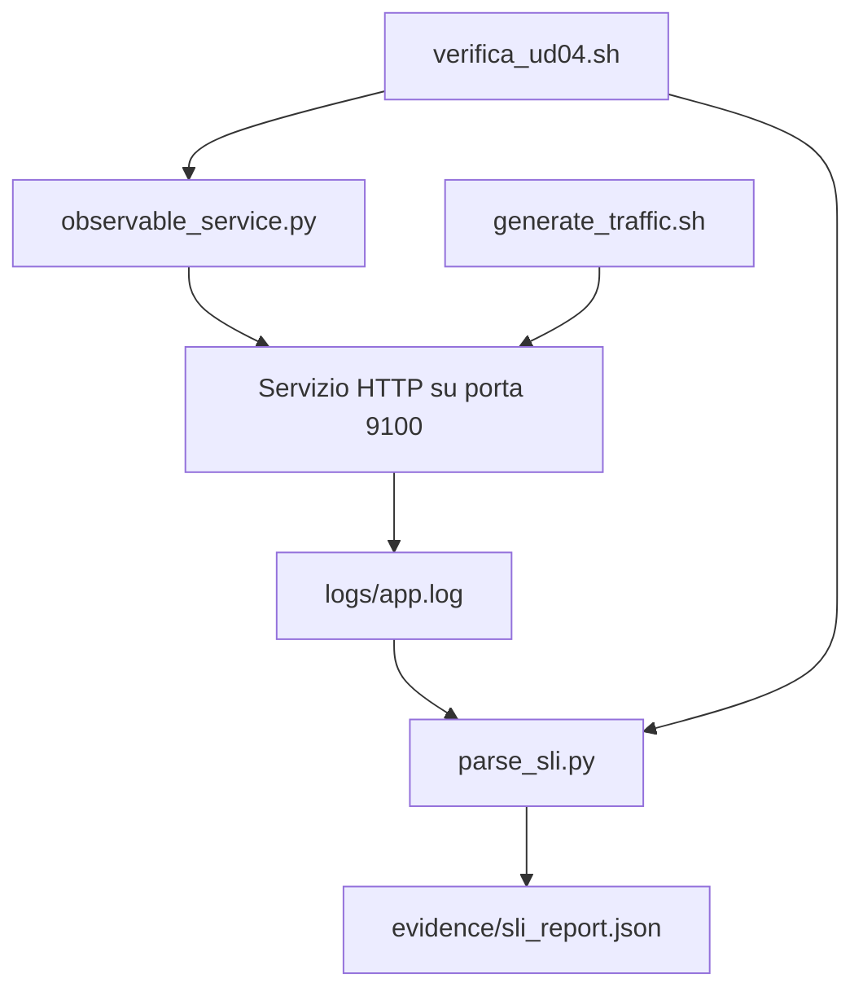

# OBS_UD04 - Spiegazione dei file `src/` 

## 1. Scopo del documento

Questo documento spiega i file presenti nella directory `src/` della UD04:

```text
src/
  observable_service.py
  generate_traffic.sh
  parse_sli.py
  verifica_ud04.sh
```

L'obiettivo e' fornire una lettura guidata del codice. I blocchi seguenti non sostituiscono i file originali: sono versioni didattiche con commenti aggiunti direttamente nel codice sorgente.

Il codice serve a mostrare come un piccolo servizio HTTP puo' produrre segnali osservabili:

- risposte HTTP;
- log JSON;
- request-id;
- metriche minime;
- report SLI;
- verifica automatica del laboratorio.

---

## 2. Mappa generale dei file

| File | Ruolo |
|---|---|
| `observable_service.py` | avvia il servizio HTTP osservabile |
| `generate_traffic.sh` | genera traffico controllato verso il servizio |
| `parse_sli.py` | legge i log JSON e calcola indicatori SLI |
| `verifica_ud04.sh` | verifica automaticamente che la UD04 funzioni |

Flusso complessivo:



---

