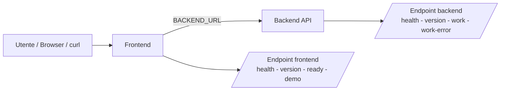
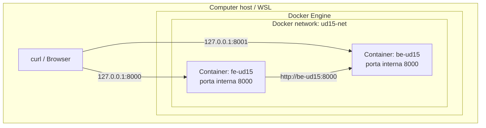
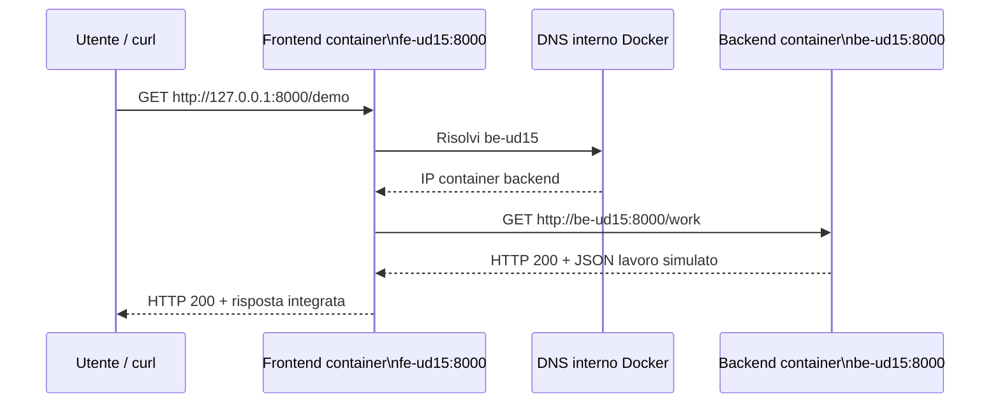
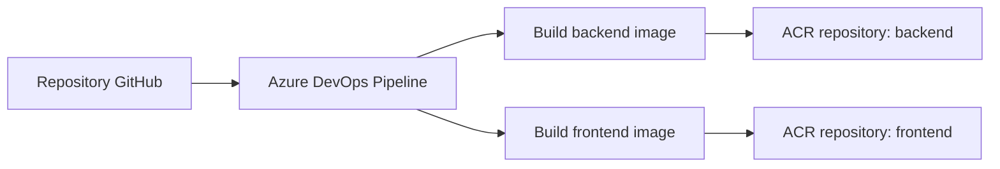

# OBS UD15 - Guida di approfondimento
# App frontend/backend, rete Docker locale e immagini multi-image verso ACR

## 0. Scopo del file

Questo file integra la UD15 v5.6 e chiarisce tre aspetti che nel laboratorio possono generare confusione:

1. che cosa fanno le applicazioni **frontend** e **backend**;
2. come funziona la **rete Docker locale** tra i due container;
3. che cosa cambia quando le immagini vengono pubblicate su **Azure Container Registry** tramite **Azure DevOps**.

Il file va letto dopo i concetti iniziali e prima o durante il laboratorio guidato.

> Nota di coerenza v5.6: in questa UD non usiamo GitHub Actions, non usiamo App Service for Containers e non facciamo ancora deploy su Azure Container Apps. La pipeline Azure DevOps costruisce e pubblica due immagini su ACR. Il deploy FE/BE arriverà nella UD16.

---

## 1. Contesto della UD15

Dopo UD12, UD13 e UD14 abbiamo già visto:

```text
UD12 = Docker locale con app singola
UD13 = primo deploy automatico app singola su ACR/ACI
UD14 = pipeline multistage app singola con build, deploy e smoke test
```

In UD15 cambiamo il modello applicativo:

```text
frontend containerizzato
+
backend containerizzato
```

L'obiettivo non è costruire un'applicazione complessa, ma avere un workload più realistico per ragionare su:

- monorepo;
- servizi separati;
- due Dockerfile;
- due immagini Docker;
- rete Docker locale;
- configurazione tramite variabile `BACKEND_URL`;
- log separati frontend/backend;
- pipeline Azure DevOps multi-image;
- repository/tag separati in ACR.

---

## 2. Architettura logica FE/BE



Il frontend è il punto di ingresso. Il backend rappresenta il servizio applicativo interno.

Il test importante non è solo:

```text
il frontend risponde
```

ma:

```text
il frontend risponde e riesce a chiamare il backend
```

Per questo in UD15 usiamo endpoint come `/ready` e `/demo`.

---

## 3. Che cosa fa il backend

Il backend è una piccola API Flask che ascolta sulla porta interna:

```text
8000
```

### 3.1 Endpoint backend

| Endpoint | Scopo |
|---|---|
| `/health` | verifica che il backend sia vivo |
| `/version` | mostra servizio, versione, ambiente e timestamp |
| `/work` | simula lavoro applicativo con una piccola latenza |
| `/work-error` | genera un errore controllato `500` |

### 3.2 Test dal computer host

Nel laboratorio guidato il backend viene pubblicato così:

```bash
-p 8001:8000
```

Quindi dal PC/WSL lo testiamo con:

```bash
curl http://127.0.0.1:8001/health
curl http://127.0.0.1:8001/version
curl http://127.0.0.1:8001/work
```

### 3.3 Porta host e porta container

| Punto di vista | URL corretto | Significato |
|---|---|---|
| Dal computer host | `http://127.0.0.1:8001` | porta pubblicata sul PC/WSL |
| Da un altro container nella stessa rete Docker | `http://be-ud15:8000` | nome DNS Docker + porta interna del backend |

La porta `8001` serve al nostro computer per entrare nel container.
La porta `8000` è la porta reale del processo Flask dentro il container backend.

---

## 4. Che cosa fa il frontend

Il frontend è una piccola app Flask che ascolta sulla porta interna:

```text
8000
```

Nel laboratorio guidato viene pubblicata sullo stesso numero di porta dell'host:

```bash
-p 8000:8000
```

### 4.1 Endpoint frontend

| Endpoint | Scopo |
|---|---|
| `/health` | verifica che il frontend sia vivo |
| `/version` | mostra configurazione del frontend, inclusa `BACKEND_URL` |
| `/ready` | controlla che il backend sia raggiungibile |
| `/demo` | chiama il backend `/work` e restituisce una risposta integrata |
| `/demo-error` | chiama il backend `/work-error` e propaga l'errore controllato |

### 4.2 Test dal computer host

```bash
curl http://127.0.0.1:8000/health
curl http://127.0.0.1:8000/version
curl http://127.0.0.1:8000/ready
curl http://127.0.0.1:8000/demo
```

### 4.3 Il ruolo di `BACKEND_URL`

Il frontend non deve avere l'indirizzo del backend scritto fisso nel codice.
Lo riceve come variabile d'ambiente:

```text
BACKEND_URL=http://be-ud15:8000
```

Questa variabile cambia a seconda dell'ambiente.

| Ambiente | Valore concettuale di `BACKEND_URL` |
|---|---|
| Docker locale UD15 | `http://be-ud15:8000` |
| Pipeline UD15 | non usata per deploy; la pipeline costruisce e pubblica immagini |
| Deploy cloud UD16 | URL/FQDN del backend su Azure Container Apps |

---

## 5. Dove viene creata la rete Docker locale

Nel laboratorio UD15 la rete viene creata con:

```bash
docker network create ud15-net || true
```

Poi i due container vengono avviati sulla stessa rete:

```bash
docker run -d \
  --name be-ud15 \
  --network ud15-net \
  -p 8001:8000 \
  backend:ud15
```

```bash
docker run -d \
  --name fe-ud15 \
  --network ud15-net \
  -p 8000:8000 \
  -e BACKEND_URL=http://be-ud15:8000 \
  frontend:ud15
```

La rete si chiama:

```text
ud15-net
```

I container si chiamano:

```text
be-ud15
fe-ud15
```

Il nome `be-ud15` diventa risolvibile dal frontend perché entrambi i container sono collegati alla stessa rete Docker definita dall'utente.

---

## 6. User-defined bridge network

La rete `ud15-net` è una rete Docker di tipo bridge definita dall'utente.



Docker fornisce DNS interno tra container collegati alla stessa rete.
Quindi il frontend può raggiungere il backend usando il nome del container:

```text
be-ud15
```

URL corretto FE → BE:

```text
http://be-ud15:8000
```

---

## 7. Differenza tra porta host e porta interna

Schema porte UD15 v5.6:

| Servizio | Porta host | Porta container | Uso |
|---|---:|---:|---|
| Frontend | 8000 | 8000 | accesso utente/curl dal PC |
| Backend | 8001 | 8000 | test diretto del backend dal PC |
| FE → BE | non usa 8001 | 8000 | comunicazione interna Docker |

Il frontend non deve chiamare:

```text
http://localhost:8001
```

perché dentro il container frontend `localhost` indica il container frontend stesso.

Il frontend deve chiamare:

```text
http://be-ud15:8000
```

perché:

- `be-ud15` è il nome del container backend nella rete Docker;
- `8000` è la porta interna del backend;
- `8001` è solo la porta pubblicata verso il PC host.

---

## 8. Flusso di una richiesta `/demo`



Quando chiamiamo `/ready`, il frontend non verifica solo se stesso.
Verifica anche di riuscire a raggiungere il backend tramite `BACKEND_URL`.

---

## 9. Comandi di verifica rete

### 9.1 Verificare che la rete esista

```bash
docker network ls | grep ud15-net
```

### 9.2 Ispezionare la rete

```bash
docker network inspect ud15-net
```

Nel risultato devono comparire i container:

```text
be-ud15
fe-ud15
```

### 9.3 Verificare container, reti e porte

```bash
docker ps --format "table {{.Names}}\t{{.Networks}}\t{{.Ports}}"
```

Output atteso, in forma simile:

```text
NAMES      NETWORKS   PORTS
be-ud15    ud15-net   0.0.0.0:8001->8000/tcp
fe-ud15    ud15-net   0.0.0.0:8000->8000/tcp
```

### 9.4 Testare il backend dal container frontend

Se nel container frontend è disponibile Python, possiamo testare la chiamata interna senza installare `curl`:

```bash
docker exec fe-ud15 python - <<'PYTHON_TEST'
import urllib.request
url = "http://be-ud15:8000/health"
with urllib.request.urlopen(url, timeout=5) as r:
    print(r.status)
    print(r.read().decode())
PYTHON_TEST
```

Risultato atteso:

```text
200
```

Questo test dimostra che la comunicazione FE → BE passa dalla rete Docker e non dalla porta host `8001`.

---

## 10. Che cosa succede nella pipeline Azure DevOps UD15

Nella UD15 v5.6 la pipeline Azure DevOps non esegue ancora il deploy FE/BE.

La pipeline fa questo:

```text
ValidateRepository
→ BuildBackend
→ Push backend su ACR
→ BuildFrontend
→ Push frontend su ACR
```

Schema:



Nel runner Azure DevOps non stiamo creando lo stack runtime completo.
Stiamo producendo artefatti containerizzati persistenti in ACR.

L'evidenza attesa è:

```text
ACR contiene due repository:
- backend
- frontend
```

con tag coerenti con il valore:

```text
$(Build.BuildId)
```

---

## 11. Differenza tra Docker locale e ACR

| Aspetto | Docker locale UD15 | ACR dopo pipeline UD15 |
|---|---|---|
| Dove stanno le immagini | nel Docker Engine del PC/WSL | in Azure Container Registry |
| Dove girano i container | sul PC/WSL | non girano ancora in cloud |
| Rete FE/BE | `ud15-net` | non esiste una rete runtime in ACR |
| Scopo | testare integrazione FE/BE | pubblicare immagini riusabili |
| Passaggio successivo | cleanup locale | deploy in UD16 |

Punto chiave:

```text
ACR conserva immagini, non esegue container.
```

Quindi in UD15 dimostriamo che sappiamo produrre due immagini distinte e renderle disponibili per il deploy successivo.

---

## 12. Cosa cambierà nella UD16

Nella UD16 le immagini pubblicate in ACR verranno usate per creare due Container App:

```text
backend Container App
frontend Container App
```

Il frontend non userà più:

```text
http://be-ud15:8000
```

perché quel nome esiste solo nella rete Docker locale.

Nel cloud il frontend dovrà usare l'indirizzo del backend esposto da Azure Container Apps, secondo la configurazione prevista nella UD16.

---

## 13. Errori tipici e diagnosi

### Errore 1 - Il frontend non trova il backend

Sintomi possibili:

```text
Name or service not known
Temporary failure in name resolution
Connection refused
```

Cause probabili:

- rete `ud15-net` non creata;
- container backend non avviato;
- frontend e backend non sono nella stessa rete;
- `BACKEND_URL` errata;
- nome container diverso da `be-ud15`.

Comandi utili:

```bash
docker network inspect ud15-net
docker ps --format "table {{.Names}}\t{{.Networks}}\t{{.Ports}}"
docker logs fe-ud15
docker logs be-ud15
```

---

### Errore 2 - Uso sbagliato di localhost

Configurazione errata dentro il container frontend:

```text
BACKEND_URL=http://localhost:8001
```

Configurazione corretta:

```text
BACKEND_URL=http://be-ud15:8000
```

Motivo:

```text
localhost dentro un container indica il container stesso, non il PC host e non un altro container.
```

---

### Errore 3 - Backend raggiungibile dall'host ma non dal frontend

Il comando seguente funziona:

```bash
curl http://127.0.0.1:8001/health
```

ma questo fallisce:

```bash
curl http://127.0.0.1:8000/ready
```

Interpretazione:

```text
Il backend è raggiungibile dal PC host, ma il frontend non riesce a raggiungerlo dalla rete Docker interna.
```

Controllare rete, nome container e `BACKEND_URL`.

---

### Errore 4 - Porta sbagliata nella comunicazione interna

Configurazione errata:

```text
BACKEND_URL=http://be-ud15:8001
```

Configurazione corretta:

```text
BACKEND_URL=http://be-ud15:8000
```

Motivo:

```text
8001 è la porta host; 8000 è la porta interna del backend.
```

---

### Errore 5 - Pipeline verde ma app non deployata

In UD15 è normale.

La pipeline UD15 pubblica le immagini su ACR, ma non crea ancora risorse runtime cloud.

Quindi una pipeline UD15 riuscita dimostra:

```text
immagini buildate e pubblicate correttamente
```

non ancora:

```text
frontend/backend in esecuzione su Azure
```

Questo passaggio arriva in UD16.

---

## 14. Frase che il partecipante deve saper dire

Al termine della UD15 il partecipante deve saper spiegare:

> In UD15 frontend e backend sono due servizi distinti, ciascuno con il proprio Dockerfile e la propria immagine. In locale li colleghiamo alla rete Docker `ud15-net`. Dal PC raggiungiamo il frontend su `127.0.0.1:8000` e il backend su `127.0.0.1:8001`; tra container, però, il frontend non usa localhost e non usa la porta host. Il frontend chiama il backend con `BACKEND_URL=http://be-ud15:8000`, cioè nome DNS Docker del container backend e porta interna. La pipeline Azure DevOps della UD15 non fa ancora deploy: costruisce e pubblica le due immagini `frontend` e `backend` su ACR, pronte per la UD16.

---

## 15. Mini-check finale

| Domanda | Risposta attesa |
|---|---|
| Che cosa fa il backend? | Espone API minime: `/health`, `/version`, `/work`, `/work-error`. |
| Che cosa fa il frontend? | Espone endpoint utente e chiama il backend tramite `BACKEND_URL`. |
| Come si chiama la rete Docker locale? | `ud15-net`. |
| Come si chiamano i container locali? | `be-ud15` e `fe-ud15`. |
| Come il frontend chiama il backend in locale? | `http://be-ud15:8000`. |
| Perché non `localhost:8001`? | Perché dentro il container `localhost` indica il frontend stesso e `8001` è una porta host. |
| Quali repository devono comparire in ACR dopo la pipeline? | `backend` e `frontend`. |
| Che cosa rappresenta il tag immagine? | Il run della pipeline, tramite `Build.BuildId`. |
| La pipeline UD15 fa deploy in Azure? | No. Pubblica immagini su ACR. Il deploy arriva in UD16. |
