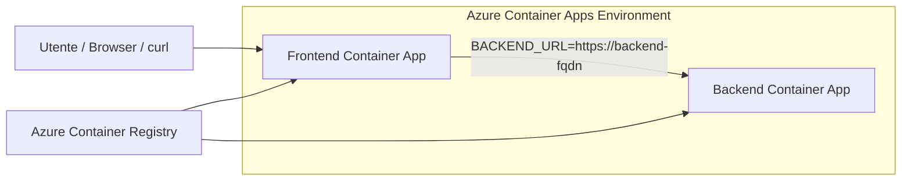
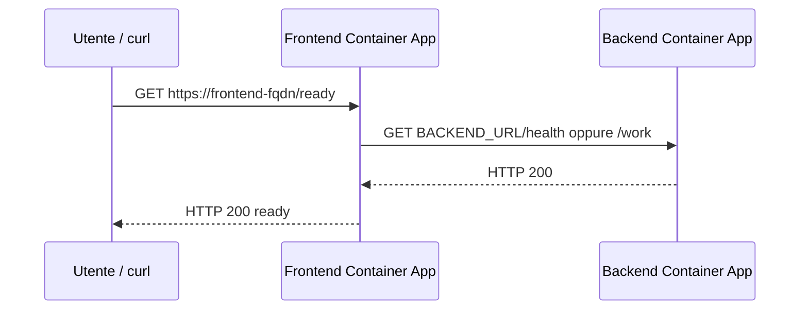

# UD16 - Guida architetturale
## Frontend/backend su Azure Container Apps: ingress, FQDN, BACKEND_URL, revisioni

## 0. Scopo del file

Questo file chiarisce l'architettura tecnica della UD16:

1. dove vivono le immagini prodotte in UD15;
2. dove vengono eseguiti frontend e backend;
3. come funziona la comunicazione frontend -> backend in Azure Container Apps;
4. che cosa sono ingress, FQDN, target port e revisioni;
5. quali errori sono più frequenti.

---

## 1. Architettura generale



Il sistema è composto da:

| Elemento | Ruolo |
|---|---|
| ACR | conserva le immagini `frontend:<tag>` e `backend:<tag>` |
| ACA Environment | ambiente che ospita le Container Apps |
| Backend Container App | espone API e endpoint di health/work |
| Frontend Container App | espone il punto di ingresso utente e chiama il backend |
| BACKEND_URL | configurazione che dice al frontend dove trovare il backend |

---

## 2. Differenza con Docker locale UD15

In UD15, in Docker locale, il frontend raggiungeva il backend tramite rete Docker e nome container:

```text
http://backend:8000
```

oppure, se il container si chiamava in modo esplicito:

```text
http://ud15-backend:8000
```

In UD16, su Azure Container Apps, il frontend usa l'URL assegnato al backend:

```text
https://<backend-fqdn>
```

Quindi la variabile diventa:

```text
BACKEND_URL=https://<backend-fqdn>
```

---

## 3. Porte: target port e URL pubblico

Il container backend ascolta su una porta interna, nel nostro caso:

```text
8000
```

Il container frontend ascolta anch'esso sulla porta configurata dall'app, nel nostro template:

```text
8000
```

In Azure Container Apps non richiamiamo normalmente:

```text
https://fqdn:8000
```

L'utente usa l'URL HTTPS esposto da ACA:

```text
https://<frontend-fqdn>/
```

ACA instrada la richiesta verso la `target-port` del container.

---

## 4. Ingress esterno nel laboratorio

Nel laboratorio configuriamo ingress esterno sia per backend sia per frontend.

```text
--ingress external
--target-port 8000
```

Motivo didattico:

- possiamo testare direttamente backend e frontend;
- possiamo vedere chiaramente i FQDN;
- il troubleshooting è più semplice.

In un ambiente più maturo, il backend potrebbe essere interno e non esposto pubblicamente. Qui privilegiamo chiarezza e verificabilità.

---

## 5. Flusso richiesta utente



`/health` del frontend dice:

```text
il frontend è vivo
```

`/ready` del frontend dice:

```text
il frontend è vivo e riesce a chiamare il backend
```

---

## 6. Revisioni ACA

Azure Container Apps usa revisioni per rappresentare versioni runtime della Container App.

Una nuova revisione può nascere quando cambiamo:

- immagine container;
- tag immagine;
- variabili ambiente;
- configurazione container;
- ingress o altre impostazioni rilevanti.

Comando:

```bash
az containerapp revision list   --resource-group <RG>   --name ca-obs-ud16-frontend   -o table
```

Nel laboratorio non facciamo ancora traffic splitting avanzato. Ci basta osservare che un cambio immagine/configurazione produce una nuova versione runtime verificabile.

---

## 7. Perché non usare localhost

Dentro la Container App frontend:

```text
localhost = il container frontend stesso
```

Quindi questo è sbagliato:

```text
BACKEND_URL=http://localhost:8000
```

perché il backend non vive dentro lo stesso container frontend.

La configurazione corretta è un URL backend esplicito:

```text
BACKEND_URL=https://<backend-fqdn>
```

---

## 8. Comandi di osservazione

FQDN frontend:

```bash
az containerapp show   --resource-group <RG>   --name ca-obs-ud16-frontend   --query properties.configuration.ingress.fqdn   -o tsv
```

Variabili ambiente frontend:

```bash
az containerapp show   --resource-group <RG>   --name ca-obs-ud16-frontend   --query properties.template.containers[0].env   -o json
```

Log:

```bash
az containerapp logs show   --resource-group <RG>   --name ca-obs-ud16-frontend   --follow false   --format text
```

Revisioni:

```bash
az containerapp revision list   --resource-group <RG>   --name ca-obs-ud16-frontend   -o table
```

---

## 9. Errori tipici

| Errore | Sintomo | Diagnosi |
|---|---|---|
| Tag immagine errato | deploy fallisce o immagine non trovata | verificare ACR repository/tag |
| Porta target errata | FQDN esiste ma app non risponde | controllare `PORT` e `target-port` |
| BACKEND_URL errato | `/health` ok ma `/ready` ko | leggere env var frontend |
| Backend non avviato | frontend non diventa ready | leggere log backend |
| Ingress mancante | FQDN assente | controllare configurazione ingress |
| Uso di localhost | frontend chiama se stesso | sostituire con FQDN backend |

---

## 10. Mini-check finale

| Domanda | Risposta attesa |
|---|---|
| Dove sono salvate le immagini? | In Azure Container Registry. |
| Dove vengono eseguite? | In Azure Container Apps. |
| Che cosa contiene ACA Environment? | Le Container Apps frontend/backend. |
| Come il frontend trova il backend? | Tramite `BACKEND_URL`. |
| Quale endpoint dimostra integrazione FE/BE? | `/ready` del frontend. |
| Che cos'è una revisione? | Una versione runtime della Container App generata da cambi immagine/configurazione. |
| Perché non usare localhost? | Perché dentro il frontend indica il frontend stesso, non il backend. |
| Dove leggo i log? | Con `az containerapp logs show` o dal portale Azure. |

---

## 11. Frase che il partecipante deve saper dire

> In UD16 le immagini `frontend` e `backend` pubblicate in ACR vengono eseguite come due Azure Container Apps dentro lo stesso ACA Environment. Il frontend viene esposto tramite ingress esterno e riceve `BACKEND_URL`, che punta al FQDN del backend. Quando cambia immagine o configurazione, ACA crea una nuova revisione. Verifico il deploy con `/health`, `/ready`, revisioni e log.
