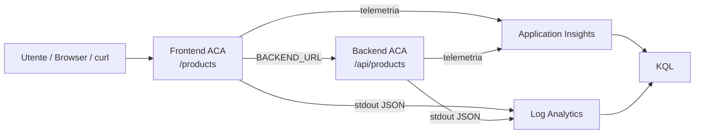

# OBS UD17 - Concetti
# Observability cloud per l'app Catalogo prodotti su Azure Container Apps

## 0. Intro

Dopo le unità precedenti l'applicazione non è più soltanto un esercizio Docker. Abbiamo un sistema composto da due servizi, frontend e backend, distribuito su Azure Container Apps e aggiornato tramite pipeline. La change request post-UD16 ha reso questo sistema più didattico: il frontend non restituisce solo una risposta tecnica, ma mostra un **Catalogo prodotti**; il backend non è più un servizio astratto, ma espone API che restituiscono prodotti, simulano lentezza e producono errori controllati.

A questo punto la domanda operativa cambia. Non ci interessa più solo sapere se il deploy è terminato correttamente. Il deploy può essere verde e l'applicazione può comunque comportarsi male: il frontend può essere online ma incapace di raggiungere il backend, un endpoint può essere lento, un errore può comparire solo sotto una certa rotta, oppure i log del container possono raccontare qualcosa che nelle request applicative non è ancora evidente.

UD17 serve a mettere ordine in questa situazione. L'obiettivo è imparare a leggere il comportamento dell'applicazione dopo il rilascio, usando segnali cloud raccolti da Azure Container Apps, Application Insights, Log Analytics e KQL.

## 1. Il passaggio concettuale: da “rilasciato” a “osservabile”

Nelle UD15 e UD16 abbiamo costruito il percorso tecnico che porta il codice in esecuzione:

```text
codice FE/BE
    ↓
immagini Docker frontend/backend
    ↓
Azure Container Registry
    ↓
Azure Container Apps
    ↓
nuove revisioni applicative
```

Con la change request prodotti abbiamo aggiunto un contenuto applicativo più realistico:

```text
Browser
  ↓
Frontend ACA
  ↓ BACKEND_URL
Backend ACA
  ↓
Catalogo prodotti
```

UD17 aggiunge il livello osservabile:



Il punto chiave è che la richiesta utente produce più evidenze. Una chiamata a `/products` sul frontend genera almeno:

- una request sul frontend;
- una dependency dal frontend verso il backend;
- una request sul backend;
- log JSON del frontend;
- log JSON del backend;
- eventuali trace, operation id, request id, durata e status code.

Il partecipante deve imparare a ricostruire questo percorso.

## 2. Perché il Catalogo prodotti è più adatto alla observability

Una app dimostrativa con endpoint `/demo` o `/work` è utile per verificare che il deploy funzioni, ma resta poco espressiva. Una app con catalogo prodotti permette di simulare scenari più vicini al lavoro reale:

| Scenario | Endpoint | Che cosa osserviamo |
|---|---|---|
| Richiesta normale | `/products` | funzionamento FE → BE, durata normale, log coerenti |
| Richiesta lenta | `/products/slow` | latenza visibile in request, dependency e log |
| Errore controllato | `/products/error` | status 500, failure, log di errore, decisione tecnica |
| Stato frontend | `/health` | il container frontend è vivo |
| Stato integrato | `/ready` | il frontend riesce a raggiungere il backend |
| Versione | `/version` | revisione/tag BuildId realmente in esecuzione |

Questo rende più semplice spiegare perché osservabilità non significa “guardare un grafico”, ma raccogliere segnali diversi per rispondere a una domanda tecnica.

## 3. I segnali principali in UD17

Nel nostro scenario raccogliamo quattro categorie principali di segnali.

### Request

Le request rappresentano le chiamate HTTP ricevute dalle applicazioni. In Application Insights diventano righe interrogabili, tipicamente nella tabella `AppRequests`. Guardando le request possiamo capire:

- quali endpoint sono stati chiamati;
- con quale status code;
- quanto sono durati;
- se sono riusciti o falliti;
- quale ruolo applicativo le ha prodotte, frontend o backend.

### Dependency

La dependency più importante è la chiamata dal frontend al backend. Se il frontend riceve `/products`, deve chiamare il backend su `/api/products`. Questa chiamata è una dipendenza applicativa. Se il backend è lento, non basta guardare la durata del frontend: dobbiamo vedere anche la durata della dependency.

### Trace e log applicativi

Le app scrivono log JSON su stdout. Questi log contengono campi tecnici come `service`, `path`, `status`, `latency_ms`, `request_id`, `trace_id`. Sono utili perché ci permettono di cercare una singola richiesta e seguirla tra frontend e backend.

### Exception e failure

Gli endpoint di errore controllato non sono un guasto casuale: servono a produrre dati osservabili. `/products/error` e `/api/products/error` aiutano a capire come un errore appare nei log, nelle request e nelle query.

## 4. Application Insights, Log Analytics e KQL

Application Insights è il componente di Azure Monitor orientato all'osservabilità applicativa. Nel nostro laboratorio riceve telemetria dalle app Python tramite Azure Monitor OpenTelemetry.

Log Analytics è lo spazio in cui interroghiamo dati e log con KQL. A seconda della configurazione, possiamo vedere sia le tabelle applicative (`AppRequests`, `AppDependencies`, `AppTraces`, `AppExceptions`) sia i log container provenienti da Azure Container Apps, ad esempio `ContainerAppConsoleLogs_CL`.

Il modello mentale da fissare è questo:

```text
OpenTelemetry → Application Insights → tabelle applicative → KQL
stdout/stderr container → Log Analytics → log ACA → KQL
```

Questi due percorsi non sono alternativi. Si completano.

## 5. Correlazione: il filo che tiene insieme i segnali

Senza correlazione, vediamo eventi isolati. Con correlazione, costruiamo una storia.

Nel nostro caso la richiesta può avere:

| Campo | Utilità |
|---|---|
| `X-Request-Id` | request id esplicito propagato dal frontend al backend |
| `request_id` nei log | campo leggibile nei log JSON |
| `OperationId` | correlazione Application Insights tra request/dependency |
| `trace_id` | id di trace OpenTelemetry, utile anche in vista distribuita |
| `span_id` | id dello span specifico |

Una buona analisi non si limita a dire “c'è un 500”. Deve provare a rispondere:

```text
Quale richiesta ha fallito?
È fallito il frontend o il backend?
Quanto è durata la dependency?
Il log del backend conferma l'errore?
La versione in esecuzione è quella rilasciata?
```

## 6. Differenza tra `/health` e `/ready`

Questa distinzione è fondamentale.

`/health` risponde alla domanda:

```text
Il processo del servizio è vivo?
```

`/ready` risponde a una domanda più utile per un'app FE/BE:

```text
Il frontend è vivo e riesce anche a parlare con il backend?
```

Per questo, in un problema reale, `/health` può restituire 200 mentre `/ready` fallisce. In quel caso il frontend non è spento: è probabilmente rotto il collegamento verso il backend, quindi dobbiamo controllare `BACKEND_URL`, ingress backend, environment ACA, DNS/FQDN e log.

## 7. Cosa deve cambiare nel modo di ragionare

UD17 richiede un passaggio di maturità. Nelle UD iniziali poteva bastare vedere una pagina o un JSON. Ora il partecipante deve imparare a spiegare un comportamento con evidenze:

```text
Osservazione: /products/slow è lento.
Evidenza 1: AppRequests mostra durata alta sul frontend.
Evidenza 2: AppDependencies mostra chiamata lenta verso il backend.
Evidenza 3: i log backend mostrano /api/products/slow con latency_ms elevata.
Interpretazione: la lentezza nasce nel backend, non nel frontend.
Decisione: introdurre alert o ottimizzare l'endpoint backend.
```

Questo è il passaggio da verifica manuale a osservabilità operativa.

## 8. Chiusura concettuale

Alla fine della UD il partecipante non deve solo sapere dove cliccare nel portale. Deve essere in grado di dire:

> Ho osservato una release FE/BE su Azure Container Apps. Ho generato traffico normale, lento e in errore sul Catalogo prodotti. Ho usato Application Insights, Log Analytics e KQL per collegare request frontend, dependency verso backend, request backend e log container. So distinguere un problema applicativo da un problema di collegamento o configurazione.
