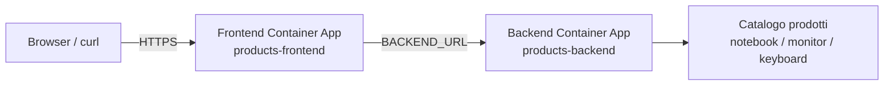
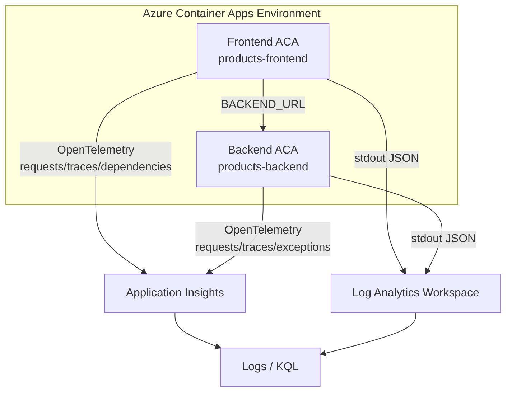
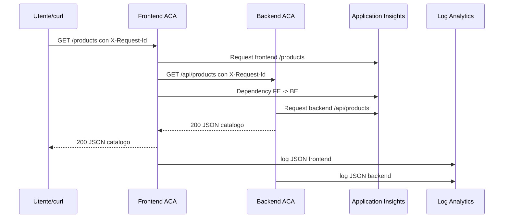

# OBS UD17 - Guida architetturale
# Observability cloud dell'app Catalogo prodotti su Azure Container Apps

## 0. Scopo del file

Questo file chiarisce l'architettura tecnica reale della UD17. È il riferimento da usare quando il partecipante vede molti componenti e rischia di confondere applicazione, piattaforma, telemetria e log.

La guida spiega:

1. dove vive l'app Catalogo prodotti;
2. come il frontend raggiunge il backend;
3. quali endpoint osserviamo;
4. come la telemetria arriva ad Application Insights;
5. dove finiscono i log dei container;
6. come usare KQL per collegare request, dependency, log e anomalie;
7. quali errori tipici aspettarsi e come diagnosticarli.

## 1. Dal deploy alla osservabilità

Dopo UD16 e la change request post-UD16, l'applicazione è già distribuita. Le risorse principali esistono già:

- Resource Group;
- Azure Container Registry;
- Azure Container Apps Environment;
- Container App backend;
- Container App frontend;
- pipeline Azure DevOps;
- immagini `obsapp-products-backend:<BuildId>` e `obsapp-products-frontend:<BuildId>`.

UD17 non deve ricreare questo ambiente. Deve renderlo osservabile, cioè deve permettere di leggere il comportamento della release products mentre viene usata.

## 2. Architettura applicativa

La vista applicativa è questa:



Il frontend è il punto di ingresso pubblico. Il backend è il servizio API che fornisce il catalogo. Nel modello corretto:

- il frontend ha ingress esterno;
- il backend mantiene ingress interno;
- entrambi stanno nello stesso Container Apps Environment;
- il frontend chiama il backend tramite `BACKEND_URL`;
- il browser non deve chiamare direttamente il backend.

## 3. Frontend pubblico e backend interno

Questa distinzione serve a evitare una confusione frequente. Il frontend deve essere raggiungibile dall'utente. Il backend deve essere raggiungibile dal frontend, non necessariamente dall'esterno.

| Componente | Ingress | Chi lo chiama | Perché |
|---|---|---|---|
| Frontend ACA | External | browser, curl, docente, partecipante | punto di ingresso applicativo |
| Backend ACA | Internal | frontend ACA | servizio interno consumato dal frontend |

Il backend interno non è un problema: è una scelta architetturale. Se `/products` sul frontend funziona, significa che il frontend sta raggiungendo correttamente il backend.

## 4. Il ruolo di `BACKEND_URL`

`BACKEND_URL` è la variabile che collega frontend e backend.

Nel container frontend il valore deve essere simile a:

```text
BACKEND_URL=https://<fqdn-backend-aca>
```

Non deve essere:

```text
BACKEND_URL=http://localhost:8000
```

In Azure Container Apps `localhost` dentro il container frontend indica il container frontend stesso. Non indica il backend. Questo errore è uno dei più comuni.

## 5. Endpoint frontend osservabili

Il frontend espone endpoint diversi per produrre segnali diversi.

| Endpoint frontend | Funzione | Segnale atteso |
|---|---|---|
| `/` | home HTML con Catalogo prodotti | request 200, dependency verso backend, log frontend/backend |
| `/health` | verifica processo frontend | request 200 solo frontend |
| `/ready` | verifica frontend + raggiungibilità backend | request 200 se FE parla col BE |
| `/version` | mostra versione/tag in esecuzione | verifica BuildId e revisione |
| `/products` | restituisce catalogo in JSON | request + dependency + request backend |
| `/products/slow` | simula lentezza controllata | durata elevata su FE/BE |
| `/products/error` | simula errore backend propagato | 500 controllato, failure, log errore |

## 6. Endpoint backend osservabili

Il backend espone API interne consumate dal frontend.

| Endpoint backend | Funzione |
|---|---|
| `/health` | servizio backend vivo |
| `/version` | versione backend |
| `/api/products` | catalogo prodotti normale |
| `/api/products/slow` | catalogo con ritardo artificiale |
| `/api/products/error` | errore controllato |
| `/work` | compatibilità con esercizi precedenti |
| `/work-error` | compatibilità errore precedente |

Per UD17 il focus non è la compatibilità `/work`, ma il nuovo contratto products.

## 7. Architettura osservabilità cloud

La vista completa include sia l'applicazione sia i sistemi che raccolgono segnali.



Ci sono quindi due canali da tenere distinti:

| Canale | Origine | Dove lo interroghiamo | Esempio |
|---|---|---|---|
| Telemetria applicativa | OpenTelemetry nell'app | Application Insights / KQL | `AppRequests`, `AppDependencies` |
| Log container | stdout/stderr del container | Log Analytics / KQL | `ContainerAppConsoleLogs_CL` |

## 8. Application Insights: cosa raccoglie

Application Insights riceve telemetria applicativa prodotta dal codice. Nel nostro caso le app Python usano Azure Monitor OpenTelemetry quando è presente la variabile:

```text
APPLICATIONINSIGHTS_CONNECTION_STRING
```

Questa connection string non va scritta nel repository. Nel laboratorio viene passata come variabile segreta di Azure DevOps e poi impostata come variabile d'ambiente nelle Container Apps.

Application Insights è utile per leggere:

- request HTTP;
- durata delle request;
- esito delle request;
- dependency frontend → backend;
- trace applicativi;
- exception;
- operation id e correlazione.

## 9. Log Analytics: cosa contiene

Log Analytics è il punto in cui interroghiamo con KQL. Può contenere tabelle diverse. Quelle più importanti in UD17 sono:

| Tabella | Cosa contiene | Uso didattico |
|---|---|---|
| `AppRequests` | richieste applicative | endpoint, status, durata, success |
| `AppDependencies` | chiamate verso servizi esterni/interni | FE → BE, durata dependency |
| `AppTraces` | trace/log applicativi raccolti da AI | messaggi applicativi |
| `AppExceptions` | eccezioni applicative | errori non gestiti o propagati |
| `ContainerAppConsoleLogs_CL` | log stdout/stderr ACA | log JSON grezzi del container |

Il partecipante deve capire che non tutte le tabelle avranno dati immediatamente. Dopo la generazione del traffico può essere necessario attendere alcuni minuti.

## 10. Differenza tra telemetria e log container

Questa è una distinzione centrale.

La telemetria applicativa è prodotta dallo strumento OpenTelemetry dentro l'applicazione. È più strutturata per request, dependency e traces.

I log container sono ciò che il processo scrive su stdout/stderr. Sono molto utili per leggere messaggi grezzi, JSON applicativi, variabili effettive, path, status e `request_id`.

Esempio pratico:

```text
AppRequests mostra che /products/error ha risposto 500.
ContainerAppConsoleLogs_CL mostra il log JSON con service=products-backend, path=/api/products/error, request_id=...
```

La diagnosi è più forte quando i due segnali concordano.

## 11. Flusso completo `/products`



Questo è il flusso principale da osservare. Se funziona, l'applicazione è integrata.

## 12. Flusso completo `/products/slow`

`/products/slow` serve a produrre un problema di latenza.

Aspettative:

- la request frontend dura più del normale;
- la dependency FE → BE dura più del normale;
- il backend mostra latenza elevata su `/api/products/slow`;
- il sistema risponde comunque 200, quindi non è un errore ma un degrado.

Questo caso insegna che non tutti i problemi sono failure. Una richiesta può riuscire e allo stesso tempo essere troppo lenta.

## 13. Flusso completo `/products/error`

`/products/error` produce un errore controllato.

Aspettative:

- il frontend riceve o propaga uno status 500;
- Application Insights mostra request fallita;
- la dependency può risultare fallita;
- il backend registra `/api/products/error`;
- i log JSON contengono `status=500` e lo stesso `request_id`.

Questo caso serve a spiegare la differenza tra:

```text
guasto reale non previsto
```

e

```text
errore controllato generato per verificare osservabilità
```

## 14. Query KQL collegate ai flussi

### Request prodotti

```kql
AppRequests
| where TimeGenerated > ago(2h)
| where Url has "/products" or Name has "/products"
| project TimeGenerated, AppRoleName, Name, Url, ResultCode, Success, DurationMs, OperationId
| order by TimeGenerated desc
```

### Dependency FE → BE

```kql
AppDependencies
| where TimeGenerated > ago(2h)
| where Name has "/api/products" or Data has "/api/products" or Target has "backend"
| project TimeGenerated, AppRoleName, Target, Name, Data, ResultCode, Success, DurationMs, OperationId
| order by TimeGenerated desc
```

### Log JSON da ACA

```kql
ContainerAppConsoleLogs_CL
| where TimeGenerated > ago(2h)
| where Log_s has "request_id"
| extend j=parse_json(Log_s)
| project TimeGenerated, ContainerAppName_s, service=tostring(j.service), path=tostring(j.path), status=toint(j.status), latency_ms=todouble(j.latency_ms), request_id=tostring(j.request_id), trace_id=tostring(j.trace_id)
| order by TimeGenerated desc
```

## 15. Errori tipici e diagnosi

### Caso 1 - `/health` funziona ma `/ready` fallisce

Interpretazione probabile: il frontend è vivo, ma non raggiunge il backend.

Controllare:

- valore di `BACKEND_URL` nella revisione frontend;
- ingress backend internal;
- FQDN backend;
- stessa ACA Environment;
- porta target backend;
- log frontend per timeout o name resolution.

### Caso 2 - Log ACA presenti ma AppRequests vuota

Interpretazione: il container scrive su stdout, ma la telemetria applicativa non arriva ad Application Insights.

Controllare:

- `APPLICATIONINSIGHTS_CONNECTION_STRING`;
- variabile segreta in Azure DevOps;
- nuova revisione effettivamente attiva;
- pacchetti OpenTelemetry installati nell'immagine;
- ingestion delay.

### Caso 3 - AppRequests presenti ma AppDependencies vuota

Interpretazione: vediamo le request ma non la chiamata FE → BE come dependency.

Controllare:

- il frontend sta effettivamente chiamando `/products` o solo `/health`;
- strumentazione HTTP client `requests`;
- traffico generato verso endpoint integrati;
- ritardo di ingestion.

### Caso 4 - `/products/error` non restituisce 500

Interpretazione: potrebbe essere in esecuzione una vecchia immagine oppure la richiesta non sta passando dalla versione products.

Controllare:

- `/version` sul frontend;
- tag immagine della revisione attiva;
- log della pipeline;
- repository ACR configurati.

### Caso 5 - Vedo il frontend ma non il catalogo HTML

Interpretazione: home non aggiornata o frontend non riesce a ottenere prodotti.

Controllare:

- risposta di `/products`;
- risposta di `/ready`;
- log frontend;
- `BACKEND_URL`;
- versione frontend.

## 16. Mini-check finale

| Domanda | Risposta attesa |
|---|---|
| Dove gira l'app? | Su Azure Container Apps, con frontend e backend separati. |
| Perché il backend può essere internal? | Perché viene chiamato dal frontend nello stesso ambiente ACA, non direttamente dall'utente. |
| Che cosa contiene `BACKEND_URL`? | Il FQDN del backend ACA usato dal frontend. |
| Quale endpoint mostra il catalogo in HTML? | `/` sul frontend. |
| Quale endpoint restituisce il catalogo JSON? | `/products` sul frontend e `/api/products` sul backend. |
| A cosa serve `/ready`? | A verificare frontend vivo più raggiungibilità backend. |
| Dove leggo request e dependency? | In Application Insights / Log Analytics, tabelle `AppRequests` e `AppDependencies`. |
| Dove leggo i log stdout JSON? | In `ContainerAppConsoleLogs_CL` o log stream ACA. |
| Che cosa cerco per correlare FE e BE? | `request_id`, `OperationId`, `trace_id`. |
| Perché `/products/slow` è utile? | Produce latenza senza errore, quindi mostra degrado. |
| Perché `/products/error` è utile? | Produce failure controllata per verificare diagnosi. |

## 17. Frase che il partecipante deve saper dire

> In UD17 osservo una release FE/BE su Azure Container Apps. Il frontend pubblico mostra il Catalogo prodotti e chiama il backend interno tramite `BACKEND_URL`. Con Application Insights vedo request, dependency, trace ed errori; con Log Analytics leggo anche i log stdout dei container. Usando KQL posso seguire una richiesta `/products` dal frontend al backend e distinguere richieste normali, lente e in errore.
