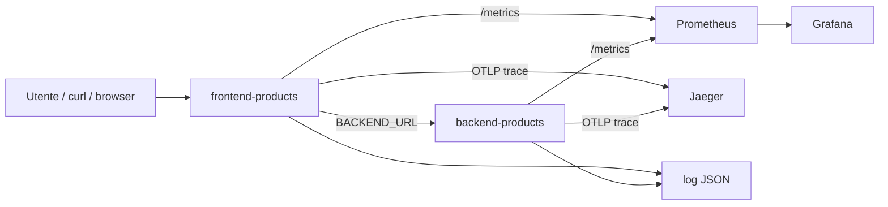

# OBS UD18 — Concetti
# App-stack, obs-stack e osservabilità locale sul Catalogo prodotti

## 0. Intro

Nelle UD precedenti abbiamo seguito un percorso progressivo: prima abbiamo costruito immagini Docker, poi le abbiamo pubblicate in ACR, poi abbiamo distribuito frontend e backend su Azure Container Apps e infine abbiamo osservato la release cloud del **Catalogo prodotti** con strumenti Azure.

A questo punto potremmo pensare che l'osservabilità sia semplicemente una funzione del cloud: abilito Application Insights, genero traffico, scrivo una query KQL e leggo il risultato. In realtà il concetto è più ampio. Una applicazione osservabile non dipende da un singolo portale: dipende dal modo in cui produce segnali leggibili, correlabili e utili per prendere decisioni tecniche.

UD18 serve a rendere visibile questa idea in modo controllato. Ricostruiamo localmente una piccola architettura applicativa frontend/backend e le affianchiamo uno stack di osservabilità. In locale possiamo fermare, riavviare, rompere e interrogare ogni componente senza attendere provisioning cloud o propagation time.

```text
utente / curl / browser
        ↓
frontend-products
        ↓
backend-products
        ↓
catalogo prodotti
```

Accanto all'applicazione aggiungiamo gli strumenti osservanti:

```text
Prometheus → metriche
Grafana    → dashboard
Jaeger     → tracce
stdout JSON→ log strutturati
```

La distinzione importante è questa: **frontend e backend sono il sistema osservato; Prometheus, Grafana e Jaeger sono il sistema osservante**.

---

## 1. Dalla release cloud al laboratorio locale

In UD17 abbiamo ragionato su una release già distribuita in Azure Container Apps. Il frontend pubblico chiamava un backend interno tramite `BACKEND_URL`, e Application Insights/Log Analytics raccoglievano richieste, dipendenze, tracce e log.

In UD18 non stiamo cambiando applicazione: cambiamo il luogo in cui la osserviamo. Il workload rimane il Catalogo prodotti, ma lo eseguiamo con Docker Compose.

Questo passaggio è utile perché permette di vedere più chiaramente:

- come i container comunicano tra loro;
- quali porte sono interne e quali sono pubblicate sull'host;
- perché il nome DNS del servizio è diverso da `localhost`;
- come Prometheus scopre i target;
- come Grafana usa Prometheus come datasource;
- come Jaeger riceve trace via OTLP;
- come i log JSON completano metriche e trace.

---

## 2. App-stack e obs-stack

Useremo due parole operative.

L'**app-stack** è la parte applicativa:

```text
frontend-products
backend-products
```

Il frontend espone la home e gli endpoint applicativi rivolti all'utente. Il backend espone le API del catalogo. Il frontend chiama il backend quando deve mostrare i prodotti.

L'**obs-stack** è la parte osservante:

```text
prometheus
grafana
jaeger
log stdout JSON
```

Non risponde alle richieste utente; raccoglie e rende leggibili segnali prodotti dall'applicazione.



---

## 3. I segnali che vogliamo produrre

Quando osserviamo il Catalogo prodotti, non ci basta sapere che i container sono avviati. Vogliamo capire come si comportano durante richieste reali.

Per questo useremo tre famiglie di endpoint:

| Endpoint frontend | Significato |
|---|---|
| `/products` | richiesta normale al catalogo |
| `/products/slow` | richiesta volutamente lenta |
| `/products/error` | errore controllato |
| `/ready` | verifica che il frontend riesca a parlare con il backend |
| `/health` | verifica minima del frontend |

Il backend espone endpoint corrispondenti:

| Endpoint backend | Significato |
|---|---|
| `/api/products` | catalogo normale |
| `/api/products/slow` | simulazione latenza |
| `/api/products/error` | errore controllato |
| `/health` | health check backend |
| `/metrics` | metriche per Prometheus |

Il valore didattico di questa scelta è che possiamo generare traffico normale, lento ed errato senza cambiare codice a ogni test.

---

## 4. Perché metriche, log e trace sono diversi

Una metrica risponde a domande aggregate:

```text
Quante richieste stanno arrivando?
Quante falliscono?
Quanto durano in media?
Qual è il p95 della latenza?
Il frontend e il backend sono UP?
```

Un log risponde a domande puntuali:

```text
Questa richiesta quale path ha chiamato?
Che status ha restituito?
Quanto è durata?
Quale request_id aveva?
Quale servizio l'ha prodotta?
```

Una trace risponde a domande di percorso:

```text
La richiesta è entrata nel frontend?
Il frontend ha chiamato il backend?
Dove si è consumato il tempo?
Quale span rappresenta il backend?
```

Nessuno di questi segnali è sufficiente da solo. Insieme permettono una diagnosi più credibile.

---

## 5. Perché Docker Compose

Docker Compose ci permette di descrivere l'intero ambiente locale in un solo file:

```text
docker-compose.yml
```

Nel compose definiamo:

- i container applicativi;
- i container osservanti;
- le porte pubblicate sull'host;
- le variabili d'ambiente;
- la rete condivisa;
- i volumi/configurazioni per Prometheus e Grafana.

Il vantaggio non è solo pratico. È anche concettuale: il partecipante vede l'architettura come sistema, non come somma di comandi isolati.

---

## 6. Porte e accesso

Nel laboratorio useremo porte host diverse per evitare conflitti:

| Componente | URL host |
|---|---|
| Frontend products | `http://localhost:8118` |
| Backend products | `http://localhost:8018` |
| Prometheus | `http://localhost:9090` |
| Grafana | `http://localhost:3000` |
| Jaeger UI | `http://localhost:16686` |

Dentro la rete Docker, però, i servizi non comunicano usando queste porte host. Il frontend chiama il backend con il nome del servizio Compose:

```text
http://backend-products:8000
```

Questa distinzione sarà ripresa nella guida architetturale, perché è una delle fonti principali di errore nei laboratori FE/BE.

---

## 7. Che cosa impareremo davvero

Alla fine della UD18 il punto non è “abbiamo acceso Prometheus, Grafana e Jaeger”. Il punto è saper spiegare una frase più importante:

> Abbiamo separato il sistema osservato dal sistema osservante. Il frontend e il backend producono segnali; Prometheus raccoglie metriche, Grafana le visualizza, Jaeger mostra il percorso distribuito e i log JSON mantengono il dettaglio delle singole richieste. Lo stesso Catalogo prodotti osservato nel cloud può essere osservato anche localmente, con strumenti diversi ma con lo stesso ragionamento tecnico.

Questa comprensione prepara direttamente UD19–UD22.
