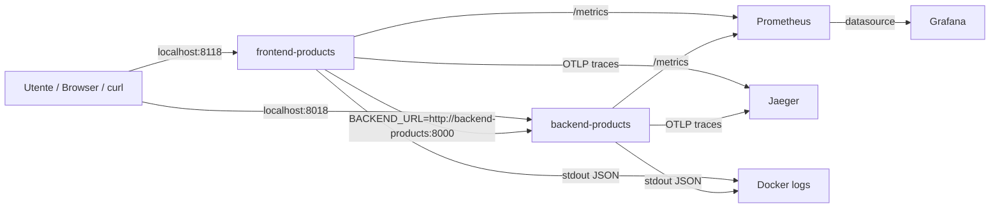
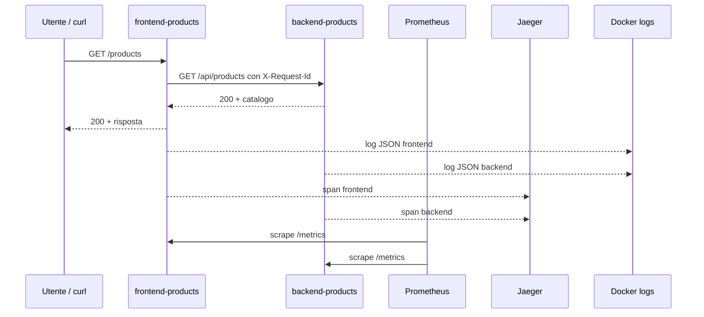

# OBS UD18 — Guida architetturale
# App-stack, obs-stack, rete Docker, porte, metriche, trace e log

## 0. Scopo del file

Questo file chiarisce l'architettura tecnica reale della UD18. Va letto dopo il file concettuale e prima del laboratorio guidato.

La UD18 introduce uno stack locale completo composto da:

```text
app-stack  = frontend-products + backend-products
obs-stack  = prometheus + grafana + jaeger + log JSON
```

Il punto non è soltanto eseguire `docker compose up`. Il punto è capire **chi parla con chi**, **con quale nome**, **su quale porta**, **quale segnale produce** e **quale strumento lo legge**.

---

## 1. Vista generale



La richiesta applicativa principale è:

```text
Browser
  ↓
frontend-products /
  ↓
backend-products /api/products
  ↓
risposta catalogo prodotti
```

Gli strumenti osservanti leggono segnali laterali:

```text
/metrics  → Prometheus → Grafana
OTLP      → Jaeger
stdout    → docker logs
```

---

## 2. Componenti applicativi

### 2.1 Backend products

Il backend rappresenta il servizio interno. Espone API applicative e segnali osservabili.

Endpoint principali:

| Endpoint | Scopo |
|---|---|
| `/health` | verifica vita del servizio |
| `/version` | versione, ambiente e timestamp |
| `/api/products` | catalogo prodotti normale |
| `/api/products/slow` | catalogo con latenza controllata |
| `/api/products/error` | errore controllato |
| `/metrics` | metriche Prometheus |

Il backend ascolta **dentro il container** sulla porta:

```text
8000
```

Dal computer host lo raggiungiamo tramite:

```text
http://localhost:8018
```

Quindi:

```text
host 8018 → container backend 8000
```

### 2.2 Frontend products

Il frontend rappresenta il punto di ingresso dell'utente. Espone una pagina HTML e chiama il backend tramite `BACKEND_URL`.

Endpoint principali:

| Endpoint | Scopo |
|---|---|
| `/` | home HTML con Catalogo prodotti |
| `/health` | health del frontend |
| `/ready` | verifica frontend + raggiungibilità backend |
| `/version` | versione, ambiente, backend url |
| `/products` | lista prodotti tramite backend |
| `/products/slow` | richiesta lenta tramite backend |
| `/products/error` | errore controllato tramite backend |
| `/metrics` | metriche Prometheus |

Il frontend ascolta **dentro il container** sulla porta:

```text
8000
```

Dal computer host lo raggiungiamo tramite:

```text
http://localhost:8118
```

Quindi:

```text
host 8118 → container frontend 8000
```

---

## 3. Rete Docker e DNS interno

Docker Compose crea una rete per i servizi definiti nel file `docker-compose.yml`.

Dentro questa rete i container si raggiungono tramite il nome del servizio Compose, non tramite `localhost`.

Per questo il frontend deve usare:

```text
BACKEND_URL=http://backend-products:8000
```

Non deve usare:

```text
BACKEND_URL=http://localhost:8018
```

Motivo:

```text
localhost dentro frontend-products indica il container frontend stesso.
8018 è una porta pubblicata sull'host, non la porta interna usata tra container.
```

Schema:

```text
Dal PC:
  curl http://localhost:8118/products

Dentro Docker:
  frontend-products → http://backend-products:8000/api/products
```

---

## 4. Porte host e porte container

| Servizio | Porta host | Porta container | Uso principale |
|---|---:|---:|---|
| frontend-products | 8118 | 8000 | accesso utente/browser |
| backend-products | 8018 | 8000 | verifica diretta backend |
| prometheus | 9090 | 9090 | UI Prometheus |
| grafana | 3000 | 3000 | UI Grafana |
| jaeger | 16686 | 16686 | UI Jaeger |
| jaeger OTLP gRPC | 4317 | 4317 | ricezione trace |
| jaeger OTLP HTTP | 4318 | 4318 | ricezione trace |

La pubblicazione delle porte serve al computer host. La comunicazione container-to-container usa invece porte interne e nomi DNS Docker.

---

## 5. Prometheus nella UD18

Prometheus raccoglie metriche interrogando periodicamente gli endpoint `/metrics`.

Nel file:

```text
prometheus/prometheus.yml
```

vengono definiti i target:

```yaml
scrape_configs:
  - job_name: "products-backend"
    static_configs:
      - targets: ["backend-products:8000"]

  - job_name: "products-frontend"
    static_configs:
      - targets: ["frontend-products:8000"]
```

Prometheus non chiama `localhost:8018` o `localhost:8118`, perché gira dentro un container. Anche Prometheus usa la rete Docker e i nomi dei servizi.

Controllo atteso:

```text
http://localhost:9090/targets
```

Target attesi:

```text
products-backend   UP
products-frontend  UP
```

---

## 6. Grafana nella UD18

Grafana non raccoglie direttamente metriche dall'applicazione. Grafana interroga Prometheus.

Il datasource viene provisionato con un file YAML:

```text
grafana/provisioning/datasources/prometheus.yml
```

URL datasource:

```text
http://prometheus:9090
```

Anche qui vale la stessa regola: Grafana è un container, quindi non deve usare `localhost:9090`. Deve usare il nome del servizio Compose `prometheus`.

Accesso UI:

```text
http://localhost:3000
```

Credenziali didattiche:

```text
admin / admin
```

---

## 7. Jaeger nella UD18

Jaeger riceve trace prodotte da frontend e backend. Il punto di ingresso usato dalle app è OTLP gRPC:

```text
http://jaeger:4317
```

La UI è accessibile dal computer host su:

```text
http://localhost:16686
```

Nella UI Jaeger ci aspettiamo di vedere, dopo aver generato traffico, servizi come:

```text
products-frontend
products-backend
```

Una richiesta `/products` dovrebbe produrre un percorso logico:

```text
frontend: GET /products
  ↓
backend: GET /api/products
```

Jaeger diventerà il centro della UD22. In UD18 lo usiamo soprattutto per verificare che il componente sia presente e riceva trace.

---

## 8. Log JSON

Frontend e backend scrivono log su stdout. Docker li raccoglie e possiamo leggerli con:

```bash
docker compose logs frontend-products
docker compose logs backend-products
```

Ogni record dovrebbe includere campi come:

```text
timestamp
service
level
message
request_id
method
path
status
latency_ms
trace_id
span_id
```

Il `request_id` permette di seguire una stessa richiesta tra frontend e backend. Il `trace_id`, quando presente, collega il log alla trace.

---

## 9. Flusso normale: /products

Quando chiamiamo:

```bash
curl http://localhost:8118/products
```

accade questo:



Segnali attesi:

| Strumento | Che cosa dovrei vedere |
|---|---|
| curl/browser | risposta con prodotti |
| Prometheus | incremento contatori richieste |
| Grafana | pannelli aggiornabili in UD20 |
| Jaeger | trace frontend/backend |
| Docker logs | due record JSON correlabili |

---

## 10. Flusso lento: /products/slow

Quando chiamiamo:

```bash
curl http://localhost:8118/products/slow
```

il backend introduce una latenza controllata. Questa richiesta è utile perché mostra che il problema non è solo il codice di stato HTTP. Una richiesta può rispondere `200` ma essere comunque degradata.

Segnali attesi:

```text
HTTP status: 200
latenza: più alta
trace: span backend più lungo
metriche: bucket/istogramma o durata maggiore
log: latency_ms elevato
```

---

## 11. Flusso errore: /products/error

Quando chiamiamo:

```bash
curl http://localhost:8118/products/error
```

l'app genera un errore controllato.

Segnali attesi:

```text
HTTP status: 500 o errore applicativo controllato
log level: ERROR
metriche: incremento errori
trace: span con informazione di errore
```

Questo endpoint sarà molto utile in UD21 per l'alerting e in UD22 per correlare errore, log e trace.

---

## 12. Comandi diagnostici fondamentali

### Verificare container e porte

```bash
docker compose ps
```

### Verificare i log

```bash
docker compose logs --tail=50 frontend-products
docker compose logs --tail=50 backend-products
```

### Verificare endpoint applicativi

```bash
curl -i http://localhost:8118/health
curl -i http://localhost:8118/ready
curl -i http://localhost:8118/products
curl -i http://localhost:8118/products/slow
curl -i http://localhost:8118/products/error
```

### Verificare Prometheus

```text
http://localhost:9090/targets
```

### Verificare Grafana

```text
http://localhost:3000
```

### Verificare Jaeger

```text
http://localhost:16686
```

---

## 13. Errori tipici

### Errore 1 — Il frontend non raggiunge il backend

Sintomo:

```text
/ready restituisce errore
/products fallisce
```

Controllare:

```bash
docker compose ps
docker compose logs frontend-products
```

Verificare che `BACKEND_URL` sia:

```text
http://backend-products:8000
```

### Errore 2 — Prometheus vede target DOWN

Cause probabili:

- container applicativo non avviato;
- target sbagliato in `prometheus.yml`;
- servizio non espone `/metrics`;
- Prometheus non è nella stessa rete Compose.

Controllare:

```bash
docker compose logs prometheus
```

### Errore 3 — Grafana non vede Prometheus

Verificare il datasource:

```text
http://prometheus:9090
```

Non usare:

```text
http://localhost:9090
```

perché Grafana gira in container.

### Errore 4 — Jaeger non mostra trace

Possibili cause:

- non è stato generato traffico dopo l'avvio;
- endpoint OTLP errato;
- servizio Jaeger non avviato;
- app non configurata con exporter OTLP.

Controllare:

```bash
docker compose logs jaeger
docker compose logs frontend-products
docker compose logs backend-products
```

### Errore 5 — Log presenti ma senza correlazione

Se i log non mostrano `request_id`, il problema è nel codice applicativo o nella propagazione header FE→BE.

In questa UD il frontend deve propagare:

```text
X-Request-Id
```

al backend.

---

## 14. Mini-check finale

| Domanda | Risposta attesa |
|---|---|
| Qual è il sistema osservato? | `frontend-products` e `backend-products`. |
| Qual è il sistema osservante? | Prometheus, Grafana, Jaeger e log JSON. |
| Come il frontend chiama il backend? | `http://backend-products:8000`. |
| Perché non usa `localhost:8018`? | Perché dentro il container `localhost` è il frontend stesso e `8018` è porta host. |
| Chi raccoglie metriche? | Prometheus tramite `/metrics`. |
| Chi visualizza metriche? | Grafana usando Prometheus come datasource. |
| Chi mostra le trace? | Jaeger. |
| Quale campo collega log FE e BE? | `request_id`. |
| Quali endpoint generano traffico utile? | `/products`, `/products/slow`, `/products/error`. |

---

## 15. Frase che il partecipante deve saper dire

> In UD18 eseguiamo localmente lo stesso tipo di applicazione FE/BE osservata nel cloud: un frontend prodotti e un backend catalogo. Il frontend raggiunge il backend attraverso la rete Docker usando `backend-products:8000`, non `localhost`. L'app produce metriche su `/metrics`, log JSON su stdout e trace OTLP verso Jaeger. Prometheus raccoglie le metriche, Grafana le visualizza, Jaeger mostra il percorso FE→BE e i log permettono di leggere il dettaglio delle singole richieste tramite `request_id`.
