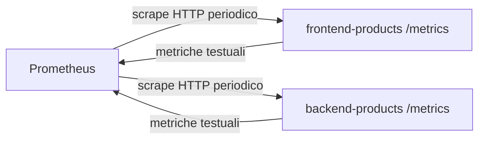

# OBS UD19 — Concetti
# Prometheus, metriche applicative e lettura quantitativa del Catalogo prodotti

## 0. Perché questa UD è importante

Nelle unità precedenti abbiamo costruito una progressione precisa. Prima abbiamo rilasciato un'applicazione frontend/backend nel cloud; poi l'abbiamo resa più significativa con la change request del **Catalogo prodotti**; infine abbiamo ricostruito localmente uno stack applicativo e uno stack osservante. A questo punto il problema non è più soltanto avviare container o verificare endpoint HTTP. Il problema diventa: **come capiamo, con dati misurabili, che cosa sta succedendo nell'applicazione?**

Prometheus entra in questo punto del percorso. Non è un visualizzatore, non è un sistema di log e non è un tracer distribuito. È un motore di raccolta e interrogazione di **serie temporali**. Questo significa che Prometheus osserva valori numerici nel tempo: richieste totali, errori, durate, stato dei target, frequenza degli eventi.

Nel nostro caso l'applicazione espone un workload semplice ma leggibile:

```text
Utente o script di traffico
        ↓
Frontend products
        ↓
Backend products
        ↓
Catalogo prodotti
```

Gli endpoint più utili per questa UD sono:

```text
/products        richiesta normale
/products/slow   richiesta lenta controllata
/products/error  errore controllato
/ready           prontezza del frontend rispetto al backend
/metrics         esposizione metriche Prometheus
```

Il vantaggio didattico è evidente: possiamo generare traffico normale, lento ed errato, poi osservare se le metriche cambiano davvero.

---

## 1. Dal log alla metrica: cambia il tipo di domanda

Quando leggiamo un log, spesso facciamo una domanda puntuale:

```text
Che cosa è successo a questa richiesta?
Quale status code ha prodotto?
Quanto tempo ha impiegato?
Quale request_id la identifica?
```

Quando leggiamo una metrica, la domanda cambia:

```text
Quante richieste sono arrivate negli ultimi minuti?
La frequenza degli errori sta aumentando?
La latenza media è stabile?
Il backend è raggiungibile?
Il frontend sta generando più errori del backend?
```

Le metriche non sostituiscono i log. Le metriche danno una vista aggregata e temporale. I log aiutano a scendere nel dettaglio di un evento. In questa UD ci concentriamo sulla prima parte: **misurare il comportamento generale**.

---

## 2. Che cosa raccoglie Prometheus

Prometheus non entra nei container per leggere tutto quello che accade. Prometheus interroga periodicamente endpoint HTTP chiamati comunemente endpoint `/metrics`.

Il meccanismo è:



La parola importante è **scrape**. Prometheus non riceve passivamente i dati dall'app; è Prometheus che, secondo una configurazione, va a raccoglierli.

Nel nostro stack la configurazione si trova in:

```text
prometheus/prometheus.yml
```

con target simili a:

```yaml
scrape_configs:
  - job_name: "products-backend"
    metrics_path: /metrics
    static_configs:
      - targets: ["backend-products:8000"]

  - job_name: "products-frontend"
    metrics_path: /metrics
    static_configs:
      - targets: ["frontend-products:8080"]
```

---

## 3. Target, job e istanze

In Prometheus è utile distinguere tre concetti:

| Concetto | Significato nel nostro laboratorio |
|---|---|
| **target** | endpoint concreto da interrogare, per esempio `backend-products:8000` |
| **job** | gruppo logico di target, per esempio `products-backend` |
| **instance** | istanza specifica osservata, spesso coincide con host:porta |

Nel laboratorio il target backend è raggiunto usando il nome del servizio Docker:

```text
backend-products:8000
```

Questo nome funziona perché Prometheus si trova nella stessa rete Docker dello stack applicativo. Dal PC host usiamo `localhost` e porte pubblicate; tra container usiamo invece nomi DNS interni Docker e porte container.

---

## 4. Metriche applicative della nostra app

Le app products espongono due metriche applicative principali:

```text
app_http_requests_total
app_http_request_duration_seconds
```

La prima conta le richieste HTTP viste dall'applicazione. È un **counter**: cresce nel tempo e non dovrebbe diminuire durante la vita del processo.

La seconda misura la durata delle richieste. È un **histogram**: consente di calcolare medie e percentili, per esempio p95.

Le label principali sono:

```text
service = frontend oppure backend
method  = GET/POST/...
path    = /products, /products/slow, /products/error, ...
status  = 200, 500, 503, ...
```

Queste label sono il ponte tra metrica e comportamento applicativo. Senza label, vedremmo solo numeri aggregati e poco interpretabili. Con le label possiamo distinguere frontend/backend, endpoint normali/lenti/errati e status code.

---

## 5. PromQL: interrogare il comportamento

PromQL è il linguaggio di query di Prometheus. All'inizio può sembrare meno immediato di KQL, ma in questa UD lo usiamo per poche domande operative.

Esempi:

```promql
up
```

Questa query risponde alla domanda:

```text
Prometheus riesce a raccogliere metriche dai target?
```

```promql
sum by (service, path, status) (app_http_requests_total)
```

Questa query mostra quante richieste sono state osservate per servizio, endpoint e stato.

```promql
sum by (service, path, status) (rate(app_http_requests_total[2m]))
```

Questa query mostra il ritmo delle richieste negli ultimi due minuti. La funzione `rate()` è importante perché i counter crescono sempre: per capire se il traffico sta aumentando, non guardiamo solo il valore assoluto, guardiamo la velocità di crescita.

---

## 6. Latenza: media e percentile

La latenza è uno dei segnali più importanti. Tuttavia la latenza media può essere ingannevole: poche richieste molto lente possono essere nascoste dentro una media ancora accettabile. Per questo spesso si usano percentili, ad esempio p95.

Con un histogram Prometheus possiamo calcolare:

```promql
rate(app_http_request_duration_seconds_sum[2m])
/
rate(app_http_request_duration_seconds_count[2m])
```

per stimare la durata media recente, oppure:

```promql
histogram_quantile(
  0.95,
  sum by (le, service, path) (
    rate(app_http_request_duration_seconds_bucket[2m])
  )
)
```

per stimare il p95.

Nel nostro laboratorio `/products/slow` serve proprio a rendere visibile la differenza tra una richiesta normale e una richiesta lenta.

---

## 7. Error rate: non basta sapere che esiste un errore

Un errore singolo può essere interessante, ma in osservabilità spesso ci interessa la frequenza degli errori.

Query utile:

```promql
sum by (service, path, status) (
  rate(app_http_requests_total{status=~"5.."}[2m])
)
```

Questa query risponde alla domanda:

```text
Quali servizi ed endpoint stanno producendo errori 5xx negli ultimi minuti?
```

Nel nostro caso `/products/error` è un errore controllato. Non lo usiamo perché vogliamo rompere l'applicazione, ma perché vogliamo vedere come un errore applicativo diventa una metrica osservabile.

---

## 8. Prometheus nel percorso complessivo

Questa UD non chiude il tema. Lo apre in modo quantitativo.

```text
UD18 → lo stack locale è avviato e riconoscibile
UD19 → Prometheus raccoglie metriche e noi le interroghiamo
UD20 → Grafana userà queste metriche per dashboard operative
UD21 → le stesse metriche diventeranno condizioni di alert
UD22 → metriche, log e trace verranno correlati
```

Questa progressione è importante: prima impariamo a leggere il dato grezzo, poi lo trasformiamo in pannelli, poi in alert, poi in diagnosi.

---

## 9. Cosa dobbiamo saper dire alla fine

Al termine della UD19 un partecipante deve poter dire:

> Prometheus raccoglie metriche dagli endpoint `/metrics` di frontend e backend. I target sono definiti in `prometheus.yml`. Le metriche `app_http_requests_total` e `app_http_request_duration_seconds` mi permettono di osservare traffico, errori e latenza del Catalogo prodotti. Con PromQL posso distinguere richieste normali, lente ed errate e preparare le dashboard che useremo in Grafana.

Questa è la competenza essenziale della UD19.
