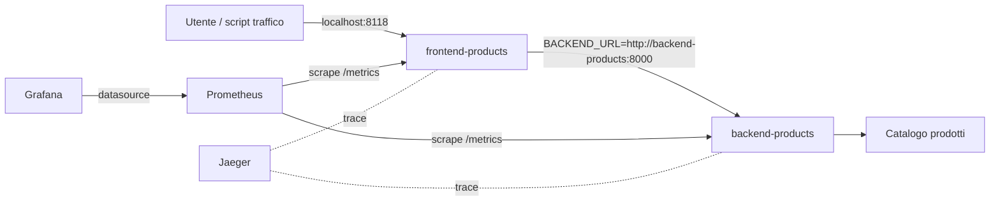
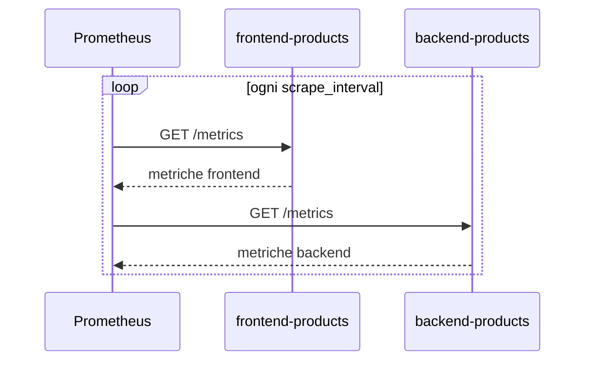
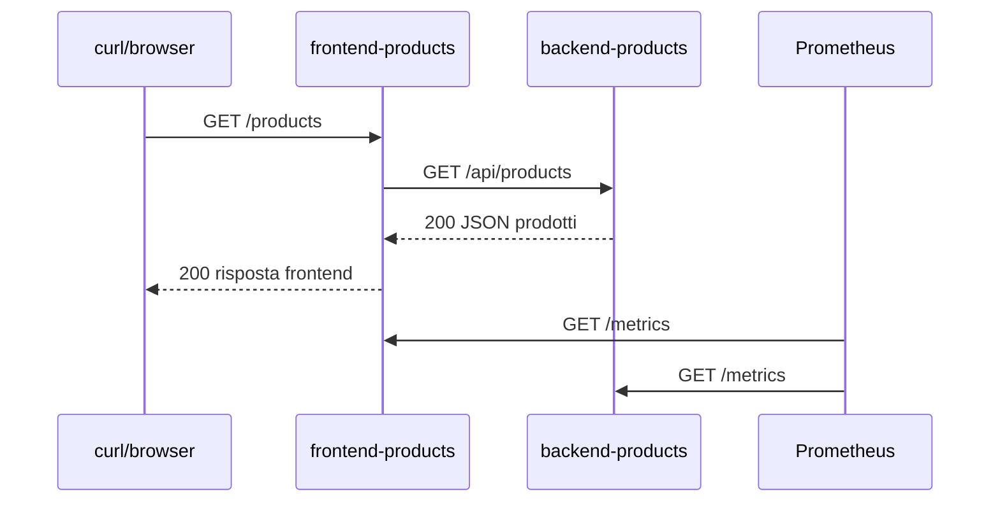

# OBS UD19 — Guida architetturale
# Come Prometheus osserva frontend e backend del Catalogo prodotti

## 0. Scopo del file

Questo file chiarisce l'architettura tecnica della UD19. Il laboratorio usa lo stesso stack locale introdotto in UD18, ma ora il punto centrale è Prometheus: come raggiunge i servizi, quali endpoint interroga, quali metriche raccoglie e come quelle metriche descrivono il comportamento del Catalogo prodotti.

La guida serve soprattutto a evitare tre confusioni frequenti:

1. confondere porte host e porte container;
2. pensare che Prometheus legga i log dei container;
3. usare query PromQL senza capire che cosa rappresentano le serie temporali.

---

## 1. Vista complessiva



In UD19 useremo quasi esclusivamente Prometheus. Grafana e Jaeger sono presenti nello stack perché servono alla progressione successiva, ma il focus della UD resta la raccolta e interrogazione metrica.

---

## 2. Due reti mentali: host e rete Docker

Dal PC/WSL raggiungiamo i servizi con porte pubblicate:

| Servizio | URL dal PC |
|---|---|
| Backend | `http://localhost:8018` |
| Frontend | `http://localhost:8118` |
| Prometheus | `http://localhost:9090` |
| Grafana | `http://localhost:3000` |
| Jaeger | `http://localhost:16686` |

Tra container, invece, non si usa `localhost`. Prometheus raggiunge backend e frontend usando i nomi dei servizi Docker:

```text
backend-products:8000
frontend-products:8080
```

Questa distinzione è essenziale. Se in `prometheus.yml` scrivessimo `localhost:8018`, per Prometheus `localhost` significherebbe il container Prometheus stesso, non il PC host.

---

## 3. Che cosa significa scrape

Prometheus lavora con un modello pull. A intervalli regolari, esegue richieste HTTP verso gli endpoint configurati.



Questo è diverso da un sistema in cui l'app invia continuamente dati verso un collector. Nel nostro laboratorio l'app espone, Prometheus raccoglie.

---

## 4. Endpoint /metrics

Frontend e backend espongono `/metrics`. Questo endpoint restituisce testo nel formato Prometheus exposition format.

Esempio concettuale:

```text
app_http_requests_total{service="frontend",method="GET",path="/products",status="200"} 42
app_http_request_duration_seconds_sum{service="frontend",method="GET",path="/products"} 1.24
app_http_request_duration_seconds_count{service="frontend",method="GET",path="/products"} 42
```

Non è una pagina per utenti. È una superficie tecnica di osservabilità.

---

## 5. Perché servono label

La metrica senza label sarebbe troppo generica. La label `service` distingue frontend e backend. La label `path` distingue `/products`, `/products/slow`, `/products/error`. La label `status` distingue successo ed errore.

Senza label potremmo solo dire:

```text
ci sono state 100 richieste
```

Con le label possiamo dire:

```text
il frontend ha prodotto errori su /products/error
il backend ha risposto lentamente su /api/products/slow
/products ha traffico normale con status 200
```

Questa differenza è il cuore della UD19.

---

## 6. Flusso /products

Quando chiamiamo:

```bash
curl http://localhost:8118/products
```

il flusso è:



La richiesta applicativa avviene prima. Prometheus la osserva indirettamente nel successivo scrape.

---

## 7. Flusso /products/slow

`/products/slow` introduce una lentezza controllata. Serve a vedere come cambia la metrica di durata.

Non dobbiamo interpretare questa lentezza come un malfunzionamento casuale. È un segnale generato apposta per allenare la lettura di latenza.

Metriche coinvolte:

```text
app_http_request_duration_seconds_bucket
app_http_request_duration_seconds_sum
app_http_request_duration_seconds_count
```

Query collegate:

```promql
sum by (service, path) (rate(app_http_request_duration_seconds_sum[2m]))
/
sum by (service, path) (rate(app_http_request_duration_seconds_count[2m]))
```

E:

```promql
histogram_quantile(
  0.95,
  sum by (le, service, path) (
    rate(app_http_request_duration_seconds_bucket[2m])
  )
)
```

---

## 8. Flusso /products/error

`/products/error` genera un errore controllato. Serve a far comparire status 5xx nelle metriche.

Query collegate:

```promql
sum by (service, path, status) (
  rate(app_http_requests_total{status=~"5.."}[2m])
)
```

Qui il punto non è correggere subito l'errore, ma capire dove si manifesta:

| Caso | Interpretazione |
|---|---|
| errore solo frontend | il frontend fallisce prima o durante la chiamata |
| errore backend e frontend | il backend fallisce e il frontend propaga/gestisce l'errore |
| backend 500, frontend 503 | frontend trasforma l'errore backend in risposta di indisponibilità |

---

## 9. Prometheus e log: cosa non confondere

Prometheus non legge direttamente i log JSON prodotti dalle app. I log sono visibili con:

```bash
docker compose logs frontend-products
docker compose logs backend-products
```

Prometheus legge metriche da `/metrics`.

La correlazione completa arriverà più avanti:

```text
metriche → andamento aggregato
log      → evento puntuale e request_id
trace    → percorso distribuito FE→BE
```

UD19 lavora sul primo livello.

---

## 10. Errori tipici

### Target DOWN ma container running

Possibili cause:

- target errato in `prometheus.yml`;
- porta container sbagliata;
- servizio non nella stessa rete;
- endpoint `/metrics` non esposto.

### `/metrics` funziona dal PC ma target DOWN

Probabile confusione host/container. Dal PC usiamo `localhost:8018`; da Prometheus si usa `backend-products:8000`.

### Query vuota dopo traffico

Possibili cause:

- Prometheus non ha ancora fatto scrape;
- finestra temporale troppo breve;
- query con label sbagliata;
- traffico generato verso endpoint diverso.

### Latenza non evidente

Generare più richieste lente e attendere alcuni scrape.

---

## 11. Mini-check finale

| Domanda | Risposta attesa |
|---|---|
| Che cosa fa Prometheus? | Raccoglie metriche da endpoint `/metrics` tramite scrape periodico. |
| Dove sono configurati i target? | In `prometheus/prometheus.yml`. |
| Quali job osservano FE/BE? | `products-frontend` e `products-backend`. |
| Perché non usare `localhost` nei target? | Perché per Prometheus `localhost` è il container Prometheus. |
| Quale metrica conta le richieste? | `app_http_requests_total`. |
| Quale metrica serve per la latenza? | `app_http_request_duration_seconds`. |
| Perché usare `rate()`? | Per leggere la velocità di crescita di un counter. |
| Perché `/products/slow` è utile? | Fa emergere il segnale di latenza. |
| Perché `/products/error` è utile? | Fa emergere errori 5xx osservabili. |

---

## 12. Frase che il partecipante deve saper dire

> Prometheus osserva il frontend e il backend del Catalogo prodotti interrogando periodicamente i loro endpoint `/metrics`. I target sono definiti in `prometheus.yml` usando nomi DNS Docker interni e porte container. Le metriche applicative permettono di distinguere richieste, errori e latenza per servizio, path e status. Con PromQL posso trasformare questi dati in domande operative come: il backend è raggiungibile, quanti errori sto producendo, quanto è lenta `/products/slow` rispetto a `/products`.
