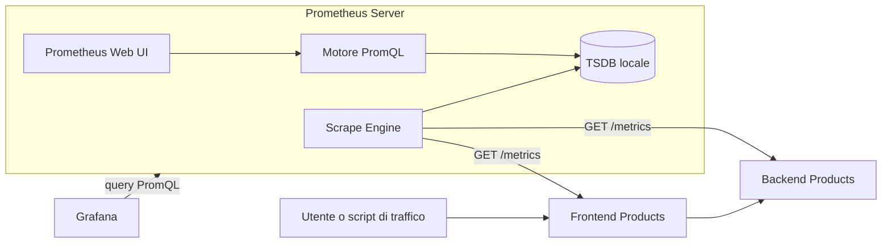
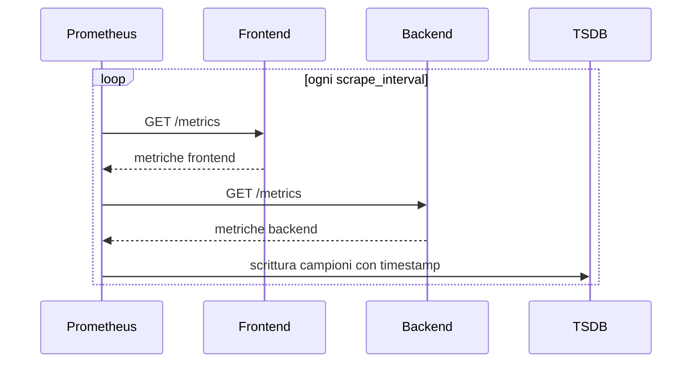
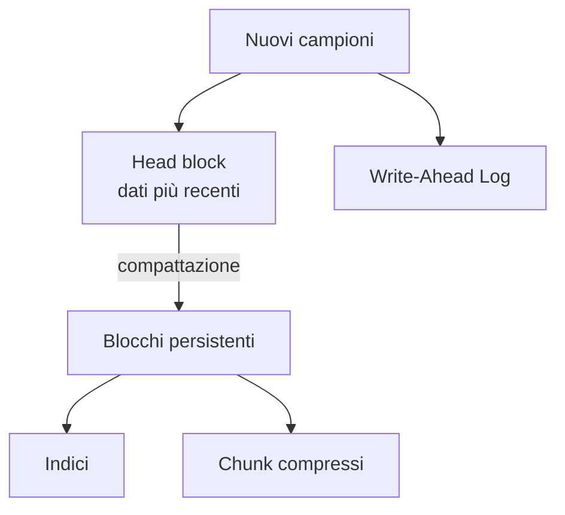
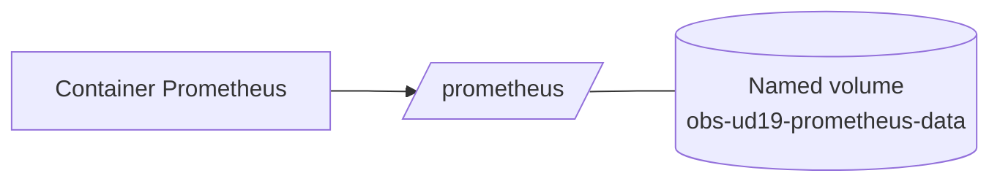
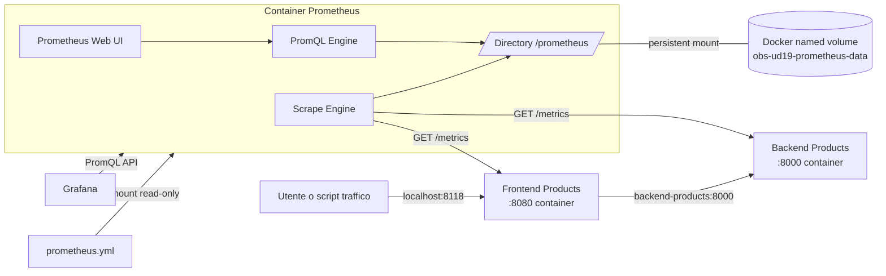
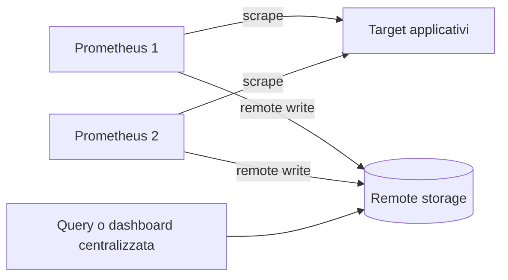
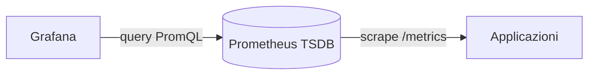

# UD19 – Guida all'architettura di Prometheus e alla persistenza delle metriche

## Obiettivo del documento

Questo documento chiarisce:

- se Prometheus possiede un database;
- dove vengono conservate le metriche raccolte;
- che cosa accade quando arrestiamo o rimuoviamo il container;
- perché nella prima configurazione della UD19 lo storico poteva scomparire;
- come rendere persistenti i dati del laboratorio;
- come cambia l'architettura passando dal laboratorio a un ambiente reale.

La domanda iniziale è:

> Prometheus ha un database?

La risposta corretta è:

> Sì. Il server Prometheus include un proprio database locale specializzato per serie temporali, chiamato TSDB, cioè Time Series Database.

Non è quindi necessario aggiungere MySQL, PostgreSQL o un altro database per il funzionamento di base di Prometheus.

Prometheus può tuttavia essere integrato con sistemi di storage remoto quando servono maggiore durata, scalabilità, replica o una vista centralizzata di più istanze.

---

## 1. Che cosa conserva Prometheus

Le applicazioni frontend e backend espongono metriche tramite l'endpoint `/metrics`.

Esempio concettuale:

```text
app_http_requests_total{service="products-backend",status="200"} 125
```

Questo valore rappresenta lo stato corrente del contatore nell'applicazione.

Prometheus interroga periodicamente l'endpoint e salva un campione composto da:

```text
nome metrica + label + valore + timestamp
```

Esempio:

```text
10:00:00  app_http_requests_total{service="products-backend"} 100
10:00:10  app_http_requests_total{service="products-backend"} 108
10:00:20  app_http_requests_total{service="products-backend"} 125
```

Prometheus non conserva soltanto il valore `125`.

Conserva una sequenza temporale di campioni. Per questo è definito database di serie temporali.

---

## 2. Architettura logica generale



Il flusso è:

```text
Applicazioni
    ↓ espongono /metrics
Prometheus Scrape Engine
    ↓ salva campioni
TSDB locale
    ↓ viene interrogato
PromQL
    ↓
Prometheus UI o Grafana
```

---

## 3. Prometheus non legge continuamente le applicazioni

Prometheus adotta normalmente un modello **pull**.

A intervalli regolari:

1. raggiunge un target;
2. richiede `/metrics`;
3. legge i valori esposti;
4. assegna il timestamp di raccolta;
5. salva i campioni nella TSDB.



Il file `prometheus.yml` stabilisce quali target interrogare e con quale frequenza.

La TSDB conserva invece i dati raccolti nel tempo.

Sono quindi due responsabilità diverse:

| Elemento | Responsabilità |
|---|---|
| `prometheus.yml` | Configura scrape, target, job e intervalli |
| TSDB | Conserva i campioni storici |

---

## 4. Dove si trova il database

Nell'immagine Docker ufficiale di Prometheus, la directory dati convenzionale è:

```text
/prometheus
```

Nel laboratorio aggiornato la configurazione rende esplicita questa posizione:

```yaml
command:
  - "--config.file=/etc/prometheus/prometheus.yml"
  - "--storage.tsdb.path=/prometheus"
```

All'interno di questa directory Prometheus gestisce autonomamente:

- campioni recenti;
- Write-Ahead Log, abbreviato WAL;
- blocchi temporali;
- indici;
- chunk compressi;
- metadati;
- informazioni necessarie alle query.

Non dobbiamo creare manualmente tabelle o indici SQL.

---

## 5. Struttura concettuale della TSDB

La struttura può essere semplificata così:



### Head block

Contiene i dati più recenti su cui Prometheus sta ancora lavorando.

### WAL

Il Write-Ahead Log registra le scritture recenti prima che vengano consolidate nei blocchi.

Serve a permettere il recupero dei dati recenti dopo un arresto o un riavvio non distruttivo.

### Blocchi

I campioni vengono periodicamente organizzati in blocchi temporali persistenti.

Ogni blocco contiene, in forma semplificata:

- dati compressi;
- indice delle serie;
- metadati;
- eventuali informazioni sulle cancellazioni.

### Compattazione

Prometheus combina progressivamente i blocchi più piccoli in blocchi più grandi per ottimizzare lo storage e le query.

---

## 6. Configurazione originaria della UD19

Nella configurazione iniziale era montato soltanto il file di configurazione:

```yaml
volumes:
  - ./prometheus/prometheus.yml:/etc/prometheus/prometheus.yml:ro
```

Non era dichiarato un volume nominato per la directory dati `/prometheus`.

L'immagine ufficiale utilizza comunque un'area dati interna, ma senza un volume nominato nel file Compose questa area non è associata in modo stabile e leggibile al progetto didattico.

Lo script di chiusura eseguiva:

```bash
docker compose down
```

Questo comando:

- arresta i container;
- rimuove i container;
- rimuove le reti Compose;
- non garantisce che un successivo `docker compose up` riutilizzi lo stesso volume anonimo.

Il risultato pratico era:

```text
docker compose down
        ↓
container Prometheus rimosso
        ↓
nuovo docker compose up
        ↓
nuova area dati
        ↓
storico precedente non visibile
```

Quindi, nella configurazione originaria, dopo la chiusura e la successiva riapertura del laboratorio lo storico Prometheus poteva risultare perso dal punto di vista dell'utente.

---

## 7. Differenza tra stop, restart e down

È importante distinguere i comandi.

| Comando | Container | Volume nominato | Storico con configurazione persistente |
|---|---|---|---|
| `docker compose stop` | arrestato, non rimosso | conservato | conservato |
| `docker compose start` | riavvia lo stesso container | riutilizzato | conservato |
| `docker compose restart` | riavviato | riutilizzato | conservato |
| `docker compose down` | rimosso | conservato | conservato |
| `docker compose down -v` | rimosso | eliminato | cancellato |

La differenza essenziale è questa:

> `down` rimuove i container; `down -v` rimuove anche i volumi dichiarati dal progetto.

---

## 8. Soluzione adottata nella UD19 aggiornata

Nel servizio Prometheus aggiungiamo un volume nominato:

```yaml
services:
  prometheus:
    image: prom/prometheus:v2.55.1
    container_name: ud18-prometheus
    command:
      - "--config.file=/etc/prometheus/prometheus.yml"
      - "--storage.tsdb.path=/prometheus"
      - "--storage.tsdb.retention.time=7d"
    volumes:
      - ./prometheus/prometheus.yml:/etc/prometheus/prometheus.yml:ro
      - prometheus-data:/prometheus
    ports:
      - "9090:9090"

volumes:
  prometheus-data:
    name: obs-ud19-prometheus-data
```

Il mapping fondamentale è:

```text
volume Docker                     directory nel container
obs-ud19-prometheus-data    →     /prometheus
```



Il container può essere eliminato e ricreato, mentre il volume rimane disponibile.

---

## 9. Che cosa accade ora con lo script di chiusura

Lo script continua a eseguire:

```bash
docker compose down
```

Ma, grazie al named volume, il comportamento diventa:

```text
1. Prometheus termina ordinatamente.
2. Il container viene rimosso.
3. La rete Compose viene rimossa.
4. Il volume obs-ud19-prometheus-data rimane.
5. Al successivo avvio il volume viene rimontato su /prometheus.
6. Prometheus riapre la propria TSDB.
7. Le metriche storiche tornano interrogabili.
```

Quindi:

> Con la configurazione aggiornata possiamo usare normalmente `stop_stack_ud19.sh` senza perdere lo storico Prometheus.

---

## 10. Persistenza non significa raccolta continua

Quando lo stack è spento, Prometheus non esegue scrape.

Durante il periodo di arresto non vengono raccolti nuovi campioni.

La persistenza garantisce la conservazione dei dati già acquisiti, non la continuità del monitoraggio mentre Prometheus è fermo.

```text
Prometheus attivo
    ↓
raccoglie e salva campioni

Prometheus fermo
    ↓
nessun nuovo campione
ma lo storico già salvato rimane nel volume
```

Nel grafico vedremo quindi un intervallo senza dati corrispondente al periodo di spegnimento.

---

## 11. Che cosa accade ai contatori delle applicazioni

Esistono due livelli di stato differenti.

### Stato nelle applicazioni

Un counter Python come:

```text
app_http_requests_total
```

vive nella memoria del processo frontend o backend.

Se il container applicativo viene ricreato, il counter può ripartire da zero.

### Stato in Prometheus

Prometheus conserva lo storico dei campioni già raccolti.

Dopo il riavvio dell'applicazione può osservare un reset del counter.

```text
prima del riavvio: 125
applicazione ricreata
primo scrape dopo il riavvio: 3
```

Prometheus non considera automaticamente questo comportamento una perdita del proprio database. È il reset della sorgente metrica.

Funzioni come `rate()` sono progettate per gestire i normali reset dei counter.

---

## 12. Retention

La persistenza non implica conservazione infinita.

La retention stabilisce per quanto tempo mantenere i campioni.

Nel laboratorio è stata scelta:

```yaml
--storage.tsdb.retention.time=7d
```

Significa:

```text
conserva indicativamente sette giorni di dati
poi elimina progressivamente i blocchi più vecchi
```

La durata è adatta a un laboratorio perché:

- permette di riaprire l'attività nei giorni successivi;
- limita l'occupazione disco;
- rende visibile il concetto di conservazione temporale;
- evita di simulare una retention di produzione senza necessità.

In un ambiente reale la retention deve essere dimensionata considerando:

- numero di target;
- numero di serie;
- cardinalità delle label;
- frequenza di scrape;
- durata richiesta;
- spazio disco disponibile;
- politiche aziendali.

---

## 13. Come verificare il volume

Dalla cartella dello stack:

```bash
docker volume ls
```

Dovremmo trovare:

```text
obs-ud19-prometheus-data
```

Per leggere i dettagli:

```bash
docker volume inspect obs-ud19-prometheus-data
```

Per verificare la directory dati dall'interno del container:

```bash
docker compose exec prometheus sh -c 'ls -la /prometheus'
```

Per una stima dello spazio occupato:

```bash
docker compose exec prometheus sh -c 'du -sh /prometheus'
```

---

## 14. Prova pratica di persistenza

### Passo 1 – Avvio

```bash
./scripts/start_stack_ud19.sh
```

### Passo 2 – Generazione traffico

```bash
./scripts/generate_traffic_ud19.sh
```

### Passo 3 – Verifica dello storico

In Prometheus eseguiamo:

```promql
app_http_requests_total
```

Poi selezioniamo una vista temporale che includa alcuni minuti precedenti.

### Passo 4 – Chiusura

```bash
./scripts/stop_stack_ud19.sh
```

### Passo 5 – Nuovo avvio

```bash
./scripts/start_stack_ud19.sh
```

### Passo 6 – Verifica

Ripetiamo la query e allarghiamo l'intervallo temporale.

Dovremmo osservare:

- i campioni raccolti prima dello spegnimento;
- un intervallo vuoto durante lo spegnimento;
- nuovi campioni dopo il riavvio;
- eventuali reset dei counter applicativi.

---

## 15. Come cancellare intenzionalmente i dati

La cancellazione dello storico deve essere esplicita.

È disponibile lo script:

```bash
./scripts/reset_stack_ud19.sh
```

Lo script esegue:

```bash
docker compose down -v
```

Questo comando rimuove:

- container;
- reti Compose;
- volume `obs-ud19-prometheus-data`;
- storico Prometheus del laboratorio.

Dopo il reset, il successivo avvio crea una TSDB vuota.

Usiamo questo script soltanto quando vogliamo realmente ripartire da zero.

---

## 16. Architettura completa della UD19 aggiornata



Il punto chiave è distinguere:

```text
prometheus.yml
    = configurazione

/prometheus
    = database TSDB

obs-ud19-prometheus-data
    = supporto persistente Docker
```

---

## 17. Laboratorio e produzione

| Caratteristica | Laboratorio UD19 | Ambiente reale |
|---|---|---|
| Numero Prometheus | Uno | Uno o più, secondo architettura |
| Database locale | TSDB Prometheus | TSDB locale presente |
| Supporto disco | Named volume Docker | Disco persistente dedicato |
| Retention | 7 giorni | Dimensionata su requisiti |
| Replica locale | No | Non nativa nella singola TSDB |
| Backup | Non necessario per il lab | Da progettare |
| Storage remoto | Non usato | Possibile tramite remote write/read |
| Alta disponibilità | Non richiesta | Da progettare |

La TSDB locale di una singola istanza Prometheus non è un database distribuito e replicato.

In produzione può essere perfettamente valida per molti scenari, ma deve essere trattata come uno storage locale di singolo nodo.

Per esigenze più ampie si possono adottare architetture con:

- più istanze Prometheus;
- remote write;
- storage remoto;
- replica;
- conservazione a lungo termine;
- query centralizzate.

---

## 18. Architettura con storage remoto



Lo storage remoto non sostituisce necessariamente la TSDB locale nel flusso di raccolta.

Prometheus può continuare a raccogliere e interrogare localmente, inviando in parallelo i campioni a un sistema esterno.

Questa architettura serve quando sono richiesti:

- retention lunga;
- aggregazione di più Prometheus;
- maggiore durabilità;
- disponibilità su più nodi;
- separazione tra raccolta e conservazione.

---

## 19. Prometheus, Grafana e database

Grafana non sostituisce il database Prometheus.

Nel laboratorio:

```text
Prometheus
    = raccoglie metriche
    = conserva campioni nella TSDB
    = esegue PromQL

Grafana
    = interroga Prometheus
    = visualizza risultati
    = gestisce dashboard
```



Se Prometheus perde il proprio storage, Grafana non può ricostruire lo storico delle metriche.

---

## 20. Domande frequenti

### Prometheus ha bisogno di un database esterno?

No. Include una TSDB locale.

### Il file `prometheus.yml` contiene i dati?

No. Contiene la configurazione di raccolta. I dati sono nella directory TSDB.

### Se chiudo il browser perdo le metriche?

No. Il browser è soltanto l'interfaccia di consultazione.

### Se eseguo `docker compose stop` perdo i dati?

No. Il container e il volume rimangono.

### Se eseguo `docker compose down` perdo i dati?

Con il named volume introdotto nella UD19 aggiornata, no.

### Se eseguo `docker compose down -v` perdo i dati?

Sì. Il volume viene eliminato intenzionalmente.

### Se spengo Prometheus, le applicazioni continuano a funzionare?

Sì, ma Prometheus non raccoglie campioni durante lo spegnimento.

### Se riavvio frontend e backend, i counter ripartono da zero?

Possono ripartire da zero perché vivono nella memoria dei processi applicativi. Lo storico Prometheus già raccolto rimane.

### Il volume rende Prometheus altamente disponibile?

No. Rende persistenti i dati sullo stesso ambiente Docker, ma non crea replica, clustering o alta disponibilità.

### Grafana conserva una copia delle metriche?

No. Grafana normalmente interroga Prometheus come datasource.

---

## 21. Sintesi finale

L'architettura della persistenza può essere riassunta così:

```text
Frontend e Backend
       ↓ /metrics
Prometheus Scrape Engine
       ↓
TSDB nella directory /prometheus
       ↓
Docker named volume
obs-ud19-prometheus-data
       ↓
PromQL, Prometheus UI e Grafana
```

La risposta alle domande iniziali è:

> Prometheus include un proprio database locale per serie temporali. Nella configurazione originaria della UD19 mancava un volume nominato e `docker compose down` rendeva lo storico precedente non riutilizzabile al successivo avvio. Montando un named volume su `/prometheus`, lo script di chiusura può continuare a usare `docker compose down` senza cancellare i dati. Lo storico viene eliminato soltanto con un'azione esplicita, come `docker compose down -v` o lo script di reset.

---

## 22. Riferimenti tecnici essenziali

- Prometheus, documentazione ufficiale sullo storage: `https://prometheus.io/docs/prometheus/latest/storage/`
- Prometheus, installazione tramite Docker: `https://github.com/prometheus/prometheus/blob/main/docs/installation.md`
- Docker, comportamento di `docker compose down`: `https://docs.docker.com/reference/cli/docker/compose/down/`
