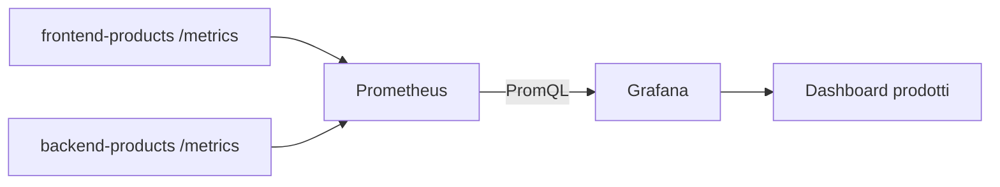

# OBS UD20 — Concetti
# Grafana dashboard, lettura visuale delle metriche e comportamento del Catalogo prodotti

## 0. Perché arriviamo a Grafana

Con Prometheus abbiamo fatto il primo passaggio quantitativo: abbiamo raccolto metriche da frontend e backend, abbiamo verificato i target e abbiamo scritto query PromQL. Questo è un passaggio fondamentale, ma non è ancora il modo in cui normalmente un team osserva un servizio durante una giornata operativa. Quando le metriche diventano molte, quando il traffico cambia, quando gli errori non sono costanti e quando la latenza si alza solo in alcune condizioni, una sequenza di query isolate non basta più.

Grafana entra qui. Non sostituisce Prometheus: lo usa come sorgente dati. Prometheus continua a raccogliere e conservare le serie temporali; Grafana ci permette di disporle in pannelli, confrontarle, salvare una vista operativa e rileggerla nel tempo.

Nel nostro caso osserviamo sempre la stessa applicazione:

```text
Utente o script di traffico
        ↓
Frontend products
        ↓
Backend products
        ↓
Catalogo prodotti
```

Gli endpoint che useremo per costruire una dashboard leggibile sono:

```text
/                  home HTML del catalogo
/products          chiamata normale al catalogo
/products/slow     latenza controllata
/products/error    errore controllato
/ready             stato di integrazione FE → BE
```

Il punto non è creare una dashboard esteticamente bella. Il punto è costruire una dashboard che aiuti a rispondere a domande operative:

```text
I servizi sono UP?
Il traffico sta arrivando?
Gli errori sono concentrati su un endpoint?
La latenza lenta è visibile?
Il frontend e il backend raccontano la stessa storia?
```

---

## 1. Dashboard non significa “grafico qualunque”

Una dashboard utile non è una raccolta casuale di pannelli. Una dashboard deve raccontare una sequenza di lettura. Nel nostro laboratorio useremo una logica semplice:

```text
1. Disponibilità: i target sono UP?
2. Traffico: quante richieste arrivano?
3. Errori: quali path producono 5xx?
4. Latenza: dove il tempo aumenta?
5. Confronto FE/BE: il problema nasce davanti o dietro?
```

Questa sequenza è volutamente vicina al modo in cui un tecnico dovrebbe ragionare davanti a un'anomalia. Prima controllo se qualcosa è acceso e raggiungibile. Poi guardo il volume. Poi guardo gli errori. Poi guardo le durate. Solo dopo provo a formulare una diagnosi.

---

## 2. Rapporto tra Prometheus e Grafana

Lo schema tecnico è questo:



Prometheus raccoglie. Grafana interroga. La dashboard non contiene i dati in modo permanente: contiene pannelli e query. Se Prometheus non raccoglie, Grafana non mostra valori utili. Se la query PromQL è sbagliata, il pannello resta vuoto o fuorviante. Se la finestra temporale è troppo corta, potremmo non vedere nulla anche se il sistema funziona.

Per questo, prima di accusare Grafana, dobbiamo sempre ragionare così:

```text
Grafana vuota
  ↓
Datasource funzionante?
  ↓
Prometheus ha target UP?
  ↓
Le metriche esistono?
  ↓
La query PromQL restituisce valori?
  ↓
Il time range della dashboard è corretto?
```

---

## 3. Il datasource Prometheus

In Grafana un datasource è la definizione di una sorgente interrogabile. Nel nostro stack il datasource Prometheus viene configurato tramite file YAML dentro la cartella di provisioning di Grafana. Questo evita che ogni partecipante debba configurarlo manualmente nella UI.

La configurazione punta a:

```text
http://prometheus:9090
```

Non usiamo `localhost:9090` dal punto di vista del container Grafana, perché Grafana gira in un container separato. Dentro la rete Docker, `prometheus` è il nome del servizio Prometheus. Questo è lo stesso principio già incontrato con `BACKEND_URL`: tra container si usano nomi di servizio e porte interne, non le porte pubblicate sull'host.

---

## 4. Pannelli minimi della UD20

La dashboard della UD20 deve contenere almeno questi pannelli:

| Pannello | Domanda a cui risponde |
|---|---|
| Target UP | frontend/backend sono raggiungibili da Prometheus? |
| Request rate | quali endpoint ricevono traffico? |
| Error rate 5xx | dove compaiono errori controllati? |
| Latency p95 | quale path mostra aumento di durata? |
| Average latency | andamento medio delle durate |
| Total requests | riepilogo aggregato per servizio/path/status |

Questi pannelli sono sufficienti per una prima lettura operativa. Non sono ancora alert; non sono ancora una diagnosi completa; non sono ancora tracing. Sono la base visuale su cui UD21 costruirà alerting e UD22 costruirà correlazione con trace e log.

---

## 5. Perché usare /products/slow e /products/error

Un errore frequente nei corsi di observability è usare solo endpoint sempre sani. In quel caso dashboard e alert sembrano funzionare, ma non si capisce se siano davvero capaci di rappresentare un degrado.

Nel nostro workload abbiamo tre comportamenti:

```text
/products        comportamento normale
/products/slow   comportamento lento ma intenzionale
/products/error  errore intenzionale
```

Questo ci permette di vedere tre forme diverse di segnale:

```text
/products        aumenta request rate
/products/slow   aumenta latenza
/products/error  aumenta error rate
```

Il valore didattico è che la dashboard non è decorativa. Mostra conseguenze osservabili di comportamenti applicativi controllati.

---

## 6. Cosa il partecipante deve portarsi dietro

Alla fine della UD20 il partecipante non deve dire soltanto “ho creato una dashboard”. Deve saper dire:

> Ho collegato Grafana a Prometheus, ho costruito pannelli che leggono metriche reali prodotte da frontend e backend, ho generato traffico normale, lento ed errato e ho verificato che request rate, error rate e latenza cambiano in modo coerente con il comportamento dell'applicazione.

Questa frase è importante perché sposta l'attenzione dal gesto tecnico al ragionamento osservabile.
