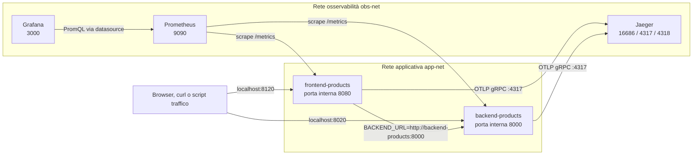
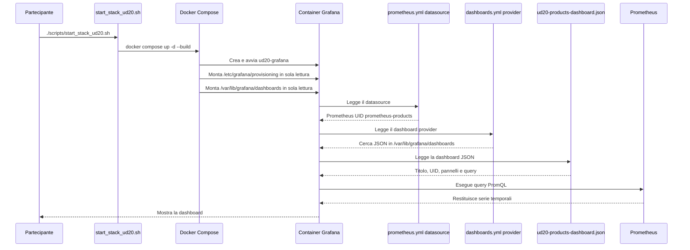
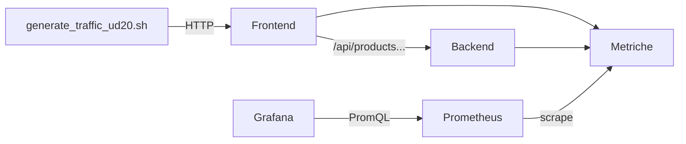

# OBS UD20 — Guida architetturale
# Come viene creata, caricata e alimentata la dashboard Grafana del Catalogo prodotti

**Versione della guida:** 5.7.2  
**Pacchetto analizzato:** `UD20_completa_partecipanti_docente_v5_7_1`  
**Applicazione:** `src/app_products_grafana`

---

## 0. Perché questa guida

Durante il Task 6 del laboratorio può sorgere una domanda corretta:

> Dove è stata creata la dashboard  
> `UD20 - Catalogo prodotti - FE/BE metrics`?  
> Quali file e quali script sono coinvolti?

La risposta non è “in un solo script”.

La dashboard nasce dalla collaborazione di più elementi:

1. il file JSON che descrive dashboard e pannelli;
2. il file YAML che configura il datasource Prometheus;
3. il file YAML che configura il provisioning delle dashboard;
4. `docker-compose.yml`, che monta i file nel container;
5. `start_stack_ud20.sh`, che avvia lo stack;
6. Prometheus, che raccoglie le metriche;
7. `generate_traffic_ud20.sh`, che produce traffico osservabile;
8. Grafana, che esegue le query PromQL e visualizza i risultati.

Questa guida ricostruisce il comportamento effettivo del pacchetto UD20 v5.7.1, usando i nomi e i percorsi reali dei file.

---

# 1. Risposta immediata

La dashboard è definita nel file:

```text
UD20/src/app_products_grafana/
└── grafana/
    └── dashboards/
        └── ud20-products-dashboard.json
```

Il suo titolo è:

```text
UD20 - Catalogo prodotti - FE/BE metrics
```

Il suo UID è:

```text
ud20-products-dashboard
```

Il file non viene eseguito come uno script. È una descrizione JSON dichiarativa che Grafana legge durante l'avvio.

Il caricamento automatico avviene grazie a:

```text
grafana/provisioning/dashboards/dashboards.yml
```

Il collegamento a Prometheus viene creato grazie a:

```text
grafana/provisioning/datasources/prometheus.yml
```

I file diventano visibili nel container Grafana tramite i mount definiti in:

```text
docker-compose.yml
```

Lo stack viene avviato da:

```text
scripts/start_stack_ud20.sh
```

---

# 2. Struttura reale dei file coinvolti

```text
UD20/
└── src/
    └── app_products_grafana/
        ├── backend/
        │   ├── Dockerfile
        │   ├── app.py
        │   └── requirements.txt
        │
        ├── frontend/
        │   ├── Dockerfile
        │   ├── app.py
        │   └── requirements.txt
        │
        ├── grafana/
        │   ├── dashboards/
        │   │   └── ud20-products-dashboard.json
        │   │
        │   └── provisioning/
        │       ├── dashboards/
        │       │   └── dashboards.yml
        │       │
        │       └── datasources/
        │           └── prometheus.yml
        │
        ├── prometheus/
        │   └── prometheus.yml
        │
        ├── scripts/
        │   ├── generate_traffic_ud20.sh
        │   ├── start_stack_ud20.sh
        │   └── stop_stack_ud20.sh
        │
        └── docker-compose.yml
```

Questi file non hanno tutti lo stesso compito.

| File | Responsabilità |
|---|---|
| `ud20-products-dashboard.json` | Definisce dashboard, pannelli e query PromQL |
| `dashboards.yml` | Dice a Grafana dove cercare i JSON |
| `prometheus.yml` di Grafana | Crea il datasource Prometheus |
| `prometheus/prometheus.yml` | Configura i target sottoposti a scrape |
| `docker-compose.yml` | Crea container, reti, porte e mount |
| `start_stack_ud20.sh` | Avvia lo stack tramite Docker Compose |
| `generate_traffic_ud20.sh` | Genera richieste HTTP normali, lente ed errate |
| `stop_stack_ud20.sh` | Rimuove container e reti dello stack |

---

# 3. Architettura runtime



## 3.1 Le due reti Docker

`docker-compose.yml` crea:

```yaml
networks:
  app-net:
    name: obs-ud20-app-net
  obs-net:
    name: obs-ud20-obs-net
```

### `app-net`

Rappresenta logicamente la comunicazione applicativa frontend-backend.

Sono collegati:

- `frontend-products`;
- `backend-products`.

### `obs-net`

Rappresenta la rete dei componenti di osservabilità.

Sono collegati:

- `frontend-products`;
- `backend-products`;
- `prometheus`;
- `grafana`;
- `jaeger`.

Prometheus deve condividere una rete con frontend e backend per raggiungere i loro endpoint `/metrics`.

Grafana deve condividere una rete con Prometheus per eseguire le query.

Frontend e backend devono condividere una rete con Jaeger per inviare le trace tramite OTLP.

---

# 4. Porte host e porte container

| Componente | Nome container | Porta host | Porta container |
|---|---|---:|---:|
| Frontend | `ud20-products-frontend` | `8120` | `8080` |
| Backend | `ud20-products-backend` | `8020` | `8000` |
| Prometheus | `ud20-prometheus` | `9090` | `9090` |
| Grafana | `ud20-grafana` | `3000` | `3000` |
| Jaeger UI | `ud20-jaeger` | `16686` | `16686` |
| Jaeger OTLP gRPC | `ud20-jaeger` | `4317` | `4317` |
| Jaeger OTLP HTTP | `ud20-jaeger` | `4318` | `4318` |

Dal computer host usiamo:

```text
http://localhost:8120
http://localhost:8020
http://localhost:9090
http://localhost:3000
http://localhost:16686
```

Tra container si usano invece i nomi dei servizi Docker:

```text
http://backend-products:8000
http://prometheus:9090
http://jaeger:4317
```

---

# 5. La catena completa di provisioning Grafana



Il provisioning è quindi un processo eseguito da Grafana durante l'avvio.

Lo script `start_stack_ud20.sh` non contiene i pannelli e non genera il JSON: avvia il container che leggerà i file.

---

# 6. Il ruolo esatto di `docker-compose.yml`

La sezione Grafana è:

```yaml
grafana:
  image: grafana/grafana:11.3.0
  container_name: ud20-grafana
  environment:
    GF_SECURITY_ADMIN_USER: admin
    GF_SECURITY_ADMIN_PASSWORD: admin
    GF_USERS_ALLOW_SIGN_UP: "false"
  volumes:
    - ./grafana/provisioning:/etc/grafana/provisioning:ro
    - ./grafana/dashboards:/var/lib/grafana/dashboards:ro
  ports:
    - "3000:3000"
  networks:
    - obs-net
  depends_on:
    - prometheus
```

## 6.1 Primo mount

```yaml
- ./grafana/provisioning:/etc/grafana/provisioning:ro
```

Significa:

```text
Directory host:
./grafana/provisioning
```

montata nel container come:

```text
/etc/grafana/provisioning
```

Il suffisso:

```text
:ro
```

significa **read-only**, cioè sola lettura.

Grafana può leggere i file, ma non può modificarli.

---

## 6.2 Secondo mount

```yaml
- ./grafana/dashboards:/var/lib/grafana/dashboards:ro
```

Significa:

```text
Directory host:
./grafana/dashboards
```

montata nel container come:

```text
/var/lib/grafana/dashboards
```

Anche questo mount è in sola lettura.

Il JSON della dashboard rimane quindi un artefatto controllato dal progetto, non dall'interfaccia Grafana.

---

## 6.3 `depends_on`

```yaml
depends_on:
  - prometheus
```

Docker Compose avvia Prometheus prima di Grafana.

Attenzione: `depends_on` controlla l'ordine di avvio, ma non garantisce che Prometheus sia già completamente pronto a rispondere. Nei primi secondi Grafana potrebbe quindi richiedere un aggiornamento della pagina o un nuovo `Save & test`.

---

# 7. Il datasource Prometheus

Il file reale è:

```text
grafana/provisioning/datasources/prometheus.yml
```

Contenuto:

```yaml
apiVersion: 1

datasources:
  - name: Prometheus
    uid: prometheus-products
    type: prometheus
    access: proxy
    url: http://prometheus:9090
    isDefault: true
    editable: true
```

## 7.1 Significato dei campi

| Campo | Valore | Significato |
|---|---|---|
| `name` | `Prometheus` | Nome visibile nella UI |
| `uid` | `prometheus-products` | Identificatore stabile usato dai pannelli |
| `type` | `prometheus` | Tipo di datasource |
| `access` | `proxy` | Le query vengono eseguite dal backend Grafana |
| `url` | `http://prometheus:9090` | URL interno Docker |
| `isDefault` | `true` | Datasource predefinito |
| `editable` | `true` | Modificabile dalla UI |

## 7.2 Perché non usa `localhost`

Dal container Grafana:

```text
localhost
```

indica il container Grafana stesso.

Per raggiungere Prometheus viene usato il nome del servizio Docker:

```text
prometheus
```

Per questo l'URL corretto è:

```text
http://prometheus:9090
```

---

# 8. Il dashboard provider

Il file reale è:

```text
grafana/provisioning/dashboards/dashboards.yml
```

Contenuto:

```yaml
apiVersion: 1

providers:
  - name: "Products Observability"
    orgId: 1
    folder: "Academy Observability"
    type: file
    disableDeletion: false
    editable: true
    options:
      path: /var/lib/grafana/dashboards
```

## 8.1 Significato dei campi

| Campo | Valore | Significato |
|---|---|---|
| `name` | `Products Observability` | Nome interno del provider |
| `orgId` | `1` | Organizzazione Grafana destinataria |
| `folder` | `Academy Observability` | Cartella mostrata nella UI |
| `type` | `file` | Le dashboard provengono da file |
| `disableDeletion` | `false` | La UI non impedisce in modo assoluto l'eliminazione |
| `editable` | `true` | La dashboard può essere modificata dalla UI |
| `options.path` | `/var/lib/grafana/dashboards` | Directory dei JSON nel container |

Il percorso:

```text
/var/lib/grafana/dashboards
```

corrisponde esattamente alla destinazione del secondo mount Docker.

---

# 9. Il file JSON della dashboard

Il file reale è:

```text
grafana/dashboards/ud20-products-dashboard.json
```

Contiene:

```text
Titolo:        UD20 - Catalogo prodotti - FE/BE metrics
UID:           ud20-products-dashboard
Refresh:       10 secondi
Time range:    ultimi 15 minuti
Schema:        39
Pannelli:      6
Editable:      true
```

Tutti i pannelli fanno riferimento al datasource mediante:

```json
{
  "type": "prometheus",
  "uid": "prometheus-products"
}
```

L'UID deve coincidere con quello dichiarato in:

```text
grafana/provisioning/datasources/prometheus.yml
```

Se gli UID non coincidessero, i pannelli non troverebbero il datasource corretto.

---

# 10. I sei pannelli reali

## 10.1 Target UP frontend/backend

Query:

```promql
up{job=~"products-.*"}
```

Domanda operativa:

> Prometheus riesce a eseguire lo scrape dei target frontend e backend?

Valori:

```text
1 = target raggiungibile
0 = target non raggiungibile
```

---

## 10.2 Request rate per path

Query presente nel pacchetto:

```promql
sum by (service,path,status) (
  rate(
    app_http_requests_total{
      path=~"/|/products.*|/ready"
    }[1m]
  )
)
```

Domanda operativa:

> Quante richieste al secondo vengono osservate, separate per servizio, path e status?

La funzione `rate(...[1m])` stima l'incremento medio al secondo del contatore nell'ultimo minuto.

---

## 10.3 Error rate 5xx

Query:

```promql
sum by (service,path,status) (
  rate(
    app_http_requests_total{
      status=~"5.."
    }[1m]
  )
)
```

Domanda operativa:

> Quali servizi e quali path stanno producendo risposte HTTP 5xx?

Il filtro:

```promql
status=~"5.."
```

seleziona codici come:

```text
500
502
503
```

---

## 10.4 Latency p95 products

Query presente nel pacchetto:

```promql
histogram_quantile(
  0.95,
  sum by (le, service, path) (
    rate(
      app_http_request_duration_seconds_bucket{
        path=~"/|/products.*"
      }[5m]
    )
  )
)
```

Domanda operativa:

> Entro quale durata termina approssimativamente il 95% delle richieste?

La label:

```text
le
```

significa **less than or equal**, cioè “minore o uguale”.

Ogni bucket dell'istogramma conta quante osservazioni hanno durata minore o uguale al proprio limite.

`histogram_quantile(0.95, ...)` stima il percentile 95 utilizzando questi bucket.

---

## 10.5 Average latency seconds

Query presente nel pacchetto:

```promql
sum by (service,path) (
  rate(
    app_http_request_duration_seconds_sum{
      path=~"/|/products.*"
    }[5m]
  )
)
/
sum by (service,path) (
  rate(
    app_http_request_duration_seconds_count{
      path=~"/|/products.*"
    }[5m]
  )
)
```

Formula:

```text
durata complessiva delle richieste
──────────────────────────────────
numero complessivo delle richieste
```

Il risultato è la latenza media in secondi.

---

## 10.6 Total requests by service/path/status

Query:

```promql
sum by (service,path,status) (
  app_http_requests_total
)
```

Il pannello è di tipo:

```text
table
```

Mostra il numero cumulativo delle richieste osservate.

A differenza di `rate()`, il contatore totale non rappresenta richieste al secondo: cresce nel tempo finché il processo applicativo resta attivo.

---

# 11. Da dove provengono le metriche

Frontend e backend dichiarano le stesse famiglie di metriche.

## 11.1 Counter

```python
REQUEST_COUNT = Counter(
    "app_http_requests_total",
    "Numero totale di richieste HTTP osservate dall'applicazione",
    ["service", "method", "path", "status"],
)
```

Label:

```text
service
method
path
status
```

Esempio concettuale:

```text
app_http_requests_total{
  service="products-frontend",
  method="GET",
  path="/products",
  status="200"
}
```

---

## 11.2 Histogram

```python
REQUEST_LATENCY = Histogram(
    "app_http_request_duration_seconds",
    "Durata delle richieste HTTP in secondi",
    ["service", "method", "path"],
)
```

Label:

```text
service
method
path
```

L'istogramma genera automaticamente:

```text
app_http_request_duration_seconds_bucket
app_http_request_duration_seconds_sum
app_http_request_duration_seconds_count
```

La metrica `_bucket` aggiunge anche la label:

```text
le
```

L'istogramma non possiede invece la label:

```text
status
```

---

## 11.3 Endpoint `/metrics`

Frontend:

```text
http://frontend-products:8080/metrics
```

Backend:

```text
http://backend-products:8000/metrics
```

Dal computer host:

```text
http://localhost:8120/metrics
http://localhost:8020/metrics
```

Il codice esclude `/metrics` dai log JSON applicativi, ma registra comunque le metriche della richiesta `/metrics`.

---

# 12. Configurazione Prometheus

Il file reale è:

```text
prometheus/prometheus.yml
```

Configurazione:

```yaml
global:
  scrape_interval: 10s
  evaluation_interval: 10s

scrape_configs:
  - job_name: "products-backend"
    metrics_path: /metrics
    static_configs:
      - targets: ["backend-products:8000"]

  - job_name: "products-frontend"
    metrics_path: /metrics
    static_configs:
      - targets: ["frontend-products:8080"]

  - job_name: "prometheus"
    static_configs:
      - targets: ["localhost:9090"]
```

Ogni 10 secondi Prometheus interroga:

```text
backend-products:8000/metrics
frontend-products:8080/metrics
localhost:9090/metrics
```

Il target `localhost:9090` è corretto in questo file perché la configurazione viene eseguita all'interno del container Prometheus: qui `localhost` indica Prometheus stesso.

Questa è una situazione diversa da Grafana:

| Componente che esegue la richiesta | Destinazione | URL corretto |
|---|---|---|
| Grafana | Prometheus | `http://prometheus:9090` |
| Prometheus | Prometheus stesso | `localhost:9090` |
| Prometheus | Backend | `backend-products:8000` |
| Prometheus | Frontend | `frontend-products:8080` |

---

# 13. Il ruolo degli script

# 13.1 `start_stack_ud20.sh`

Contenuto operativo essenziale:

```bash
cd "$(dirname "$0")/.."

docker compose up -d --build
docker compose ps
```

Ruoli:

- si sposta nella directory che contiene `docker-compose.yml`;
- costruisce frontend e backend;
- crea reti e container;
- avvia Jaeger, applicazioni, Prometheus e Grafana;
- mostra lo stato dei container;
- stampa gli URL;
- indica il nome della dashboard da cercare.

Non crea il JSON e non costruisce direttamente i pannelli.

La dashboard appare perché il container Grafana, una volta avviato, esegue il provisioning.

---

# 13.2 `generate_traffic_ud20.sh`

Valori predefiniti:

```bash
FRONTEND_URL=http://localhost:8120
ROUNDS=60
SLEEP_SECONDS=0.25
```

A ogni round chiama:

```text
/
```

e:

```text
/products
```

Ogni 4 round chiama:

```text
/ready
```

Ogni 5 round chiama:

```text
/products/slow
```

Ogni 8 round chiama:

```text
/products/error
```

Schema:



Lo script non crea dashboard e non invia dati direttamente a Grafana.

Genera il comportamento applicativo che produce metriche.

---

# 13.3 `stop_stack_ud20.sh`

Contenuto operativo:

```bash
cd "$(dirname "$0")/.."

docker compose down
```

Il comando:

```bash
docker compose down
```

rimuove:

- container;
- rete predefinita del progetto;
- reti create da Compose quando applicabile.

Nel pacchetto v5.7.1 non è definito alcun volume persistente per:

```text
/var/lib/grafana
```

Di conseguenza, il database interno del container Grafana non è conservato quando il container viene rimosso.

---

# 14. Dashboard provisionata e dashboard manuale

Questa distinzione è essenziale nel Task 9.

## 14.1 Dashboard provisionata

```text
UD20 - Catalogo prodotti - FE/BE metrics
```

Origine:

```text
grafana/dashboards/ud20-products-dashboard.json
```

Caratteristiche:

- è presente nel repository;
- viene montata in sola lettura;
- viene caricata automaticamente;
- può essere ricreata dopo `docker compose down`;
- è ripetibile per tutti i partecipanti;
- è versionabile con Git.

---

## 14.2 Dashboard creata manualmente

```text
UD20 - Catalogo prodotti - esercizio partecipante
```

Origine:

```text
interfaccia Grafana
```

Grafana la salva nel proprio database interno, normalmente:

```text
/var/lib/grafana/grafana.db
```

Nel `docker-compose.yml` della UD20 v5.7.1 non esiste un volume come:

```yaml
grafana-data:/var/lib/grafana
```

Pertanto:

```text
docker compose restart
```

mantiene il container e normalmente conserva la dashboard manuale.

Ma:

```text
docker compose down
```

rimuove il container e con esso il database interno non persistente.

Al successivo:

```text
docker compose up
```

la dashboard provisionata ricompare dal JSON, mentre la dashboard creata solo dalla UI può non ricomparire.

## 14.3 Come rendere persistenti le dashboard manuali

Possibile modifica a `docker-compose.yml`:

```yaml
services:
  grafana:
    volumes:
      - grafana-data:/var/lib/grafana
      - ./grafana/provisioning:/etc/grafana/provisioning:ro
      - ./grafana/dashboards:/var/lib/grafana/dashboards:ro

volumes:
  grafana-data:
```

Con questa configurazione il database Grafana viene memorizzato nel volume nominato:

```text
grafana-data
```

Attenzione:

```bash
docker compose down -v
```

rimuoverebbe anche il volume.

Un'altra strategia è esportare la dashboard manuale in JSON e inserirla nel progetto.

---

# 15. Cosa significano i log del Task 6

Messaggio:

```text
inserting datasource from configuration
name=Prometheus
uid=prometheus-products
```

Significato:

> Grafana ha letto `grafana/provisioning/datasources/prometheus.yml` e ha creato il datasource.

Messaggi:

```text
starting to provision dashboards
finished to provision dashboards
```

Significato:

> Grafana ha letto il dashboard provider e ha completato la scansione dei file JSON.

Messaggi relativi a:

```text
provisioning/plugins
provisioning/alerting
```

non indicano un errore della dashboard UD20, perché il pacchetto non provisiona plugin aggiuntivi o regole di alerting Grafana.

Errori di risoluzione verso:

```text
grafana.com
```

riguardano aggiornamenti o plugin online e non impediscono necessariamente l'uso locale della dashboard e del datasource Prometheus.

---

# 16. Verifiche pratiche

## 16.1 Trovare la dashboard nel progetto

```bash
cd UD20/src/app_products_grafana

grep -Rni \
  "UD20 - Catalogo prodotti - FE/BE metrics" \
  .
```

Risultato atteso:

```text
./grafana/dashboards/ud20-products-dashboard.json
```

---

## 16.2 Vedere i mount reali

```bash
docker inspect ud20-grafana \
  --format '{{range .Mounts}}{{println .Source "->" .Destination}}{{end}}'
```

Risultato concettuale:

```text
.../grafana/provisioning -> /etc/grafana/provisioning
.../grafana/dashboards   -> /var/lib/grafana/dashboards
```

---

## 16.3 Vedere i file dal container

```bash
docker exec ud20-grafana \
  find \
    /etc/grafana/provisioning \
    /var/lib/grafana/dashboards \
    -maxdepth 5 \
    -type f \
    -print
```

---

## 16.4 Verificare la dashboard tramite API Grafana

```bash
curl -s -u admin:admin \
  "http://localhost:3000/api/search?query=UD20"
```

Con `jq`:

```bash
curl -s -u admin:admin \
  "http://localhost:3000/api/search?query=UD20" | jq
```

---

## 16.5 Verificare il provisioning nei log

```bash
docker logs ud20-grafana 2>&1 \
  | grep -Ei "provision|dashboard|datasource"
```

---

## 16.6 Verificare i target Prometheus

Aprire:

```text
http://localhost:9090/targets
```

Oppure eseguire:

```promql
up{job=~"products-.*"}
```

---

# 17. Diagnosi di una dashboard vuota

Seguire l'ordine della catena, senza partire immediatamente da Grafana.

```text
1. Applicazione raggiungibile?
2. Endpoint /metrics raggiungibile?
3. Target Prometheus UP?
4. Metrica presente in Prometheus?
5. Query PromQL corretta?
6. Datasource Grafana funzionante?
7. Time range corretto?
8. Pannello correttamente configurato?
```

## 17.1 Applicazioni

```bash
curl -i http://localhost:8120/health
curl -i http://localhost:8020/health
```

## 17.2 Metriche

```bash
curl -s http://localhost:8120/metrics \
  | grep app_http_requests_total

curl -s http://localhost:8020/metrics \
  | grep app_http_requests_total
```

## 17.3 Prometheus

```promql
app_http_requests_total
```

## 17.4 Grafana

Verificare:

```text
Connections → Data sources → Prometheus → Save & test
```

## 17.5 Intervallo temporale

La dashboard usa per impostazione iniziale:

```text
now-15m → now
```

e aggiorna i pannelli ogni:

```text
10s
```

---

# 18. Nota tecnica sul pacchetto v5.7.1

L'analisi del pacchetto evidenzia alcune incoerenze che è utile conoscere prima della distribuzione definitiva.

## 18.1 I filtri di alcuni pannelli non includono i path backend

Frontend:

```text
/
/products
/products/slow
/products/error
/ready
```

Backend:

```text
/api/products
/api/products/slow
/api/products/error
/health
```

Le query dei pannelli Request rate, p95 e latenza media usano:

```promql
path=~"/|/products.*|/ready"
```

oppure:

```promql
path=~"/|/products.*"
```

Questi filtri includono i path frontend, ma non:

```text
/api/products
/api/products/slow
/api/products/error
```

Di conseguenza, tali pannelli possono mostrare soprattutto il frontend nonostante il titolo della dashboard richiami FE e BE.

Filtro più completo:

```promql
path=~"/|/products.*|/api/products.*|/ready"
```

Per i soli endpoint prodotti:

```promql
path=~"/|/products.*|/api/products.*"
```

---

## 18.2 Alcune legende fanno riferimento a label non presenti

Il pannello `Target UP frontend/backend` usa:

```text
{{service}} {{path}} {{status}}
```

Ma la metrica standard:

```promql
up
```

possiede normalmente label come:

```text
job
instance
```

Legenda più corretta:

```text
{{job}} - {{instance}}
```

I pannelli di latenza usano una legenda che include:

```text
{{status}}
```

ma l'istogramma è dichiarato con:

```text
service
method
path
```

e i bucket aggiungono:

```text
le
```

Non esiste la label `status` nelle metriche di durata.

Legenda più corretta:

```text
{{service}} {{path}}
```

---

## 18.3 La dashboard manuale non è persistente dopo `down`

Il Task 9 chiede di salvare:

```text
UD20 - Catalogo prodotti - esercizio partecipante
```

Il cleanup usa:

```bash
docker compose down
```

Senza un volume per `/var/lib/grafana`, la dashboard manuale può essere persa.

Per conservare l'evidenza si può:

- aggiungere un volume persistente;
- esportare il JSON prima del cleanup;
- usare uno screenshot come evidenza;
- evitare `down` finché la valutazione non è terminata.

---

# 19. Query corrette consigliate per una vista realmente FE/BE

## 19.1 Request rate FE/BE

```promql
sum by (service, path, status) (
  rate(
    app_http_requests_total{
      path=~"/|/products.*|/api/products.*|/ready"
    }[1m]
  )
)
```

## 19.2 Error rate 5xx

La query esistente è già trasversale a frontend e backend:

```promql
sum by (service, path, status) (
  rate(
    app_http_requests_total{
      status=~"5.."
    }[1m]
  )
)
```

## 19.3 Latency p95 FE/BE

```promql
histogram_quantile(
  0.95,
  sum by (le, service, path) (
    rate(
      app_http_request_duration_seconds_bucket{
        path=~"/|/products.*|/api/products.*"
      }[5m]
    )
  )
)
```

Legenda:

```text
{{service}} {{path}}
```

## 19.4 Average latency FE/BE

```promql
sum by (service, path) (
  rate(
    app_http_request_duration_seconds_sum{
      path=~"/|/products.*|/api/products.*"
    }[5m]
  )
)
/
sum by (service, path) (
  rate(
    app_http_request_duration_seconds_count{
      path=~"/|/products.*|/api/products.*"
    }[5m]
  )
)
```

Legenda:

```text
{{service}} {{path}}
```

---

# 20. Domande tipiche dei partecipanti

## La dashboard viene creata da `start_stack_ud20.sh`?

Non direttamente.

Lo script avvia Docker Compose. È Grafana che legge il provisioning e importa il file JSON.

---

## `generate_traffic_ud20.sh` crea i grafici?

No.

Genera richieste HTTP. Le applicazioni aggiornano le metriche, Prometheus le raccoglie e Grafana le visualizza.

---

## Prometheus crea la dashboard?

No.

Prometheus raccoglie e conserva serie temporali. Grafana crea la visualizzazione.

---

## Il JSON contiene anche i valori delle metriche?

No.

Contiene query, layout e configurazione grafica. I dati arrivano da Prometheus.

---

## Perché la dashboard compare già al primo accesso?

Perché il provisioning viene eseguito automaticamente all'avvio di Grafana.

---

## Perché la dashboard si trova nella cartella `Academy Observability`?

Perché il file:

```text
grafana/provisioning/dashboards/dashboards.yml
```

contiene:

```yaml
folder: "Academy Observability"
```

---

## Perché il datasource ha UID `prometheus-products`?

Per fornire un riferimento stabile che il JSON della dashboard può utilizzare.

Il nome visibile può cambiare, ma l'UID consente ai pannelli di identificare il datasource.

---

## Posso modificare la dashboard dalla UI?

Il provider e il JSON dichiarano:

```text
editable: true
```

Quindi Grafana consente la modifica.

Tuttavia il file sorgente è montato in sola lettura e le modifiche UI vengono salvate nel database interno, non nel JSON del progetto.

---

## Perché una dashboard manuale può scomparire dopo il cleanup?

Perché `docker compose down` rimuove il container e nel pacchetto non è presente un volume persistente per `/var/lib/grafana`.

---

# 21. Mini-attività di ricostruzione architetturale

## Passo 1 — Individuare il JSON

```bash
grep -Rni \
  "ud20-products-dashboard" \
  grafana
```

## Passo 2 — Individuare il provider

```bash
cat grafana/provisioning/dashboards/dashboards.yml
```

## Passo 3 — Individuare il datasource

```bash
cat grafana/provisioning/datasources/prometheus.yml
```

## Passo 4 — Collegare mount host e container

```bash
grep -n -A20 "grafana:" docker-compose.yml
```

## Passo 5 — Verificare dal container

```bash
docker exec ud20-grafana \
  ls -R \
  /etc/grafana/provisioning \
  /var/lib/grafana/dashboards
```

## Passo 6 — Verificare i log

```bash
docker logs ud20-grafana 2>&1 \
  | grep -Ei "provision|dashboard|datasource"
```

## Passo 7 — Verificare l'API

```bash
curl -s -u admin:admin \
  "http://localhost:3000/api/search?query=UD20"
```

---

# 22. Risposta finale attesa

> La dashboard UD20 è definita nel file `grafana/dashboards/ud20-products-dashboard.json`. Lo script `start_stack_ud20.sh` esegue `docker compose up -d --build`; Docker Compose monta la directory di provisioning in `/etc/grafana/provisioning` e il JSON in `/var/lib/grafana/dashboards`, entrambi in sola lettura. Grafana legge `prometheus.yml`, crea il datasource con UID `prometheus-products`, legge `dashboards.yml`, individua il JSON e carica la dashboard nella cartella `Academy Observability`. Lo script `generate_traffic_ud20.sh` non crea la dashboard: genera richieste che aggiornano le metriche di frontend e backend. Prometheus raccoglie tali metriche ogni 10 secondi e Grafana le interroga con PromQL. Le dashboard create manualmente vengono invece salvate nel database interno di Grafana e, nella configurazione v5.7.1, possono essere perse dopo `docker compose down` perché non esiste un volume persistente per `/var/lib/grafana`.

---

# 23. Mappa mentale conclusiva

```text
DEFINIZIONE DELLA DASHBOARD
grafana/dashboards/ud20-products-dashboard.json
                    │
                    ▼
PROVIDER
grafana/provisioning/dashboards/dashboards.yml
                    │
                    ▼
DATASOURCE
grafana/provisioning/datasources/prometheus.yml
                    │
                    ▼
MOUNT E CONTAINER
docker-compose.yml
                    │
                    ▼
AVVIO
scripts/start_stack_ud20.sh
                    │
                    ▼
RACCOLTA
prometheus/prometheus.yml
                    │
                    ▼
TRAFFICO
scripts/generate_traffic_ud20.sh
                    │
                    ▼
VISUALIZZAZIONE
Grafana → Academy Observability → dashboard UD20
```
