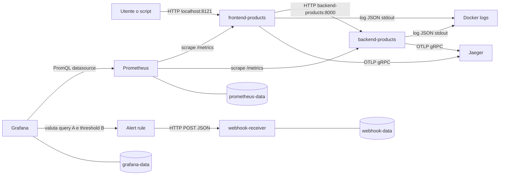
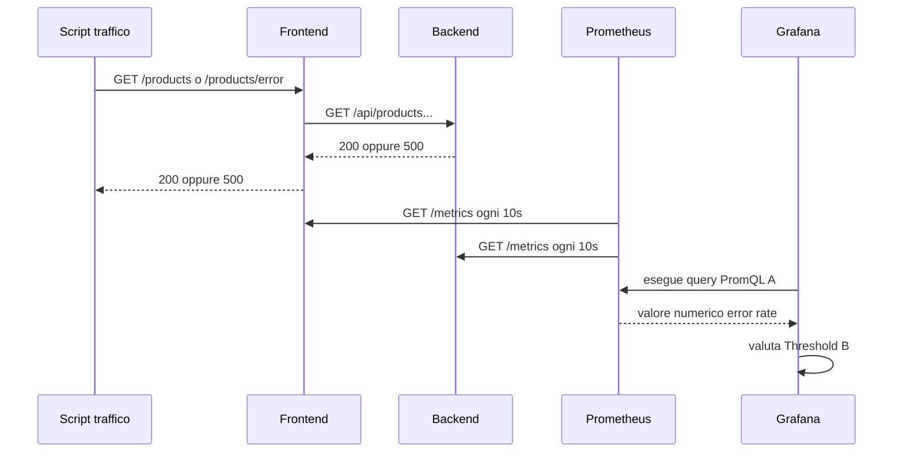
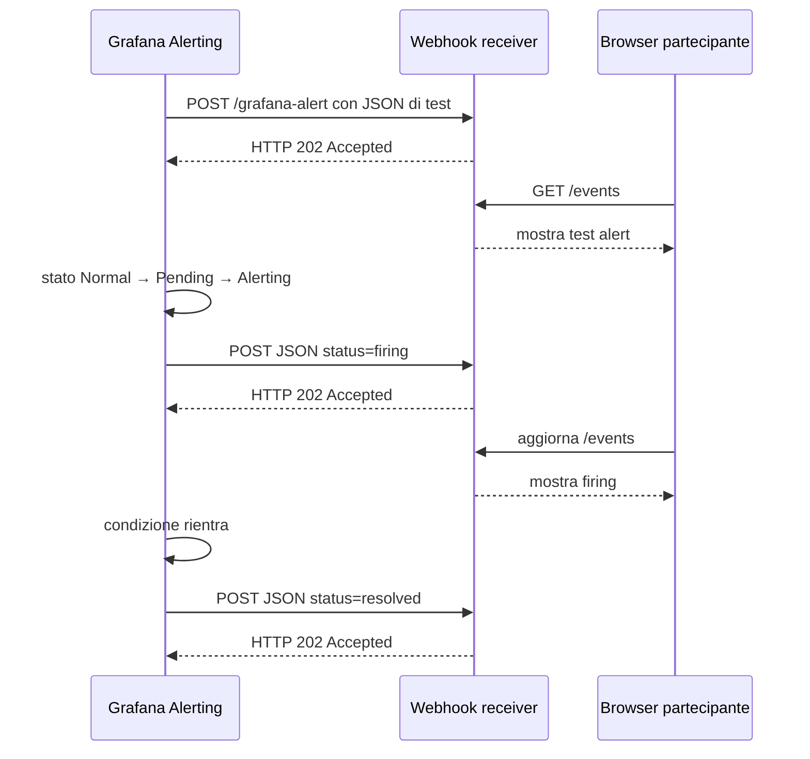

# OBS UD21 — Guida architetturale
# Alerting Grafana, webhook locale, reti e volumi Docker

## 0. Obiettivo architetturale

Questa guida descrive il percorso completo del segnale, non solo i clic nella GUI. Distingue quattro piani:

1. piano applicativo;
2. piano di raccolta e valutazione;
3. piano di notifica;
4. piano di persistenza.

---

## 1. Vista complessiva



---

## 2. Componenti e responsabilità

| Servizio Docker Compose | Porta host | Rete | Responsabilità |
|---|---:|---|---|
| `frontend-products` | 8121 | `app-net`, `obs-net` | punto di ingresso utente e metrica user-facing |
| `backend-products` | 8021 | `app-net`, `obs-net` | catalogo e simulazioni controllate |
| `prometheus` | 9090 | `obs-net` | scrape, query e TSDB |
| `grafana` | 3000 | `obs-net` | dashboard, regole e notifiche |
| `webhook-receiver` | 5001 | `obs-net` | ricezione e visualizzazione dei payload |
| `jaeger` | 16686 | `obs-net` | ricerca delle trace |

Il frontend e il backend condividono `app-net` perché rappresentano il percorso applicativo. Tutti i componenti osservabili usano `obs-net`.

---

## 3. Hostname Docker e `localhost`

La stessa applicazione è raggiunta con nomi diversi a seconda del punto di origine.

### Dal computer host

```text
Grafana          http://localhost:3000
Webhook UI       http://localhost:5001/events
Frontend         http://localhost:8121
```

### Da un container sulla rete `obs-net`

```text
Prometheus       http://prometheus:9090
Webhook receiver http://webhook-receiver:5001
```

Per questo il contact point Grafana deve usare:

```text
http://webhook-receiver:5001/grafana-alert
```

Non deve usare `localhost:5001`, perché dentro il container Grafana `localhost` indica Grafana stesso.

---

## 4. Flusso della metrica



Le metriche principali sono:

```text
app_http_requests_total
app_http_request_duration_seconds_bucket
app_http_request_duration_seconds_sum
app_http_request_duration_seconds_count
```

Label principali:

```text
service, method, path, status
```

---

## 5. Perché l'alert principale osserva il frontend

La stessa richiesta produce metriche sia nel frontend sia nel backend. Aggregare indiscriminatamente entrambi può contare due volte il percorso.

L'alert principale usa:

```promql
service="products-frontend"
```

per misurare l'esito che arriva all'utente. In diagnosi confrontiamo poi:

```text
frontend /products/error = 500
backend /api/products/error = 500
```

Questa distinzione introduce un principio importante: **il segnale di servizio deve avere un punto di vista esplicito**.

---

## 6. Flusso della notifica webhook



Il receiver non decide se l'alert è corretto. Accetta e registra ciò che Grafana invia.

---

## 7. Persistenza: bind mount e named volume

Nel compose sono usati due meccanismi diversi.

### Bind mount di file versionati

```yaml
- ./prometheus/prometheus.yml:/etc/prometheus/prometheus.yml:ro
- ./grafana/provisioning:/etc/grafana/provisioning:ro
- ./grafana/dashboards:/var/lib/grafana/dashboards:ro
```

Questi file appartengono al progetto e devono essere leggibili nel repository. Il suffisso `:ro` impedisce modifiche dal container.

### Named volume di dati runtime

```yaml
- grafana-data:/var/lib/grafana
- prometheus-data:/prometheus
- webhook-data:/data
```

Questi dati vengono creati durante l'esecuzione e non devono essere versionati in Git.

---

## 8. Che cosa conserva ogni volume

### `obs-ud21-grafana-data`

Contiene il database interno di Grafana e quindi, tra l'altro:

- alert rule create dalla GUI;
- contact point;
- evaluation group e folder;
- configurazioni utente;
- metadati delle dashboard.

Il dashboard JSON della UD resta comunque provisioned da bind mount. Questo mostra la differenza tra configurazione **as code** e configurazione **creata a runtime**.

### `obs-ud21-prometheus-data`

Contiene la TSDB locale. La retention è limitata a due giorni per evitare crescita inutile nel laboratorio.

### `obs-ud21-webhook-data`

Contiene `events.jsonl`, una riga JSON per ogni notifica ricevuta. Il receiver ricostruisce la pagina `/events` leggendo questo file.

---

## 9. Cosa succede ai dati con i comandi Docker

| Comando | Container | Reti Compose | Volumi |
|---|---|---|---|
| `docker compose stop` | fermati | conservate | conservati |
| `docker compose down` | rimossi | rimosse | conservati |
| `docker compose down -v` | rimossi | rimosse | **eliminati** |
| `docker compose up -d` | creati/avviati | create | riutilizzati |

La UD usa `docker compose down` nello script di stop e riserva `down -v` allo script di reset protetto.

---

## 10. Perché Jaeger non ha un volume in questa UD

Jaeger all-in-one usa storage in memoria nella configurazione corrente. Le trace scompaiono quando il container viene ricreato.

La scelta è esplicita:

- l'obiettivo della UD21 è la persistenza dell'alerting e delle metriche;
- le trace servono come supporto diagnostico temporaneo;
- la persistenza Jaeger richiederebbe un backend dedicato o una configurazione locale aggiuntiva.

Questa limitazione deve essere dichiarata, non lasciata implicita.

---

## 11. Punti di guasto e strumenti di verifica

| Sintomo | Verifica iniziale |
|---|---|
| Grafana non vede Prometheus | datasource e `http://prometheus:9090` |
| webhook test fallisce | URL interna e log `ud21-webhook-receiver` |
| regola sparita dopo `down` | verificare mount `/var/lib/grafana` e volume |
| cronologia Prometheus vuota | verificare mount `/prometheus` |
| eventi webhook spariti | verificare `webhook-data` e uso accidentale di `down -v` |
| Jaeger vuoto dopo restart | comportamento atteso: storage in memoria |

Comandi:

```bash
docker compose ps
docker volume ls --filter name=obs-ud21
docker logs ud21-grafana --tail 100
docker logs ud21-webhook-receiver --tail 100
docker logs ud21-prometheus --tail 100
```

---

## 12. Architettura logica della regola

```text
A — PromQL Instant
    error rate user-facing del frontend
            ↓
B — Threshold
    A IS ABOVE 0.20
            ↓
Alert condition = B
            ↓
Evaluation group = ud21-every-30s
Pending period = 1m
            ↓
Contact point = UD21 - Webhook locale
            ↓
POST http://webhook-receiver:5001/grafana-alert
```

Questa è la configurazione che il partecipante deve saper ricostruire e spiegare.
