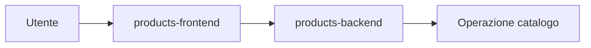
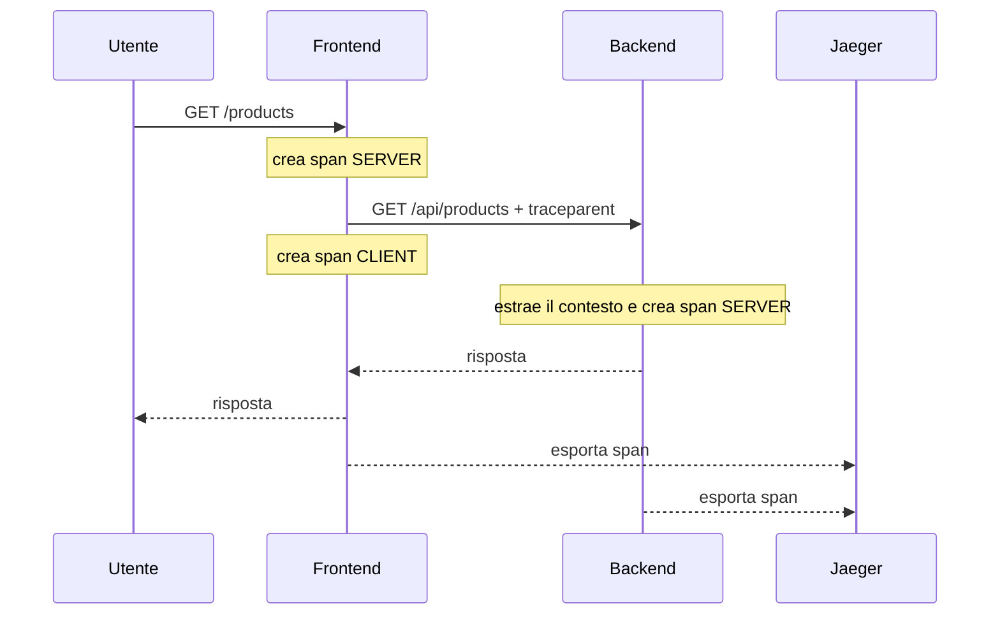

# OBS UD22 — Concetti
# Tracing distribuito e Jaeger

## 1. Dal sintomo alla singola richiesta

Metriche e dashboard descrivono il comportamento complessivo di un sistema. Possono mostrarci, per esempio, che il tasso di errori è aumentato o che il percentile p95 della latenza ha superato una soglia. Questa informazione è fondamentale, ma è aggregata: riassume molte richieste.

Il tracing distribuito affronta una domanda diversa:

> Che cosa è accaduto lungo il percorso di una specifica richiesta?

Nel Catalogo prodotti una richiesta attraversa almeno due servizi:



Se la risposta è lenta, la sola durata totale non ci dice dove il tempo è stato consumato. Una trace rende visibile la sequenza delle operazioni e la loro durata relativa.

## 2. Trace e span

Una **trace** rappresenta l'intera storia di una richiesta distribuita. Uno **span** rappresenta una singola operazione delimitata nel tempo.

Nel laboratorio la gerarchia attesa è:

```text
GET /products                         span SERVER del frontend
└── GET backend-products/api/products span CLIENT del frontend
    └── GET /api/products             span SERVER del backend
        └── catalog.load_products     span INTERNAL del backend
```

Ogni span possiede almeno:

- un nome;
- un tempo di inizio e fine;
- una durata;
- un `span_id`;
- un `trace_id` comune agli span della stessa trace;
- attributi, per esempio metodo HTTP, route, status e servizio;
- uno stato, per esempio `UNSET` oppure `ERROR`.

La struttura padre-figlio esprime causalità. Il backend non compare come evento indipendente: è stato chiamato dal frontend all'interno della stessa richiesta.

## 3. Trace ID, span ID e request ID

| Identificatore | Significato | Utilizzo prevalente |
|---|---|---|
| `trace_id` | identifica l'intera trace | ricerca e correlazione in Jaeger |
| `span_id` | identifica una singola operazione | lettura della gerarchia e dei log |
| `request_id` | identificatore applicativo propagato con `X-Request-Id` | ricerca leggibile nei log |

Il `trace_id` è lo stesso per frontend e backend. Lo `span_id` cambia a ogni operazione. Il `request_id` è controllabile dall'applicazione e ci consente di generare richieste facilmente riconoscibili.

## 4. Propagazione del contesto

Affinché gli span appartengano alla stessa trace, il contesto deve attraversare la chiamata HTTP.



OpenTelemetry gestisce la propagazione tramite il formato W3C Trace Context. Nel codice del laboratorio le strumentazioni Flask e `requests` creano automaticamente gli span HTTP e propagano il contesto. Gli span applicativi interni rimangono espliciti, perché rappresentano operazioni di dominio che HTTP non può conoscere.

## 5. Come leggere una timeline

La durata della trace coincide approssimativamente con la durata osservata dall'utente. Gli span figli occupano porzioni di quella finestra temporale.

Non dobbiamo sommare ingenuamente tutte le durate: alcuni span sono annidati. Un client span, per esempio, include il tempo durante il quale il backend elabora la richiesta.

Per individuare il punto dominante osserviamo:

1. quale ramo occupa la parte maggiore della timeline;
2. quale span contiene l'attesa principale;
3. quali operazioni sono annidate;
4. se esistono intervalli non spiegati da span figli;
5. quale servizio possiede lo span.

## 6. Stato e attributi di errore

Un codice HTTP `500` è un'evidenza applicativa. In una trace vogliamo anche che gli span interessati risultino in stato `ERROR`. Questo permette di distinguere visivamente i percorsi falliti e di leggere gli attributi collegati.

Nel laboratorio l'errore nasce nel backend:

```text
frontend SERVER: riceve e restituisce 500
frontend CLIENT: osserva 500 dal backend
backend SERVER: restituisce 500
catalog.load_products.error: rappresenta l'errore di business simulato
```

La diagnosi non si limita a constatare “c'è un errore”: deve indicare in quale servizio e in quale operazione nasce.

## 7. Architettura essenziale di Jaeger

Jaeger all-in-one riunisce in un unico container le funzioni necessarie al laboratorio:

```text
Collector  riceve gli span OTLP
Storage    conserva e indicizza le trace
Query      interroga lo storage
UI         permette di cercare e leggere le trace
```

Nel nostro ambiente lo storage è **Badger**, un database key-value embedded. Jaeger scrive i file del database nella directory `/badger`, montata sul named volume Docker `obs-ud22-jaeger-data`.

```text
Jaeger -> Badger -> /badger -> volume Docker
```

Le quattro parti non sono sinonimi:

- Jaeger è il sistema di tracing;
- Badger è il motore di storage;
- `/badger` è la directory interna al container;
- il volume Docker conserva quei file oltre la vita del container.

## 8. Sampling

Il sampling decide quali richieste vengono tracciate. Nel laboratorio raccogliamo tutte le trace per rendere gli esperimenti ripetibili. In produzione, tracciare il 100% delle richieste può avere costi elevati.

Due concetti da conoscere:

- **head sampling**: la decisione viene presa all'inizio della richiesta;
- **tail sampling**: la decisione viene presa dopo aver osservato la trace, per esempio conservando errori o richieste molto lente.

In questa UD non configuriamo una strategia produttiva: impariamo perché il sampling esiste e come influenza ciò che possiamo cercare.

## 9. Competenze attese

Al termine della UD dobbiamo saper:

- distinguere trace e span;
- leggere la relazione padre-figlio;
- individuare il servizio e lo span responsabili della latenza;
- riconoscere il punto in cui nasce un errore;
- correlare trace e log;
- spiegare il ruolo dello storage e del volume senza confonderli;
- usare metriche, log e trace come evidenze complementari.
