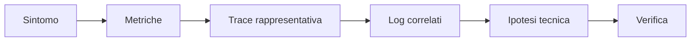

# OBS UD22 — Raccordo
# Metriche, log e trace come evidenze complementari

## 1. Le domande cambiano lo strumento

| Domanda | Evidenza prevalente |
|---|---|
| Il problema interessa molte richieste? | metriche |
| Quando è iniziato il fenomeno? | metriche e dashboard |
| Quale richiesta mostra il comportamento? | trace |
| Dove si concentra il tempo? | timeline degli span |
| Quale servizio genera l'errore? | span e log |
| Quali dettagli applicativi sono presenti? | log strutturati |

## 2. Sequenza di troubleshooting

Non esiste l'obbligo di partire sempre dalle metriche. La sequenza dipende dal modo in cui il problema viene scoperto. Ciò che conta è passare da un'indicazione generica a evidenze specifiche.

## 3. Errori di ragionamento da evitare

- attribuire la causa al servizio con la durata totale senza leggere gli span figli;
- sommare durate di span annidati;
- confondere un `request_id` con un `trace_id`;
- concludere che una trace assente dimostri l'assenza della richiesta, ignorando sampling o problemi di esportazione;
- considerare il volume Docker come se fosse il database;
- usare un solo segnale per sostenere una diagnosi complessa.

## 4. Risultato professionale

Una diagnosi utile è verificabile:

> Il p95 mostra un aumento della latenza. La trace `...` dura circa 2,5 secondi e concentra il tempo nello span `catalog.load_products` del backend. I log frontend e backend condividono lo stesso `request_id` e `trace_id`; il backend riporta una durata coerente. L'ipotesi è quindi una lentezza nell'operazione catalogo, non un'elaborazione locale del frontend.
