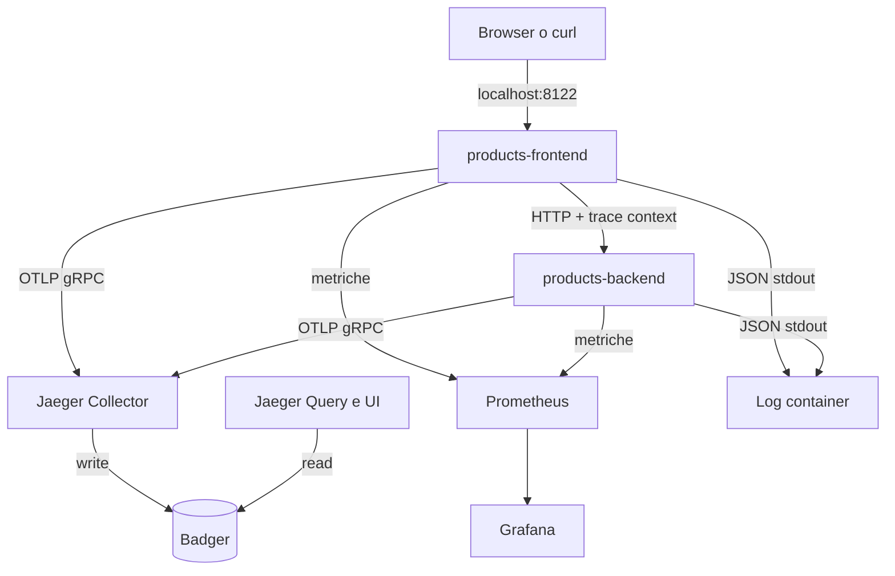

# OBS UD22 — Guida architetturale
# Jaeger, storage e volumi nello stack Catalogo prodotti

## 1. Vista complessiva



Jaeger è il centro della UD. Prometheus e Grafana aiutano a individuare il sintomo aggregato; i log forniscono dettagli testuali; la trace ricostruisce la richiesta distribuita.

## 2. Flusso dei dati di tracing

Le applicazioni inviano span al collector mediante OTLP gRPC sulla porta interna `4317`:

```text
products-frontend  ─┐
                    ├─> http://jaeger:4317
products-backend   ─┘
```

Il nome `jaeger` è risolto dalla rete Docker `obs-net`. Dal browser, invece, la UI è raggiungibile su `http://localhost:16686`.

## 3. Struttura degli span HTTP

La strumentazione produce quattro livelli principali:

```text
products-frontend  GET /products                  SERVER
products-frontend  GET backend-products/...       CLIENT
products-backend   GET /api/products              SERVER
products-backend   catalog.load_products          INTERNAL
```

I primi tre span descrivono il protocollo HTTP. L'ultimo descrive un'operazione applicativa. Questa distinzione consente di separare il tempo di comunicazione dal lavoro di dominio.

## 4. Storage Jaeger

Jaeger all-in-one utilizza Badger come storage locale embedded:

```yaml
SPAN_STORAGE_TYPE: badger
BADGER_EPHEMERAL: "false"
BADGER_DIRECTORY_VALUE: /badger/data/values
BADGER_DIRECTORY_KEY: /badger/data/keys
BADGER_SPAN_STORE_TTL: 72h0m0s
```

Badger scrive i propri file in `/badger`. Il Compose monta su quella directory il named volume:

```yaml
- jaeger-data:/badger
```

Il volume è dichiarato con un nome stabile:

```yaml
volumes:
  jaeger-data:
    name: obs-ud22-jaeger-data
```

### Servizio di preparazione del volume

L'immagine Jaeger viene eseguita con un utente non privilegiato. Il Compose contiene quindi un breve servizio one-shot, `prepare-jaeger-data`, che crea le directory e assegna i permessi prima dell'avvio di Jaeger. Non partecipa al flusso delle trace e termina subito dopo la preparazione.

## 5. I tre volumi dello stack

| Volume | Mount nel container | Contenuto |
|---|---|---|
| `obs-ud22-jaeger-data` | `/badger` | trace e indici Badger |
| `obs-ud22-prometheus-data` | `/prometheus` | campioni della TSDB Prometheus |
| `obs-ud22-grafana-data` | `/var/lib/grafana` | database e stato Grafana |

I file di configurazione sono invece montati come **bind mount read-only**, perché fanno parte del materiale versionato:

```yaml
./prometheus/prometheus.yml:/etc/prometheus/prometheus.yml:ro
./grafana/provisioning:/etc/grafana/provisioning:ro
./grafana/dashboards:/var/lib/grafana/dashboards:ro
```

Questa distinzione è importante:

```text
bind mount  -> configurazione che leggiamo e versioniamo
named volume -> dati runtime prodotti dai servizi
```

## 6. Ciclo di vita

```text
docker compose stop
  ferma i container; dati e container restano disponibili

docker compose down
  elimina container e reti; i named volume restano disponibili

docker compose down -v
  elimina anche i named volume e quindi i dati persistenti
```

Gli script della UD espongono queste operazioni con nomi espliciti. Il percorso principale usa avvio, arresto e riavvio. Il reset distruttivo richiede una conferma intenzionale.

## 7. Limiti dell'architettura

L'all-in-one con Badger è adeguato per un ambiente locale a singolo nodo. Non offre la scalabilità e la resilienza di un deployment distribuito. Questo limite non impedisce di apprendere il modello di tracing: trace, span, propagazione, ricerca e correlazione restano gli stessi concetti fondamentali.
