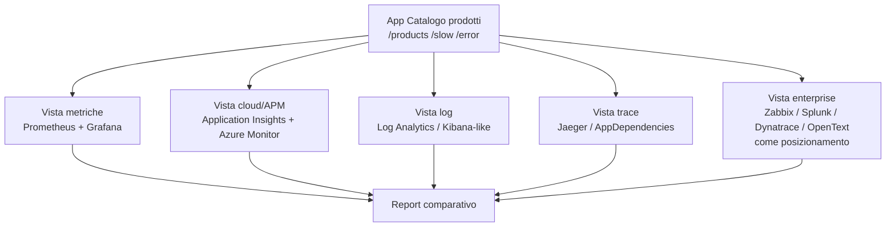

# OBS UD23 - Concetti
# Comparativa stack e strumenti Observability

## 0. Perché questa UD esiste

Fino a questo punto abbiamo costruito un percorso molto pratico: abbiamo scritto e containerizzato applicazioni, le abbiamo rilasciate in cloud, abbiamo raccolto log, metriche e trace, abbiamo creato dashboard e alert, e abbiamo seguito una richiesta dall'ingresso nel frontend fino al backend. Dopo UD22 abbiamo in mano una cosa importante: non solo alcuni strumenti, ma un modo di ragionare.

UD23 serve a fare un passo ulteriore. Nella pratica professionale non esiste un unico strumento che risolve ogni scenario. Un team può usare Prometheus e Grafana per metriche applicative e infrastrutturali; può usare Application Insights perché l'applicazione gira su Azure; può usare uno stack log per cercare eventi e pattern; può trovare Zabbix in contesti infrastrutturali tradizionali; può incontrare Splunk, Dynatrace o OpenText in ambienti enterprise dove pesano integrazione, licensing, retention, APM avanzato e processi ITOM.

Il rischio didattico sarebbe fare una lista di nomi. La UD23 non fa questo. Usiamo l'app **Catalogo prodotti** come filo conduttore e ci chiediamo quale strumento risponde meglio a una domanda operativa concreta.

```text
Non partiamo dagli strumenti.
Partiamo dalle domande:
- Il servizio è vivo?
- Quanto traffico riceve?
- Dove aumenta la latenza?
- Quale endpoint fallisce?
- Il frontend raggiunge il backend?
- Quali log dimostrano il problema?
- Quanto è costosa o sostenibile questa osservabilità?
```

## 1. Dal singolo stack alla scelta consapevole

Nelle UD18-UD22 abbiamo osservato la stessa app in locale. Questo ci ha permesso di vedere fisicamente molti elementi: container, rete Docker, endpoint `/metrics`, target Prometheus, dashboard Grafana, trace Jaeger, log JSON. In Azure, gli stessi segnali sono meno visibili come componenti singoli e più integrati in servizi gestiti: Application Insights, Log Analytics, Azure Monitor, Workbook, log di Container Apps.

Il punto non è stabilire se lo stack locale sia meglio del cloud o viceversa. Il punto è capire che ciascun ambiente favorisce un tipo di risposta:

| Domanda | Strumento spesso efficace |
|---|---|
| Il target risponde? | Prometheus `up`, Azure metriche/health |
| Quanto traffico arriva? | PromQL, AppRequests/KQL |
| Quale endpoint è lento? | Grafana p95, Application Insights requests |
| Quale chiamata FE -> BE è problematica? | Jaeger, AppDependencies |
| Quali log contengono l'errore? | Log Analytics, stack log/Kibana-like |
| Quale strumento è sostenibile nel tempo? | Matrice comparativa: costi, effort, retention, integrazioni |

## 2. Schema mentale della comparativa

In questa UD la stessa applicazione viene osservata da viste diverse. Ogni vista illumina un aspetto e ne lascia altri in ombra.



Questo schema è volutamente diverso dagli schemi architetturali precedenti. Qui non stiamo rappresentando solo il flusso tecnico di una richiesta; stiamo rappresentando le **prospettive di osservazione**.

## 3. Metric scraping, log ingestion, APM e infrastructure monitoring

Una comparativa seria deve distinguere almeno quattro famiglie:

**Metric scraping.** Prometheus raccoglie metriche esposte dagli endpoint, normalmente con un modello pull. È molto adatto a metriche numeriche, rate, percentili e alert basati su serie temporali. È meno adatto, da solo, a cercare dentro log testuali complessi.

**Log ingestion e log search.** Uno stack log raccoglie eventi testuali o JSON, li indicizza e permette ricerche sui campi. In Azure questa funzione è spesso svolta da Log Analytics/KQL; in altri ambienti può essere coperta da Elastic/Kibana o Splunk. È molto utile quando bisogna leggere messaggi, codici, pattern e dettagli applicativi.

**APM e distributed tracing.** Application Insights, Dynatrace, Splunk APM o Jaeger rispondono a domande sul percorso delle richieste, sulle dipendenze e sulla latenza distribuita. Qui non basta sapere che `/products` è lento: vogliamo capire se il tempo si perde nel frontend, nel backend, nella dipendenza esterna o nella piattaforma.

**Infrastructure monitoring.** Zabbix e strumenti analoghi sono storicamente forti su host, servizi, trigger, availability e infrastrutture più tradizionali. Non sostituiscono sempre un APM cloud-native, ma possono essere molto presenti nelle aziende.

## 4. Perché includiamo strumenti che non installiamo

UD23 include schede su Zabbix, Splunk, Dynatrace e OpenText. Zabbix, Splunk e OpenText restano casi di studio; **Dynatrace viene anche esplorato praticamente nel Playground ufficiale**, senza introdurre un deployment enterprise. In questo modo un tecnico junior non vede solo il nome dello strumento, ma riconosce concretamente servizi, endpoint, dipendenze, log e trace in una piattaforma integrata.

La regola della UD è chiara:

```text
Zabbix, Splunk e OpenText
-> schede + casi d'uso + matrice comparativa

Dynatrace
-> scheda + esplorazione pratica guidata nel Playground

Nessuno strumento enterprise richiede una demo improvvisata.
```

Questa scelta mantiene il laboratorio controllabile, ma non nasconde la realtà del mercato.

## 5. Cosa significa confrontare due stack

Confrontare due stack non significa dire quale interfaccia è più bella. Significa partire dallo stesso evento e chiedersi:

```text
- Quale stack mi fa vedere prima il problema?
- Quale mi dà più contesto?
- Quale richiede più configurazione?
- Quale scala meglio?
- Quale costa di più in ingestion o retention?
- Quale è più adatto a un team DevOps, SRE, IT Ops o enterprise?
```

Per questo il laboratorio chiede un report finale. La capacità richiesta non è solo usare un comando, ma argomentare una scelta.

## 6. Collegamento con UD24

UD24 userà questa comparativa per fare un salto di livello. Dopo aver confrontato strumenti, passeremo alla domanda SRE: come trasformiamo questi segnali in affidabilità misurabile? Da qui nasceranno SLI, SLO, error budget, incident lifecycle e Reliability Brief.

UD23 è quindi il punto di chiusura del blocco strumenti e il ponte verso il ragionamento moderno SRE.
