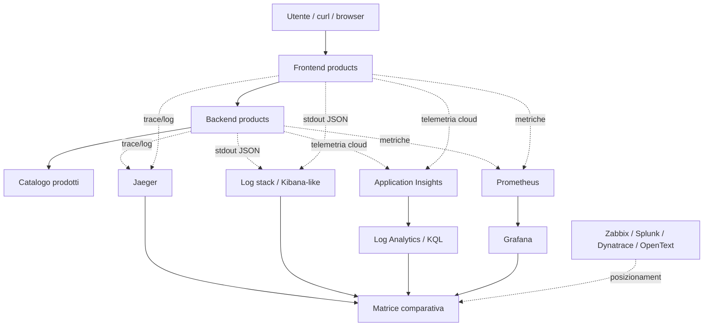

# OBS UD23 - Guida architetturale
# Comparativa stack Observability: viste, segnali e decisioni

## 0. Scopo del file

Questo file chiarisce l'architettura concettuale della UD23. Non descrive un unico deploy. Descrive più viste della stessa applicazione e spiega perché ciascuna vista aiuta a rispondere a domande diverse.

Nelle UD tecniche precedenti gli schemi erano soprattutto flussi: browser -> frontend -> backend. Qui serve uno schema diverso, perché il tema non è solo il traffico applicativo; il tema è **come diversi strumenti osservano lo stesso sistema**.

## 1. Sistema osservato

Il sistema osservato resta l'app **Catalogo prodotti**:

```text
Utente
  -> frontend-products
      -> backend-products
          -> catalogo prodotti
```

Endpoint usati per la comparativa:

| Endpoint | Significato |
|---|---|
| `/products` | comportamento normale |
| `/products/slow` | lentezza controllata |
| `/products/error` | errore controllato |
| `/ready` | frontend e backend raggiungibili |
| `/version` | versione/release |

## 2. Schema a viste multiple



Questo schema non dice che tutti gli strumenti sono attivi nello stesso ambiente. Dice che esistono viste diverse e che UD23 insegna a collocarle.

## 3. Vista metriche: Prometheus e Grafana

Prometheus raccoglie metriche numeriche. Grafana le rende esplorabili e comunicabili. Questa vista è adatta per:

- traffico;
- error rate;
- latenza;
- target UP/DOWN;
- trend temporali;
- alert basati su soglie.

Limite principale: da sola non dà il dettaglio testuale del singolo evento applicativo.

## 4. Vista cloud/APM: Application Insights e Azure Monitor

Application Insights è naturale quando l'app è su Azure. Permette di vedere richieste, dipendenze, tracce, eccezioni e operazioni correlate.

Domande tipiche:

```text
Quale endpoint è lento?
Il frontend chiama davvero il backend?
Quale dipendenza fallisce?
Quale operation_id collega request e dependency?
```

Questa vista è forte perché integra app e piattaforma, ma è legata al modello Azure e alla qualità della strumentazione.

## 5. Vista log: Log Analytics e Kibana-like

I log rispondono a domande diverse dalle metriche. Una metrica può dire che gli errori aumentano; il log può dire quale messaggio, quale request_id, quale payload o quale condizione applicativa ha generato l'errore.

In Azure usiamo Log Analytics/KQL. Per simulare uno stack log tipo Kibana usiamo un dataset JSONL e query locali.

Campi minimi utili:

```text
timestamp
service
level
message
request_id
path
status
latency_ms
trace_id
span_id
```

Senza campi strutturati, la ricerca log diventa fragile.

## 6. Vista trace: Jaeger e AppDependencies

Il tracing collega più operazioni dentro una stessa richiesta. È utile quando il sistema è distribuito.

Scenario:

```text
GET /products
  frontend span
    backend dependency/span /api/products
```

In locale questo è visto con Jaeger. In Azure può emergere come dependencies/requests correlate in Application Insights.

## 7. Vista enterprise e infrastrutturale

Gli strumenti enterprise non sono installati in questa UD. Sono però posizionati tramite schede perché i partecipanti devono imparare a riconoscerli.

| Strumento | Vista prevalente |
|---|---|
| Zabbix | host, item, trigger, infrastruttura |
| Splunk | log/eventi enterprise, correlazione |
| Dynatrace | APM enterprise, service flow, tracing |
| OpenText | ITOM/AIOps, correlazione eventi, automazione |

## 8. Schema decisionale contestuale

Per UD23 lo schema più utile non è solo una sequenza, ma una matrice di decisione.

```text
                       Profondità APM
                            alta
                             ^
                             |
        Dynatrace/Splunk APM | Application Insights
                             |
log search <-----------------+-----------------> metriche/dashboard
                             |
        Elastic/Kibana       | Prometheus/Grafana
                             |
                             v
                       effort/costo da valutare
```

Questo schema non è una classifica. Serve a visualizzare trade-off.

## 9. Errore architetturale da evitare

Errore:

```text
Aggiungo strumenti finché vedo tutto.
```

Correzione:

```text
Definisco prima le domande operative,
poi scelgo segnali e strumenti sostenibili.
```

## 10. Frase che il partecipante deve saper dire

Al termine della UD23 il partecipante deve poter dire:

> Ho osservato la stessa app Catalogo prodotti con viste diverse. Prometheus/Grafana mi aiutano su metriche e dashboard; Application Insights e Log Analytics mi aiutano su richieste, dipendenze e log cloud; una vista log tipo Kibana aiuta nella ricerca strutturata sugli eventi; strumenti come Zabbix, Splunk, Dynatrace e OpenText rispondono a casi d'uso specifici e vanno valutati con criteri tecnici, non per moda o preferenza.

## 11. Mini-check finale

| Domanda | Risposta attesa |
|---|---|
| Che cosa misura meglio Prometheus? | Metriche numeriche e serie temporali. |
| Che cosa rende utile Grafana? | Dashboard e lettura visuale delle metriche. |
| Dove vedo requests e dependencies in Azure? | Application Insights / Log Analytics. |
| Perché usare log strutturati? | Per filtrare e correlare eventi con campi come request_id e path. |
| Perché non installiamo tutti gli strumenti enterprise? | Perché il laboratorio deve restare sostenibile; li valutiamo con schede pronte. |
| Qual è l'output principale della UD23? | Report comparativo e matrice decisionale. |
