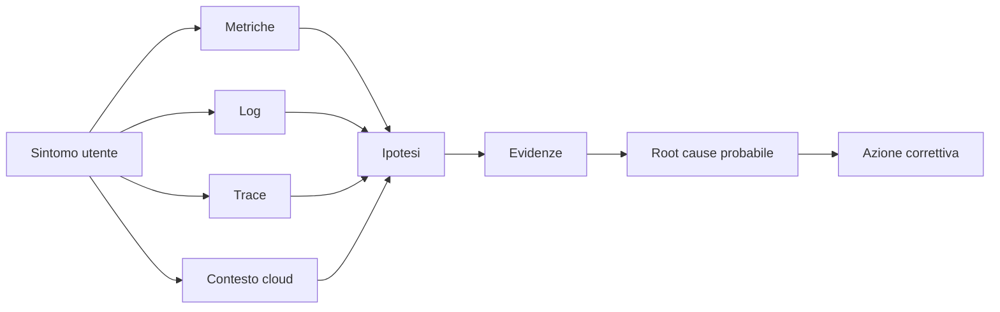

# OBS UD24 — Concetti
# Incident investigation locale/cloud su app Catalogo prodotti

## 0. Perché questa UD è centrale

Finora abbiamo costruito molti pezzi separati. Abbiamo imparato a creare container, a pubblicare immagini, a distribuire frontend e backend in Azure Container Apps, a raccogliere telemetria cloud, a usare Prometheus, Grafana, Jaeger e log JSON in locale. UD24 serve a trasformare questi strumenti in un metodo di diagnosi.

Un sistema osservabile non è un sistema in cui “abbiamo tante dashboard”. È un sistema in cui, quando qualcosa non funziona, siamo in grado di porre domande tecniche e trovare segnali utili per rispondere.

La domanda di UD24 è:

```text
Quando il Catalogo prodotti è lento o va in errore,
come dimostriamo che cosa sta succedendo?
```

Non basta vedere un HTTP 500. Non basta vedere una linea rossa su un grafico. Dobbiamo costruire una spiegazione che colleghi sintomo, tempo, componente, endpoint, richiesta, dipendenza e log.

## 1. Dalla raccolta dei segnali alla spiegazione

Nelle UD precedenti abbiamo visto segnali diversi:

- metriche Prometheus;
- pannelli Grafana;
- alert locali;
- trace Jaeger;
- log JSON con `request_id`;
- richieste e dipendenze in Application Insights;
- log runtime di Azure Container Apps;
- query KQL in Log Analytics.

Ognuno di questi segnali dice una parte della storia. L'investigazione nasce quando li mettiamo in relazione.



Questo è il passaggio culturale più importante: non cerchiamo una sola “schermata che risolve il problema”, ma una sequenza coerente di evidenze.

## 2. Il workload usato: Catalogo prodotti

Usiamo la stessa app introdotta con la change request post-UD16:

```text
Browser
  ↓
Frontend products
  ↓ BACKEND_URL
Backend products
  ↓
Catalogo prodotti
```

Gli endpoint principali sono:

| Endpoint frontend | Scopo |
|---|---|
| `/` | Home HTML con catalogo prodotti |
| `/products` | Flusso normale FE → BE |
| `/products/slow` | Flusso lento controllato |
| `/products/error` | Errore controllato |
| `/ready` | Verifica che il frontend raggiunga il backend |
| `/version` | Verifica versione/build |

Sul backend gli endpoint equivalenti sono:

| Endpoint backend | Scopo |
|---|---|
| `/api/products` | API catalogo normale |
| `/api/products/slow` | API lenta controllata |
| `/api/products/error` | API errore controllato |
| `/health` | Stato servizio |
| `/version` | Versione servizio |

Questi endpoint sono didatticamente utili perché ci permettono di distinguere tre situazioni:

```text
/products        → comportamento normale
/products/slow   → latenza anomala ma risposta valida
/products/error  → errore applicativo controllato
```

## 3. Investigare non significa indovinare

Un errore comune è partire subito da una causa:

```text
“Il backend non funziona.”
```

Questa non è ancora un'analisi. È un'ipotesi. In UD24 lavoriamo in modo diverso:

```text
1. Che sintomo vedo?
2. Quando è iniziato?
3. Quale endpoint è coinvolto?
4. Il problema è riproducibile?
5. Quali segnali cambiano?
6. Quali segnali non cambiano?
7. Quale componente è più probabilmente coinvolto?
8. Quale evidenza lo dimostra?
9. Quale azione correttiva è coerente?
10. Quali limiti ha la mia conclusione?
```

Questo metodo protegge da due errori opposti: reagire troppo presto e restare bloccati davanti a troppi dati.

## 4. Locale e cloud non sono due mondi separati

Lo stack locale e quello Azure non sono identici, ma raccontano gli stessi tipi di fenomeni.

| Domanda | Locale | Cloud Azure |
|---|---|---|
| Il servizio risponde? | Prometheus `up` | ACA revision/status, AppRequests |
| Quante richieste arrivano? | PromQL rate/count | KQL su AppRequests |
| Ci sono errori? | error rate PromQL, log JSON | AppRequests, AppExceptions, ContainerAppConsoleLogs |
| La risposta è lenta? | histogram/latency, Grafana | DurationMs in AppRequests/AppDependencies |
| FE chiama BE? | Jaeger trace FE→BE | AppDependencies / distributed trace |
| Quale richiesta sto seguendo? | `request_id`, `trace_id` | operation id, trace/log, request id applicativo |

Questa tabella è il cuore della UD23 e diventa operativa in UD24.

## 5. Timeline, ipotesi, evidenze

Un incident report minimo deve avere tre elementi.

### Timeline

Una sequenza temporale:

```text
10:04 traffico normale su /products
10:07 aumento latenza su /products/slow
10:09 errori controllati su /products/error
10:11 query KQL mostra ResultCode 500
10:13 Jaeger mostra span backend lento
```

La timeline impedisce di confondere causa ed effetto.

### Ipotesi

Le ipotesi devono essere tecniche ma provvisorie:

```text
Ipotesi A: il frontend non raggiunge il backend.
Ipotesi B: il backend risponde ma con latenza elevata.
Ipotesi C: l'errore è applicativo e localizzato su /products/error.
Ipotesi D: la piattaforma ACA ha problemi di revisione o avvio container.
```

### Evidenze

Le evidenze devono essere verificabili:

```text
Query KQL, query PromQL, log, trace, screenshot, output curl, revisioni ACA.
```

Una buona evidenza non è “ho visto che non va”. È qualcosa che un altro tecnico può rileggere e ripetere.

## 6. Root cause probabile, non certezza assoluta

Nel lavoro reale spesso non abbiamo certezza matematica. Per questo parliamo di **root cause probabile**.

Una root cause ben formulata non dice solo “errore backend”, ma qualcosa di più preciso:

```text
Durante le richieste a /products/error il frontend riceve errore dal backend.
Le richieste frontend risultano 500 e le dipendenze verso il backend mostrano ResultCode 500.
I log container backend confermano l'errore applicativo controllato con lo stesso request_id.
La piattaforma ACA non mostra evidenze di riavvio o problema di revisione.
La causa probabile è quindi applicativa e localizzata nell'endpoint backend /api/products/error.
```

Questa è una spiegazione difendibile.

## 7. Collegamento con UD25

UD25 userà dati osservabili per ragionare su baseline e anomalie. UD24 prepara quel passaggio, perché insegna a distinguere un dato utile da un dato rumoroso.

Prima di parlare di anomaly detection dobbiamo sapere:

```text
quale metrica misuro,
in quale finestra,
su quale endpoint,
con quale comportamento atteso,
con quale possibile falso positivo.
```

Per questo UD24 viene prima di UD25.

## 8. Obiettivo finale della UD

Al termine il partecipante deve saper dire:

> Ho simulato un problema sull'app Catalogo prodotti, ho raccolto segnali locali e cloud, ho costruito una timeline, ho formulato ipotesi, ho verificato le ipotesi con metriche, log e trace, e ho prodotto un incident report con root cause probabile e azione correttiva.
