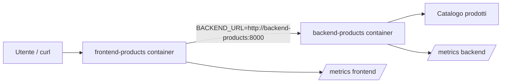
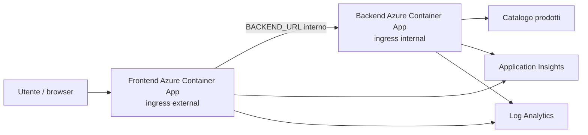
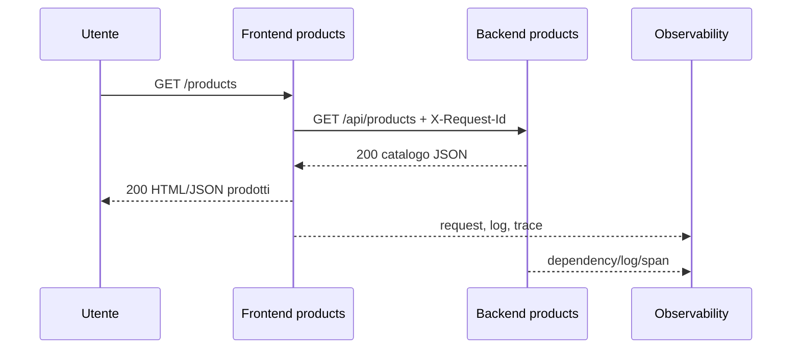

# OBS UD24 — Guida architetturale
# Incident investigation locale/cloud su app Catalogo prodotti

## 0. Scopo del file

Questo file chiarisce l'architettura usata in UD24 e spiega come leggere un incidente attraversando due ambienti:

```text
ambiente locale osservato con Prometheus/Grafana/Jaeger/log
ambiente cloud osservato con Azure Monitor/Application Insights/Log Analytics
```

L'obiettivo non è dire che i due ambienti sono uguali. L'obiettivo è riconoscere la stessa domanda tecnica in due forme operative diverse.

## 1. Architettura applicativa

La stessa applicazione esiste in due contesti.

### Locale



### Cloud Azure



## 2. Endpoint e significato investigativo

| Endpoint | Significato |
|---|---|
| `/products` | comportamento normale del catalogo |
| `/products/slow` | scenario di latenza controllata |
| `/products/error` | scenario di errore controllato |
| `/ready` | relazione frontend → backend |
| `/version` | versione/build e revisione |
| `/health` | vitalità del singolo servizio |

Questa distinzione è fondamentale. Se `/health` è OK ma `/ready` fallisce, il problema non è semplicemente “il frontend è giù”: potrebbe essere la relazione con il backend.

## 3. Mappa segnali locale/cloud

| Fenomeno | Locale | Cloud |
|---|---|---|
| servizio vivo | Prometheus `up` | ACA status/revision, AppRequests |
| richieste HTTP | `http_requests_total` | `AppRequests` |
| latenza | histogram Prometheus, Grafana p95 | `DurationMs`, percentile in KQL |
| dipendenza FE→BE | Jaeger span FE→BE | `AppDependencies` |
| errore applicativo | log JSON + trace error | `AppExceptions`, `AppTraces`, log ACA |
| stdout container | `docker logs` | `ContainerAppConsoleLogs_CL` |
| correlazione | `request_id`, `trace_id` | `OperationId`, log request_id, trace applicativi |

## 4. Flusso normale `/products`



Segnali attesi:

- status 200;
- latenza stabile;
- trace FE→BE completo;
- error rate basso;
- log con request_id coerente.

## 5. Flusso lento `/products/slow`

Qui il flusso funziona, ma impiega più tempo.

Segnali attesi:

- status 200 o comunque risposta non necessariamente errata;
- `DurationMs` elevata;
- p95 elevato;
- span backend più lungo;
- AppDependencies lente;
- log senza eccezione bloccante.

Interpretazione:

```text
Lentezza non equivale automaticamente a errore.
Una richiesta può riuscire ma degradare l'esperienza utente.
```

## 6. Flusso errore `/products/error`

Qui la richiesta produce un errore controllato.

Segnali attesi:

- ResultCode 500;
- AppExceptions o log ERROR;
- error rate visibile;
- trace con span marcato come errore;
- log backend con stesso request_id.

Interpretazione:

```text
Se frontend e backend mostrano errore collegato allo stesso request_id,
il problema è molto probabilmente nel percorso applicativo FE→BE.
```

## 7. Perché la timeline è indispensabile

Senza timeline rischiamo di confondere:

- effetto con causa;
- traffico di test con traffico reale;
- errore vecchio con errore corrente;
- deployment con incidente;
- problema locale con problema cloud.

Timeline minima:

```text
T0 deploy/revisione
T1 baseline normale
T2 traffico lento
T3 comparsa latenza
T4 query log/trace
T5 ipotesi
T6 decisione
```

## 8. Relazione tra revisioni ACA e incidente

In Azure Container Apps ogni aggiornamento immagine può produrre una nuova revisione. Questo è utile perché un incidente può essere collegato a una release.

Da verificare:

```bash
az containerapp revision list --resource-group RG --name APP -o table
```

Domande:

- Il problema è iniziato dopo una nuova revisione?
- La nuova revisione usa l'immagine products corretta?
- La revisione precedente è ancora disponibile?
- Il rollback è possibile?

## 9. Errore applicativo vs problema piattaforma

| Indizio | Più probabile applicativo | Più probabile piattaforma |
|---|---|---|
| AppRequests 500 su endpoint specifico | sì | no |
| AppExceptions coerenti | sì | no |
| Container restart/unhealthy | forse | sì |
| revision failed | no | sì |
| `/health` OK ma `/products/error` KO | sì | no |
| nessuna telemetria applicativa ma log container presenti | problema strumentazione | forse |

## 10. Diagnosi tipiche

### Frontend OK, backend non raggiunto

Segnali:

- `/health` frontend OK;
- `/ready` KO;
- AppDependencies fallite;
- log frontend con errore su `BACKEND_URL`;
- backend health eventualmente OK.

### Backend lento

Segnali:

- `/products/slow` con DurationMs elevata;
- Jaeger span backend lungo;
- AppDependencies lente;
- error rate basso.

### Endpoint backend in errore

Segnali:

- `/products/error` 500;
- AppExceptions;
- log backend ERROR;
- trace con errore;
- revisioni ACA sane.

### Telemetria mancante

Segnali:

- app risponde ma AppRequests vuota;
- ContainerAppConsoleLogs presente;
- connection string mancante o sbagliata;
- instrumentation non attivata nella revisione corrente.

## 11. Schema RCA minimo

```text
Sintomo: cosa vede l'utente o il sistema.
Impatto: chi è colpito e quanto.
Timeline: quando accade.
Evidenze: metriche, log, trace, query.
Ipotesi scartate: perché non sono probabili.
Root cause probabile: causa più coerente con i segnali.
Azione correttiva: cosa fare adesso.
Prevenzione: cosa migliorare dopo.
Limiti: cosa non possiamo dimostrare con i dati disponibili.
```

## 12. Mini-check finale

| Domanda | Risposta attesa |
|---|---|
| Perché `/ready` è diverso da `/health`? | `/ready` verifica anche la relazione FE→BE. |
| Quale endpoint simula lentezza? | `/products/slow`. |
| Quale endpoint simula errore? | `/products/error`. |
| Dove vedo la latenza in locale? | Prometheus/Grafana e Jaeger. |
| Dove vedo la latenza in cloud? | AppRequests/AppDependencies `DurationMs`. |
| Dove vedo log stdout ACA? | `ContainerAppConsoleLogs_CL`. |
| Perché serve una timeline? | Per distinguere causa, effetto e correlazioni temporali. |
| Che cos'è una root cause probabile? | La spiegazione più coerente con le evidenze disponibili. |

## 13. Frase che il partecipante deve saper dire

> Ho investigato il Catalogo prodotti confrontando segnali locali e cloud. Ho distinto comportamento normale, lento ed errore. Ho usato metriche, log, trace e KQL per costruire una timeline, scartare ipotesi deboli e formulare una root cause probabile con un'azione correttiva.
