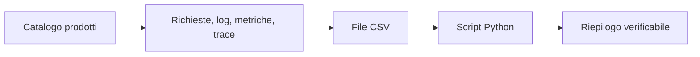

# UD25 — Concetti
# Python da zero per rappresentare dati osservabili

## 1. Perché introduciamo Python in un percorso di Observability

Finora abbiamo interrogato strumenti già capaci di raccogliere e visualizzare segnali: metriche in Prometheus e Grafana, log in Log Analytics, richieste e dipendenze in Application Insights, trace in Jaeger. Questi strumenti restano centrali. Python non li sostituisce.

Python diventa utile quando vogliamo prendere un insieme di osservazioni e svolgere elaborazioni ripetibili: leggere un file, filtrare errori, raggruppare richieste, calcolare statistiche e, nelle UD successive, costruire baseline e modelli.

Prima di usare questi strumenti dobbiamo capire come un programma rappresenta una richiesta applicativa.



In questa UD ci fermiamo al primo riepilogo. Non cerchiamo ancora anomalie.

## 2. Interprete, script, modulo e libreria

### Interprete

L'interprete Python legge ed esegue le istruzioni contenute nel programma. Il comando dipende dal sistema:

Ubuntu e WSL:

```bash
python3 --version
```

Windows PowerShell:

```powershell
py -3 --version
```

Dopo l'attivazione dell'ambiente virtuale useremo normalmente:

```bash
python --version
```

### Script

Uno script è un file di testo con estensione `.py`, per esempio:

```text
01_first_script.py
```

Lo eseguiamo con:

```bash
python src/01_first_script.py
```

### Modulo

Un modulo è un file Python che può essere importato e riutilizzato da un altro programma. In UD25 usiamo soprattutto script eseguiti direttamente; il concetto diventerà più importante quando il codice crescerà.

### Libreria

Una libreria raccoglie funzionalità riutilizzabili. Python include una **libreria standard**. Il modulo `csv`, che useremo per leggere il dataset, è già disponibile e non richiede installazione.

```python
import csv
```

In UD26 introdurremo librerie esterne, installate separatamente. Questa distinzione evita di eseguire comandi `pip install` senza sapere perché.

## 3. Variabili e tipi

Una variabile è un nome associato a un valore.

```python
service = "frontend"
status_code = 200
duration_ms = 125.4
has_error = False
```

| Variabile | Valore | Tipo | Significato |
|---|---:|---|---|
| `service` | `"frontend"` | `str` | testo |
| `status_code` | `200` | `int` | numero intero |
| `duration_ms` | `125.4` | `float` | numero decimale |
| `has_error` | `False` | `bool` | vero/falso |

Il tipo è importante perché determina le operazioni possibili. Il testo `"500"` e il numero `500` sembrano simili, ma non sono equivalenti:

```python
status_text = "500"
status_number = 500
```

Per confrontare correttamente uno status letto da CSV dobbiamo convertirlo:

```python
status_code = int(status_text)
```

### Stampare un valore non equivale a usarlo in un calcolo

Queste due istruzioni possono entrambe essere stampate:

```python
print(125.4)
print("125.4")
```

`print()` costruisce una rappresentazione leggibile del valore. Un confronto numerico richiede invece tipi compatibili:

```python
125.4 > 120.0       # valido: float confrontato con float
"125.4" > 120.0     # TypeError: str confrontata con float
```

La stringa letta da un CSV deve essere convertita:

```python
duration_ms = float("125.4")
print(duration_ms > 120.0)  # True
```

## 4. Decisioni con `if`

Un tecnico applica continuamente condizioni: status 5xx, durata oltre una soglia, endpoint specifico. In Python una decisione si esprime con `if`.

```python
if status_code >= 500:
    print("Errore server")
```

L'indentazione indica quali istruzioni appartengono alla condizione. Non è un dettaglio grafico: fa parte della sintassi del linguaggio.

```python
if status_code >= 500:
    print("Errore server")  # dentro l'if

print("Controllo terminato")  # fuori dall'if
```

## 5. Liste: più valori dello stesso insieme

Una lista contiene più valori ordinati:

```python
durations_ms = [112.5, 128.0, 121.7, 940.2]
```

Possiamo visitarli uno alla volta:

```python
for duration_ms in durations_ms:
    print(duration_ms)
```

Il ciclo `for` evita di ripetere manualmente la stessa istruzione.

## 6. Dizionari: una richiesta con attributi nominati

Una richiesta non è soltanto una durata. Ha servizio, endpoint, status e identificatori. Il dizionario associa una **chiave** a un **valore**.

```python
request = {
    "service": "frontend",
    "endpoint": "/products",
    "status_code": 200,
    "duration_ms": 124.7,
    "request_id": "req-example-001",
}
```

Accediamo a un valore indicando la chiave:

```python
print(request["endpoint"])
```

Schema mentale:

```text
chiave              valore
service          -> frontend
endpoint         -> /products
status_code      -> 200
duration_ms      -> 124.7
request_id       -> req-example-001
```

## 7. Lista di dizionari: più osservazioni

Una lista di dizionari rappresenta più richieste:

```python
requests = [
    {"service": "frontend", "status_code": 200},
    {"service": "backend", "status_code": 500},
]
```

Questa struttura prepara il passaggio al dataset:

```text
lista                  insieme delle righe
dizionario             singola riga
chiavi del dizionario  nomi delle colonne
valori                  contenuto delle celle
```

## 8. Funzioni: dare un nome a una regola

Una funzione raccoglie istruzioni riutilizzabili.

```python
def is_server_error(status_code):
    return status_code >= 500
```

- `status_code` è il parametro;
- il corpo è indentato;
- `return` restituisce un risultato;
- la chiamata è `is_server_error(503)`.

La funzione non “indovina” se esiste un incidente. Applica una regola esplicita.

## 9. Dal CSV al dizionario

Un CSV è un file testuale tabellare. La prima riga contiene le intestazioni:

```csv
observation_id,timestamp_utc,service,endpoint,status_code,duration_ms
```

`csv.DictReader` usa le intestazioni come chiavi e restituisce un dizionario per ogni riga:

```python
with open("dataset.csv", encoding="utf-8") as file:
    reader = csv.DictReader(file)

    for row in reader:
        print(row["endpoint"])
```

Tutti i valori arrivano inizialmente come testo. Quindi:

```python
status_code = int(row["status_code"])
duration_ms = float(row["duration_ms"])
```

## 10. Che cosa non stiamo ancora facendo

In UD25 non useremo:

- pandas;
- DataFrame;
- media, mediana o p95;
- baseline;
- anomaly detection;
- ground truth;
- Machine Learning;
- AI generativa.

Questi concetti richiedono il linguaggio costruito oggi. Anticiparli produrrebbe esecuzione meccanica senza comprensione.

## 11. Frase di uscita

Al termine della UD dobbiamo saper spiegare:

> Il CSV viene letto riga per riga. Ogni riga diventa un dizionario e i nomi delle colonne diventano chiavi. I valori numerici sono inizialmente stringhe e devono essere convertiti prima di confronti o calcoli.
