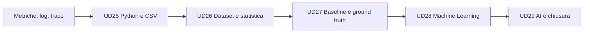

# UD25 — Riallineamento del percorso

## Da dove arriviamo

Le UD precedenti hanno costruito un'applicazione osservabile e gli strumenti per raccogliere metriche, log e trace. Abbiamo imparato a interrogare sistemi già pronti e a correlare segnali.

## Perché introduciamo ora il codice

L'obiettivo non è cambiare mestiere né sostituire Grafana, Jaeger o Application Insights. Vogliamo aggiungere la capacità di elaborare piccoli insiemi di dati in modo:

- ripetibile;
- verificabile;
- modificabile;
- documentabile.

## Posizione di UD25 nella nuova sequenza

## Input

- familiarità con il Catalogo prodotti;
- terminale e VS Code;
- nessuna conoscenza Python.

## Output trasferiti alla UD26

- capacità di leggere CSV;
- comprensione di riga, chiave e valore;
- conversione dei tipi;
- uso di condizioni, cicli e funzioni;
- primo riepilogo ripetibile.

## Confine della UD

UD25 non anticipa concetti che non possiamo ancora leggere nel codice. Questo confine è intenzionale: la chiarezza della progressione vale più della quantità di termini introdotti in una sola giornata.
