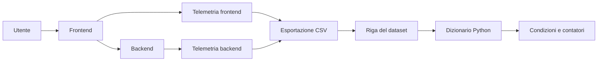

# UD25 — Guida architetturale
# Dal segnale applicativo alla struttura dati Python

## 1. I livelli che non dobbiamo confondere



L'applicazione produce eventi reali. Il CSV è una rappresentazione tabellare di alcune osservazioni. Il dizionario è la rappresentazione in memoria di una riga. Lo script applica operazioni sui valori.

## 2. Una richiesta end-to-end può produrre più righe

L'utente invia una richiesta al frontend. Il frontend chiama il backend. Le due osservazioni condividono `request_id` e `trace_id`, ma hanno servizi ed endpoint diversi.

```text
request_id=req-0001, service=frontend, endpoint=/products
request_id=req-0001, service=backend,  endpoint=/api/products
```

Non sono duplicati: rappresentano due segmenti della stessa interazione.

## 3. Mappatura CSV → dizionario

Riga CSV:

```csv
obs-000001,2026-07-20T08:00:00Z,local,backend,/api/products,200,112.42,req-0001,trace-0001-7812
```

Dizionario letto da `DictReader`:

```python
{
    "observation_id": "obs-000001",
    "timestamp_utc": "2026-07-20T08:00:00Z",
    "environment": "local",
    "service": "backend",
    "endpoint": "/api/products",
    "status_code": "200",
    "duration_ms": "112.42",
    "request_id": "req-0001",
    "trace_id": "trace-0001-7812",
}
```

Osserviamo le virgolette attorno a `"200"` e `"112.42"`: sono testi. Il programma decide quando convertirli.

## 4. Responsabilità dello script UD25

Lo script:

- apre un file locale;
- legge righe;
- converte due valori;
- applica condizioni;
- mantiene contatori;
- produce un riepilogo testuale.

Non:

- interroga direttamente Azure o Prometheus;
- modifica il dataset;
- addestra un modello;
- conferma incidenti;
- stabilisce una root cause.

## 5. Perché usiamo percorsi relativi allo script

Gli script costruiscono il percorso con `pathlib`:

```python
DATASET_PATH = Path(__file__).resolve().parents[1] / "datasets" / "mini_products_requests.csv"
```

Questo riduce la dipendenza dalla directory dalla quale viene eseguito il comando e rende il laboratorio più stabile su Windows e WSL.
