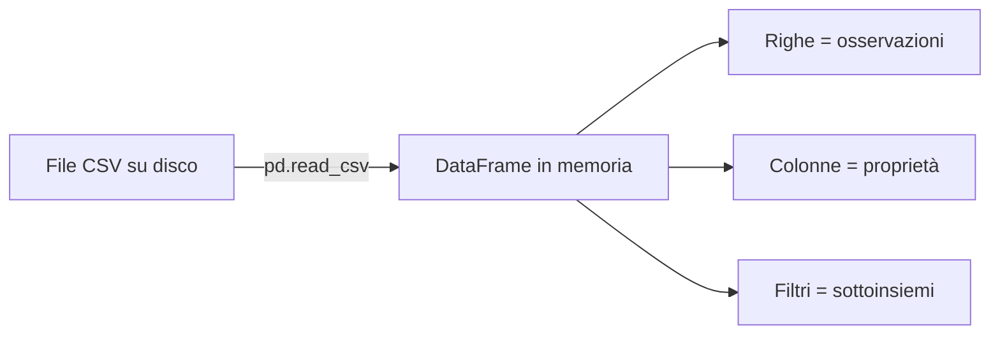
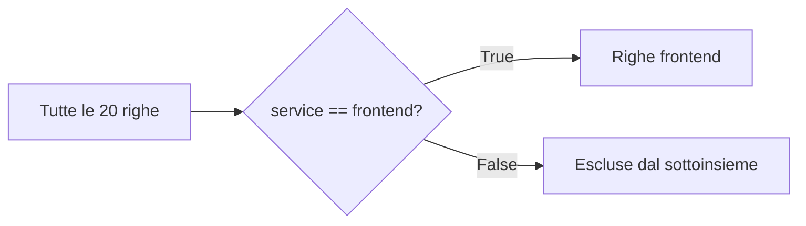

# UD26 — Concetti
# Dal CSV al DataFrame

## 1. La domanda della giornata

In UD25 abbiamo imparato a leggere un file CSV una riga alla volta.

Con `csv.DictReader`, ogni riga diventava un dizionario Python:

```python
{
    "service": "frontend",
    "endpoint": "/products",
    "status_code": "200"
}
```

Ora cambiamo punto di vista.

> Invece di lavorare con una riga alla volta, come possiamo rappresentare l'intera tabella in memoria?

La risposta che useremo è: **DataFrame**.

---

## 2. Dal file alla tabella in memoria



Il CSV continua a esistere sul disco.

`pandas` lo legge e costruisce una rappresentazione tabellare in memoria.

```text
mini_products_requests.csv
           ↓
      pd.read_csv()
           ↓
         data
      DataFrame
```

### Da ricordare

- il **CSV** è il file;
- il **DataFrame** è la tabella caricata in memoria;
- modificare un DataFrame non significa automaticamente modificare il file CSV.

---

## 3. Dataset, osservazione, riga e colonna

Consideriamo questa piccola tabella:

| service | endpoint | status_code | duration_ms |
|---|---|---:|---:|
| frontend | /products | 200 | 110 |
| backend | /api/products | 200 | 85 |
| frontend | /products | 200 | 130 |
| backend | /api/products | 500 | 95 |
| frontend | /products/slow | 200 | 750 |

### Dataset

L'intera tabella è un **dataset**: una raccolta organizzata di osservazioni.

### Osservazione

Una singola riga rappresenta una **osservazione**.

Per esempio:

```text
frontend | /products | 200 | 110
```

ci dice che abbiamo osservato:

- il servizio `frontend`;
- l'endpoint `/products`;
- lo status HTTP `200`;
- una durata di `110 ms`.

### Colonna

Una colonna descrive una proprietà presente in tutte le osservazioni.

```text
service
endpoint
status_code
duration_ms
```

---

## 4. Schema e granularità

Due parole sono importanti, ma il loro significato è semplice.

### Schema

Lo **schema** descrive quali colonne sono presenti.

Nel nostro dataset completo:

```text
observation_id
timestamp_utc
environment
service
endpoint
status_code
duration_ms
request_id
trace_id
```

### Granularità

La **granularità** risponde alla domanda:

> Che cosa rappresenta una singola riga?

Nel nostro file:

> una riga rappresenta l'osservazione di una richiesta elaborata da un servizio.

Questo è importante perché `duration_ms` rappresenta la durata di quella specifica osservazione, non una media di molte richieste.

---

## 5. Continuità con `DictReader`

In UD25 avevamo:

```python
reader = csv.DictReader(file)

for row in reader:
    print(row["service"])
```

Il ciclo riceveva una riga alla volta.

Con pandas useremo:

```python
import pandas as pd

data = pd.read_csv(DATASET_PATH)
```

Il risultato è concettualmente diverso:

```text
DictReader
riga 1 → dizionario
riga 2 → dizionario
riga 3 → dizionario

DataFrame
┌──────────────────────────┐
│ tutte le righe insieme   │
└──────────────────────────┘
```

Non significa che uno strumento sia sempre migliore dell'altro.

- `DictReader` è semplice e utile per elaborazioni riga per riga.
- `DataFrame` è comodo quando vogliamo osservare, selezionare e analizzare una tabella.

---

## 6. Che cos'è pandas

`pandas` è una libreria Python esterna specializzata nel lavoro con dati tabellari.

La importiamo così:

```python
import pandas as pd
```

Leggiamo questa riga pezzo per pezzo:

```text
import        → voglio usare una libreria
pandas        → nome della libreria
as pd         → userò il nome abbreviato pd
```

`pd` è solo un alias convenzionale.

Quindi:

```python
pd.read_csv(...)
```

significa:

> usa la funzione `read_csv` della libreria pandas.

---

## 7. Primo DataFrame

```python
data = pd.read_csv(DATASET_PATH)
```

La variabile `data` ora contiene il DataFrame.

Possiamo chiedere alcune informazioni semplici.

### Prime righe

```python
print(data.head())
```

`head()` mostra per impostazione predefinita le prime cinque righe.

### Dimensioni

```python
print(data.shape)
```

Restituisce una coppia:

```text
(numero_righe, numero_colonne)
```

Nel nostro mini dataset:

```text
(20, 9)
```

### Nomi delle colonne

```python
print(data.columns)
```

### Tipi riconosciuti

```python
print(data.dtypes)
```

Questo permette di vedere che pandas riconosce automaticamente alcuni valori numerici.

---

## 8. Selezionare una colonna

Possiamo selezionare una colonna usando il suo nome:

```python
durations = data["duration_ms"]
```

L'immagine mentale è:

```text
DataFrame completo
┌─────────┬──────────────┬─────────────┐
│ service │ status_code  │ duration_ms │
├─────────┼──────────────┼─────────────┤
│ ...     │ ...          │ 123.26      │
│ ...     │ ...          │ 177.40      │
└─────────┴──────────────┴─────────────┘
                         ↓
                seleziono duration_ms
                         ↓
                     123.26
                     177.40
                     ...
```

Non abbiamo modificato il dataset. Abbiamo selezionato una sua parte.

---

## 9. Filtrare righe

Supponiamo di voler vedere soltanto le osservazioni del frontend.

Prima costruiamo una condizione:

```python
is_frontend = data["service"] == "frontend"
```

Per ogni riga, la condizione produce:

```text
True   se service è frontend
False  altrimenti
```

Poi usiamo la condizione:

```python
frontend_rows = data[is_frontend]
```



Il filtro non cancella le righe dal CSV originale.

Crea un sottoinsieme in memoria.

---

## 10. Un secondo filtro: status 5xx

La stessa idea può essere riutilizzata:

```python
is_server_error = data["status_code"] >= 500
server_errors = data[is_server_error]
```

Il ragionamento è sempre:

```text
colonna
  ↓
condizione True/False
  ↓
filtro
  ↓
sottoinsieme
```

Questo schema mentale è più importante della sintassi da memorizzare.

---

## 11. Cosa non stiamo ancora facendo

In questa UD non cerchiamo di stabilire:

- quale endpoint è più lento;
- quale comportamento è anomalo;
- quale valore è una soglia;
- quale richiesta rappresenta un incidente.

Stiamo imparando soltanto a:

```text
caricare
osservare
selezionare
filtrare
```

Le statistiche arriveranno nella UD successiva.

---

## 12. Da ricordare

1. Un dataset è una raccolta organizzata di osservazioni.
2. Una riga rappresenta un'osservazione.
3. Una colonna rappresenta una proprietà.
4. Un DataFrame è una tabella in memoria.
5. `pd.read_csv()` carica un CSV in un DataFrame.
6. `data["nome_colonna"]` seleziona una colonna.
7. Una condizione produce valori `True` e `False` che possono essere usati per filtrare le righe.
8. Filtrare un DataFrame non significa cancellare righe dal CSV originale.
