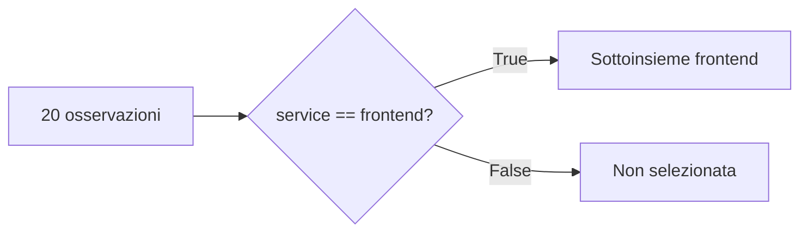

# UD26 — Laboratorio guidato
# Dal CSV al DataFrame

## Obiettivo

Alla fine del laboratorio dovremo saper spiegare questa trasformazione:

```text
CSV
 ↓ read_csv
DataFrame
 ↓ selezione / filtro
sottoinsieme di osservazioni
```

Non basta eseguire i comandi. Per ogni script leggeremo prima il codice, prevederemo l'output e soltanto dopo lo eseguiremo.

---

# Task 1 — Preparare l'ambiente

Seguire:

```text
05_OBS_UD26_GUIDA_OPERATIVA_Ambiente_Pandas_v7_0.md
```

Linux / WSL:

```bash
python3 -m venv .venv
source .venv/bin/activate
python -m pip install -r requirements.txt
```

Verifica:

```bash
python -c "import pandas; print(pandas.__version__)"
```

### Che cosa dobbiamo capire

`pandas` non fa parte della libreria standard di Python: deve essere installata nell'ambiente virtuale.

---

# Task 2 — Riprendere il dataset conosciuto

Aprire:

```text
datasets/mini_products_requests.csv
```

Prima di eseguire codice, rispondere:

1. Qual è la riga delle intestazioni?
2. Quante colonne contiene?
3. Che cosa rappresenta una singola riga?
4. Quale colonna contiene la durata?
5. Quali colonne riconosciamo già da UD25?

### Collegamento con UD25

Con `DictReader` la prima riga veniva usata come intestazione e il ciclo restituiva una osservazione alla volta.

Ora vedremo l'intera tabella in memoria.

---

# Task 3 — Caricare il primo DataFrame

## File

```text
src/01_load_dataframe.py
```

## Prima dell'esecuzione: leggiamo il codice

### Blocco 1 — Import

```python
from pathlib import Path
import pandas as pd
```

- `Path` serve a costruire il percorso del file.
- `pandas` è la nuova libreria della giornata.
- `pd` è semplicemente il nome abbreviato che useremo per richiamarla.

### Blocco 2 — Codice di servizio

```python
DATASET_PATH = Path(__file__).resolve().parents[1] / "datasets" / "mini_products_requests.csv"
```

Questo codice individua il CSV partendo dalla posizione dello script.

Non è il nuovo obiettivo della UD: serve per rendere lo script più affidabile.

### Blocco 3 — Concetto nuovo

```python
data = pd.read_csv(DATASET_PATH)
```

Leggiamolo come una frase:

```text
usa pandas
→ leggi il CSV indicato da DATASET_PATH
→ conserva la tabella nella variabile data
```

`data` è ora un DataFrame.

### Blocco 4 — Osservazione

```python
print(data.head())
print(data.shape)
print(list(data.columns))
print(data.dtypes)
```

- `head()` → prime 5 righe;
- `shape` → `(righe, colonne)`;
- `columns` → nomi delle colonne;
- `dtypes` → tipi riconosciuti.

## Previsione

Prima di eseguire, scrivere:

```text
numero righe previsto =
numero colonne previsto =
```

## Esecuzione

```bash
python src/01_load_dataframe.py
```

## Output atteso principale

```text
Dimensione del DataFrame (righe, colonne):
(20, 9)
```

## Domanda

Perché ora `duration_ms` viene riconosciuta come numero mentre con `csv.DictReader` inizialmente la leggevamo come testo?

### Risposta da costruire

Sono strumenti diversi: pandas prova a riconoscere automaticamente i tipi delle colonne durante il caricamento.

Questo comportamento è comodo, ma va sempre verificato con `dtypes`.

---

# Task 4 — Selezionare una colonna

## File

```text
src/02_select_column.py
```

## Codice centrale

```python
durations = data["duration_ms"]
```

Non stiamo filtrando righe.

Stiamo dicendo:

> dal DataFrame `data`, mostrami la colonna `duration_ms`.

## Previsione

Il numero di valori presenti in `durations` sarà:

```text
5?
9?
20?
```

Motivare la risposta prima dell'esecuzione.

## Esecuzione

```bash
python src/02_select_column.py
```

## Modifica guidata

### Cercare

```python
# MODIFICA GUIDATA - TASK 4
```

### Codice iniziale

```python
durations = data["duration_ms"]
```

### Sostituire temporaneamente con

```python
durations = data["status_code"]
```

### Previsione

- cambieranno i valori mostrati;
- il numero di elementi resterà 20.

### Domanda

Perché cambiare colonna non cambia il numero delle righe del dataset?

### Ripristino

Riportare:

```python
durations = data["duration_ms"]
```

---

# Task 5 — Filtrare per servizio

## File

```text
src/03_filter_service.py
```

## Passo 1 — Costruire una condizione

```python
is_selected_service = data["service"] == "frontend"
```

Pensiamo alla condizione riga per riga:

```text
frontend == frontend → True
backend  == frontend → False
```

## Passo 2 — Usare la condizione

```python
selected_rows = data[is_selected_service]
```

Pandas conserva le righe associate a `True`.



## Previsione

Guardando il CSV, prevedere quante righe frontend verranno selezionate.

## Esecuzione

```bash
python src/03_filter_service.py
```

## Modifica guidata

### Cercare

```python
# MODIFICA GUIDATA - TASK 5
```

### Cambiare

```python
is_selected_service = data["service"] == "frontend"
```

in:

```python
is_selected_service = data["service"] == "backend"
```

Cambiare anche:

```python
print("Servizio selezionato: frontend")
```

in:

```python
print("Servizio selezionato: backend")
```

## Eseguire di nuovo

```bash
python src/03_filter_service.py
```

## Osservare

Che cosa è cambiato?

- i valori delle righe selezionate;
- il nome del servizio.

Che cosa non è cambiato?

- lo schema;
- i nomi delle colonne;
- il CSV originale.

## Ripristino

Riportare il filtro a `frontend` per mantenere il file nella configurazione iniziale.

---

# Task 6 — Riutilizzare il filtro sugli status HTTP

## File

```text
src/04_filter_server_errors.py
```

Il concetto non è nuovo: riutilizziamo lo stesso schema.

```text
colonna
  ↓
condizione
  ↓
True / False
  ↓
filtro
```

## Codice

```python
is_server_error = data["status_code"] >= 500
server_errors = data[is_server_error]
```

## Previsione

Guardando il CSV, quante osservazioni con status 5xx ci aspettiamo?

## Esecuzione

```bash
python src/04_filter_server_errors.py
```

## Modifica guidata

### Codice iniziale

```python
is_server_error = data["status_code"] >= 500
```

### Sostituire con

```python
is_server_error = data["status_code"] == 200
```

Prima di eseguire rispondere:

> Il numero di righe aumenterà o diminuirà? Perché?

Poi eseguire.

## Domanda importante

Se una riga ha status 500, possiamo già concludere che conosciamo la root cause?

**No.** Abbiamo selezionato un fatto osservato: uno status 5xx. La causa richiede altre evidenze.

### Ripristino

Riportare:

```python
is_server_error = data["status_code"] >= 500
```

---

# Task 7 — Consolidamento senza nuovo codice

Completare questa mappa:

```text
CSV
 ↓ __________________
DataFrame
 ↓ selezione di __________________
colonna

DataFrame
 ↓ costruzione di una __________________ True/False
 ↓ filtro
sottoinsieme di __________________
```

Parole da usare:

```text
pd.read_csv()
colonna
condizione
osservazioni
```

---

# Task 8 — Preparazione al laboratorio autonomo

Lo starter è:

```text
src/starter/select_observations_TODO.py
```

Non introduce operazioni nuove.

Richiede soltanto di riutilizzare:

- `pd.read_csv()`;
- filtro su `service`;
- filtro su `status_code`;
- `len()`;
- `head(2)`.

## Criterio di completamento

La UD non è completata quando gli script “funzionano”.

È completata quando sappiamo spiegare:

1. differenza tra CSV e DataFrame;
2. che cosa rappresentano righe e colonne;
3. come si seleziona una colonna;
4. come una condizione diventa un filtro;
5. perché il filtro non modifica il CSV originale.
