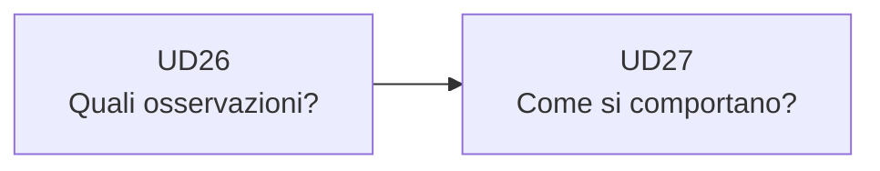

# UD26 — Raccordo con il percorso
# Dal DataFrame alla statistica descrittiva

## Che cosa sappiamo fare ora

```text
CSV
 ↓
DataFrame
 ↓
selezione di colonne
 ↓
filtri
 ↓
sottoinsiemi di osservazioni
```

Abbiamo quindi imparato a scegliere **quali dati** vogliamo osservare.

## La domanda successiva

Supponiamo di aver selezionato:

```text
service = frontend
endpoint = /products
```

Ora possiamo chiedere:

> Come descriviamo il comportamento delle durate di questo gruppo?

Per rispondere serviranno concetti nuovi:

```text
conteggio
minimo
massimo
media
mediana
p95
```

Questi appartengono alla UD27.

## Confine da mantenere

In UD26:

> selezioniamo i dati.

In UD27:

> descriviamo numericamente i dati selezionati.


