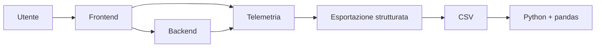
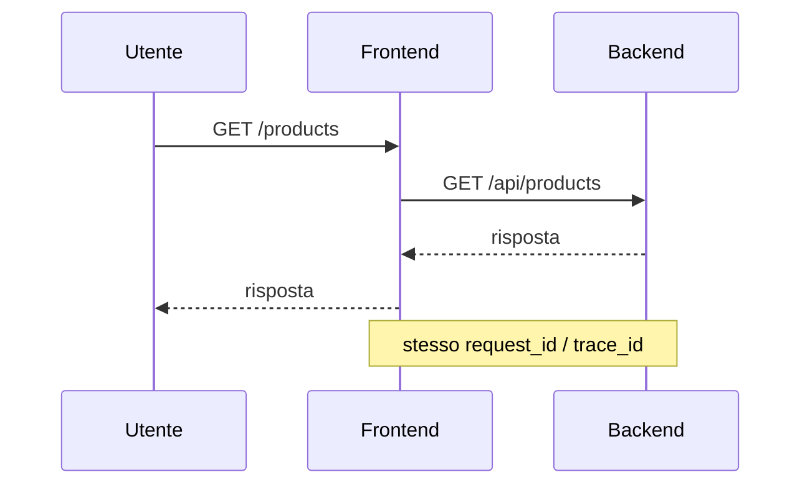

# UD26 — Guida architetturale
# Dove si colloca il dataset

## 1. Il dataset non sostituisce gli strumenti di Observability

Durante il percorso abbiamo già incontrato sistemi che producono o raccolgono telemetria.

Il CSV di questa UD è una rappresentazione tabellare semplificata di osservazioni tecniche.



Lo scopo non è sostituire Prometheus, Grafana, Application Insights o Jaeger.

Lo scopo è imparare a ragionare sui dati quando sono disponibili in forma tabellare.

---

## 2. Una richiesta può produrre più osservazioni

Nel nostro mini dataset possiamo trovare due righe con lo stesso `request_id` e `trace_id`:

```text
frontend  /products
backend   /api/products
```

Questo accade perché la stessa richiesta attraversa più servizi.



Ogni riga mantiene però un proprio `observation_id`.

---

## 3. Il concetto importante della UD

```text
SISTEMA
  ↓ produce segnali
TELEMETRIA
  ↓ può essere esportata
DATI TABELLARI
  ↓ caricati con pandas
DATAFRAME
  ↓ possiamo selezionare e filtrare
SOTTOINSIEME DI OSSERVAZIONI
```

In questa UD ci fermiamo qui.
