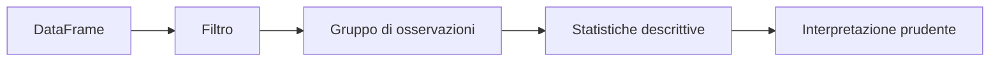
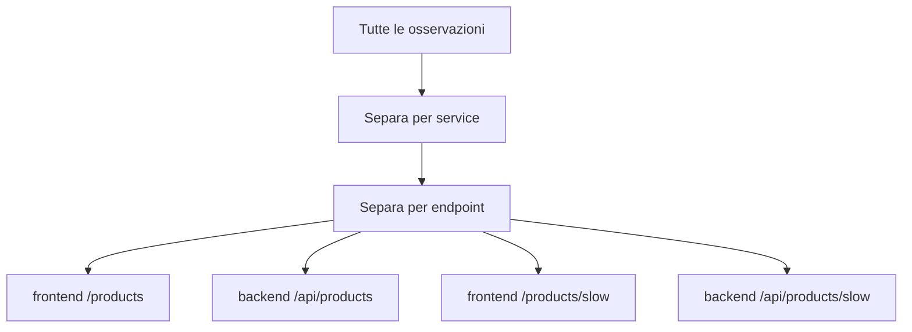

# UD27 — Concetti
# Statistica descrittiva e gruppi 

## 1. La domanda della giornata

In UD26 abbiamo imparato a selezionare osservazioni da un DataFrame.

Per esempio:

```python
frontend_rows = data[data["service"] == "frontend"]
```

Questo ci permette di vedere **quali righe** appartengono al frontend.

Ora vogliamo fare un passo diverso:

> Come possiamo descrivere sinteticamente il comportamento di quelle righe?

La risposta è usare poche **statistiche descrittive**.



La parola importante è **descrittive**: queste statistiche descrivono i dati disponibili. Non diagnosticano automaticamente un problema.

---

## 2. Prima dei numeri: che cosa stiamo descrivendo?

Consideriamo cinque durate in millisecondi:

```text
100   105   110   115   900
```

Sono cinque osservazioni dello stesso fenomeno.

Possiamo farci alcune domande semplici:

- quanti valori abbiamo?
- qual è il più piccolo?
- qual è il più grande?
- dove si trova il centro dei valori?
- esiste un valore molto lontano dagli altri?

Le statistiche ci aiutano a rispondere.

---

## 3. Count, minimo e massimo

### Count

Il **count** è il numero delle osservazioni.

```text
100   105   110   115   900

count = 5
```

### Minimo

Il **minimo** è il valore più piccolo:

```text
min = 100
```

### Massimo

Il **massimo** è il valore più grande:

```text
max = 900
```

Queste statistiche sono immediate, ma da sole non descrivono il comportamento tipico.

---

## 4. Media

La **media aritmetica** usa tutti i valori:

```text
100 + 105 + 110 + 115 + 900 = 1330
1330 / 5 = 266
```

Quindi:

```text
media = 266
```

Ma osserviamo i dati:

```text
100   105   110   115                         900
└──── valori vicini tra loro ────┘             ↑
                                         valore molto alto
```

La maggior parte dei valori è vicina a `100–115`, ma la media è `266`.

Perché?

Perché il valore `900` pesa nel calcolo e trascina la media verso l'alto.

### Da ricordare

> La media usa tutti i valori ed è sensibile ai valori molto alti o molto bassi.

---

## 5. Mediana

Per trovare la **mediana** ordiniamo i valori e prendiamo quello centrale.

```text
100   105   110   115   900
            ↑
         mediana
```

Quindi:

```text
mediana = 110
```

La mediana non ignora il valore `900`, ma il suo valore non viene trascinato verso l'alto nello stesso modo della media.

### Confronto

```text
media   = 266
mediana = 110
```

La grande distanza tra media e mediana ci suggerisce che la distribuzione contiene valori elevati rispetto alla maggioranza.

Non ci dice ancora **perché**.

---

## 6. Perché non dobbiamo mescolare tutto

Il dataset contiene servizi ed endpoint con comportamenti differenti.

Per esempio:

```text
frontend /products
backend  /api/products
frontend /products/slow
backend  /api/products/slow
```

Un endpoint chiamato `/products/slow` è stato costruito proprio per rispondere più lentamente.

Se mescoliamo tutte le durate:

```text
richieste normali + richieste slow
                ↓
           una sola media
```

otteniamo un numero che descrive male entrambi i comportamenti.

È più utile separare gruppi coerenti:



### Da ricordare

> Prima di confrontare numeri, dobbiamo essere sicuri di confrontare fenomeni comparabili.

---

## 7. Dal filtro manuale a `groupby`

In UD26 abbiamo imparato a selezionare un gruppo esplicitamente:

```python
selected = data[
    (data["service"] == "frontend")
    & (data["endpoint"] == "/products")
]
```

Questa operazione è importante perché rende evidente **quale gruppo** stiamo analizzando.

Se però volessimo ripetere lo stesso calcolo per tutti i servizi e tutti gli endpoint, dovremmo scrivere molti filtri.

`groupby` automatizza questa separazione:

```python
groups = data.groupby(["service", "endpoint"])["duration_ms"]
```

Leggiamolo come una frase:

```text
prendi data
→ separa le righe per service ed endpoint
→ per ogni gruppo considera duration_ms
```

`groupby` non introduce una nuova idea statistica.

Automatizza un'operazione che abbiamo già compreso manualmente.

---

## 8. Il p95: descrivere la parte lenta

Media e mediana descrivono il centro della distribuzione.

A volte ci interessa anche la parte più lenta delle richieste.

Il **p95**, cioè il 95° percentile, risponde approssimativamente a questa domanda:

> Qual è il valore sotto il quale ricade circa il 95% delle osservazioni?

Immaginiamo le durate ordinate:

```text
più veloci                                         più lente
|-------------------------------------------------------|
0%                         50%                     95% 100%
                                                   ↑
                                                  p95
```

Il p95 non è:

- il massimo;
- il 95% della media;
- una soglia automatica di anomalia;
- la prova di un incidente.

È una statistica che ci aiuta a descrivere la **coda lenta**.

In pandas:

```python
p95 = selected["duration_ms"].quantile(0.95)
```

In questa UD ci interessa soprattutto comprenderne il significato.

---

## 9. Tabella e grafico rispondono a domande differenti

Una tabella di statistiche può dirci:

```text
count = 9
media = 234.95 ms
mediana = 185.18 ms
p95 = 426.34 ms
```

Ma non ci dice **quando** sono comparsi i valori più alti.

Un grafico temporale conserva l'ordine delle osservazioni:

```text
duration_ms
   ↑
500|             ●
400|        ●
300|
200| ●  ●       ●
100|____________________________→ tempo
```

Per questo tabella e grafico sono complementari.

---

## 10. Che cosa possiamo e non possiamo concludere

Dopo questa UD possiamo dire:

- quale gruppo ha una media maggiore;
- quale gruppo ha una mediana maggiore;
- quale gruppo presenta un p95 maggiore;
- come cambiano le durate nel tempo.

Non possiamo ancora dire automaticamente:

```text
"questa osservazione è anomala"
"questo è un incidente"
"questa è la root cause"
```

Per farlo dovremo prima definire un **comportamento di riferimento**.

Questo sarà il passo della UD28.

---

## 11. Da ricordare

1. La media usa tutti i valori ed è sensibile agli estremi.
2. La mediana rappresenta il valore centrale dei dati ordinati.
3. Gruppi differenti devono essere descritti separatamente.
4. `groupby` automatizza una separazione che sappiamo già fare con i filtri.
5. Il p95 descrive la parte lenta, ma non è automaticamente una soglia di anomalia.
6. Descrivere un comportamento non significa ancora diagnosticare un problema.
