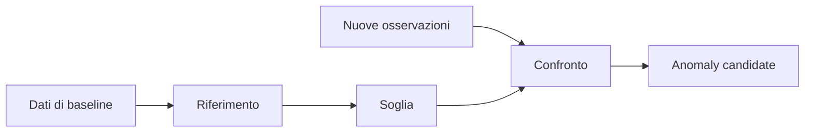
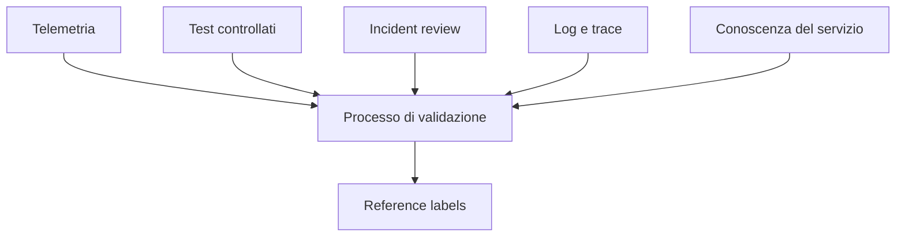

# UD28 — Concetti
# Baseline, detection e ground truth

## 1. Dalla descrizione al confronto

UD27 ci ha insegnato a descrivere un gruppo.

UD28 introduce una domanda nuova:

> Rispetto a quale comportamento decidiamo che una nuova osservazione merita attenzione?



Una **anomaly candidate** è una segnalazione prodotta da una regola. Non è automaticamente un incidente e non identifica una root cause.

---

## 2. Perché abbiamo tre file

### A. `baseline_products_requests.csv`

Contiene **60 osservazioni** di un periodo precedente considerato stabile per l'esercizio.

```text
08:00 ... 09:58
        ↓
mediana + MAD
        ↓
soglia
```

Le sue `observation_id` sono:

```text
base-001 ... base-060
```

### B. `evaluation_products_requests.csv`

Contiene **20 osservazioni successive** sulle quali applichiamo la soglia.

```text
10:00 ... 10:38
        ↓
detector
        ↓
prediction
```

Le sue `observation_id` sono:

```text
eval-001 ... eval-020
```

### C. `products_reference_labels.csv`

Non contiene una seconda rilevazione.

Contiene **20 label**, una per ciascuna delle **stesse osservazioni `eval-*`** del file evaluation.

```text
evaluation_products_requests.csv      products_reference_labels.csv

eval-001  --------------------------  eval-001
eval-002  --------------------------  eval-002
eval-003  --------------------------  eval-003
```

La relazione è:

```text
stessa observation_id
= stessa osservazione
= informazioni con ruoli differenti
```

---

## 3. Baseline

Una baseline rappresenta il comportamento di riferimento scelto per il confronto.

Nel laboratorio usiamo **60 osservazioni di baseline** raccolte tra le 08:00 e le 09:58, una ogni due minuti.
Il set di evaluation contiene invece **20 osservazioni successive**.

```text
BASELINE — 60 osservazioni
● ● ● ● ● ● ● ● ● ● ● ● ● ● ● ● ● ● ● ● ...
                    ↓
             mediana + MAD
                    ↓
                 soglia

EVALUATION — 20 nuove osservazioni
● ● ● ● ● ● ● ● ● ● ...
                    ↓
            applico la soglia
```

La baseline è volutamente più numerosa: un punto di riferimento è più credibile se deriva da un insieme più ampio di osservazioni del comportamento stabile, non da un campione della stessa dimensione del test.

> Più righe, da sole, non garantiscono una buona baseline: devono rappresentare davvero un periodo e un contesto coerenti con il comportamento che vogliamo usare come riferimento.

Nel dataset fornito la normale variabilità delle 60 durate produce:

```text
mediana = 166,5 ms
MAD     =   7,5 ms
```

La baseline non è una “verità eterna”. Dipende:

- dal periodo scelto;
- dal servizio;
- dall'endpoint;
- dal contesto operativo.

---

## 4. MAD con un esempio piccolo

Prima del dataset completo:

```text
100 102 105 108 110
```

Mediana:

```text
105
```

Distanze assolute dalla mediana:

```text
5 3 0 3 5
```

Mediana delle distanze:

```text
MAD = 3
```

MAD significa **Median Absolute Deviation**.

Ci aiuta a descrivere quanto i valori si allontanano tipicamente dalla mediana.

---

## 5. Costruire una soglia

Nel nostro esercizio:

```text
mediana baseline = 166,5 ms
MAD              =   7,5 ms
moltiplicatore    =   4
```

Quindi:

```text
soglia = 166,5 + 4 × 7,5
       = 196,5 ms
```

Il moltiplicatore `4` è una **scelta tecnica dell'esperimento**, non una legge universale.

Il detector usa una sola regola:

```text
duration_ms > 196,5
        ↓
anomaly candidate
```

---

## 6. Il detector vede solo ciò che gli diamo

Il detector della UD28 usa una sola informazione:

```text
duration_ms
```

Non usa:

```text
status_code
log
trace
informazioni del test
incident review
conoscenza del service owner
```

Questo limite è intenzionale: ci permette di capire perché un detector semplice può produrre errori.

---

## 7. Chi crea la ground truth in un contesto reale?

La ground truth non viene prodotta dal detector che vogliamo valutare.

In un contesto reale può derivare da un processo di validazione che combina:



Possono contribuire:

- SRE / Operations;
- Service Owner;
- sviluppatori;
- QA / team di test;
- team che conduce incident review o postmortem.

Nel laboratorio rappresentiamo il risultato di questo processo con:

```text
products_reference_labels.csv
```

Nel mondo reale queste informazioni possono provenire da ticket, postmortem, test controllati, sistemi di incident management o revisioni tecniche e solo successivamente essere trasformate in un dataset etichettato.

---

## 8. Le colonne del reference file

```text
reference_label
→ qual è la classificazione di riferimento?

reference_reason
→ perché è stata assegnata quella classificazione?

label_source
→ da quale processo di validazione deriva?
```

Esempio:

```text
observation_id       eval-005
reference_label      anomaly
reference_reason     Risposta HTTP 500 inattesa confermata durante la revisione tecnica
label_source         incident_review
```

### Importante

```text
reference_reason
≠ root cause
```

“Status HTTP 500 inatteso” spiega perché il caso è classificato come anomaly.

Non dimostra automaticamente che la causa sia, per esempio, “database sovraccarico”.

---

## 9. Prediction e reference sono indipendenti

Ordine corretto:

```text
1. baseline → soglia
2. evaluation data → prediction
3. solo dopo → reference labels
4. confronto
```

Il detector non deve conoscere prima la risposta di riferimento.

---

## 10. TP, FP, FN, TN

| Reference | Prediction | Risultato |
|---|---|---|
| anomaly | anomaly | TP — vero positivo |
| normal | anomaly | FP — falso positivo |
| anomaly | normal | FN — falso negativo |
| normal | normal | TN — vero negativo |

### Il falso negativo reale del laboratorio

```text
eval-005

duration_ms = 190
status_code = 500
```

Detector:

```text
190 < 196,5
→ predicted = normal
```

Reference:

```text
reference_label = anomaly
reference_reason = Risposta HTTP 500 inattesa confermata durante la revisione tecnica
```

Quindi:

```text
prediction = normal
reference  = anomaly
→ FALSE NEGATIVE
```

Il detector lo perde perché usa **solo `duration_ms`** e non usa `status_code`.

---

## 11. Precision e recall

### Precision

Domanda:

> Tra i casi segnalati dal detector, quanti erano davvero anomaly secondo il riferimento?

### Recall

Domanda:

> Tra tutte le anomaly di riferimento, quante ne ha trovate il detector?

Nel laboratorio, con moltiplicatore `4`:

```text
TP = 4
FP = 2
FN = 1
TN = 13

precision = 4 / (4 + 2) ≈ 0,67
recall    = 4 / (4 + 1) = 0,80
```

---

## 12. Da ricordare

1. La baseline costruisce il riferimento statistico.
2. Il file evaluation contiene osservazioni successive da testare.
3. Il reference file descrive le stesse observation_id del file evaluation, non nuovi eventi.
4. La ground truth deriva da un processo di validazione indipendente dal detector.
5. `reference_reason` spiega la label, non necessariamente la root cause.
6. Un detector basato su una sola feature può perdere anomalie visibili in altri segnali.
7. Una anomaly candidate non è automaticamente un incidente.
