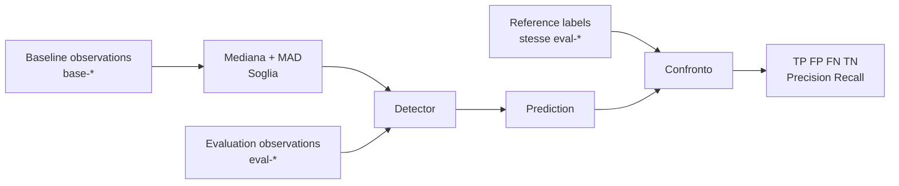

# UD28 — Guida architetturale
# Dati, detector e reference



## Relazioni corrette

### Baseline ↔ Evaluation

Sono **osservazioni differenti**, raccolte in periodi differenti.

Non vengono confrontate riga per riga.

La baseline produce un riferimento statistico che viene applicato alle evaluation observations.

### Evaluation ↔ Reference

Sono informazioni sulla **stessa observation_id**.

```text
eval-005 dati osservati
↔
eval-005 classificazione di riferimento
```

Il reference file non rappresenta un nuovo evento.

## Processo reale di labeling

```text
SRE / Operations
+ Service Owner
+ QA / controlled tests
+ incident review
+ evidenze log/trace
        ↓
validazione
        ↓
label di riferimento
```

Il CSV del laboratorio rappresenta il risultato finale di questo processo.
