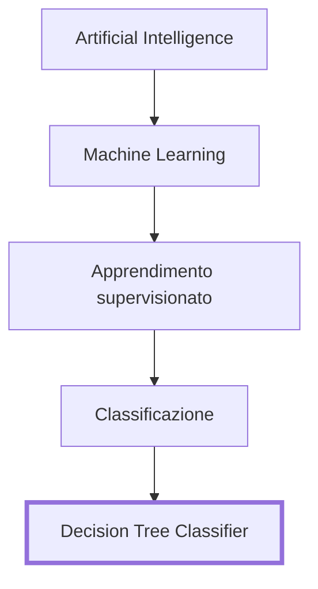
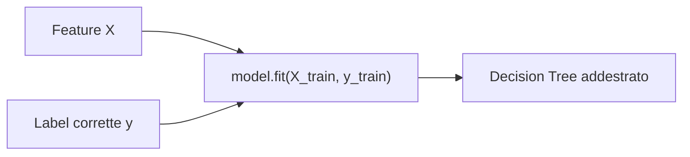
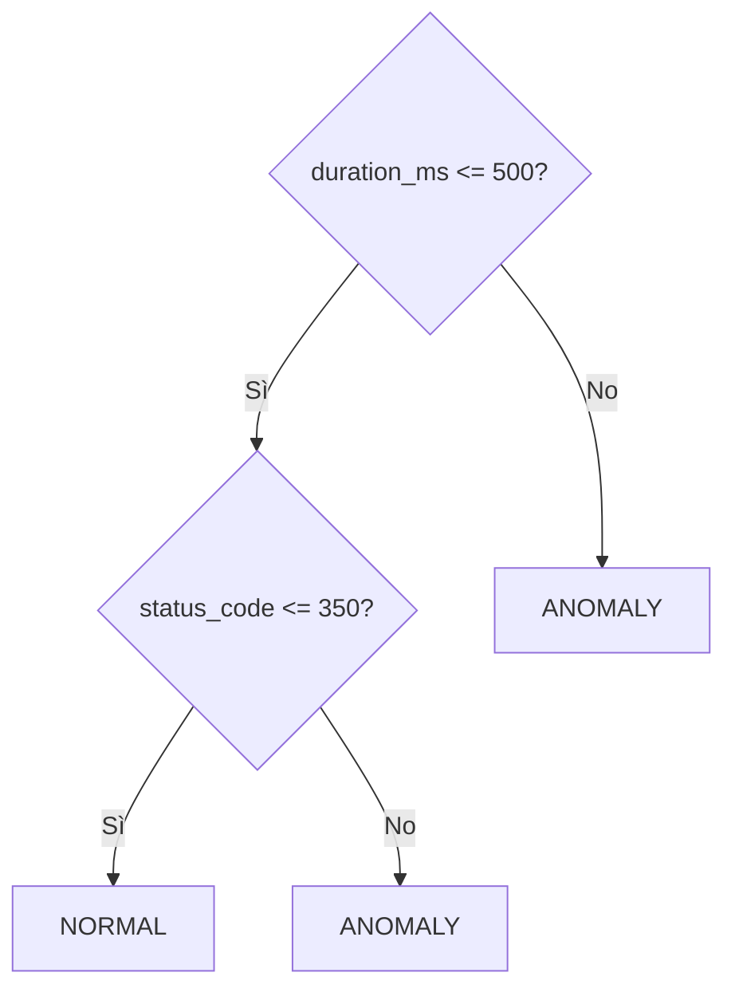
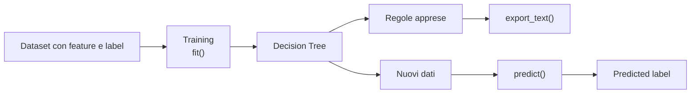

# UD29 — Come impara un Decision Tree

## Che tipo di AI stiamo usando e come avviene l'apprendimento

---

## 1. Dove si colloca il modello usato nella UD29

Nel laboratorio utilizziamo:

```python
from sklearn.tree import DecisionTreeClassifier, export_text
```

Il modello appartiene a questa famiglia:



Quindi nella UD29 **non stiamo usando** una rete neurale, Deep Learning, un LLM o AI generativa.

Stiamo usando un algoritmo di **Machine Learning supervisionato per classificare osservazioni**.

---

# 2. Perché si chiama apprendimento supervisionato

Durante il training il modello riceve:

```text
FEATURE
ciò che può osservare

+

LABEL
la risposta corretta già nota
```

Esempio:

| duration_ms | status_code | reference_label |
|---:|---:|---|
| 120 | 200 | NORMAL |
| 180 | 200 | NORMAL |
| 850 | 200 | ANOMALY |
| 160 | 500 | ANOMALY |

Le feature sono gli input del modello; la label è ciò che vogliamo imparare a prevedere.



La presenza delle label corrette rende l'apprendimento **supervisionato**.

---

# 3. Dove avviene realmente l'apprendimento

Quando scriviamo:

```python
model = DecisionTreeClassifier(max_depth=2)
```

abbiamo creato l'algoritmo, ma il modello **non ha ancora imparato nulla dai nostri dati**.

L'apprendimento avviene qui:

```python
model.fit(X_train, y_train)
```

Possiamo leggere `fit()` così:

```text
osserva gli esempi di training
        ↓
cerca come separare le classi
        ↓
sceglie le separazioni più utili
        ↓
costruisce nodi e rami
        ↓
produce un albero decisionale
```

---

# 4. Come nasce una regola dell'albero

All'inizio le classi possono essere mescolate:

```text
NORMAL   NORMAL   ANOMALY   NORMAL   ANOMALY
```

Il Decision Tree prova possibili domande, per esempio:

```text
duration_ms <= 500 ?
status_code <= 350 ?
```

Ogni domanda divide le osservazioni in due gruppi.

Il modello preferisce le divisioni che separano meglio le classi.



Queste regole **non sono state scritte dal programmatore**: vengono costruite automaticamente durante `fit()`.

---

# 5. Che cosa significa "purezza"

Un nodo è più puro quando contiene soprattutto osservazioni della stessa classe.

Molto puro:

```text
NORMAL
NORMAL
NORMAL
NORMAL
```

Poco puro:

```text
NORMAL
ANOMALY
NORMAL
ANOMALY
```

Il Decision Tree cerca split che rendano i gruppi figli più omogenei.

```text
gruppo misto
    ↓
provo una separazione
    ↓
ottengo gruppi più omogenei
    ↓
mantengo la separazione se è utile
```

Il `DecisionTreeClassifier` usa un criterio matematico per misurare questa impurità; uno dei criteri più comuni è **Gini**.

Per la UD29 non serve calcolarlo manualmente. È sufficiente capire che:

> **il modello preferisce le separazioni che distinguono meglio NORMAL da ANOMALY.**

---

# 6. Se cerca la purezza, perché usiamo `max_depth=2`?

Il Decision Tree potrebbe continuare a creare split per rendere le foglie sempre più pure.

Ma un albero troppo profondo può diventare:

- troppo complesso;
- difficile da leggere;
- troppo legato ai dettagli del training;
- meno efficace su nuovi dati.

Questo rischio si chiama **overfitting**.

```text
più profondità
      ↓
più split
      ↓
maggiore purezza sul training
      ↓
regole più specifiche
      ↓
rischio di overfitting
```

Con:

```python
max_depth=2
```

limitiamo volontariamente la crescita dell'albero.

Accettiamo quindi che alcune foglie possano non essere perfettamente pure, in cambio di:

```text
albero più semplice
      +
regole più leggibili
      +
minore rischio di overfitting
      +
maggiore capacità di generalizzare
```

Quindi:

> **Il Decision Tree cerca split che aumentano la purezza, ma noi possiamo limitarne la profondità per evitare che impari troppo bene i dettagli del training.**

`max_depth=2` non è una regola generale del Machine Learning.

Nella UD29 è una scelta soprattutto didattica e di controllo della complessità.

---

# 7. Perché può comparire `status_code <= 350`

Una regola come:

```text
status_code <= 350
```

può sembrare strana.

Il motivo è che il Decision Tree **non conosce la semantica del protocollo HTTP**.

Per il modello `status_code` è semplicemente un numero.

Se nel training compaiono soprattutto:

```text
200
500
```

una soglia intermedia può separarli bene:

```text
200 ----------- 350 ----------- 500
 |               |               |
osservato       soglia          osservato
```

La soglia `350` non significa:

```text
"tutti gli status <= 350 sono corretti"
```

Significa:

```text
"questa soglia separa bene
gli esempi presenti nel training"
```

Questa distinzione è fondamentale:

```text
REGOLA DI DOMINIO
status_code >= 400
```

deriva dalla conoscenza del protocollo HTTP.

Mentre:

```text
REGOLA APPRESA
status_code <= 350
```

deriva dalla distribuzione dei dati.

Per questo una regola appresa deve comunque essere interpretata da chi conosce il sistema reale.

---

# 8. `fit()` e `predict()` fanno due lavori diversi

## Training

```python
model.fit(X_train, y_train)
```

Significa:

```text
IMPARA
```

Il modello costruisce l'albero.

## Inference

```python
predictions = model.predict(X_test)
```

Significa:

```text
USA CIÒ CHE HA IMPARATO
```

Una nuova osservazione attraversa l'albero:

```text
nuova osservazione
      ↓
prima regola
      ↓
ramo scelto
      ↓
seconda regola
      ↓
foglia
      ↓
predicted_label
```

Quindi:

```text
fit()      = apprendimento
predict()  = classificazione di nuovi dati
```

---

# 9. Che cosa ci mostra `export_text()`

Dopo il training possiamo usare:

```python
export_text(model)
```

per vedere una rappresentazione leggibile delle regole apprese.

Esempio:

```text
|--- duration_ms <= 500
|   |--- status_code <= 350
|   |   |--- class: NORMAL
|   |--- status_code > 350
|   |   |--- class: ANOMALY
|--- duration_ms > 500
|   |--- class: ANOMALY
```

La sequenza è:

```text
DecisionTreeClassifier(...)
        ↓
creazione dell'algoritmo

fit(...)
        ↓
apprendimento delle regole

export_text(...)
        ↓
lettura delle regole apprese

predict(...)
        ↓
uso delle regole su nuovi dati
```

---

# 10. Perché il Decision Tree è utile nella UD29

Il Decision Tree permette di introdurre il Machine Learning senza trasformare subito il modello in una scatola nera.

Possiamo:

```text
vedere le feature
      ↓
vedere le soglie
      ↓
seguire i rami
      ↓
capire perché una prediction è stata prodotta
```

Per questo è un buon esempio di **Machine Learning spiegabile**.

Ma:

> **spiegabile non significa automaticamente corretto.**

Possiamo leggere perfettamente una regola e accorgerci che non rappresenta bene la realtà.

---

# 11. Differenza essenziale tra UD28 e UD29

## UD28 — Anomaly Detection statistica

```text
dati storici
    ↓
baseline
    ↓
soglia
    ↓
nuova osservazione
    ↓
confronto con la soglia
```

Domanda:

> Quanto questa osservazione si discosta dal comportamento di riferimento?

## UD29 — Machine Learning supervisionato

```text
feature + label corrette
        ↓
training
        ↓
regole apprese
        ↓
nuove osservazioni
        ↓
prediction
```

Domanda:

> Quali combinazioni delle feature separano meglio NORMAL da ANOMALY?

Questo è il salto concettuale principale della UD29.

---

# 12. Schema finale



La sequenza da ricordare è:

```text
DATI ETICHETTATI
        ↓
fit()
        ↓
APPRENDIMENTO
        ↓
ALBERO DI REGOLE
        ↓
predict()
        ↓
PREDIZIONE
```

---

# 13. Concetti chiave

**1.** Il modello usato nella UD29 è un **Decision Tree di Machine Learning supervisionato**.

**2.** L'apprendimento avviene con:

```python
model.fit(X_train, y_train)
```

**3.** Il modello cerca split che rendono le classi più separate, aumentando la purezza dei nodi.

**4.** `max_depth=2` limita intenzionalmente la complessità: non cerchiamo la massima purezza possibile a ogni costo.

**5.** Una soglia come:

```text
status_code <= 350
```

è una separazione appresa dai dati, non una regola semantica del protocollo HTTP.

**6.** Con:

```python
model.predict(...)
```

il modello applica a nuovi dati ciò che ha già imparato.

**7.** Con:

```python
export_text(...)
```

possiamo leggere le regole costruite durante il training.

> **Nel Decision Tree il programmatore non scrive direttamente le regole di classificazione: fornisce esempi etichettati e l'algoritmo costruisce automaticamente le separazioni che distinguono meglio le classi, entro i limiti di complessità che gli imponiamo.**
