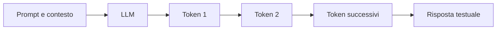
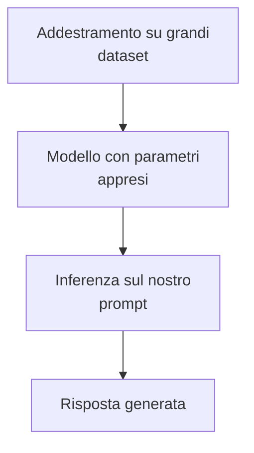
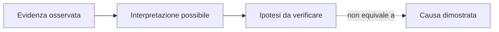

# UD30 — Dal Machine Learning agli LLM

## Perché questa unità arriva dopo UD29

Nella UD29 abbiamo usato un Decision Tree per produrre una previsione strutturata. Il modello riceveva feature numeriche e restituiva una classe, per esempio:

```text
status_code = 500
duration_ms = 1800
error_count = 7
        ↓
Decision Tree
        ↓
anomalia = sì
```

Il risultato aveva un insieme limitato di valori possibili. Un Large Language Model opera in modo diverso:

```text
evidenze testuali + istruzione
        ↓
LLM
        ↓
testo, sintesi, spiegazioni e ipotesi
```

Cosa succede quando il nostro strumento possiede un modello che produce **linguaggio naturale** e che le risposte che otteniamo che appaiaono convincenti anche quando contiene conclusioni non dimostrate?

---

## 1. Che cos’è un modello

Un modello è una rappresentazione appresa dai dati che viene usata per produrre un risultato su un nuovo input.

Nel Decision Tree il risultato poteva essere una classe. In un LLM il risultato è una sequenza di elementi linguistici chiamati **token**.

La parola modello non indica:

- un’applicazione completa;
- una chat grafica;
- un database di risposte già scritte;
- una persona che ragiona dietro lo schermo.

Indica il componente matematico che elabora l’input e calcola quali token generare.

---

## 2. Che cos’è un Large Language Model

Un **Large Language Model**, abbreviato in **LLM**, è un modello addestrato su grandi quantità di testo per elaborare sequenze linguistiche e generare una continuazione coerente con il contesto ricevuto.

La definizione contiene quattro elementi.

### Large

Il modello possiede un numero elevato di valori appresi, chiamati **parametri**. Non è necessario conoscere qui la matematica con cui vengono aggiornati. È sufficiente comprendere che i parametri rappresentano regolarità apprese durante l’addestramento.

### Language

Il modello lavora con sequenze che rappresentano testo. Può quindi riassumere, riscrivere, tradurre, classificare, spiegare e generare codice o ipotesi.

### Model

Non è una fonte automaticamente affidabile. È un sistema che calcola una risposta coerente con il contesto e con ciò che ha appreso.

### Generativo

Non seleziona soltanto una classe. Produce progressivamente una nuova sequenza di token.



---

## 3. Token: il testo visto dal modello

Un token è un’unità usata dal modello per rappresentare il testo. Un token può corrispondere:

- a una parola;
- a una parte di parola;
- a un segno di punteggiatura;
- a uno spazio o a una sequenza frequente.

Non dobbiamo quindi assumere che:

```text
1 parola = 1 token
```

Per questa UD è importante perché:

- il prompt utilizza token;
- la risposta genera token;
- un contesto più lungo richiede più elaborazione e memoria;
- Utilizzeremo lo strumento Ollama che restituisce il numero di token elaborati e generati.

Non studieremo gli algoritmi di tokenizzazione. Osserveremo soltanto i contatori forniti dal runtime.

> I token sono le unità con cui l’LLM legge e produce il testo. Il loro numero influenza quantità di contesto disponibile, memoria richiesta, latenza e capacità del modello di analizzare correttamente le evidenze.

---

## 4. Addestramento e inferenza

### Addestramento

Durante l’addestramento il modello apprende regolarità da grandi raccolte di dati. È una fase costosa che non svolgeremo nel corso.

### Inferenza

L’inferenza è l’uso di un modello già addestrato per produrre una risposta.



Nella UD30 eseguiremo esclusivamente inferenza.

---

## 5. Prompt e contesto

Il **prompt** è l’istruzione fornita al modello. Il **contesto** comprende tutto ciò che il modello può usare nella richiesta corrente:

- istruzioni;
- testo dell’incidente;
- messaggi precedenti della conversazione;
- eventuali documenti o dati aggiunti dall’applicazione;
- istruzioni di sistema non sempre visibili all’utente.

Esempio generico:

```text
Analizza questo incidente e indicane la causa.
```

Esempio più controllato:

```text
Usa soltanto le evidenze fornite.
Separa fatti, ipotesi e verifiche necessarie.
Non presentare come certa una causa non dimostrata.
```

La seconda formulazione non rende il modello infallibile. Rende però più facile verificare il risultato.

---

## 6. Finestra di contesto

La finestra di contesto è la quantità massima di token che il modello può gestire nella richiesta o conversazione.

Una finestra più ampia permette di fornire più materiale, ma comporta normalmente un maggior uso di memoria e tempo di elaborazione. Nel laboratorio useremo evidence packet piccoli: non è necessario configurare finestre estreme.

Il concetto importante è questo:

> Se un’informazione non è nel contesto e il modello non può ricavarla in modo affidabile, la risposta può colmare il vuoto con una continuazione plausibile.

---

## 7. Perché la risposta non è una prova

Consideriamo queste evidenze:

```text
- p95 aumentato da 420 ms a 1.840 ms;
- nuova release alle 14:25;
- trace lento: 1.350 ms nella chiamata al database;
- CPU del database non disponibile.
```

Il modello potrebbe rispondere:

```text
La nuova release ha introdotto una query inefficiente che ha saturato la CPU del database.
```

La frase è plausibile, ma contiene due affermazioni non dimostrate:

1. la nuova release ha introdotto una query inefficiente;
2. la CPU del database è satura.

Le evidenze mostrano una correlazione temporale e un’attesa elevata sul database. Non dimostrano ancora né la regressione né la saturazione della CPU.



---

## 8. Capacità generali degli LLM

Un LLM può essere utile per:

- sintetizzare testi;
- estrarre elementi da un documento;
- riorganizzare informazioni;
- spiegare un concetto;
- proporre una struttura;
- generare esempi e codice;
- confrontare alternative;
- formulare ipotesi;
- trasformare dati tecnici in una comunicazione comprensibile.

Queste capacità derivano dall’elaborazione del linguaggio. Non implicano che il modello:

- osservi direttamente il nostro sistema;
- possieda dati aggiornati sul nostro incidente;
- abbia accesso automatico a log, metriche e trace;
- distingua sempre un fatto da un’ipotesi;
- sia responsabile della decisione operativa.

---

## 9. Limiti da ricordare

### Plausibilità senza prova

Il modello può completare informazioni mancanti con affermazioni coerenti ma non supportate.

### Dipendenza dal prompt

Una richiesta vaga può produrre una risposta vaga o troppo sicura. Una richiesta più strutturata migliora la forma del risultato, ma non garantisce la verità.

### Variabilità

Due esecuzioni possono produrre formulazioni o contenuti non identici. Il comportamento dipende dal modello e dai parametri di generazione.

### Conoscenza non coincidente con lo stato reale

Il modello può conoscere concetti generali su database e latenza, ma non conosce automaticamente lo stato del Catalogo prodotti alle 14:32.

### Qualità difficile da misurare

Latenza e token sono misure tecniche. Non dimostrano che la risposta sia utile, corretta o supportata dalle evidenze.

---

## 10. Quale uso faremo dell’LLM nella UD30

L’LLM non verrà usato per:

- sostituire l’operatore;
- addestrare un nuovo modello;
- costruire un chatbot aziendale;
- implementare RAG, agenti o tool calling;
- accedere direttamente all’infrastruttura;
- dichiarare automaticamente la root cause.

Verrà usato per:

1. organizzare un insieme di evidenze;
2. separare fatti e ipotesi;
3. proporre verifiche successive;
4. preparare una sintesi tecnica;
5. confrontare risposte generate da sistemi diversi;
6. osservare latenza e token della chiamata locale.

La competenza finale non è “saper fare domande all’AI”. È:

> saper integrare un LLM in un processo di analisi mantenendo la tracciabilità tra affermazioni ed evidenze.

---

## Domande di controllo

1. In che cosa l’output di un LLM differisce dalla classe prodotta da un Decision Tree?
2. Perché una risposta linguisticamente convincente non costituisce una prova?
3. Che differenza c’è tra addestramento e inferenza?
4. Perché il numero di token è rilevante nell’esecuzione locale?
5. Quale ruolo avrà l’LLM nell’analisi dell’incidente del laboratorio?
