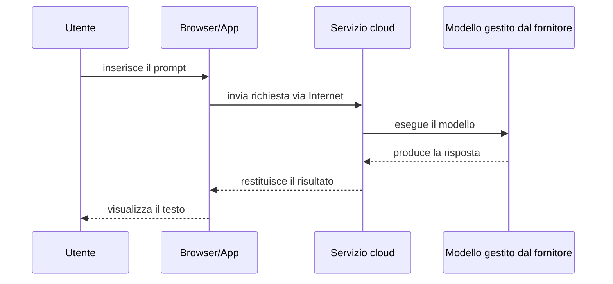
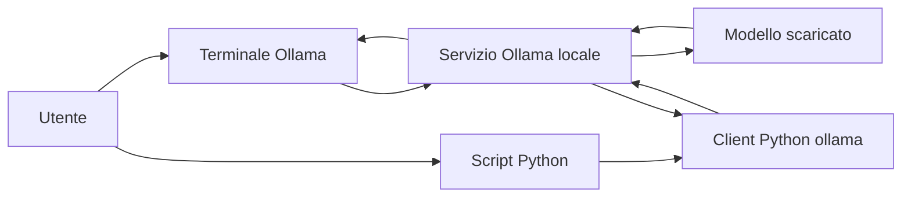
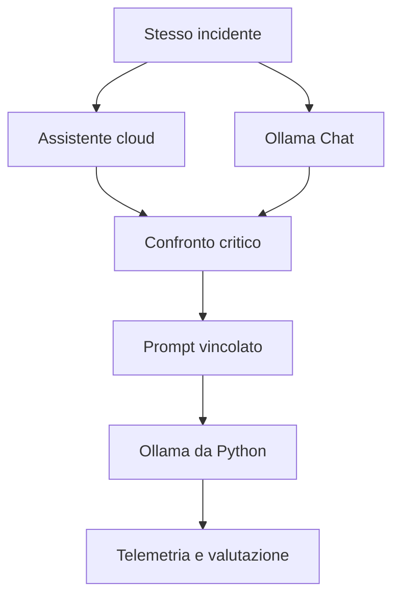

# UD30 — Assistenti cloud, Ollama e modelli locali

## 1. Prodotto, modello e runtime non sono sinonimi

Quando una persona utilizza ChatGPT, Gemini o Claude vede un prodotto conversazionale completo. Il prodotto può includere:

- interfaccia web o applicazione;
- gestione della conversazione;
- uno o più modelli;
- istruzioni di sistema;
- strumenti aggiuntivi;
- ricerca web o accesso a file;
- limiti e funzioni dipendenti dal piano.

Il nome del prodotto non coincide necessariamente con il nome di un singolo modello.

```text
ChatGPT  → prodotto di OpenAI
Gemini   → prodotto/assistente di Google e famiglia di modelli
Claude   → prodotto di Anthropic e famiglia di modelli
```

Durante il laboratorio registreremo il nome o la modalità mostrata dall’interfaccia, senza assumere che tutti gli account abbiano le stesse opzioni. Le interfacce e i modelli disponibili possono cambiare nel tempo.

---

## 2. Assistente cloud

In un assistente cloud il flusso tipico è:



### Vantaggi

- utilizzo immediato;
- nessuna gestione locale del modello;
- disponibilità di modelli generalmente più capaci;
- interfacce ricche e integrate.

### Vincoli

- dipendenza dalla connessione e dal servizio;
- account e limiti di utilizzo;
- minore controllo sul runtime;
- modelli e modalità che possono cambiare;
- dati inviati al servizio remoto secondo condizioni e impostazioni del prodotto;
- telemetria interna non completamente visibile all’utente.

---

## 3. Che cos’è Ollama

Ollama è un **runtime** che permette di scaricare, gestire ed eseguire modelli sul computer locale. Offre:

- comandi da terminale;
- un servizio locale;
- API HTTP;
- client ufficiali, tra cui quello Python.

Ollama non è:

- il modello Llama;
- un LLM;
- un concorrente perfettamente equivalente a ChatGPT come prodotto completo;
- una libreria che addestra il modello durante il laboratorio.

La distinzione corretta è:

```text
modello LLM       → genera il testo
Ollama            → gestisce ed esegue il modello
ollama-python     → permette allo script di chiamare Ollama
script Python     → definisce il nostro caso d’uso
```

---

## 4. “Ollama Chat” nel laboratorio

Nella prima parte useremo il comando:

```bash
ollama run llama3.2:1b
```

Il terminale diventa una semplice interfaccia conversazionale. In questa modalità:

```text
persona → terminale Ollama → modello locale
```

Successivamente useremo lo stesso modello da Python:

```text
script Python → client ollama → servizio Ollama → modello locale
```

Il passaggio non serve a ottenere un modello diverso. Serve a rendere l’interazione programmabile e osservabile.

---

## 5. Architettura locale



Per impostazione predefinita, l’API locale di Ollama è esposta su:

```text
http://localhost:11434/api
```

Nel laboratorio non chiameremo direttamente l’API con `curl`. Useremo il client Python ufficiale, che semplifica la richiesta.

---

## 6. Esecuzione locale e privacy

Eseguire un modello localmente significa che la richiesta al modello locale non deve essere inviata a un provider esterno. Questo può offrire maggiore controllo sui dati e sul modello utilizzato.

Tuttavia:

> locale non significa automaticamente sicuro.

Restano necessarie valutazioni su:

- accesso al computer;
- file salvati;
- log e cronologia;
- autorizzazioni;
- origine e licenza del modello;
- eventuali integrazioni cloud attivate;
- dati inseriti nel prompt.

Nella UD useremo solo dati didattici sintetici.

### Regola per gli assistenti cloud

Non inserire in servizi pubblici:

- credenziali;
- dati personali reali;
- dati dei clienti;
- log con token o segreti;
- configurazioni riservate;
- informazioni aziendali non autorizzate.

---

## 7. Confronto corretto tra cloud e locale

Il laboratorio non deve rispondere alla domanda:

```text
Qual è il sistema migliore in assoluto?
```

Il confronto corretto riguarda il comportamento osservato sullo stesso compito.

| Dimensione | Assistente cloud | Ollama con modello locale |
|---|---|---|
| Esecuzione | infrastruttura del fornitore | computer locale |
| Scelta del modello | dipende da prodotto e piano | tag scelto esplicitamente |
| Credenziali | normalmente account richiesto | nessuna API key per API locale |
| Risorse locali | limitate | determinano velocità e modello utilizzabile |
| Telemetria tecnica | parziale o non esposta | token e durate disponibili via API |
| Capacità | spesso elevata | dipende dal modello scaricato |
| Controllo versione | limitato dal prodotto | maggiore usando un tag esplicito |
| Dati | inviati al servizio | elaborati localmente per modelli locali |

---

## 8. Perché confrontare ChatGPT, Gemini, Claude e Ollama

Il confronto iniziale serve a far emergere tre idee.

### Sistemi diversi possono produrre risposte diverse

Le risposte dipendono da:

- modello;
- istruzioni di sistema;
- cronologia della chat;
- strumenti attivi;
- parametri di generazione;
- modalità selezionata;
- dimensione del modello.

### La fluidità non dimostra la correttezza

Una risposta più elegante può contenere più inferenze non supportate.

### Il prompt può migliorare la verificabilità

Chiedere esplicitamente di separare fatti, ipotesi e verifiche produce un risultato più controllabile, ma non garantisce che ogni affermazione sia corretta.

---

## 9. Perché il confronto non è un benchmark scientifico

Per un benchmark rigoroso dovremmo controllare:

- stesso modello o modelli chiaramente identificati;
- stesso prompt;
- stessi parametri;
- stesso numero di esecuzioni;
- stesso contesto;
- criteri di valutazione predefiniti;
- assenza di strumenti aggiuntivi;
- ripetibilità temporale.

Nelle interfacce cloud non controlliamo tutti questi elementi. Per questo il laboratorio è un’**osservazione comparativa guidata**, non una classifica dei fornitori.

Per ridurre le differenze:

1. aprire una nuova conversazione;
2. disattivare ricerca web e strumenti quando possibile;
3. usare lo stesso evidence packet;
4. copiare lo stesso prompt;
5. registrare servizio, data e modalità visualizzata;
6. non modificare il prompt dopo la risposta;
7. applicare la stessa griglia di valutazione.

---

## 10. Uso specifico nella UD30



Il confronto iniziale crea il problema didattico. Python e Observability permettono poi di trattarlo in modo più strutturato.

---

## Domande di controllo

1. Perché ChatGPT non deve essere identificato semplicemente con un singolo modello?
2. Quale componente genera il testo nell’architettura Ollama?
3. Quale ruolo svolge il package Python `ollama`?
4. Perché un modello locale può risultare meno capace di un assistente cloud?
5. Perché il confronto del laboratorio non è un benchmark rigoroso?
