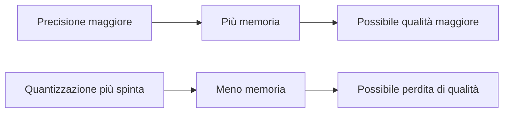
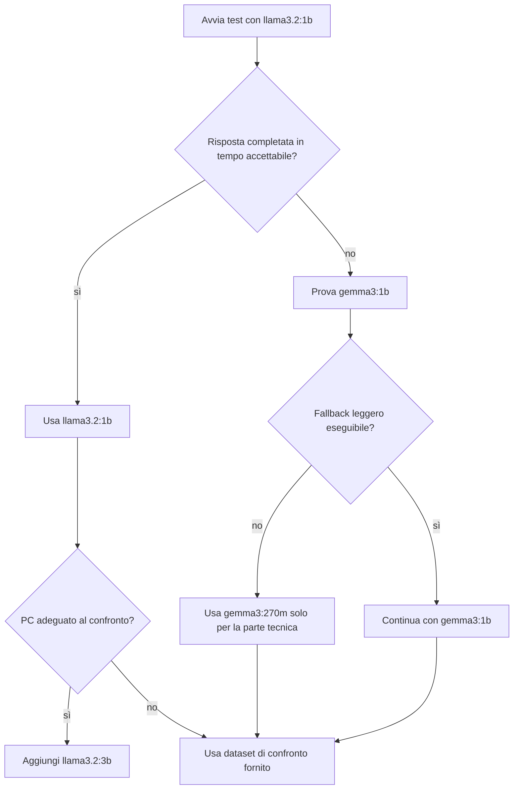

# UD30 — Modelli Ollama: famiglie, tag, dimensioni e quantizzazione

## 1. Ollama esegue modelli differenti

Installare Ollama non significa installare automaticamente un unico LLM. Il runtime può gestire modelli appartenenti a famiglie differenti.

Esempi:

```text
llama3.2:1b
llama3.2:3b
gemma3:1b
gemma3:270m
```

Ogni nome comunica informazioni sul modello. Comprenderle è necessario per scegliere una variante compatibile con l’hardware.

---

## 2. Anatomia semplificata di un nome

Consideriamo:

```text
llama3.2:1b
```

```text
llama     → famiglia
3.2       → generazione/release della famiglia
1b        → dimensione approssimativa in miliardi di parametri
```

Consideriamo invece:

```text
gemma3:270m
```

```text
gemma     → famiglia
3         → generazione/release
270m      → circa 270 milioni di parametri
```

Queste informazioni non descrivono la versione del software Ollama.

```text
versione Ollama ≠ versione del modello
```

---

## 3. Famiglia del modello

Una famiglia identifica un progetto di modelli con determinate caratteristiche, licenza, architettura e dati di addestramento.

Modelli appartenenti a famiglie differenti possono differire per:

- lingue supportate;
- capacità di seguire istruzioni;
- generazione di codice;
- ragionamento;
- contesto massimo;
- modalità testuale o multimodale;
- licenza;
- requisiti hardware.

Nel corso non confronteremo le architetture interne. Valuteremo soltanto l’adeguatezza al compito.

---

## 4. Numero di parametri

La lettera `b` significa **billion**, miliardi.

```text
270m → circa 270 milioni di parametri
1b   → circa 1 miliardo
3b   → circa 3 miliardi
```

In termini generali, un modello più grande può avere maggiore capacità, ma richiede normalmente:

- più spazio su disco;
- più memoria;
- più tempo di caricamento;
- più tempo di inferenza.

Non vale però la regola:

```text
più parametri = risposta sempre migliore
```

La qualità dipende anche da addestramento, fine-tuning, lingua, prompt e compito.

---

## 5. Dimensione del file e memoria non sono la stessa cosa

La dimensione mostrata nella libreria Ollama indica quanto occupa il pacchetto scaricato. La memoria usata durante l’esecuzione dipende anche da:

- quantizzazione;
- lunghezza del contesto;
- cache;
- CPU o GPU;
- numero di richieste concorrenti;
- implementazione del modello.

Quindi un file da circa 1,3 GB non implica automaticamente un consumo di RAM esattamente pari a 1,3 GB.

---

## 6. Quantizzazione

I pesi di un modello possono essere rappresentati con precisioni numeriche differenti. La **quantizzazione** riduce la precisione e quindi, generalmente, anche dimensione e memoria richiesta.



Tag come questi indicano varianti di quantizzazione:

```text
q4_K_M
q8_0
bf16
```

Non studieremo i formati numerici. Useremo il concetto come compromesso operativo:

> ridurre le risorse può rendere il modello eseguibile, ma può modificare la qualità della risposta.

---

## 7. Tag del modello

Il tag è la parte dopo i due punti:

```text
llama3.2:1b
         ^^
         tag
```

Un tag può identificare:

- dimensione;
- tipo di istruzione;
- quantizzazione;
- variante specializzata;
- versione predefinita `latest`.

Per esempio:

```bash
ollama pull llama3.2:1b
```

scarica la variante 1B. Usare un tag esplicito rende il laboratorio più riproducibile rispetto a:

```bash
ollama pull llama3.2
```

che può riferirsi al tag predefinito `latest`.

---

## 8. Capacità del modello

La pagina del modello può indicare capacità come:

```text
text
vision
tools
thinking
```

Per la UD30 serve soltanto:

```text
testo in ingresso → testo in uscita
```

Non useremo:

- immagini;
- tool calling;
- agenti;
- ricerca web;
- modelli cloud eseguiti tramite Ollama.

Questa scelta limita la complessità e rende il comportamento più comprensibile.

---

## 9. Modelli previsti per il laboratorio

### Modello di riferimento

```text
llama3.2:1b
```

È un modello testuale relativamente leggero, adatto alla prima esperienza e al prompt in italiano.

### Modello di confronto

```text
llama3.2:3b
```

Viene utilizzato solo quando il computer riesce a eseguirlo con tempi accettabili. Permette di confrontare due dimensioni della stessa famiglia.

### Fallback leggero

```text
gemma3:1b
```

Occupa meno spazio del modello di riferimento e può mantenere il laboratorio eseguibile su PC più limitati. La qualità dell’analisi può essere inferiore o diversa: questo è un risultato da osservare, non un errore del laboratorio.

### Fallback estremo

```text
gemma3:270m
```

Questa variante è destinata ai PC che non riescono a eseguire neppure il modello da 1B. È adeguata per verificare la chiamata Python, i metadati e la raccolta della telemetria; **non è il riferimento per giudicare la qualità dell’analisi dell’incidente**.

---

## 10. Scala di scelta



Il laboratorio non fallisce se il PC non può eseguire un modello. Sono forniti output e telemetria di continuità.

---

## 11. Comandi principali

### Scaricare un modello

```bash
ollama pull llama3.2:1b
```

### Elencare i modelli locali

```bash
ollama list
```

### Avviare la chat

```bash
ollama run llama3.2:1b
```

### Controllare i modelli caricati

```bash
ollama ps
```

### Rimuovere un modello

```bash
ollama rm nome-modello
```

---

## 12. Scelta del modello da Python

Gli script leggono il nome dalla variabile d’ambiente:

```bash
export OLLAMA_MODEL=llama3.2:1b
```

Nel codice:

```python
import os

MODEL_NAME = os.getenv("OLLAMA_MODEL", "llama3.2:1b")
```

Per cambiare modello non si modifica lo script:

```bash
export OLLAMA_MODEL=gemma3:1b
python3 scripts/01_first_chat.py
```

Questo separa:

- logica applicativa;
- configurazione del modello.

---

## 13. Cosa valuteremo nel confronto

Non valuteremo soltanto la velocità.

| Dimensione | Domanda |
|---|---|
| Risorse | Il modello è eseguibile sul PC? |
| Latenza | Quanto dura la chiamata? |
| Token | Quanto testo elabora e genera? |
| Aderenza | Rispetta le istruzioni? |
| Grounding | Usa le evidenze fornite? |
| Prudenza | Distingue ipotesi e fatti? |
| Utilità | Propone verifiche sensate? |

Il risultato atteso è comprendere il compromesso:

```text
risorse ↔ prestazioni ↔ qualità sul compito
```

---

## Domande di controllo

1. Che cosa indica `1b` nel nome di un modello?
2. Perché dimensione del file e RAM utilizzata non coincidono necessariamente?
3. Quale funzione ha la quantizzazione?
4. Perché è preferibile un tag esplicito rispetto a `latest`?
5. Quali sono i due livelli di fallback e perché `gemma3:270m` non va usato come riferimento qualitativo?
