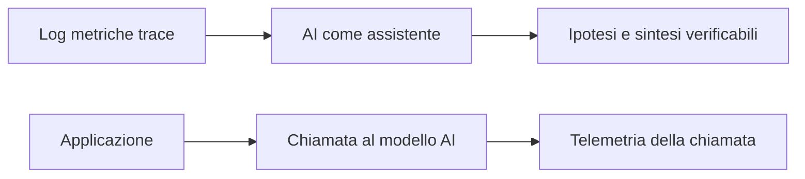
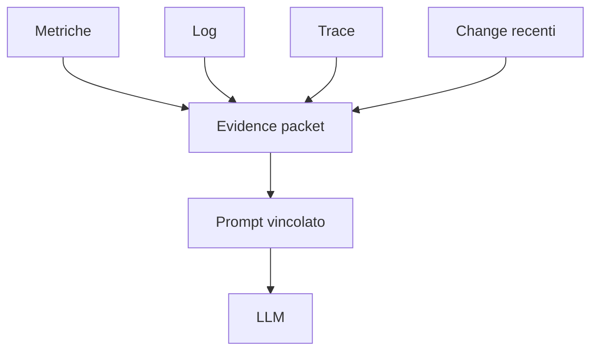
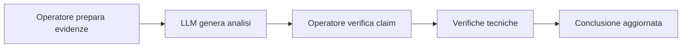
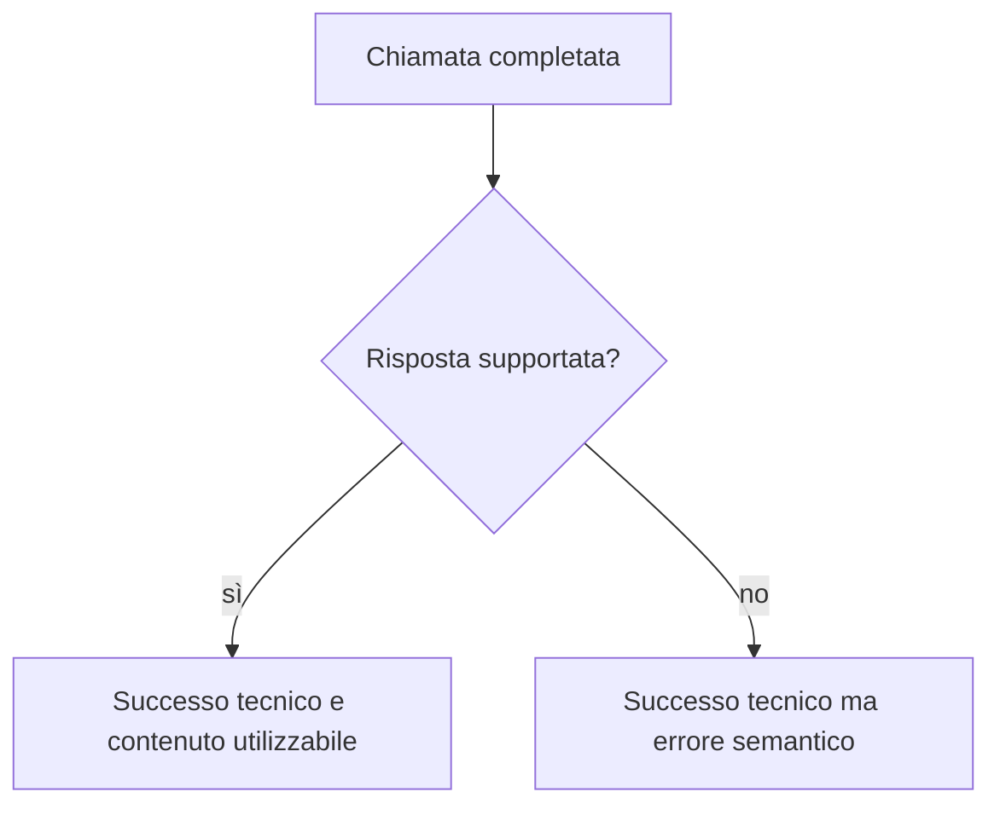

# UD30 — AI-assisted Observability e Observability for AI

## 1. Due direzioni differenti

La relazione tra AI e Observability può essere applicata in due direzioni.



### AI-assisted Observability

L’AI aiuta l’operatore a interpretare evidenze già raccolte.

### Observability for AI

La chiamata al modello è parte del sistema e deve essere osservata.

Nella UD30 il peso principale è sulla prima direzione. La seconda viene resa concreta tramite la telemetria restituita da Ollama.

---

## 2. Evidenza, interpretazione e decisione

### Evidenza

Informazione osservata o misurata:

```text
p95 = 1.840 ms
error rate = 6,8%
span database = 1.350 ms
```

### Interpretazione

Significato attribuito all’evidenza:

```text
il database è il principale contributore alla latenza osservata nel trace
```

### Ipotesi

Spiegazione possibile ancora da verificare:

```text
la nuova release potrebbe aver introdotto una query inefficiente
```

### Decisione

Azione scelta dall’operatore:

```text
confrontare le query della versione precedente e della versione corrente
```

L’LLM può supportare interpretazione e formulazione di ipotesi. La decisione resta responsabilità umana.

---

## 3. Evidence packet

Un evidence packet è una raccolta breve e organizzata di informazioni utili all’analisi.

Struttura usata nella UD:

```text
scenario
finestra temporale
sintomi
metriche
log significativi
trace significative
modifiche recenti
informazioni mancanti
```

Non è un nuovo formato industriale obbligatorio. È uno strumento didattico per evitare di inviare al modello dati casuali e privi di contesto.



---

## 4. Prompt aperto e prompt vincolato

### Prompt aperto

```text
Analizza questo incidente e indicane la causa.
```

Problemi possibili:

- chiede una causa certa quando le evidenze non la dimostrano;
- non richiede di citare le evidenze;
- non richiede di dichiarare le informazioni mancanti;
- favorisce una risposta narrativa difficile da verificare.

### Prompt vincolato

```text
Analizza esclusivamente le evidenze fornite.

Produci:
1. fatti osservati;
2. ipotesi ordinate per plausibilità;
3. evidenze che supportano ogni ipotesi;
4. informazioni mancanti;
5. verifiche successive.

Non presentare come certa una causa non dimostrata.
```

Il prompt vincolato non “programma” completamente il modello. Definisce però un contratto di risposta più adatto all’analisi tecnica.

---

## 5. Human-in-the-loop

Human-in-the-loop significa che una persona rimane parte attiva del processo.

L’operatore:

1. seleziona le evidenze;
2. formula il compito;
3. verifica le affermazioni;
4. distingue fatto e ipotesi;
5. decide quali controlli eseguire;
6. approva o corregge l’handoff.



L’AI accelera la riorganizzazione del materiale. Non sostituisce l’indagine.

---

## 6. Claim–evidence mapping

Un **claim** è un’affermazione contenuta nella risposta.

Per ogni claim dobbiamo chiedere:

- quale evidenza lo supporta?
- è un fatto o un’ipotesi?
- quale verifica lo confermerebbe?

Esempio:

| Claim | Evidenza | Classificazione | Azione |
|---|---|---|---|
| La latenza è aumentata | p95 420 → 1.840 ms | Fatto | Nessuna conferma ulteriore necessaria |
| Il database contribuisce al ritardo | span DB 1.350 ms | Interpretazione supportata | Confrontare altri trace |
| La release ha introdotto una query lenta | release alle 14:25 + span DB lento | Ipotesi | Confrontare query e rollback |
| La CPU DB è satura | nessun dato CPU | Non supportato | Acquisire metrica CPU |

Questa tabella è più importante di una risposta ben scritta.

---

## 7. Valutare una risposta

La griglia usata nel laboratorio considera:

| Criterio | Domanda |
|---|---|
| Aderenza | Usa le evidenze fornite? |
| Separazione | Distingue fatti e ipotesi? |
| Provenienza | Collega le affermazioni ai dati? |
| Prudenza | Dichiara ciò che non è dimostrato? |
| Completezza | Evidenzia i dati mancanti? |
| Azionabilità | Propone controlli utili? |
| Allucinazioni | Introduce fatti non presenti? |

Il termine **allucinazione** indica qui un contenuto generato che non è supportato dal contesto o dalle evidenze disponibili. Non è necessario stabilire se il modello “crede” alla frase: valutiamo il risultato prodotto.

---

## 8. Observability for AI con Ollama

Una chiamata eseguita da Python produce due tipi di output.

### Output funzionale

```text
testo generato
```

### Telemetria tecnica

```text
modello
esito
latenza totale
numero token del prompt
numero token generati
durata caricamento
durata valutazione prompt
durata generazione
```

Ollama esprime le durate native in nanosecondi. Gli script della UD le convertono in millisecondi per facilitarne la lettura.

---

## 9. Successo tecnico e qualità semantica

```text
status = success
```

significa che la chiamata è stata completata senza errore tecnico. Non significa che:

- i fatti siano corretti;
- il modello abbia rispettato il prompt;
- non esistano informazioni inventate;
- la risposta sia utile all’operatore.



Per questo nel laboratorio uniremo:

```text
telemetria tecnica + valutazione umana
```

---

## 10. Segnali minimi

Gli script registrano:

```text
timestamp
run_id
prompt_type
model
status
latency_ms
prompt_tokens
output_tokens
response_length
```

Questi segnali permettono di rispondere a domande come:

- quale chiamata è stata più lenta?
- quale modello ha prodotto più token?
- la prima chiamata è più lenta per il caricamento?
- ci sono richieste fallite?

Non permettono da soli di rispondere a:

- la risposta è corretta?
- l’ipotesi è dimostrata?
- l’handoff è professionale?

Per queste domande serve la griglia qualitativa.

---

## 11. Collegamento con il percorso Observability

```text
Log      → cosa è accaduto in eventi discreti
Metriche → come evolve un comportamento aggregato
Trace    → dove viene speso il tempo lungo una richiesta
ML       → classificazione o rilevazione su feature
LLM      → interpretazione testuale e ipotesi da verificare
```

L’LLM non sostituisce i pilastri. Dipende dalla qualità delle evidenze che ricaviamo da essi.

---

## Competenze finali

Al termine della UD il partecipante saprà:

1. distinguere un LLM da un assistente e da Ollama;
2. usare lo stesso prompt su sistemi cloud e locali;
3. costruire un evidence packet;
4. confrontare prompt aperto e vincolato;
5. verificare claim rispetto alle evidenze;
6. chiamare Ollama da Python;
7. raccogliere latenza e token;
8. distinguere successo tecnico e qualità della risposta;
9. produrre un handoff verificabile.
