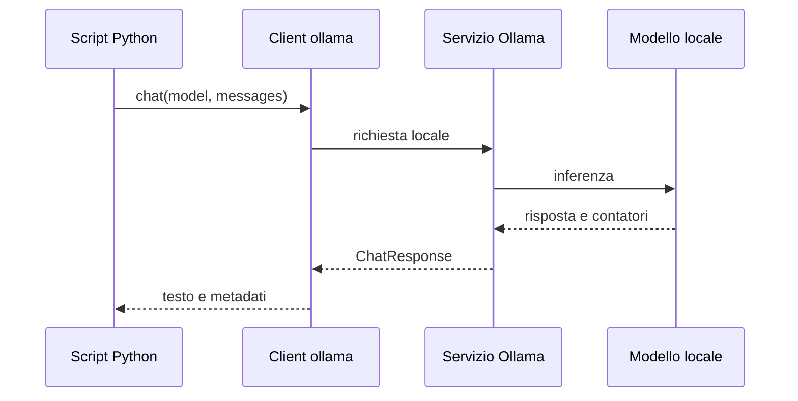

# LAB guidato — Usare Ollama da Python

## Durata indicativa

75 minuti.

## Obiettivo

Passare dall’interazione manuale con Ollama Chat a una chiamata programmata da Python, distinguendo:

- istruzione applicativa;
- modello configurato;
- risposta testuale;
- metadati tecnici.

Non stiamo costruendo un chatbot o un endpoint web.

---

## Architettura



---

## Task 1 — Verificare l’ambiente

Dalla cartella `UD30`:

```bash
python3 scripts/00_check_ollama.py
```

Lo script verifica:

- import del package Python;
- raggiungibilità del servizio;
- modelli installati;
- presenza del modello configurato;
- esecuzione di una richiesta breve.

Il modello predefinito è:

```text
llama3.2:1b
```

Per cambiarlo:

```bash
export OLLAMA_MODEL=gemma3:1b
python3 scripts/00_check_ollama.py
```

Non proseguire con il laboratorio reale se il test non riesce. Usare il fallback indicato dal messaggio.

---

## Task 2 — Leggere lo script prima di eseguirlo

Aprire:

```text
scripts/01_first_chat.py
```

Individuare:

1. dove viene letto il nome del modello;
2. dove viene costruito il messaggio;
3. dove avviene la chiamata `chat()`;
4. dove viene letto il testo;
5. quali metadati vengono stampati.

### Punto chiave

Il modello non viene importato in Python. Python importa il **client**:

```python
from ollama import chat
```

Il client comunica con il servizio Ollama, che esegue il modello.

---

## Task 3 — Eseguire la prima chiamata

```bash
python3 scripts/01_first_chat.py
```

Annotare:

- modello;
- risposta;
- durata misurata dal client;
- token del prompt;
- token generati;
- durata totale restituita da Ollama.

### Domande

1. Durata del client e durata Ollama coincidono esattamente?
2. Perché potrebbero differire?
3. Il numero di token coincide con il numero di parole?
4. Il campo `status` è prodotto dal modello o dallo script?

---

## Task 4 — Modificare soltanto il prompt

Nel file `scripts/01_first_chat.py`, cambiare solo la costante `PROMPT` con:

```text
Rispondi in due sezioni:
1. definizione di evidenza;
2. esempio relativo al Catalogo prodotti.
```

Eseguire nuovamente.

Confrontare:

- struttura della risposta;
- token in ingresso;
- token in uscita;
- latenza.

Ripristinare poi il file usando Git oppure la copia originale fornita dal docente.

---

## Task 5 — Cambiare modello senza modificare il codice

```bash
export OLLAMA_MODEL=gemma3:1b
python3 scripts/01_first_chat.py
```

Se disponibile:

```bash
export OLLAMA_MODEL=llama3.2:3b
python3 scripts/01_first_chat.py
```

### Domande

- Quale modello segue meglio le due sezioni?
- Quale risponde più velocemente?
- Il modello più lento produce necessariamente la risposta migliore?
- Perché la variabile d’ambiente è preferibile a un nome scritto in più script?

Al termine reimpostare:

```bash
export OLLAMA_MODEL=llama3.2:1b
```

---

## Task 6 — Leggere l’oggetto risposta

Lo script usa questi campi quando disponibili:

```text
response.message.content
response.model
response.prompt_eval_count
response.eval_count
response.total_duration
response.load_duration
response.prompt_eval_duration
response.eval_duration
```

Le durate native Ollama sono convertite da nanosecondi a millisecondi.

### Distinzione

```text
message.content     → output funzionale
campi di durata     → telemetria di prestazione
contatori token     → telemetria di utilizzo
model               → configurazione effettiva
```

---

## Task 7 — Errore controllato

Impostare temporaneamente un modello inesistente:

```bash
export OLLAMA_MODEL=modello-inesistente:1b
python3 scripts/01_first_chat.py
```

Osservare il messaggio di errore.

Poi ripristinare:

```bash
export OLLAMA_MODEL=llama3.2:1b
```

### Domanda

Perché questo errore deve essere distinto da una risposta semanticamente scorretta?

Risposta attesa:

- nel primo caso la chiamata non produce una risposta valida;
- nel secondo la chiamata riesce tecnicamente ma il contenuto può essere inadeguato.

---

## Conclusione

Il passaggio da terminale a Python aggiunge:

- ripetibilità;
- configurazione esplicita;
- gestione degli errori;
- accesso ai metadati;
- possibilità di registrare telemetria.

Non rende automaticamente il modello più capace o corretto.
