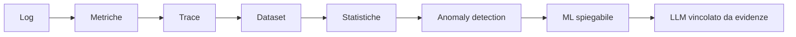

# UD30 — Raccordo e chiusura del percorso

## Dall’osservazione all’assistenza generativa

Il percorso ha costruito progressivamente capacità differenti:

L’ultima tappa non sostituisce le precedenti. Un LLM può produrre un’analisi utile soltanto se riceve evidenze comprensibili e se le sue affermazioni vengono verificate.

## Il nuovo ruolo dell’operatore

L’operatore non delega la diagnosi. Usa l’AI per:

- ridurre il tempo necessario a ordinare il materiale;
- evidenziare ipotesi alternative;
- preparare comunicazioni e handoff;
- rendere esplicite le verifiche successive.

Resta responsabile di:

- qualità dei dati;
- selezione del contesto;
- verifica dei claim;
- decisione operativa;
- comunicazione del livello di certezza.

## Competenze da presentare professionalmente

Il partecipante può descrivere di saper:

- costruire evidence packet da log, metriche e trace;
- usare assistenti generativi in modo controllato;
- formulare prompt che separano fatti e ipotesi;
- validare claim rispetto alle evidenze;
- usare modelli locali tramite Ollama;
- integrare Ollama con Python;
- raccogliere latenza e token delle chiamate;
- confrontare modelli rispetto a risorse, prestazioni e adeguatezza;
- distinguere failure tecniche ed errori semantici;
- produrre handoff verificabili.

## Limiti consapevoli

La UD30 non forma un LLM engineer né un ML researcher. Non copre:

- addestramento e fine-tuning;
- RAG;
- embeddings e vector database;
- agenti e tool calling;
- valutazione automatica avanzata;
- sicurezza completa dei sistemi AI;
- deployment di modelli in produzione.

Questi argomenti costituiscono possibili sviluppi successivi.

## Domanda finale

> Se l’AI produce una spiegazione plausibile, quale evidenza permette di trasformarla da testo convincente a conclusione tecnica?

Se l’evidenza non esiste ancora, la risposta corretta è una verifica da eseguire, non una certezza da dichiarare.
