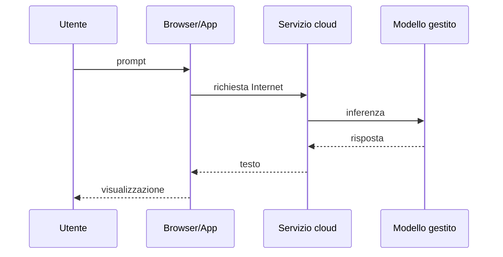
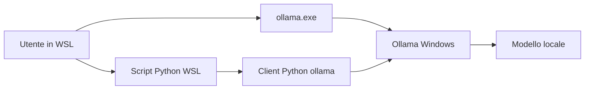

# UD30 — Assistenti cloud, Ollama e modelli locali

## 1. Prodotto, modello e runtime

ChatGPT, Gemini e Claude sono prodotti conversazionali. Possono includere interfaccia, modelli, istruzioni di sistema, ricerca web, strumenti e funzioni dipendenti dal piano.

Ollama è invece un runtime che scarica, gestisce ed esegue modelli.

```text
modello LLM       → genera il testo
Ollama Windows    → gestisce ed esegue il modello
ollama-python     → client usato dallo script WSL
script Python     → definisce il caso d'uso
```

## 2. Architettura cloud



Vantaggi:

- uso immediato;
- modelli generalmente più capaci;
- nessuna gestione locale del runtime.

Vincoli:

- account e limiti;
- dipendenza dal servizio;
- controllo parziale su modello e parametri;
- dati inviati a un servizio remoto;
- telemetria tecnica non sempre disponibile.

## 3. Architettura locale adottata



La chat interattiva si avvia da WSL con:

```bash
ollama.exe run llama3.2:1b
```

Gli script Python usano:

```text
OLLAMA_BASE_URL → API Ollama Windows
```

## 4. Privacy e sicurezza

Un modello locale evita l'invio della richiesta a un provider esterno per quella specifica inferenza. Non significa automaticamente “sicuro”. Restano da gestire:

- accesso al PC;
- file salvati;
- cronologia e log;
- provenienza e licenza del modello;
- esposizione dell'API;
- contenuto del prompt.

## 5. Tag e dimensione

Nel nome:

```text
llama3.2:1b
```

`1b` indica approssimativamente un miliardo di parametri. Non è la dimensione esatta del file né la RAM esatta richiesta.

La quantizzazione riduce la precisione numerica dei pesi per diminuire spazio e memoria, accettando un possibile impatto sulla qualità.

Il tag esplicito è preferibile perché rende l'esperimento più riproducibile.

## 6. Fallback

```text
llama3.2:1b → riferimento
   ↓
gemma3:1b   → fallback qualitativo
   ↓
gemma3:270m → fallback tecnico
```

Il modello da 270 milioni di parametri non deve essere usato per trarre conclusioni qualitative sul valore degli LLM in generale.

## 7. Confronto corretto

| Dimensione | Assistente cloud | Ollama locale |
|---|---|---|
| Esecuzione | infrastruttura provider | PC Windows |
| Interfaccia | web/app | terminale o Python |
| Modello | dipende dal prodotto/piano | tag esplicito |
| API key | dipende dal servizio | non necessaria per API locale |
| Risorse PC | marginali | determinanti |
| Telemetria token/durate | spesso parziale | disponibile via API |
| Dati | inviati al provider | elaborati localmente |

## 8. Perché non è un benchmark scientifico

Il confronto in aula non controlla completamente modello, parametri, sistema prompt, strumenti e aggiornamenti dei servizi cloud. È un'osservazione comparativa guidata.

Per ridurre le differenze:

1. nuova conversazione;
2. stesso evidence packet;
3. stesso prompt;
4. ricerca web disattivata quando possibile;
5. registrazione di data, prodotto e modalità;
6. stessa griglia di valutazione.

## Domande di controllo

1. Quale componente genera effettivamente il testo?
2. Perché Ollama non è un LLM?
3. Perché un tag esplicito migliora la riproducibilità?
4. Perché `gemma3:270m` è un fallback tecnico?
5. Quale differenza esiste tra `ollama.exe` e il package Python `ollama`?
